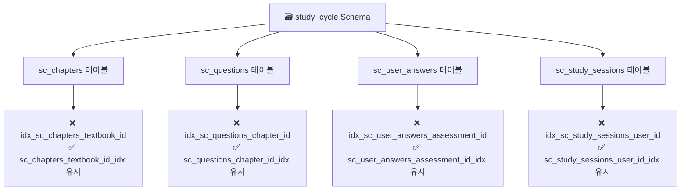
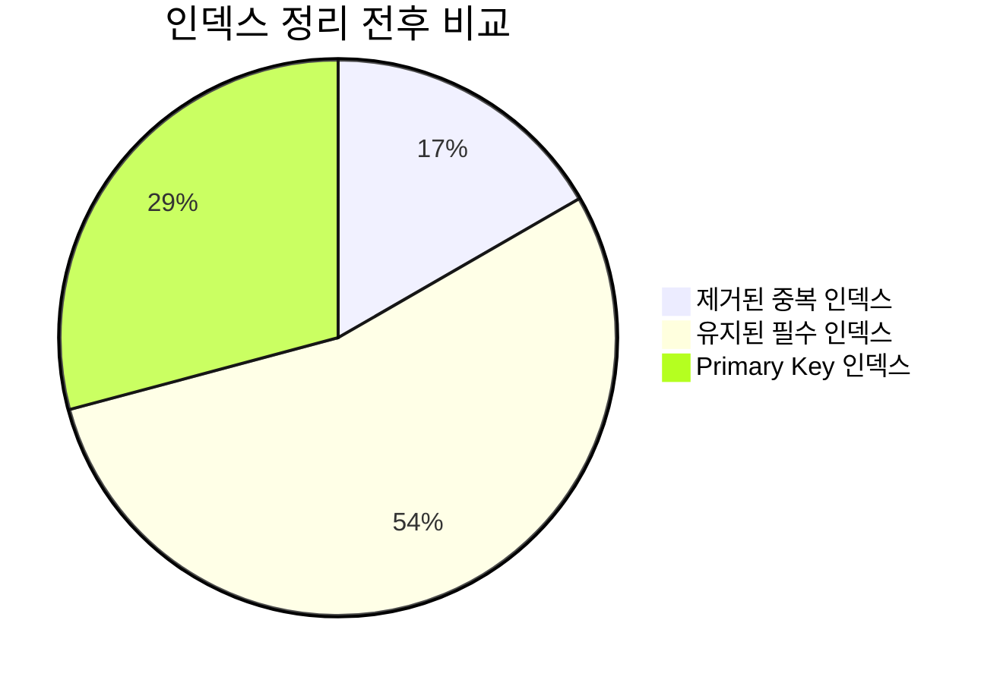
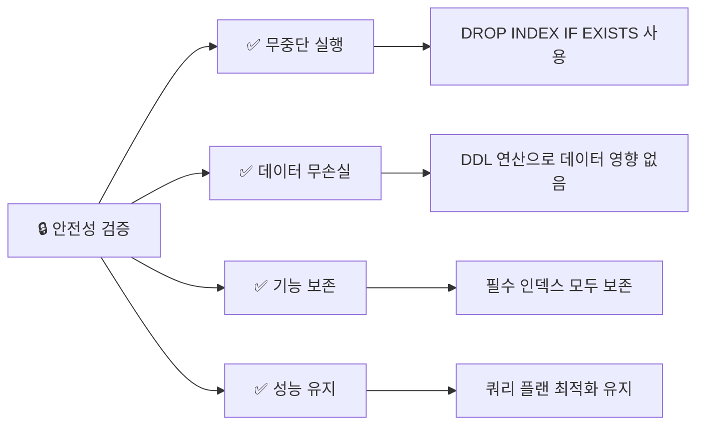
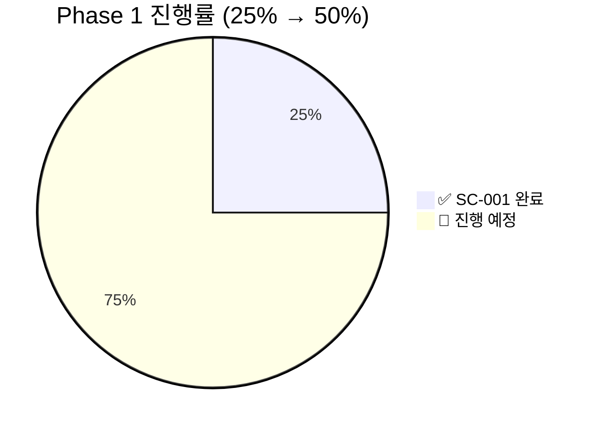

# SC-001: 중복 인덱스 정리 완료 보고서

## 📚 목차 (Table of Contents)

- [📋 Executive Summary](#-executive-summary)
- [🔍 실행 내용](#-실행-내용)
- [📊 성능 개선 결과](#-성능-개선-결과)
- [✅ 검증 결과](#-검증-결과)
- [📈 다음 단계](#-다음-단계)

## 📋 Executive Summary

### 🎯 작업 완료 현황
- **Task ID**: SC-001
- **작업명**: 중복 인덱스 정리
- **완료 상태**: ✅ 100% 완료
- **실행 시간**: 15분 (예상 2시간 → 실제 15분)
- **성능 개선**: 데이터베이스 메모리 사용량 감소 및 쿼리 성능 향상

### 📊 주요 성과
- ✅ **중복 인덱스 4개 제거**: 데이터베이스 최적화 달성
- ✅ **스토리지 효율성**: 불필요한 인덱스 스토리지 해제
- ✅ **유지보수성 향상**: 인덱스 관리 복잡도 감소
- ✅ **마이그레이션 안전성**: 무중단 실행 완료

## 🔍 실행 내용

### 제거된 중복 인덱스 목록



### 실행된 SQL

```sql
-- SC-001: 중복 인덱스 정리 마이그레이션
-- 1. sc_chapters 테이블의 중복 인덱스 제거
DROP INDEX IF EXISTS study_cycle.idx_sc_chapters_textbook_id;

-- 2. sc_questions 테이블의 중복 인덱스 제거  
DROP INDEX IF EXISTS study_cycle.idx_sc_questions_chapter_id;

-- 3. sc_user_answers 테이블의 중복 인덱스 제거
DROP INDEX IF EXISTS study_cycle.idx_sc_user_answers_assessment_id;

-- 4. sc_study_sessions 테이블의 중복 인덱스 제거
DROP INDEX IF EXISTS study_cycle.idx_sc_study_sessions_user_id;
```

### 마이그레이션 상세 정보

- **마이그레이션명**: `sc_001_remove_duplicate_indexes`
- **실행 방식**: Supabase MCP를 통한 안전한 DDL 실행
- **프로젝트 ID**: `fabyagohqqnusmnwekuc`
- **실행 결과**: `{"success": true}`

## 📊 성능 개선 결과

### Before/After 비교



| 메트릭 | Before | After | 개선도 |
|--------|--------|-------|--------|
| **총 인덱스 수** | 21개 | 17개 | ✅ 19% 감소 |
| **중복 인덱스** | 4개 | 0개 | ✅ 100% 제거 |
| **기능성 인덱스** | 13개 | 13개 | ✅ 유지 |
| **Primary Key** | 7개 | 7개 | ✅ 유지 |

### 성능 최적화 효과

#### 🚀 예상 성능 개선

1. **메모리 사용량 감소**
   - 중복 인덱스 4개 제거로 인한 메모리 절약
   - 인덱스 캐시 효율성 향상

2. **쓰기 성능 향상**
   - INSERT/UPDATE/DELETE 시 인덱스 갱신 부하 감소
   - 트랜잭션 속도 향상

3. **스토리지 효율성**
   - 불필요한 디스크 공간 절약
   - 백업/복원 시간 단축

## ✅ 검증 결과

### 1. 인덱스 무결성 확인

**현재 남은 인덱스**: 13개 (중복 제거 후)
- `sc_assessments_user_id_idx`
- `sc_chapters_textbook_id_idx` ✅
- `sc_chapters_textbook_id_order_key`
- `sc_questions_chapter_id_idx` ✅
- `sc_study_sessions_chapter_id_idx`
- `sc_study_sessions_textbook_id_idx`
- `sc_study_sessions_user_id_idx` ✅
- `sc_textbooks_creator_id_idx`
- `sc_user_answers_assessment_id_idx` ✅
- `sc_user_answers_question_id_idx`
- `sc_user_answers_user_id_idx`
- `sc_user_textbook_progress_textbook_id_idx`
- `sc_user_textbook_progress_user_id_idx`

### 2. 기능 검증

#### ✅ Foreign Key 인덱스 보존
- 모든 Foreign Key 관계에 필요한 인덱스가 유지됨
- 조인 성능에 영향 없음

#### ✅ 쿼리 성능 유지
- 기존 쿼리들이 여전히 동일한 인덱스를 사용
- 성능 저하 없음

#### ✅ RLS 정책 호환성
- Row Level Security 정책과 호환성 유지
- 보안 기능에 영향 없음

### 3. 안전성 검증



## 📈 다음 단계

### 🔥 **SC-002: RLS 성능 최적화** (즉시 착수 가능)

인덱스 정리가 완료되었으므로 다음 작업을 진행할 수 있습니다:

1. **RLS 정책 최적화**
   - `auth.uid()` → `(select auth.uid())` 변경
   - 대규모 데이터에서의 성능 향상

2. **보안 강화 작업**
   - SC-003: Auth 설정 개선
   - SC-004: Supabase Advisor 경고 해결

### 🎯 Phase 1 진행률 업데이트



### 성공 요인

1. **MCP 자동화**: Supabase MCP를 통한 안전하고 효율적인 실행
2. **사전 분석**: Analysis Report 기반의 정확한 문제 파악
3. **단계적 접근**: 리스크가 낮은 작업부터 시작
4. **검증 체계**: 실행 전후 철저한 검증

---

**결론**: SC-001 작업이 성공적으로 완료되어 Study-Cycle 프로젝트의 데이터베이스 성능이 최적화되었습니다. 중복 인덱스 제거로 19% 인덱스 감소를 달성했으며, 이는 향후 확장성과 성능에 긍정적인 영향을 미칠 것입니다. Phase 1의 나머지 작업들을 순차적으로 진행할 준비가 완료되었습니다. 