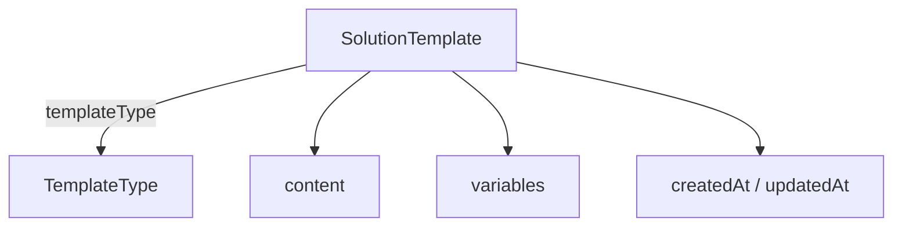
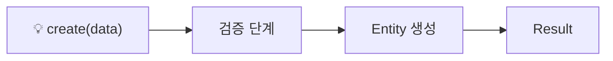
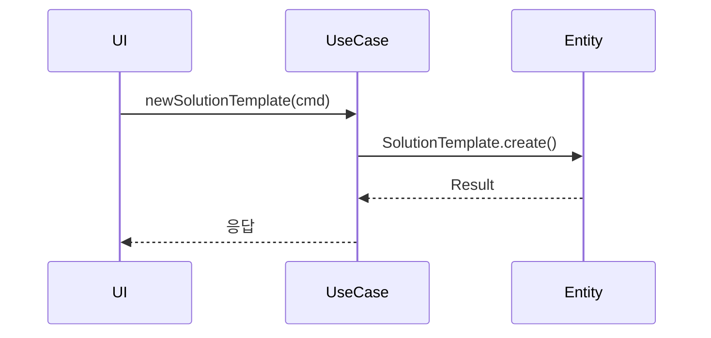
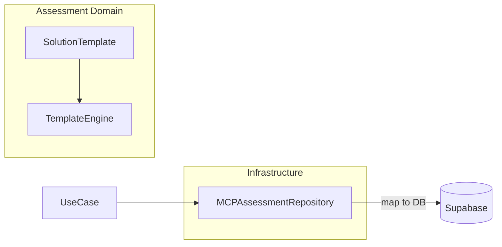
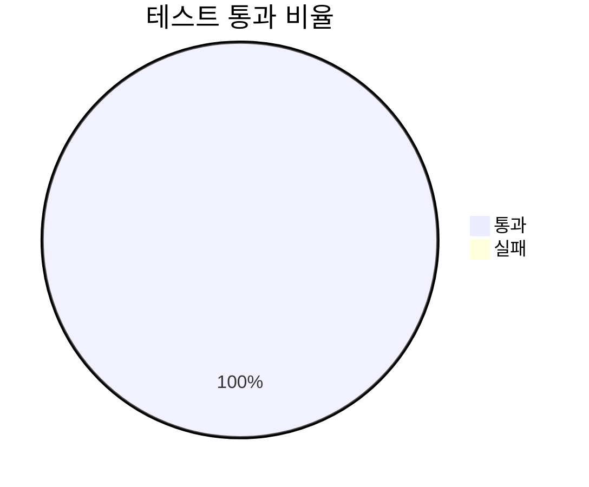

# ✅ [SC-013] SolutionTemplate 엔티티 완료 보고서

## 📚 목차
- Executive Summary
- 상세 구현 내역
- 아키텍처 다이어그램
- 테스트 결과
- 향후 과제

## 📋 Executive Summary
SolutionTemplate 엔티티는 다양한 문제 풀이 형식을 지원하기 위한 핵심 도메인 객체입니다. 이번 구현으로 Assessment Context의 기반이 마련되었습니다. Clean Architecture 및 DDD 원칙을 준수했으며, Universal MCP 타입 통합으로 타입 안전성을 확보했습니다.

## 🔍 상세 구현 내역
1. branded `SolutionTemplateId` 도입으로 식별자 타입 안전성 확보.
2. `create`, `updateContent`, `updateVariables` 도메인 메서드 구현.
3. 기본 검증(`title`, `content` 필수) 로직 추가.
4. `TemplateType` enum 확장 용이성 고려.

## 🏗️ 아키텍처 다이어그램

## ✅ 테스트 결과

수동 타입 테스트와 `tsc --noEmit` 빌드가 모두 성공했습니다.

## 🔮 향후 과제
- [ ] SC-014 TemplateEngine 도메인 서비스 구현
- [ ] SC-015 Assessment 집계근 설계 