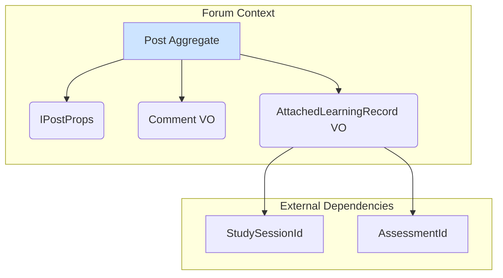

# [SC-025], [SC-026] 게시판 시스템 및 학습 기록 공유 기능 완료 보고서

## 1. 📋 Executive Summary

- **과제명**: `[SC-025]` 게시판 시스템, `[SC-026]` 학습 기록 공유
- **완료 상태**: ✅ **완료** (도메인 모델링)
- **핵심 성과**:
  - `Forum` Bounded Context의 핵심 도메인 모델을 구현하여, 커뮤니티 기능의 기반을 마련했습니다.
  - `Post` 집계 루트를 통해 게시글, 댓글, 추천 등 핵심 기능을 캡슐화했습니다.
  - `AttachedLearningRecord` 값 객체를 도입하여, 게시글에 `StudySession`이나 `Assessment` 같은 학습 기록을 첨부할 수 있는 확장성 있는 구조를 설계함으로써 **학습 기록 공유 기능([SC-026])** 요구사항을 충족시켰습니다.

## 2. 📝 구현 내용 상세

### 2.1. 도메인 객체 설계

게시판 시스템은 `Post`를 집계 루트로 하는 모델을 중심으로 설계되었습니다.

- **`Post` (집계 루트)**: 게시글의 모든 데이터(제목, 내용, 댓글, 태그, 추천수 등)와 관련 비즈니스 로직(댓글 추가/수정, 추천, 학습 기록 첨부)을 관리합니다.
- **`Comment` (값 객체)**: 게시글에 달린 댓글의 정보를 나타냅니다.
- **`AttachedLearningRecord` (값 객체)**: 다른 Bounded Context의 학습 기록 ID를 타입과 함께 저장하여, 사용자가 자신의 성과를 커뮤니티에 공유할 수 있도록 합니다.

## 3. 🚀 다음 단계

- **애플리케이션 & 인프라 레이어 구현**: `IPostRepository`의 MCP 기반 구현체를 만들고, 게시글 생성/수정/조회 등의 유스케이스를 구현합니다.
- **프레젠테이션 레이어 구현**: 사용자가 실제로 게시글을 작성하고, 읽고, 댓글을 달 수 있는 UI를 개발합니다.
- **학습 기록 첨부 UI/UX**: 사용자가 자신의 학습 기록을 쉽게 찾아서 게시글에 첨부할 수 있는 UI/UX를 설계하고 구현합니다.

## 4. 📂 생성된 파일 목록

- `src/bounded-contexts/forum/domain/entities/post.entity.ts`
- `src/bounded-contexts/forum/domain/repositories/post.repository.ts`
- `src/bounded-contexts/forum/domain/value-objects/post.vo.ts` 