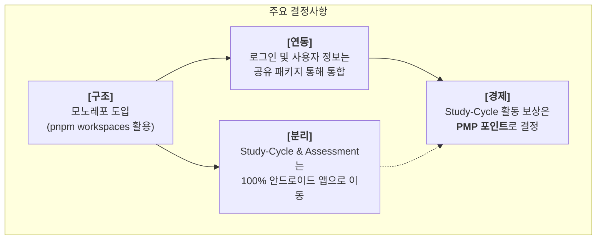
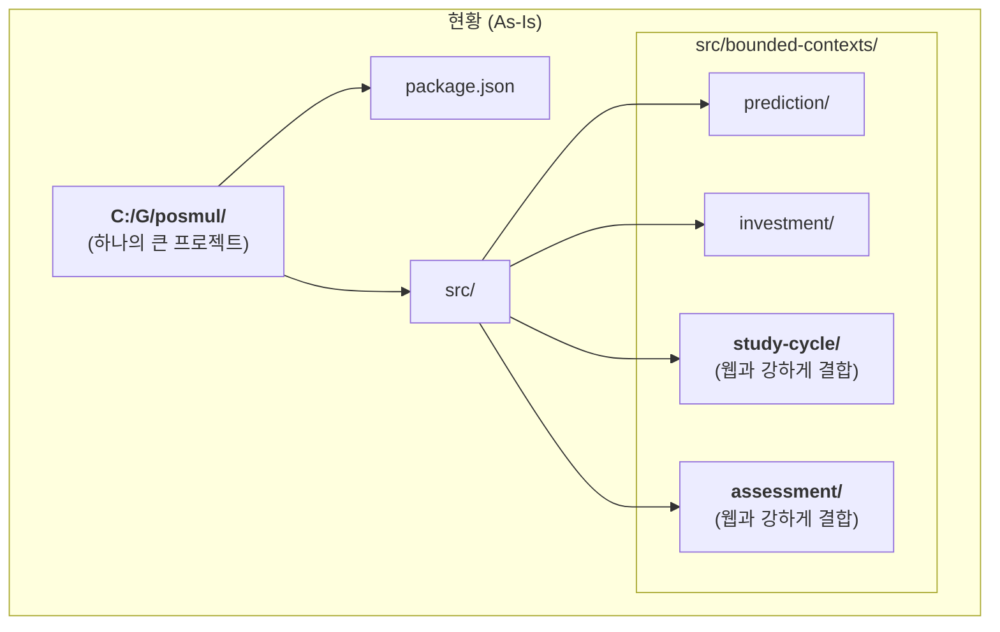
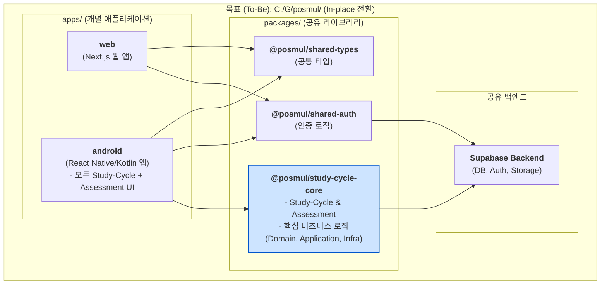
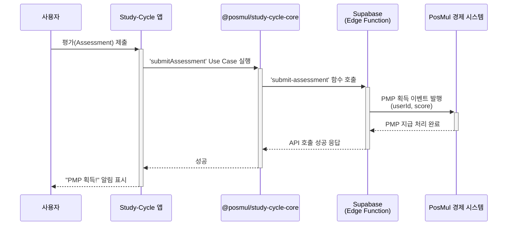
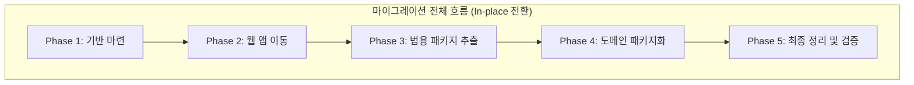
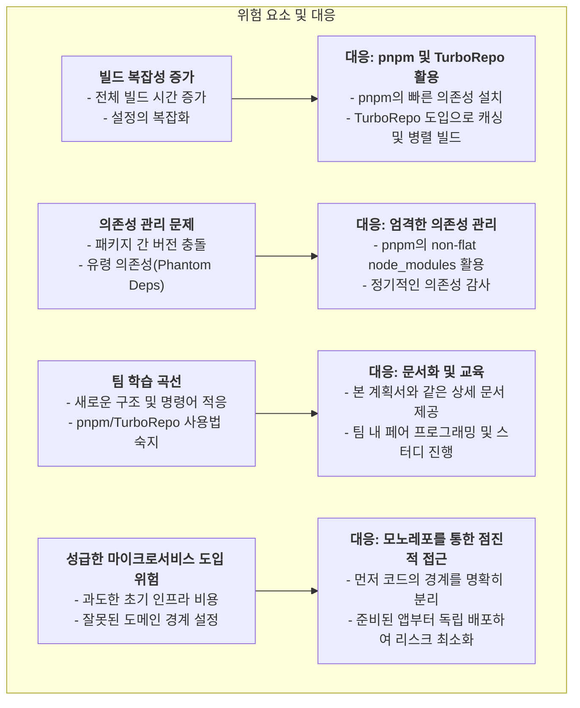

# Study-Cycle 안드로이드 앱 분리 및 기존 프로젝트의 모노레포 전환 계획서

> **문서 버전**: 1.2  
> **작성일**: 2025-06-24  
> **작성자**: AI Agent  
> **상태**: **In-place 전환 전략으로 업데이트**

---

## 목차

1.  [개요](#1-개요)
    - [1.1. 목표](#11-목표)
    - [1.2. 기대 효과](#12-기대-효과)
    - [1.3. 핵심 결정사항](#13-핵심-결정사항)
    - [1.4. 주요 변경사항: Assessment 컨텍스트 처리](#14-주요-변경사항-assessment-컨텍스트-처리)
    - [1.5. 아키텍처 진화 전략: 모노레포에서 마이크로서비스로](#15-아키텍처-진화-전략-모노레포에서-마이크로서비스로)
2.  [현황 분석 (As-Is Architecture)](#2-현황-분석-as-is-architecture)
3.  [목표 아키텍처 (To-Be Architecture)](#3-목표-아키텍처-to-be-architecture)
4.  [경제 시스템 연동 방안](#4-경제-시스템-연동-방안)
    - [4.1. PMP 보상 모델](#41-pmp-보상-모델)
    - [4.2. PMP 획득 프로세스](#42-pmp-획득-프로세스)
5.  [마이그레이션 상세 작업 목록 (Task List)](#5-마이그레이션-상세-작업-목록-task-list)
    - [Phase 1: 모노레포 구조 기반 마련](#phase-1-모노레포-구조-기반-마련)
    - [Phase 2: 기존 웹 앱을 `apps/web`으로 이동](#phase-2-기존-웹-앱을-appsweb으로-이동)
    - [Phase 3: 범용 공유 패키지 추출](#phase-3-범용-공유-패키지-추출)
    - [Phase 4: Study-Cycle 및 Assessment 코드 분리 및 패키지화](#phase-4-study-cycle-및-assessment-코드-분리-및-패키지화)
    - [Phase 5: 최종 정리 및 검증](#phase-5-최종-정리-및-검증)
6.  [위험 요소 및 대응 방안](#6-위험-요소-및-대응-방안)

---

## 1. 개요

### 1.1. 목표

본 문서는 현재 `PosMul` 모놀리식 웹 프로젝트 내에 존재하는 `study-cycle` 및 `assessment` Bounded Context를 독립적인 안드로이드 애플리케이션으로 분리하고, 전체 프로젝트 구조를 효율적인 모노레포(Monorepo)로 전환하기 위한 상세한 계획을 정의하는 것을 목표로 합니다.

### 1.2. 기대 효과

- **명확한 경계 설정**: 웹(PosMul)과 앱(Study-Cycle)의 책임과 역할을 물리적으로 분리하여 코드 복잡성 감소.
- **독립적인 개발 및 배포**: 각 애플리케이션을 독립적으로 개발, 테스트, 배포하여 민첩성 향상.
- **코드 재사용성 극대화**: 인증, 타입, 공통 로직, 도메인 로직 등을 `packages`로 추출하여 여러 앱에서 공유.
- **통합된 사용자 경험**: 공유된 Supabase 백엔드와 인증 로직을 통해 웹과 앱 간의 일관된 사용자 경험 제공.

### 1.3. 핵심 결정사항

이번 마이그레이션을 통해 확정된 주요 아키텍처 및 정책 결정사항은 다음과 같습니다.



### 1.4. 주요 변경사항: Assessment 컨텍스트 처리

기존 계획에서 더 나아가, `assessment`(평가) Bounded Context 또한 `study-cycle`의 핵심 하위 도메인으로 판단하여 함께 마이그레이션합니다. 이는 학습 플랫폼의 본질적인 기능을 하나의 응집력 있는 단위로 묶어 관리하기 위함입니다. 이에 따라 `assessment`의 비즈니스 로직 또한 새로운 공유 패키지로 이동하고, UI는 안드로이드 앱으로 이전됩니다.

### 1.5. 아키텍처 진화 전략: 모노레포에서 마이크로서비스로

본 마이그레이션은 단순히 코드를 재구성하는 것을 넘어, 미래의 마이크로서비스 아키텍처(MSA)로 확장하기 위한 전략적인 첫 단계입니다. 모노레포는 마이크로서비스로 가는 가장 안전하고 효율적인 경로를 제공합니다.

```mermaid
graph TD
    subgraph "Phase 1: 현재 (모듈형 모놀리스)"
        A[<b>Posmul App</b><br/>(하나의 빌드/배포 단위)]
    end

    subgraph "Phase 2: 전환 단계 (본 계획의 목표)"
        B["<b>Monorepo</b><br/>(하나의 Git 저장소, 코드 분리)"]
        subgraph "개발/코드 관리"
            direction LR
            B_A["apps/web"]
            B_Android["apps/android"]
            B_P["packages/shared-logic"]
        end
        B --> B_A & B_Android & B_P
        B_A --> B_P
        B_Android --> B_P
    end

    subgraph "Phase 3: 최종 목표 (마이크로서비스 배포)"
        C_GW["API Gateway"]
        subgraph "독립적인 실행/운영 환경"
            direction LR
            C_Web["web (독립 배포)"]
            C_Android["android (독립 API 호출)"]
            C_Auth["auth-service (공유 서비스)"]
        end
        C_GW --> C_Web & C_Android & C_Auth
    end

    A --"<b>코드 구조 리팩토링<br/>(Monorepo 전환)</b>"--> B
    B --"<b>독립 CI/CD 구축<br/>(점진적 배포)</b>"--> C_GW

    classDef phase fill:#f2f2f2,stroke:#333,stroke-width:1px,rx:5,ry:5;
    class A,B,C_GW phase;
```

- **모노레포는 대안이 아니라 과정입니다**: 마이크로서비스와 모노레포는 대립하는 개념이 아닙니다. 모노레포는 여러 마이크로서비스의 코드를 하나의 저장소에서 일관되게 관리하여 코드 재사용성을 극대화하고, 버전 충돌 문제를 원천적으로 해결하는 개발 전략입니다.
- **점진적 전환**: "한 번에" 마이크로서비스의 모든 인프라(API 게이트웨이, 서비스 디스커버리 등)를 구축하는 대신, 먼저 모노레포를 통해 코드의 경계를 명확히 하고, 준비가 된 `app`부터 독립적으로 배포하여 점진적으로 전환할 수 있습니다.

## 2. 현황 분석 (As-Is Architecture)

현재 `posmul` 프로젝트는 단일 `package.json`을 가진 모놀리식 애플리케이션입니다. 모든 도메인(prediction, investment, study-cycle, assessment 등)이 하나의 소스 코드(`src`) 내에 Bounded Context로 존재합니다.



## 3. 목표 아키텍처 (To-Be Architecture)

새로운 모노레포 구조는 기존 `C:/G/posmul/` 디렉터리 내에 `apps`와 `packages` 폴더를 생성하여 구성됩니다.



> **아키텍처 노트**: 이 구조에서 `apps` 폴더의 각 애플리케이션(`web`, `android`)은 잠재적인 마이크로서비스입니다. 모노레포는 이들의 코드를 효율적으로 관리하는 '개발/관리'의 영역이며, 각 `app`은 독립적인 CI/CD 파이프라인을 통해 별도의 '배포/운영' 단위가 될 수 있습니다.

## 4. 경제 시스템 연동 방안

### 4.1. PMP 보상 모델

`study-cycle`은 사용자의 꾸준한 노력과 지적 활동을 장려하는 것을 목표로 합니다. 이는 '위험 감수'보다는 '노력에 대한 보상' 성격이 강하므로, 리스크 없는 자산인 **PMP(PosMul Point)** 를 보상으로 지급하는 것이 가장 적합합니다.

- **획득 조건**: 강의 완료, 퀴즈 통과, 과제 제출(`assessment` 기능), 우수 풀이 템플릿 선정 등
- **획득량**: 활동의 난이도와 중요도에 따라 차등 지급
- **목적**: 사용자의 학습 동기를 부여하고, 성실한 활동에 대한 명확한 보상 제공

### 4.2. PMP 획득 프로세스

안드로이드 앱에서 발생한 학습 활동이 어떻게 PosMul 경제 시스템에 반영되어 PMP를 획득하는지 보여주는 프로세스입니다.



## 5. 마이그레이션 상세 작업 목록 (Task List)

아래 작업 목록은 마이그레이션을 위한 구체적인 실행 계획입니다. 각 단계는 순서대로 진행하는 것을 원칙으로 합니다.



---

### **Phase 1: 모노레포 구조 기반 마련**

| #   | 작업 내용                          | 상세 설명 및 명령어 예시                                                                                                                                                     | 완료 조건                                            |
| --- | ---------------------------------- | ---------------------------------------------------------------------------------------------------------------------------------------------------------------------------- | ---------------------------------------------------- |
| 1.1 | **[Git] 작업 브랜치 생성**         | `main` 또는 `develop` 브랜치에서 새로운 작업 브랜치를 생성하여 기존 코드를 보존하고 안전하게 작업을 진행합니다.<br/>`git checkout -b feat/monorepo-conversion`               | `feat/monorepo-conversion` 브랜치 생성 및 체크아웃   |
| 1.2 | **`apps` 및 `packages` 폴더 생성** | 모노레포의 기본 구조인 `apps`와 `packages` 폴더를 프로젝트 루트에 생성합니다.                                                                                                | `apps/`, `packages/` 폴더 생성                       |
| 1.3 | **`pnpm-workspace.yaml` 생성**     | pnpm이 모노레포 구조(워크스페이스)를 인식하도록 루트에 `pnpm-workspace.yaml` 파일을 생성하고 패키지 경로를 지정합니다.                                                       | `pnpm-workspace.yaml` 파일 생성 및 설정              |
| 1.4 | **루트 `package.json` 재구성**     | 기존 `package.json`을 수정하여, 여러 패키지에서 공통으로 사용하는 개발 의존성(`typescript`, `eslint`, `prettier` 등)만 남깁니다. 앱 전용 의존성은 `apps/web`으로 이동됩니다. | 루트 `package.json`이 공통 의존성만 갖도록 수정 완료 |
| 1.5 | **루트 `tsconfig.json` 재구성**    | 루트 `tsconfig.json`에 `compilerOptions.paths`를 설정하여 `@posmul/*`과 같은 패키지 별칭을 인식할 수 있도록 합니다.                                                          | 루트 `tsconfig.json`에 path alias 설정 완료          |

---

### **Phase 2: 기존 웹 앱을 `apps/web`으로 이동**

| #   | 작업 내용                      | 상세 설명 및 명령어 예시                                                                                                                     | 완료 조건                                               |
| --- | ------------------------------ | -------------------------------------------------------------------------------------------------------------------------------------------- | ------------------------------------------------------- |
| 2.1 | **핵심 파일 및 폴더 이동**     | `src`, `public`, `.next`, `next.config.ts` 등 기존 웹 앱의 소스코드와 설정 파일을 모두 `apps/web/` 폴더 안으로 이동시킵니다.                 | 웹 앱 관련 파일 및 폴더가 `apps/web`으로 모두 이동      |
| 2.2 | **웹 앱 `package.json` 설정**  | `apps/web/` 폴더에 `package.json` 파일을 만들고, 기존 `package.json`에서 앱 전용 의존성을 옮겨옵니다. `name`은 `@posmul/web`으로 지정합니다. | `@posmul/web` 패키지의 `package.json` 생성 및 설정 완료 |
| 2.3 | **웹 앱 `tsconfig.json` 설정** | `apps/web/` 폴더에 `tsconfig.json` 파일을 만들고, 루트 `tsconfig.json`을 `extends` 하도록 설정합니다.                                        | `apps/web/tsconfig.json` 생성 및 설정 완료              |
| 2.4 | **의존성 재설치**              | 모노레포 루트에서 `pnpm install`을 실행하여 전체 의존성을 워크스페이스 구조에 맞게 재설치합니다.                                             | `node_modules`가 루트와 각 패키지에 올바르게 생성       |
| 2.5 | **웹 앱 실행 테스트**          | 웹 앱이 모노레포 구조 내에서 정상적으로 실행되는지 확인합니다. <br/>`pnpm --filter @posmul/web dev`                                          | 웹 애플리케이션이 브라우저에서 정상 구동                |

---

### **Phase 3: 범용 공유 패키지 추출**

| #   | 작업 내용                      | 상세 설명 및 명령어 예시                                                                                                                                                      | 완료 조건                                        |
| --- | ------------------------------ | ----------------------------------------------------------------------------------------------------------------------------------------------------------------------------- | ------------------------------------------------ |
| 3.1 | **`shared-types` 패키지 생성** | `packages/shared-types` 폴더를 만들고, `package.json`, `tsconfig.json`을 설정합니다. `apps/web/src/shared/types` 내용을 이곳으로 옮깁니다.                                    | `@posmul/shared-types` 패키지 생성 및 소스 이동  |
| 3.2 | **`shared-auth` 패키지 생성**  | `packages/shared-auth` 폴더를 만들고, Supabase 클라이언트 설정 및 인증 관련 훅/함수를 이곳으로 옮깁니다.                                                                      | `@posmul/shared-auth` 패키지 생성 및 소스 이동   |
| 3.3 | **웹 앱의 의존성 변경**        | `apps/web/package.json`에서 새로 만든 공유 패키지를 `workspace:*` 프로토콜을 사용하여 참조하도록 수정합니다. <br/>`"dependencies": { "@posmul/shared-types": "workspace:*" }` | 웹 앱의 `package.json`에 공유 패키지 의존성 추가 |
| 3.4 | **웹 앱의 import 경로 수정**   | `apps/web`의 소스코드에서 `../../shared/types`와 같았던 import 경로를 `@posmul/shared-types`와 같이 패키지 이름으로 변경합니다.                                               | 웹 앱의 모든 관련 import 경로 수정 완료          |
| 3.5 | **전체 재설치 및 테스트**      | 모노레포 루트에서 `pnpm install`을 다시 실행하고 웹 앱을 테스트하여 모든 것이 정상 동작하는지 확인합니다.                                                                     | 웹 앱이 공유 패키지를 참조하여 정상 구동         |

---

### **Phase 4: Study-Cycle 및 Assessment 코드 분리 및 패키지화**

| #   | 작업 내용                                  | 상세 설명 및 명령어 예시                                                                                                                                        | 완료 조건                                                |
| --- | ------------------------------------------ | --------------------------------------------------------------------------------------------------------------------------------------------------------------- | -------------------------------------------------------- |
| 4.1 | **`@posmul/study-cycle-core` 패키지 생성** | `packages/` 폴더에 `study-cycle-core` 패키지를 생성하고 `package.json`, `tsconfig.json`을 설정합니다. 이름은 `@posmul/study-cycle-core`로 지정합니다.           | `@posmul/study-cycle-core` 패키지 기본 구조 생성         |
| 4.2 | **도메인/애플리케이션 계층 이동**          | `apps/web/src/bounded-contexts/`에서 `assessment`와 `study-cycle`의 `domain` 및 `application` 계층 코드를 `@posmul/study-cycle-core/src`로 이동합니다.          | `study-cycle-core` 패키지에 비즈니스 로직 코드 이동 완료 |
| 4.3 | **인프라 계층 이동**                       | `assessment`와 `study-cycle`의 `infrastructure` 계층 코드(리포지토리 구현 등)를 `@posmul/study-cycle-core/src/infrastructure`로 이동합니다.                     | `study-cycle-core` 패키지에 인프라 코드 이동 완료        |
| 4.4 | **안드로이드 앱 뼈대 생성**                | `apps/android` 폴더에 React Native 프로젝트를 초기화합니다.                                                                                                     | `@posmul/android` 앱 기본 구조 생성                      |
| 4.5 | **프리젠테이션 계층 이동**                 | `apps/web/src/bounded-contexts/`에서 `assessment`와 `study-cycle`의 `presentation` 계층 코드(React 컴포넌트, 훅 등)를 `apps/android/src/features`로 이동합니다. | 안드로이드 앱으로 UI 관련 코드 이동 완료                 |
| 4.6 | **의존성 설정**                            | `apps/android/package.json`에 `@posmul/study-cycle-core`를 비롯한 공유 패키지 의존성을 추가합니다.                                                              | 안드로이드 앱 `package.json` 설정 완료                   |
| 4.7 | **웹 앱 코드 최종 정리**                   | 웹 앱에서 `study-cycle` 및 `assessment`와 관련된 모든 코드, 라우팅, UI 요소를 완전히 제거합니다.                                                                | 웹 앱에서 Study-Cycle/Assessment 관련 코드 완전 분리     |
| 4.8 | **모노레포 전체 테스트**                   | `pnpm install`을 다시 실행하고, 웹 앱과 안드로이드 앱의 기본 빌드가 모두 성공하는지 확인합니다.                                                                 | 웹 앱 및 안드로이드 앱 빌드 성공                         |

---

### **Phase 5: 최종 정리 및 검증**

| #   | 작업 내용                          | 상세 설명 및 명령어 예시                                                                                                          | 완료 조건                                       |
| --- | ---------------------------------- | --------------------------------------------------------------------------------------------------------------------------------- | ----------------------------------------------- |
| 5.1 | **[Git] 브랜치 병합**              | 모든 테스트가 완료되면 `feat/monorepo-conversion` 브랜치를 `main` 또는 `develop`과 같은 주력 브랜치에 병합합니다.                 | 모노레포 전환 브랜치가 주력 브랜치에 병합 완료  |
| 5.2 | **README 업데이트**                | 모노레포 루트의 `README.md` 파일을 작성하여 새로운 프로젝트 구조, 빌드/실행 방법, 패키지 정보 등을 상세히 기술합니다.             | README 문서 작성 완료                           |
| 5.3 | **최종 통합 테스트**               | 웹 앱과 안드로이드 앱이 동시에 실행되는 환경에서 로그인 공유, 데이터 동기화 등 핵심 기능이 정상적으로 동작하는지 최종 검증합니다. | 통합 테스트 시나리오 모두 통과                  |
| 5.4 | **[Git] 변경사항 푸시 및 PR 생성** | 변환된 브랜치를 원격 저장소에 푸시하고 Pull Request를 생성하여 팀의 최종 코드 리뷰를 받습니다.                                    | GitHub에 Pull Request 생성 및 팀 리뷰 요청 완료 |

## 6. 위험 요소 및 대응 방안

모노레포 전환은 복잡한 작업이며, 다음과 같은 잠재적 위험이 존재합니다.


