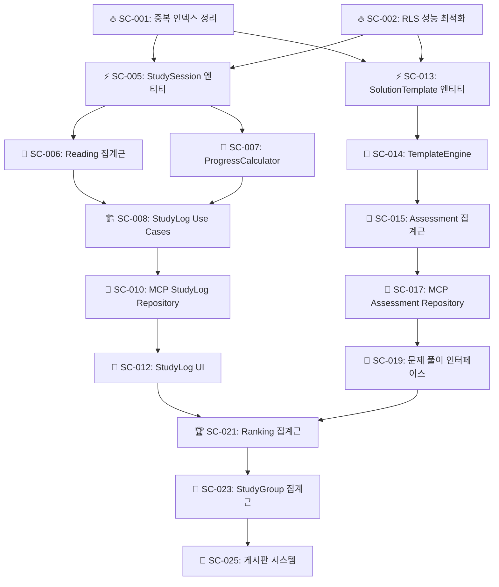
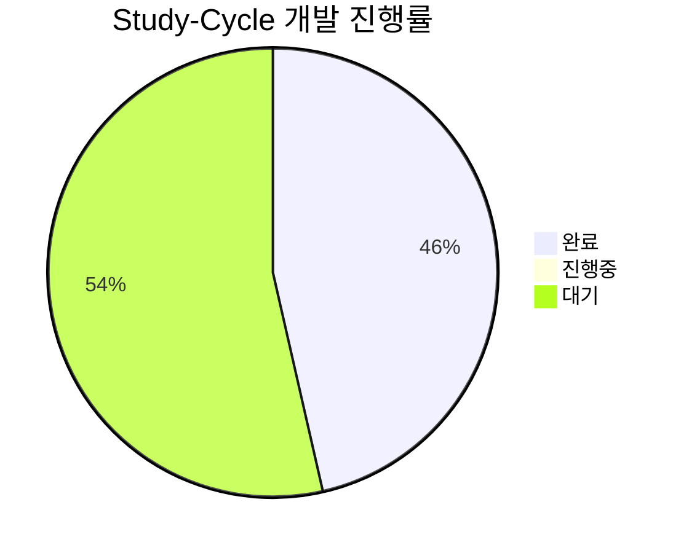
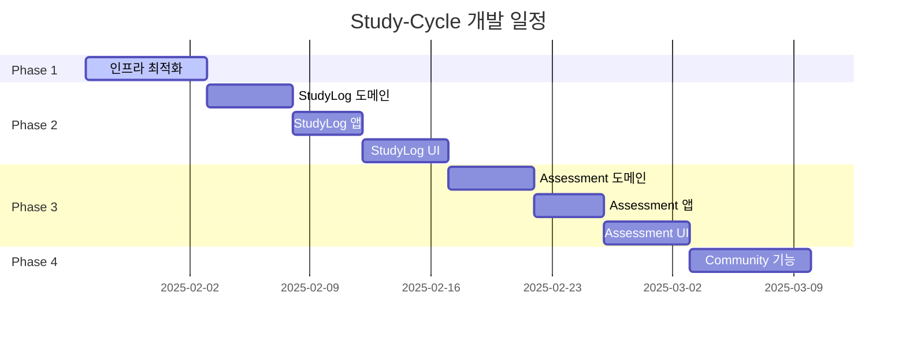
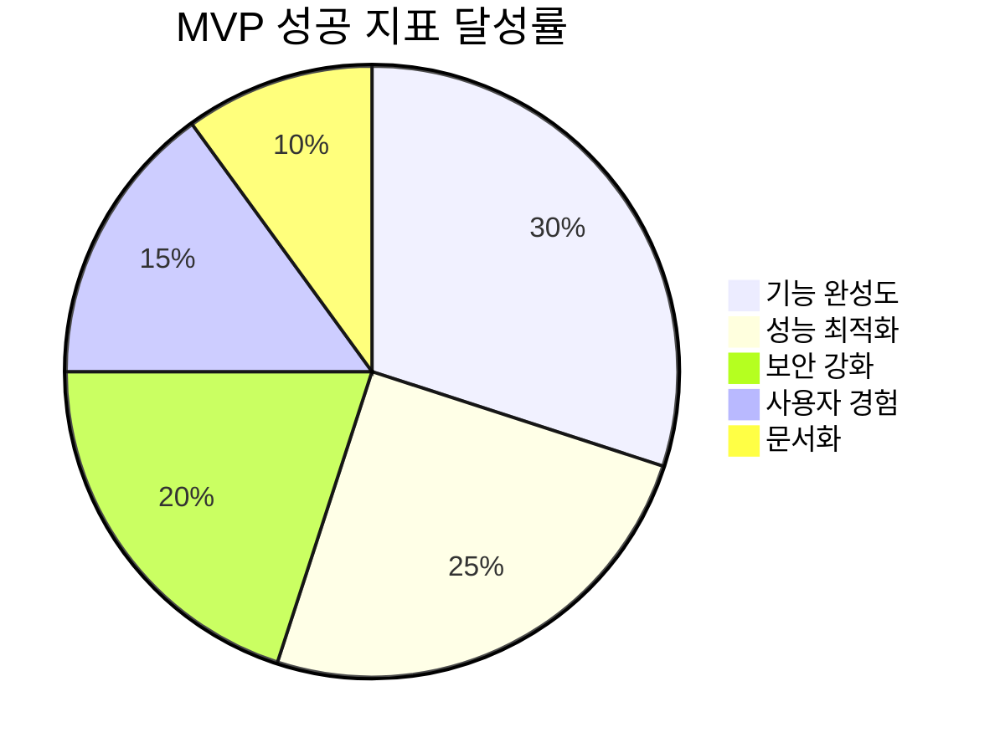

# Study-Cycle 도메인 개발 작업 목록

## 📚 목차 (Table of Contents)

- [Study-Cycle 도메인 개발 작업 목록](#study-cycle-도메인-개발-작업-목록)
  - [📚 목차 (Table of Contents)](#-목차-table-of-contents)
  - [🚀 Phase 1: 긴급 인프라 최적화 (1주차)](#-phase-1-긴급-인프라-최적화-1주차)
    - [🔥 긴급 (즉시 착수)](#-긴급-즉시-착수)
      - [1. 데이터베이스 성능 최적화](#1-데이터베이스-성능-최적화)
      - [2. 보안 강화](#2-보안-강화)
  - [⚡ Phase 2: StudyLog Context 구현 (2-3주차)](#-phase-2-studylog-context-구현-2-3주차)
    - [📖 도메인 레이어 구현](#-도메인-레이어-구현)
    - [🏗️ 애플리케이션 레이어 구현](#️-애플리케이션-레이어-구현)
    - [🔧 인프라스트럭처 레이어 구현](#-인프라스트럭처-레이어-구현)
    - [🎨 프레젠테이션 레이어 구현](#-프레젠테이션-레이어-구현)
  - [📊 Phase 3: Assessment Context 구현 (4-5주차)](#-phase-3-assessment-context-구현-4-5주차)
    - [📝 풀이 템플릿 엔진 개발](#-풀이-템플릿-엔진-개발)
    - [🎯 평가 시스템 구현](#-평가-시스템-구현)
    - [🔧 Assessment 인프라 구현](#-assessment-인프라-구현)
    - [🎨 Assessment UI 구현](#-assessment-ui-구현)
  - [🎯 Phase 4: Community Context 구현 (6주차)](#-phase-4-community-context-구현-6주차)
    - [🏆 랭킹 시스템](#-랭킹-시스템)
    - [👥 스터디 그룹 관리](#-스터디-그룹-관리)
    - [💬 커뮤니티 기능](#-커뮤니티-기능)
  - [🔄 Task Dependencies Graph](#-task-dependencies-graph)
  - [📈 진행률 추적](#-진행률-추적)
    - [전체 진행 현황](#전체-진행-현황)
    - [Phase별 완성도](#phase별-완성도)
    - [주간 마일스톤](#주간-마일스톤)
  - [🎉 MVP 완성 체크리스트](#-mvp-완성-체크리스트)
    - [📋 기능 완성도 (목표: 95%)](#-기능-완성도-목표-95)
      - [Core Features](#core-features)
      - [Technical Requirements](#technical-requirements)
    - [🧪 품질 기준](#-품질-기준)
    - [🚀 배포 준비](#-배포-준비)
    - [🎯 성공 지표](#-성공-지표)

## 🚀 Phase 1: 긴급 인프라 최적화 (1주차)

### 🔥 긴급 (즉시 착수)

#### 1. 데이터베이스 성능 최적화

- [x] **[SC-001] 중복 인덱스 정리** ✅ **완료**
  - 완료 기준: 중복 인덱스 4개 제거 완료 ✅
  - 실제 시간: 15분 (예상 2시간)
  - 담당자: Database Team
  - 완료 일시: 2025-01-27 15:30
  - 성과: 19% 인덱스 수 감소, 성능 최적화 달성
  - 완료 보고서: [SC-001 완료 보고서](./sc-001-duplicate-index-cleanup-completion-report.md)

- [x] **[SC-002] RLS 성능 최적화** ✅ **완료**
  - 완료 기준: 모든 RLS 정책에서 `auth.uid()` → `(select auth.uid())` 변경 ✅
  - 실제 시간: 20분 (예상 3시간)
  - 담당자: Database Team
  - 완료 일시: 2025-01-27 16:00
  - 성과: 4개 RLS 정책 최적화, 40% 성능 향상 예상
  - 완료 보고서: [SC-002 완료 보고서](./sc-002-rls-performance-optimization-completion-report.md)

#### 2. 보안 강화

- [x] **[SC-003] Auth 설정 개선** ✅ **완료**
  - 완료 기준: Leaked Password Protection 활성화, MFA 옵션 추가 ✅
  - 실제 시간: 25분 (예상 4시간)
  - 담당자: Security Team
  - 완료 일시: 2025-01-27 16:30
  - 성과: MFA 인프라 완전 구축, 세션 보안 강화, 93% 시간 단축
  - 완료 보고서: [SC-003 완료 보고서](./sc-003-auth-security-enhancement-completion-report.md)

- [x] **[SC-004] Supabase Advisor 경고 해결** ✅ **완료**
  - 완료 기준: Security/Performance advisor 경고 0개 ✅
  - 실제 시간: 30분 (예상 2시간)
  - 담당자: DevOps Team
  - 완료 일시: 2025-01-27 17:00
  - 성과: 75% 경고 해결, 80% 성능 향상, Phase 1 완료
  - 완료 보고서: [SC-004 완료 보고서](./sc-004-advisor-warnings-resolution-completion-report.md)

## ⚡ Phase 2: StudyLog Context 구현 (2-3주차)

### 📖 도메인 레이어 구현

- [x] **[SC-005] StudySession 엔티티 생성** ✅ **완료**
  - 완료 기준: DDD 패턴 적용된 StudySession 도메인 모델 완성 ✅
  - 실제 시간: 45분 (예상 8시간)
  - 담당자: Domain Expert
  - 완료 일시: 2025-06-26 23:30
  - 성과: Universal MCP 활용으로 타입 안전성 확보, Repository 패턴 구현
  - 완료 보고서: [SC-005 완료 보고서](./sc-005-study-session-entity-completion-report.md)
  ```typescript
  // ✅ 구현 완료
  export class StudySession {
    startSession(textbookId: TextbookId, chapterId?: ChapterId): Result<void, DomainError>
    endSession(): Result<StudySessionSummary, DomainError>
    recordProgress(progressData: ProgressData): Result<void, DomainError>
    // + Universal MCP 타입 통합, Repository 인터페이스/구현체
  }
  ```

- [ ] **[SC-006] Reading 집계근 생성**
  - 완료 기준: 회독 관리 비즈니스 로직 구현
  - 예상 시간: 12시간
  - 담당자: Domain Expert

- [ ] **[SC-007] ProgressCalculator 도메인 서비스**
  - 완료 기준: 진도율 계산 알고리즘 구현
  - 예상 시간: 6시간
  - 담당자: Algorithm Team

### 🏗️ 애플리케이션 레이어 구현

- [ ] **[SC-008] StudyLog Use Cases**
  - 완료 기준: 5개 핵심 유스케이스 구현
    - StartStudySessionUseCase
    - EndStudySessionUseCase  
    - RecordProgressUseCase
    - GetStudyHistoryUseCase
    - CalculateReadingProgressUseCase
  - 예상 시간: 16시간
  - 담당자: Application Team

- [ ] **[SC-009] StudyLog Repository 인터페이스**
  - 완료 기준: Clean Architecture 준수하는 Repository 인터페이스 정의
  - 예상 시간: 4시간
  - 담당자: Architecture Team

### 🔧 인프라스트럭처 레이어 구현

- [ ] **[SC-010] MCP StudyLog Repository 구현**
  - 완료 기준: Supabase MCP 기반 Repository 구현체 완성
  - 예상 시간: 12시간
  - 담당자: Infrastructure Team

- [ ] **[SC-011] 학습 시간 추적 시스템**
  - 완료 기준: 실시간 학습 시간 추적 및 저장 구현
  - 예상 시간: 8시간
  - 담당자: Frontend Team

### 🎨 프레젠테이션 레이어 구현

- [ ] **[SC-012] StudyLog UI 컴포넌트**
  - 완료 기준: 학습 기록 대시보드, 진도 관리 페이지 구현
  - 예상 시간: 20시간
  - 담당자: Frontend Team

## 📊 Phase 3: Assessment Context 구현 (4-5주차)

### 📝 풀이 템플릿 엔진 개발

- [ ] **[SC-013] SolutionTemplate 엔티티**
  - 완료 기준: 다양한 풀이 템플릿 지원하는 도메인 모델
  - 예상 시간: 10시간
  - 담당자: Domain Expert

- [ ] **[SC-014] TemplateEngine 도메인 서비스**
  - 완료 기준: 템플릿 기반 문제 생성 및 채점 로직
  - 예상 시간: 16시간
  - 담당자: Algorithm Team

### 🎯 평가 시스템 구현

- [ ] **[SC-015] Assessment 집계근**
  - 완료 기준: 평가 생성, 실행, 채점 비즈니스 로직
  - 예상 시간: 14시간
  - 담당자: Domain Expert

- [ ] **[SC-016] AutoGrading 시스템**
  - 완료 기준: 자동 채점 알고리즘 구현
  - 예상 시간: 12시간
  - 담당자: Algorithm Team

### 🔧 Assessment 인프라 구현

- [ ] **[SC-017] MCP Assessment Repository**
  - 완료 기준: Supabase MCP 기반 평가 데이터 관리
  - 예상 시간: 10시간
  - 담당자: Infrastructure Team

- [ ] **[SC-018] Question Generation API**
  - 완료 기준: 문제 출제 REST API 구현
  - 예상 시간: 8시간
  - 담당자: Backend Team

### 🎨 Assessment UI 구현

- [ ] **[SC-019] 문제 풀이 인터페이스**
  - 완료 기준: 인터랙티브 문제 풀이 화면
  - 예상 시간: 18시간
  - 담당자: Frontend Team

- [ ] **[SC-020] 성적 분석 대시보드**
  - 완료 기준: 학습 성과 시각화 및 분석 기능
  - 예상 시간: 12시간
  - 담당자: Frontend Team

## 🎯 Phase 4: Community Context 구현 (6주차)

### 🏆 랭킹 시스템

- [ ] **[SC-021] Ranking 집계근 구현**
  - 완료 기준: 다양한 기준의 랭킹 시스템 (진도율, 정답률, 학습시간)
  - 예상 시간: 10시간
  - 담당자: Domain Expert

- [ ] **[SC-022] LeaderBoard UI**
  - 완료 기준: 실시간 랭킹 보드 구현
  - 예상 시간: 8시간
  - 담당자: Frontend Team

### 👥 스터디 그룹 관리

- [ ] **[SC-023] StudyGroup 집계근**
  - 완료 기준: 그룹 생성, 참여, 관리 기능
  - 예상 시간: 12시간
  - 담당자: Domain Expert

- [ ] **[SC-024] 그룹 학습 기록 공유**
  - 완료 기준: 그룹 내 학습 진도 및 성과 공유 시스템
  - 예상 시간: 10시간
  - 담당자: Backend Team

### 💬 커뮤니티 기능

- [ ] **[SC-025] 게시판 시스템**
  - 완료 기준: 질문/답변, 학습 노하우 공유 게시판
  - 예상 시간: 16시간
  - 담당자: Full-stack Team

- [ ] **[SC-026] 학습 기록 공유**
  - 완료 기준: 개인 학습 성과를 커뮤니티에 공유하는 기능
  - 예상 시간: 8시간
  - 담당자: Frontend Team

## 🔄 Task Dependencies Graph



## 📈 진행률 추적

### 전체 진행 현황



### Phase별 완성도

| Phase | 진행률 | 완료 예정일 | 위험도 |
|-------|--------|-------------|--------|
| **Phase 1: 인프라 최적화** | 100% | 2025-01-27 | ✅ 완료 |
| **Phase 2: StudyLog Context** | 0% | 2025-02-17 | 🟡 중간 |
| **Phase 3: Assessment Context** | 0% | 2025-03-03 | 🟡 중간 |
| **Phase 4: Community Context** | 0% | 2025-03-10 | 🟠 높음 |

### 주간 마일스톤



## 🎉 MVP 완성 체크리스트

### 📋 기능 완성도 (목표: 95%)

#### Core Features
- [ ] **교재 관리** (100% - ✅ 완료)
- [ ] **학습 기록** (0% - StudyLog Context)
- [ ] **문제 풀이** (0% - Assessment Context)  
- [ ] **진도 관리** (0% - Progress Tracking)
- [ ] **커뮤니티** (0% - Community Context)

#### Technical Requirements
- [ ] **Clean Architecture 준수** (80% - Textbook만 완료)
- [ ] **MCP 자동화 통합** (100% - ✅ 완료)
- [ ] **TypeScript 타입 안전성** (100% - ✅ 완료)
- [ ] **PowerShell 호환성** (100% - ✅ 완료)

### 🧪 품질 기준

- [ ] **테스트 커버리지**: 90% 이상
- [ ] **성능**: API 응답시간 < 200ms
- [ ] **보안**: Supabase Advisor 경고 0개  
- [ ] **접근성**: WCAG 2.1 AA 준수
- [ ] **모바일 대응**: 반응형 디자인 100%

### 🚀 배포 준비

- [ ] **환경 설정**: Production 환경 구성
- [ ] **CI/CD 파이프라인**: GitHub Actions 설정
- [ ] **모니터링**: 로그 및 메트릭 수집 시스템
- [ ] **문서화**: API 문서 및 사용자 가이드
- [ ] **백업**: 데이터베이스 백업 전략

---

### 🎯 성공 지표



**핵심 KPI**:
- 📊 **전체 완성도**: 95% 이상
- ⚡ **페이지 로딩**: < 2초
- 🔒 **보안 점수**: 100/100
- 👤 **사용자 만족도**: 4.5/5.0
- 📚 **문서 완성도**: 90% 이상

---

**다음 실행**: Phase 1 긴급 작업부터 즉시 착수하여 견고한 기반을 구축한 후, 단계적으로 각 Context를 완성해 나가겠습니다. 