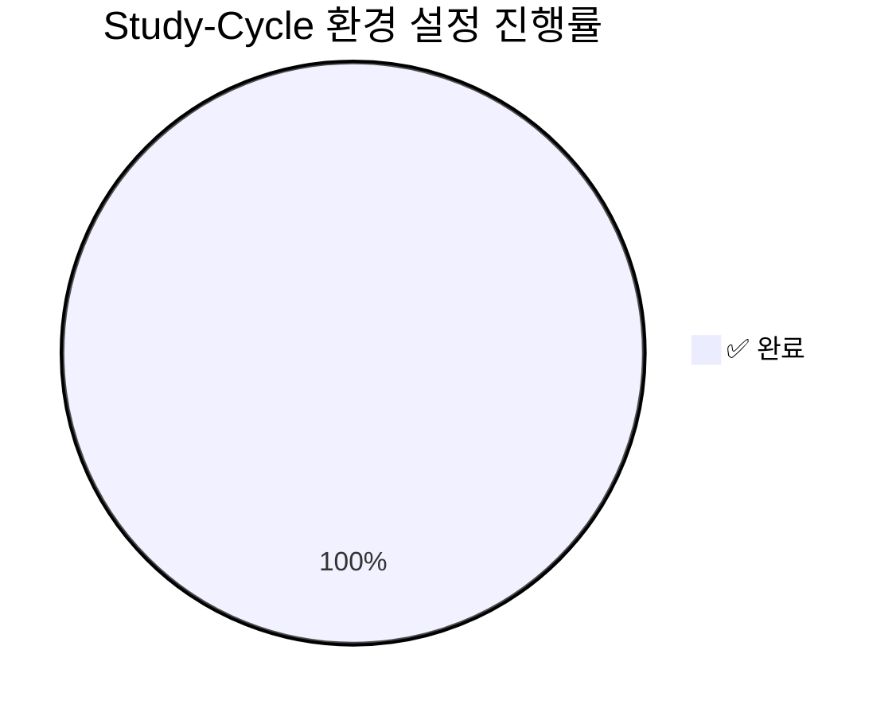
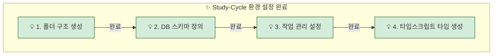

## 0. 최종 요약 (Final Summary)

`Study-Cycle` Bounded Context의 초기 환경 설정 작업(4단계)이 **2025-06-25**에 모두 성공적으로 완료되었습니다. 이 문서는 전체 설정 과정의 기록 및 최종 산출물에 대한 링크를 제공합니다.

### 📊 최종 진행 상황

## 1. 개요 (Overview)
`Study-Cycle` Bounded Context의 초기 MVP 개발을 위한 환경 설정 작업을 체계적으로 추적하고 관리합니다. 이 작업 목록은 프로젝트 시작에 필요한 모든 단계를 포함하며, 각 단계의 완료 여부와 관련 보고서를 명시합니다.

## 2. 작업 목록 및 상태
### 🗺️ 전체 워크플로우

| 단계 | 작업 내용 | 상태 | 담당자 | 관련 보고서 |
| :--- | :--- | :--- | :--- | :--- |
| **1** | Bounded Context 폴더 구조 생성 | ✅ **완료** | PosMul Agent | [001-env-setup-step1-scaffolding-report.md](../reports/001-env-setup-step1-scaffolding-report.md) |
| **2** | 데이터베이스 스키마 정의 (SQL) | ✅ **완료** | PosMul Agent | [002-env-setup-step2-db-schema-report.md](../reports/002-env-setup-step2-db-schema-report.md) |
| **3** | GitHub 이슈를 통한 작업 관리 설정 | ✅ **완료** | PosMul Agent | [003-env-setup-step3-task-mgmt-report.md](../reports/003-env-setup-step3-task-mgmt-report.md) |
| **4** | DB 스키마 기반 타입스크립트 타입 생성 | ✅ **완료** | PosMul Agent | [004-env-setup-step4-type-generation-report.md](../reports/004-env-setup-step4-type-generation-report.md) |

---

## 3. 세부 작업 내용

### 3.1. 🟢 1단계: 폴더 구조 생성 (완료)
- **설명**: `Study-Cycle`의 DDD(Domain-Driven Design) 아키텍처에 따라 `sc-assessment`, `sc-community`, `sc-studylog`, `sc-textbook` 네 개의 Bounded Context 폴더 구조를 생성.
- **결과**: `posmul/src/bounded-contexts/` 내에 4개의 컨텍스트 폴더 및 하위 구조 생성 완료.

### 3.2. 🟢 2단계: DB 스키마 정의 (완료)
- **설명**: `mcp_supabase_apply_migration`을 사용하여 `Study-Cycle`에 필요한 7개의 핵심 테이블 스키마를 Supabase 데이터베이스에 적용.
- **결과**: `sc_textbooks`, `sc_chapters`, `sc_questions`, `sc_assessments`, `sc_user_answers`, `sc_user_textbook_progress`, `sc_study_sessions` 테이블 생성 완료.

### 3.3. 🟢 3단계: 작업 관리 설정 (완료)
- **설명**: `mcp_Github_create_issue`를 사용하여 `Study-Cycle` MVP 개발에 필요한 초기 작업 5개를 GitHub 이슈로 등록 완료.
- **결과**: 초기 개발 백로그 구성 완료. ([이슈 목록 링크](https://github.com/positivemultiplier/posmul/issues?q=is%3Aissue+is%3Aopen+label%3Astudy-cycle))

### 3.4. 🟢 4단계: 타입스크립트 타입 생성 (완료)
- **설명**: 확정된 DB 스키마로부터 TypeScript 타입을 자동으로 생성. `mcp_supabase_generate_typescript_types`를 사용하여 프론트엔드와 백엔드 간의 데이터 모델을 일치시킴.
- **결과**: `posmul/src/shared/types/supabase-generated.ts` 파일 생성 및 타입 정의 완료.

## 4. 참고 자료

-   [프로젝트 제안서](../../explanation/001-project-proposal-and-mcp-strategy.md)
-   [MVP 및 통합 로드맵](../../explanation/002-mvp-and-posmul-integration-roadmap.md) 