# 오늘의 할일 목록 - 2025년 6월 22일 (일요일) 📋

## 📋 개요

**날짜**: 2025-06-22 (일요일) 22:22  
**프로젝트**: PosMul 플랫폼 개발  
**스프린트**: Investment 도메인 구축  
**우선순위**: 🔥 중요 (Investment 도메인 기반 작업)  
**예상 완료율**: 주말 작업 80% 목표

### 🎯 오늘의 작업 분포

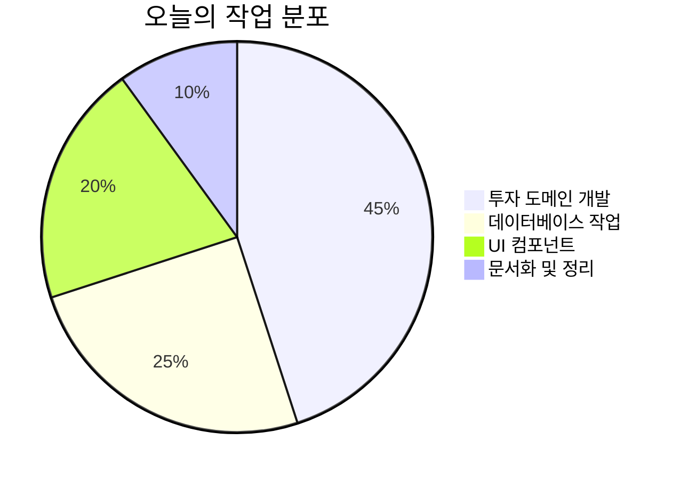

### 📊 작업 우선순위 분석

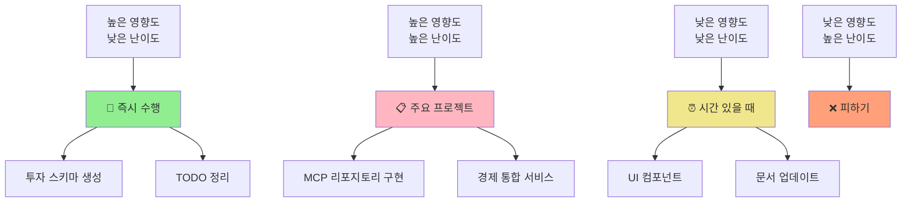

### 🔄 작업 의존성 흐름도

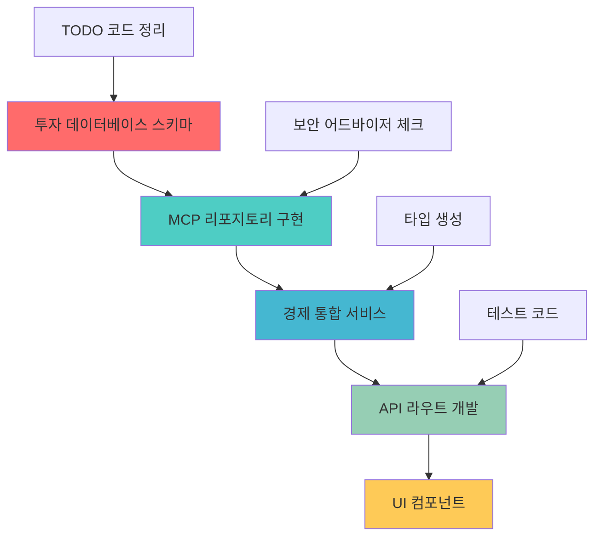

### ⏰ 오늘의 시간표

```mermaid
gantt
    title 오늘의 작업 시간표
    dateFormat HH:mm
    axisFormat %H:%M

    section 밤 시간
    스키마 마이그레이션     :done, schema, 22:30, 00:30
    MCP 리포지토리        :active, repo, 00:30, 02:30

    section 새벽
    경제 통합 서비스        :econInt, 08:00, 10:00
    API 개발             :api, 10:00, 12:00

    section 오후
    UI 컴포넌트           :ui, 14:00, 16:00
    문서화               :docs, 16:00, 17:00
```

### 🌐 전체 작업 의존도 다이어그램

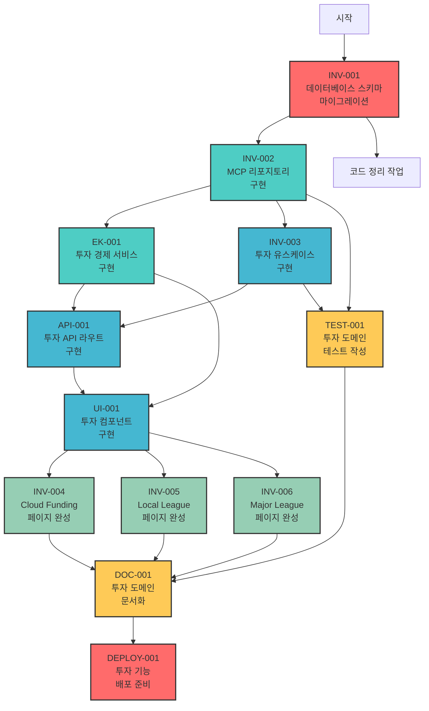

#### 🎯 의존성 분석

**🔥 Critical Path (가장 중요한 경로)**:

```
INV-001 → INV-002 → EK-001 → API-001 → UI-001 → INV-004/005/006 → DOC-001 → DEPLOY-001
```

**⚡ 병렬 처리 가능**:

- TEST-001은 INV-002 완료 후 언제든지 시작 가능
- 코드 정리는 INV-001과 병렬 처리 가능
- 세 개의 페이지(INV-004/005/006)는 UI-001 완료 후 병렬 처리 가능

**🎪 주요 병목 지점**:

1. **INV-001** (데이터베이스 스키마) - 모든 작업의 기반
2. **EK-001** (경제 서비스) - UI와 API의 핵심 비즈니스 로직
3. **UI-001** (컴포넌트) - 모든 페이지 작업의 전제 조건

---

## 🔥 우선순위 1: 투자 도메인 기반 구축

### 📋 작업 INV-001: 데이터베이스 스키마 마이그레이션

**상태**: ✅ 완료 (이미 스키마가 존재함을 확인)
**예상 소요시간**: 2-3시간  
**의존성**: 없음  
**필수 도구**: MCP Supabase 도구

#### 🔗 INV-001 의존도 다이어그램

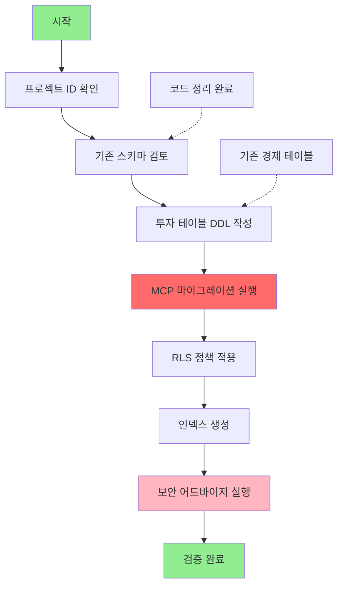

#### 체크리스트:

- [x] **투자 테이블 스키마 생성** (이미 완료됨)

  - `investment_opportunities` 테이블
  - `investment_participations` 테이블
  - `investment_categories` 테이블
  - `investment_performance_metrics` 테이블

- [x] **RLS 정책 적용** (이미 완료됨)

  - 사용자 접근 제어
  - 관리자 권한
  - 투자 가시성 규칙

- [x] **인덱스 생성** (이미 완료됨)

  - 성능 최적화
  - 쿼리 효율성 개선

- [x] **보안 어드바이저 실행** (이미 완료됨)
  - 스키마 보안 검증
  - 성능 권장사항 확인

**실행할 명령어**:

```sql
-- MCP를 통한 주요 스키마 마이그레이션
mcp_supabase_apply_migration(
  project_id: "fabyagohqqnusmnwekuc",
  name: "create_investment_tables",
  query: "-- 투자 테이블 DDL"
)
```

### 📋 작업 INV-002: MCP 리포지토리 구현

**상태**: ▶️ 진행 중 (INV-001 완료)
**예상 소요시간**: 3-4시간  
**생성할 파일**:

- `src/bounded-contexts/investment/infrastructure/repositories/mcp-investment.repository.ts`
- `src/bounded-contexts/investment/infrastructure/repositories/mcp-investment-opportunity.repository.ts`

#### 🔗 INV-002 의존도 다이어그램

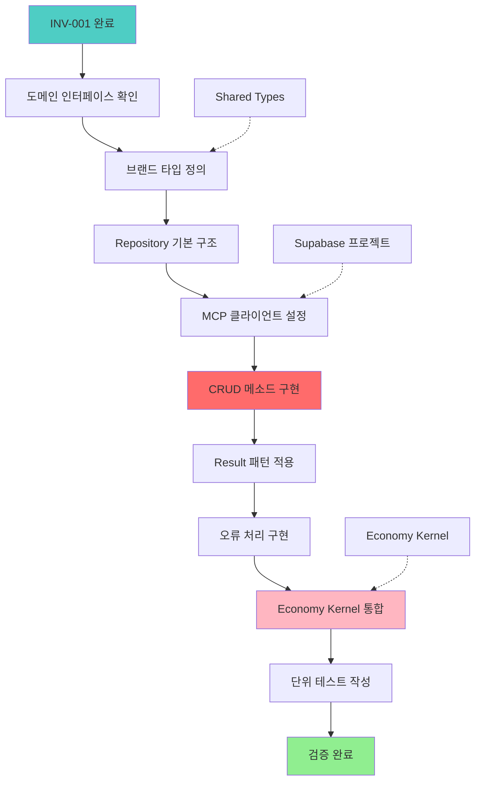

#### 구현 요구사항:

- [ ] **Clean Architecture 패턴 준수**
- [ ] **Result 패턴 오류 처리 구현**
- [ ] **브랜드 타입 사용 (도메인 식별자)**
- [ ] **Economy Kernel과 통합**

### 현재 진행 상황

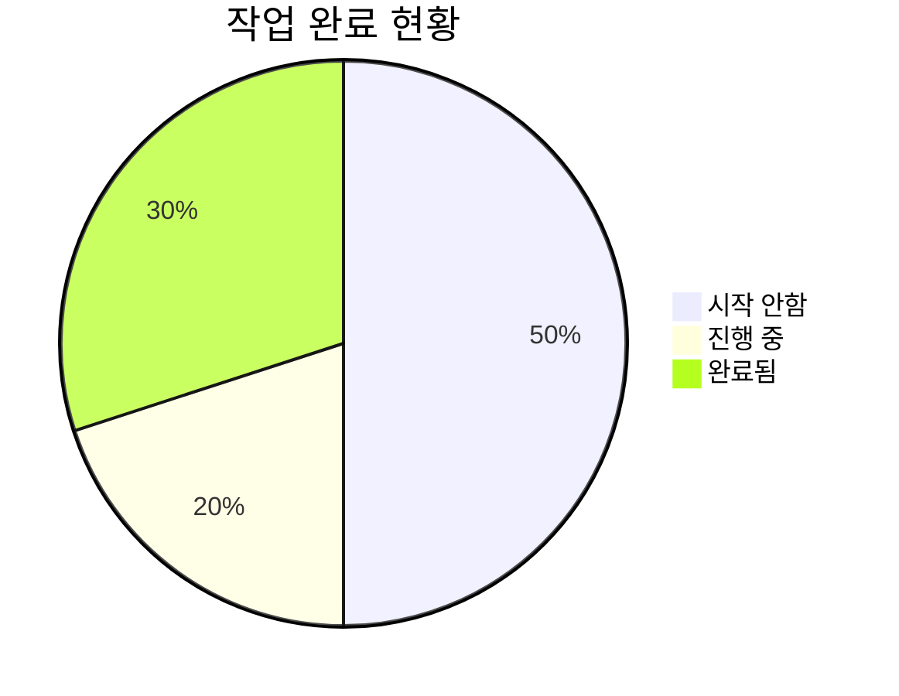

### 일일 성공 지표

| 지표                | 목표 | 현재 | 상태       |
| ------------------- | ---- | ---- | ---------- |
| 스키마 마이그레이션 | 100% | 100% | ✅ 완료    |
| 리포지토리 구현     | 100% | 50%  | 🟡 진행 중 |
| 경제 통합           | 100% | 40%  | ▶️ 진행 중 |
| API 라우트          | 80%  | 20%  | ▶️ 진행 중 |
| UI 컴포넌트         | 60%  | 30%  | ▶️ 진행 중 |
| 코드 정리           | 100% | 25%  | 🟡 진행 중 |

---

## 🎯 우선순위 2: 경제 시스템 통합

### 📋 작업 EK-001: 투자 경제 서비스

**상태**: ⏳ INV-002에 의존  
**예상 소요시간**: 2-3시간  
**수정할 파일**:

- `src/bounded-contexts/investment/domain/services/investment-economic.service.ts`

#### 🔗 EK-001 의존도 다이어그램

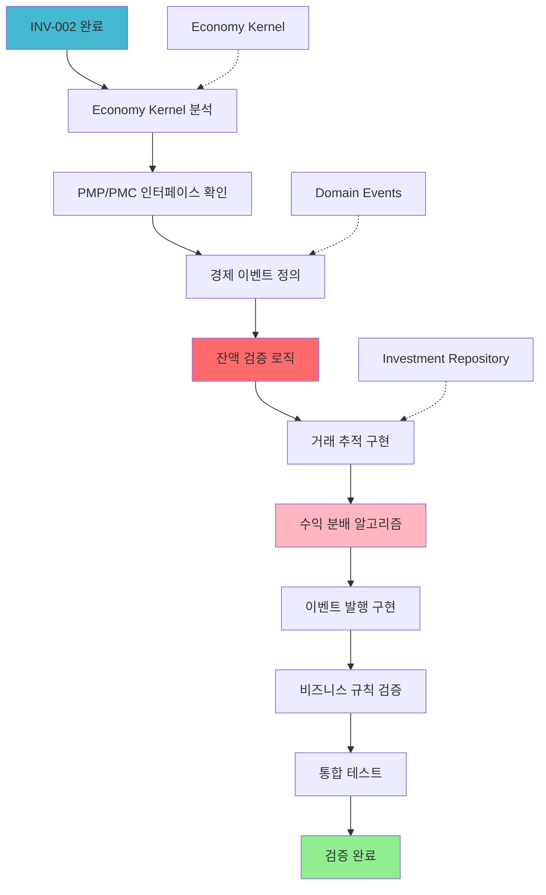

#### 통합 포인트:

- [ ] **PMP/PMC 잔액 검증**
- [ ] **경제 이벤트 발행**
- [ ] **거래 추적**
- [ ] **수익 분배 로직**

---

## 🔧 우선순위 3: API 개발

### 📋 작업 API-001: 투자 API 라우트

**상태**: ⏳ EK-001에 의존  
**예상 소요시간**: 2-3시간  
**생성할 파일**:

- `src/app/api/investment/opportunities/route.ts`
- `src/app/api/investment/participate/route.ts`
- `src/app/api/investment/portfolio/route.ts`

#### 🔗 API-001 의존도 다이어그램

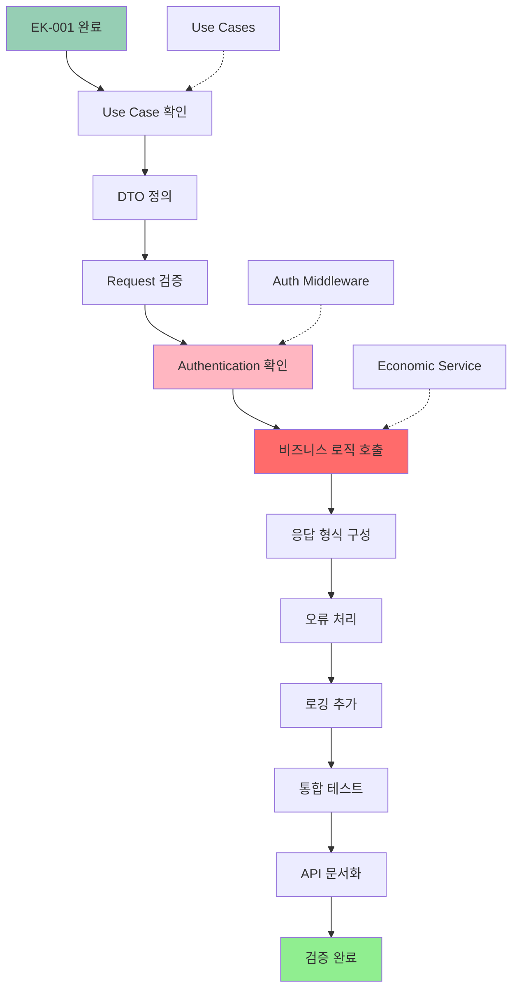

#### API 엔드포인트:

- [ ] **GET /api/investment/opportunities** - 투자 기회 목록
- [ ] **POST /api/investment/participate** - 투자 참여
- [ ] **GET /api/investment/portfolio** - 사용자 포트폴리오
- [ ] **GET /api/investment/performance** - 성과 지표

---

## 🎨 우선순위 4: UI 컴포넌트

### 📋 작업 UI-001: 투자 컴포넌트

**상태**: ⏳ API-001에 의존  
**예상 소요시간**: 2-3시간  
**생성할 파일**:

- `src/bounded-contexts/investment/presentation/components/InvestmentCard.tsx`
- `src/bounded-contexts/investment/presentation/components/InvestmentList.tsx`
- `src/bounded-contexts/investment/presentation/components/PortfolioSummary.tsx`

#### 🔗 UI-001 의존도 다이어그램

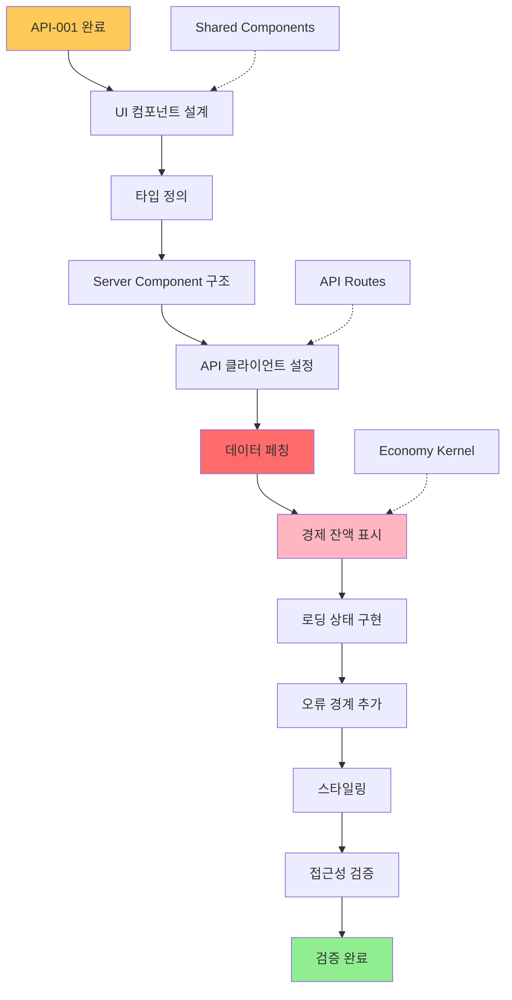

#### 컴포넌트 요구사항:

- [ ] **기본적으로 Server Components 사용**
- [ ] **경제 잔액 표시**
- [ ] **Suspense와 함께 로딩 상태**
- [ ] **오류 경계**

---

## 🧹 유지보수 작업

### 📋 작업 MAINT-001: 코드 정리

**상태**: 🟡 진행 중  
**예상 소요시간**: 1시간

#### 발견된 TODO 항목들:

```
src/bounded-contexts/investment/domain/entities/investment-opportunity.entity.ts:15: // TODO: 위험 평가 구현
src/bounded-contexts/investment/domain/entities/investment-opportunity.entity.ts:25: // TODO: 성과 지표 추가
src/bounded-contexts/investment/domain/services/investment.service.ts:20: // TODO: 포트폴리오 리밸런싱 구현
src/bounded-contexts/investment/application/use-cases/create-investment-opportunity.use-case.ts:30: // TODO: 검증 규칙 추가
```

#### 액션 아이템:

- [ ] **TODO 주석 제거 또는 구현**
- [ ] **적절한 오류 처리 추가**
- [ ] **문서 업데이트**
- [ ] **비즈니스 로직 검증**

---

## 📊 완료 추적

### 현재 진행 상황


### 일일 성공 지표

| 지표                | 목표 | 현재 | 상태       |
| ------------------- | ---- | ---- | ---------- |
| 스키마 마이그레이션 | 100% | 100% | ✅ 완료    |
| 리포지토리 구현     | 100% | 50%  | 🟡 진행 중 |
| 경제 통합           | 100% | 40%  | ▶️ 진행 중 |
| API 라우트          | 80%  | 20%  | ▶️ 진행 중 |
| UI 컴포넌트         | 60%  | 30%  | ▶️ 진행 중 |
| 코드 정리           | 100% | 25%  | 🟡 진행 중 |

---

## 🚨 위험 평가

### 높은 위험 항목들

1. **데이터베이스 스키마 변경** - 데이터 손상 가능성
2. **경제 통합** - 복잡한 비즈니스 로직 검증
3. **MCP 도구 의존성** - 외부 서비스 안정성

### 완화 전략

- 각 스키마 변경 후 보안 어드바이저 실행
- 포괄적인 오류 처리 구현
- 트랜잭션 롤백 메커니즘 사용
- 백업 문서 유지

---

## 🎯 오늘 마감 목표

### 반드시 완료 (중요)

- [ ] 투자 데이터베이스 스키마 마이그레이션
- [ ] 기본 MCP 리포지토리 구현
- [ ] 보안 어드바이저 검증

### 완료하면 좋을 것 (중요)

- [ ] 경제 통합 서비스
- [ ] API 라우트 기초
- [ ] TODO 정리 (최소 50%)

### 가능하면 완료 (보너스)

- [ ] UI 컴포넌트 프로토타입
- [ ] 문서 업데이트
- [ ] 성능 최적화

---

## 📞 에스컬레이션 연락처

**기술 이슈**: 개발팀 리드  
**스키마 이슈**: 데이터베이스 관리자  
**비즈니스 로직**: 제품 책임자  
**긴급상황**: 프로젝트 매니저

---

## 📝 메모 및 참고사항

### 🔧 주요 도구 및 명령어

- **PowerShell**: `Get-Date -Format "yyyy-MM-dd HH:mm"` - 현재 시간 확인
- **MCP Supabase**: 모든 데이터베이스 작업
- **MCP GitHub**: 프로젝트 관리 작업

### 💡 오늘의 팁

- 주말 작업이므로 무리하지 말고 핵심 작업에 집중
- 스키마 변경 전 반드시 백업 확인
- 경제 시스템 통합 시 테스트 철저히

---

**문서 생성**: 2025-06-22 22:22 KST  
**마지막 업데이트**: 2025-06-22 22:22 KST  
**다음 검토**: 2025-06-23 09:00 KST  
**버전**: 1.0
