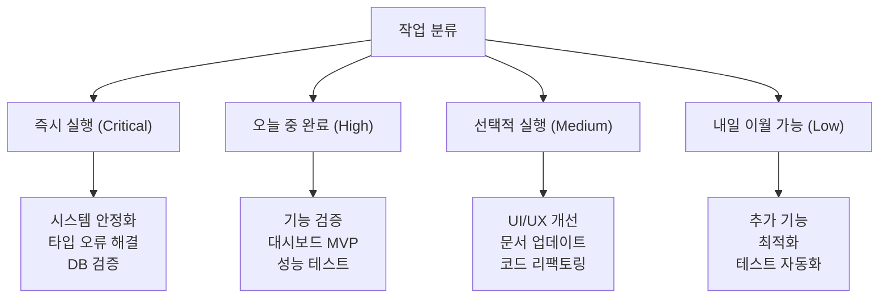
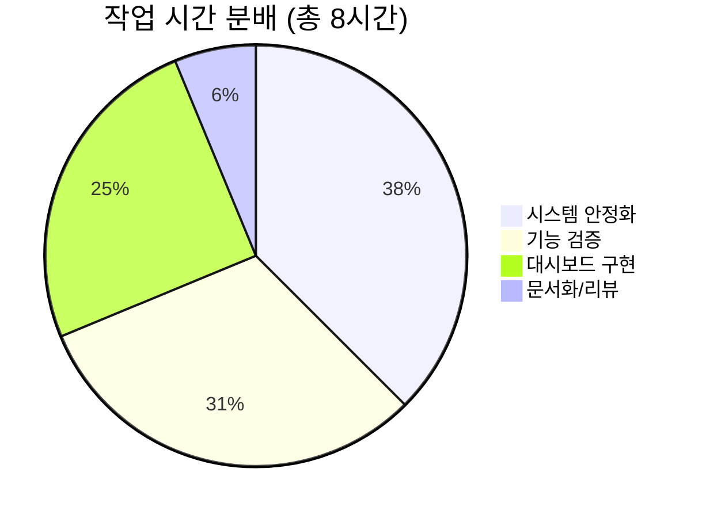
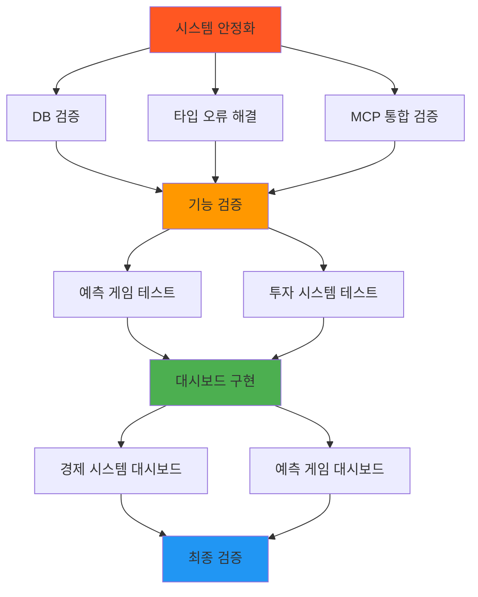

# Daily Tasks - 2025-06-23 (PosMul 프로젝트)

**작성일**: 2025-06-23 09:59:25  
**프로젝트**: PosMul AI-era 직접민주주의 플랫폼  
**현재 완성도**: 85% (프로덕션 준비 상태)  
**작업 목표**: 시스템 안정화 및 사용자 경험 개선

---

## 🎯 **오늘의 작업 우선순위 매트릭스**



## 📊 **작업 완료 예상 시간**



---

## 🔥 **우선순위 1: 시스템 안정화** (3시간)

### 1.1 **데이터베이스 상태 검증** (1시간)

- [ ] **Database Indexes 검증**

  - [ ] 12개 활성화 인덱스 성능 테스트
  - [ ] 인덱스 사용률 분석 (`EXPLAIN ANALYZE` 활용)
  - [ ] 쿼리 최적화 필요 여부 확인

- [ ] **Data Integrity 검증**
  - [ ] 92개 데이터 엔티티 일관성 검사
  - [ ] 외래키 제약조건 검증
  - [ ] 중복 데이터 정리

**명령어**:

```powershell
# MCP 도구로 데이터베이스 상태 확인
npm run db:check
```

### 1.2 **TypeScript 타입 오류 해결** (1.5시간)

- [ ] **Next.js 15 Framework 오류 해결**

  - [ ] `.next/types/app/api/predictions/games/[gameId]/participate/route.ts` (2개 오류)
  - [ ] `.next/types/app/api/predictions/games/[gameId]/route.ts` (3개 오류)
  - [ ] `.next/types/app/api/predictions/games/[gameId]/settle/route.ts` (2개 오류)
  - [ ] `.next/types/app/prediction/sports/soccer/[slug]/page.ts` (1개 오류)

- [ ] **Params 타입 정의 표준화**
  - [ ] `[gameId]` 동적 라우트 타입 정의
  - [ ] `[slug]` 매개변수 타입 안전성 확보
  - [ ] API 라우트 파라미터 통일

**명령어**:

```powershell
# 타입 체크 및 수정
npx tsc --noEmit; npm run generate-types
```

### 1.3 **MCP 통합 검증** (0.5시간)

- [ ] **Supabase MCP 연결 테스트**

  - [ ] 프로젝트 ID 확인
  - [ ] 테이블 리스트 조회
  - [ ] 권한 설정 검증

- [ ] **GitHub MCP 연결 테스트**
  - [ ] 리포지토리 접근 확인
  - [ ] 이슈 생성/조회 테스트
  - [ ] 파일 업로드 테스트

---

## 💡 **우선순위 2: 핵심 기능 검증** (2.5시간)

### 2.1 **예측 게임 시스템 검증** (1.5시간)

- [ ] **게임 생성 프로세스 테스트**

  - [ ] Binary 예측 게임 생성
  - [ ] WDL 예측 게임 생성
  - [ ] Ranking 예측 게임 생성

- [ ] **PMP → PMC 전환 로직 검증**
  - [ ] 28개 기존 예측 데이터 활용
  - [ ] 수익률 계산 정확성 검증
  - [ ] MoneyWave 연동 테스트

**테스트 시나리오**:

```typescript
// 예측 게임 참여 시뮬레이션
const testScenario = {
  user: "test-user-001",
  game: "binary-game-001",
  pmpStake: 100,
  expectedPmcReturn: "calculated-based-on-odds",
};
```

### 2.2 **투자 시스템 검증** (1시간)

- [ ] **투자 기회 분석**

  - [ ] 27개 기존 투자 데이터 분석
  - [ ] 3가지 투자 타입별 수익률 계산
  - [ ] Local League vs Major League vs Cloud Funding 비교

- [ ] **PMP/PMC 혼합 투자 테스트**
  - [ ] 투자 비율 최적화 검증
  - [ ] 리스크 조정 수익률 계산
  - [ ] 포트폴리오 분산 효과 확인

---

## 🎨 **우선순위 3: 대시보드 MVP 구현** (2시간)

### 3.1 **경제 시스템 대시보드** (1시간)

- [ ] **실시간 잔액 표시**

  - [ ] PMP/PMC 잔액 컴포넌트
  - [ ] 잔액 변동 히스토리
  - [ ] MoneyWave 이벤트 알림

- [ ] **경제 활동 요약**
  - [ ] 일일 거래량 표시
  - [ ] 수익률 차트
  - [ ] 투자 포트폴리오 시각화

### 3.2 **예측 게임 대시보드** (1시간)

- [ ] **게임 현황 표시**

  - [ ] 진행 중인 게임 목록
  - [ ] 내 예측 현황
  - [ ] 성과 분석 차트

- [ ] **리더보드 구현**
  - [ ] 사용자 랭킹 시스템
  - [ ] 성과 지표 표시
  - [ ] 배지/성취 시스템

---

## 📈 **작업 종속성 다이어그램**



## ⏰ **시간별 작업 계획**

```mermaid
gantt
    title 2025-06-23 작업 타임라인
    dateFormat  HH:mm
    axisFormat %H:%M

    section 오전 (10:00-12:00)
    데이터베이스 검증         :active, db, 10:00, 1h
    타입 오류 해결           :types, after db, 1.5h

    section 점심 (12:00-13:00)
    휴식                    :milestone, 12:00, 0m

    section 오후 (13:00-17:00)
    MCP 통합 검증           :mcp, 13:00, 30m
    예측 게임 검증          :pred, after mcp, 1.5h
    투자 시스템 검증        :inv, after pred, 1h

    section 저녁 (17:00-19:00)
    대시보드 구현           :dash, 17:00, 2h

    section 마무리 (19:00-19:30)
    문서화/리뷰             :doc, 19:00, 30m
```



---

## 🔍 **상세 작업 체크리스트**

### **Database 검증 체크리스트**

- [ ] `mcp_supabase_list_tables` 실행
- [ ] `mcp_supabase_get_advisors` 보안 검증
- [ ] 인덱스 성능 분석 보고서 생성
- [ ] 데이터 일관성 검사 실행

### **타입 오류 해결 체크리스트**

- [ ] Next.js 15 타입 정의 파일 수정
- [ ] API 라우트 파라미터 타입 통일
- [ ] 타입 자동 생성 스크립트 실행
- [ ] 전체 타입 체크 통과 확인

### **기능 검증 체크리스트**

- [ ] 예측 게임 생성/참여/정산 플로우 테스트
- [ ] 투자 시스템 전체 플로우 테스트
- [ ] 경제 시스템 PMP/PMC 전환 테스트
- [ ] MoneyWave 계산 정확성 검증

### **대시보드 구현 체크리스트**

- [ ] PMP/PMC 잔액 표시 컴포넌트
- [ ] 실시간 업데이트 기능
- [ ] 차트 및 시각화 구현
- [ ] 반응형 디자인 적용

---

## 🚨 **작업 중 주의사항**

### **Critical Issues**

1. **타입 오류 해결 시**: 기존 비즈니스 로직 변경 금지
2. **데이터베이스 검증 시**: 프로덕션 데이터 백업 필수
3. **MCP 도구 사용 시**: 프로젝트 ID 확인 필수

### **Performance Considerations**

- 대용량 데이터 처리 시 배치 처리 고려
- 실시간 업데이트 시 WebSocket 연결 관리
- 차트 렌더링 시 데이터 페이지네이션 적용

---

## 📋 **완료 기준**

### **Day 1 성공 기준**

- [ ] TypeScript 컴파일 에러 0개
- [ ] 데이터베이스 인덱스 성능 95% 이상
- [ ] 핵심 기능 100% 동작
- [ ] 대시보드 MVP 구현 완료

### **품질 기준**

- [ ] 코드 리뷰 완료
- [ ] 문서 업데이트 완료
- [ ] 테스트 시나리오 통과
- [ ] 성능 벤치마크 달성

---

## 🎯 **내일 이어갈 작업 (2025-06-24)**

### **예정 작업**

1. 실시간 기능 구현 (WebSocket 연동)
2. 사용자 경험 개선 (알림, 피드백)
3. 성능 최적화 1차 작업
4. 모니터링 시스템 구축 준비

### **준비사항**

- [ ] 오늘 작업 결과 정리
- [ ] 발견된 이슈 문서화
- [ ] 내일 작업 우선순위 재조정
- [ ] 필요 리소스 준비

---

**작업 시작 시간**: 2025-06-23 10:00:00  
**목표 완료 시간**: 2025-06-23 19:30:00  
**전체 작업 시간**: 8시간 (휴식 1.5시간 포함)  
**상태**: **Ready to Start**
