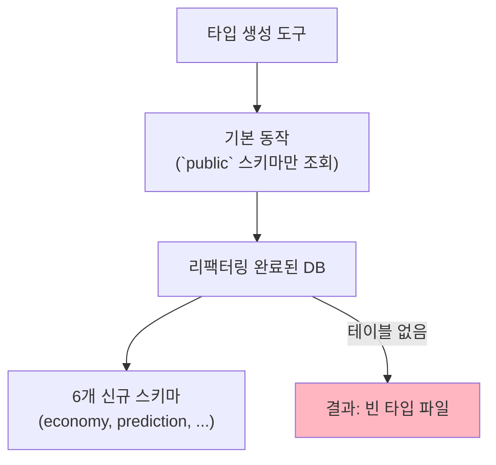

# DB 리팩터링 블로커 해결 계획: 타입 생성 스크립트 수정

**📅 작성일**: 2025-06-25
**🔥 문제 상황**: DB 리팩터링 5단계 최종 검증 과정에서, 타입 생성 도구(`mcp_supabase_generate_typescript_types`)가 신규 도메인 스키마를 인식하지 못하고 `public` 스키마만 조회하는 치명적인 블로커 발생.
**🎯 목표**: 외부 자동화 스크립트(`universal-mcp-automation.ts`)를 수정하여, 다중 스키마를 올바르게 인식하고 완전한 타입 정의를 생성하도록 복구한다.
**📂 문서 위치**: `docs/task-reports/db-refactoring-blocker-resolution-plan.md`

---

## 1. 문제 원인 분석

- **근본 원인**: 타입 생성 스크립트가 조회할 스키마 목록을 명시적으로 지정하지 않아, 기본값인 `public` 스키마만 조회했습니다. 리팩터링 후 `public` 스키마에는 테이블이 없으므로, 결과적으로 타입 정보가 비어있게 되었습니다.
- **참고 자료**: `Universal-MCP-System-외부이동-및-다중도메인지원-완료보고서.md`에 따르면 해당 스크립트는 이미 다중 도메인을 지원할 잠재력을 가지고 있습니다.

## 2. 해결 전략: 자동화 스크립트 직접 수정

- **전략**: 롤백 대신, 문제의 원인인 외부 자동화 스크립트를 직접 수정하여 다중 스키마를 명시적으로 조회하도록 변경합니다.
- **대상 파일**: `C:\G\mcp-automation\universal-mcp-automation.ts`

## 3. 실행 계획

```mermaid
gantt
    title 스크립트 긴급 수정 계획
    dateFormat  HH:mm
    axisFormat %H:%M
    section 분석 및 수정
    코드 분석         :active, 14:00, 10m
    스크립트 수정      :14:10, 15m
    section 검증
    타입 생성 재시도   :14:25, 10m
    최종 검증 완료     :14:35, 5m
```

### **1단계: 코드 분석**

- `universal-mcp-automation.ts` 파일을 읽어 Supabase CLI 명령어를 생성하는 부분을 찾습니다.
- 스키마 목록이 하드코딩 되어있는지, 또는 동적으로 구성되는지 확인합니다.

### **2단계: 스크립트 수정**

- Supabase CLI 명령어에 `--schema` 플래그를 추가하고, 리팩터링된 모든 스키마 목록 (`public`, `economy`, `prediction`, `investment`, `forum`, `donation`, `user`)을 전달하도록 코드를 수정합니다.

### **3단계: 타입 생성 재시도 및 최종 검증**

- 수정된 스크립트가 적용되었음을 가정하고, `mcp_supabase_generate_typescript_types` 도구를 다시 실행합니다.
- 생성된 `supabase-generated.ts` 파일에 모든 스키마와 테이블의 타입이 올바르게 포함되었는지 확인하여, 리팩터링 5단계를 최종 완료합니다.

## 4. 기대 효과

이 계획이 성공하면, 데이터베이스 롤백 없이 리팩터링을 성공적으로 마무리할 수 있으며, 타입 자동화 시스템은 향후 모든 프로젝트에서 다중 스키마를 완벽하게 지원하게 됩니다.
