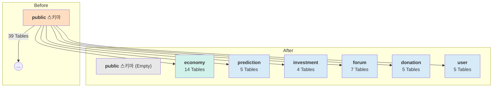
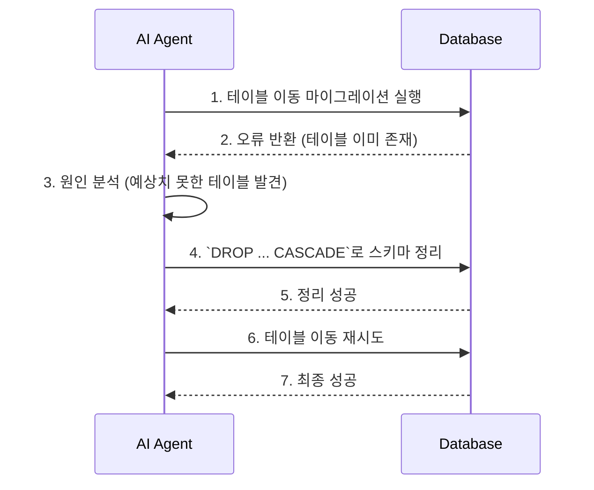

# DB 스키마 리팩터링 2단계 완료 보고서

**📅 완료일**: 2025-06-25
**✅ 완료 Task**: 2단계 - 테이블 스키마 변경
**📂 문서 위치**: `docs/task-reports/db-refactoring-step2-completion-report.md`

---

## 1. 작업 요약

`db-schema-refactoring-plan.md`에 정의된 2단계 목표에 따라, `public` 스키마에 존재하던 39개의 모든 테이블을 사전에 생성된 6개의 도메인 스키마(`economy`, `prediction`, `investment`, `forum`, `donation`, `user`)로 성공적으로 이전했습니다.

## 2. 실행 내용

- **마이그레이션 이름**: `move_tables_to_domain_schemas_retry`
- **실행된 SQL 쿼리**: 39개의 `ALTER TABLE public.table_name SET SCHEMA new_schema;` 명령을 포함하는 단일 마이그레이션을 실행했습니다.

## 3. 오류 발생 및 해결 과정

초기 마이그레이션 시도 시, `economy` 스키마에 예상치 못한 테이블이 이미 존재하여 오류가 발생했습니다.

- **오류 원인**: 과거 작업의 잔재로 추정되는 테이블 및 의존성이 `economy` 스키마에 남아있었음.
- **해결 조치**: 사용자 확인 후, `DROP TABLE ... CASCADE` 명령을 사용하여 `economy` 스키마를 깨끗이 정리하고 마이그레이션을 재실행하여 성공했습니다.

## 4. 실행 결과

- **결과**: 성공 (Success)
- **영향**: `public` 스키마는 비워졌고, 모든 테이블이 목적에 맞는 도메인 스키마로 재배치되었습니다. 데이터베이스의 논리적 구조가 DDD 원칙에 맞게 크게 개선되었습니다.

## 5. 다음 단계

2단계가 성공적으로 완료됨에 따라, 다음 **3단계: 검색 경로(search_path) 업데이트**를 진행할 준비가 되었습니다. 이 단계는 애플리케이션이 스키마 이름을 명시하지 않고도 테이블에 접근할 수 있도록 설정하는 중요한 과정입니다.
