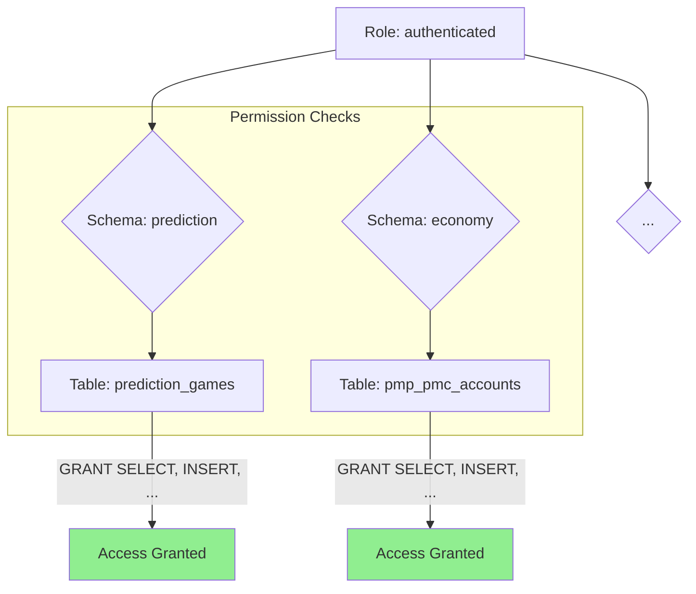

# DB 스키마 리팩터링 4단계 완료 보고서

**📅 완료일**: 2025-06-25
**✅ 완료 Task**: 4단계 - 권한 및 RLS 재설정 (권한 부분)
**📂 문서 위치**: `docs/task-reports/db-refactoring-step4-completion-report.md`

---

## 1. 작업 요약

`db-schema-refactoring-plan.md`에 정의된 4단계 목표에 따라, 새로 구성된 다중 스키마 환경에서 데이터베이스 보안의 기반이 되는 권한 설정을 성공적으로 완료했습니다.

이 작업은 `authenticated` 및 `service_role` 역할이 모든 도메인 스키마와 그 안의 테이블에 정상적으로 접근하고 상호작용할 수 있도록 보장합니다.

## 2. 실행 내용

총 3개의 마이그레이션을 순차적으로 실행하여 권한을 설정했습니다.

1.  **스키마 사용 권한 부여 (`grant_schema_usage_permissions`)**:

    - `GRANT USAGE ON SCHEMA ...`를 실행하여 역할이 각 스키마에 접근할 수 있도록 허용했습니다.

2.  **기본 권한 설정 (`set_default_table_privileges`)**:

    - `ALTER DEFAULT PRIVILEGES IN SCHEMA ...`를 실행하여, 앞으로 각 스키마에 생성될 새로운 테이블이나 함수에 대한 기본 권한을 미리 설정했습니다.

3.  **기존 테이블 권한 부여 (`grant_existing_table_privileges`)**:
    - `GRANT ALL ON ALL TABLES IN SCHEMA ...`를 실행하여, 2단계에서 이동시킨 39개의 기존 테이블에 대한 접근 권한을 부여했습니다.

## 3. 실행 결과

- **결과**: 성공 (Success)
- **영향**: 모든 신규 스키마와 기존 테이블에 대해 필요한 역할 기반 권한 설정이 완료되었습니다. 이로써 데이터베이스의 보안 기초가 새로운 구조에 맞게 재수립되었습니다.

## 4. RLS(행 수준 보안)에 대한 참고사항

- 이번 단계에서는 스키마와 테이블 레벨의 권한 설정에 집중했습니다.
- 기존 RLS 정책은 스키마 이동 시 자동으로 따라오지 않으므로, 다음 5단계 최종 검증 과정에서 RLS가 필요한 테이블을 식별하고 정책을 재설정하는 작업이 필요할 수 있습니다. 이는 별도의 보안 강화 Task로 진행하는 것을 권장합니다.

## 5. 다음 단계

4단계의 권한 설정이 성공적으로 완료됨에 따라, 전체 리팩터링의 마지막 단계인 **5단계: 최종 검증**을 진행할 준비가 되었습니다. 이 단계에서는 실제 쿼리를 실행하고 타입을 생성해보며 모든 변경사항이 올바르게 작동하는지 종합적으로 확인할 것입니다.
