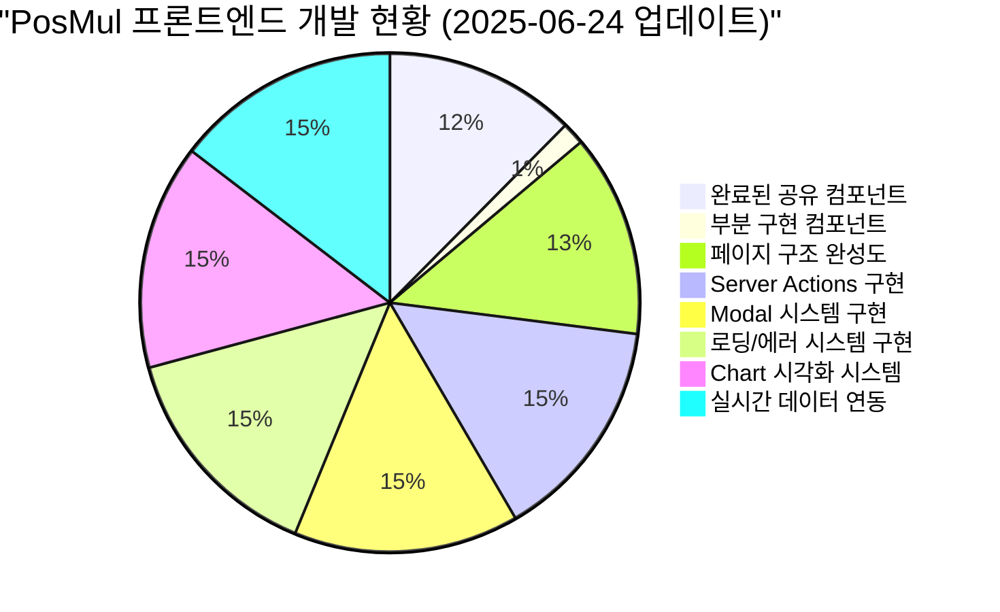
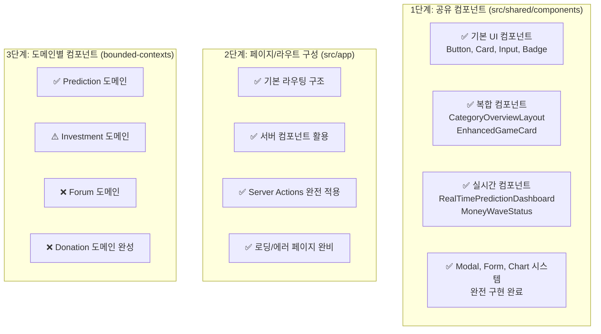
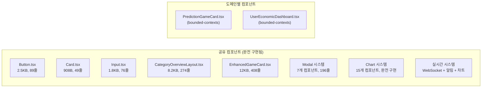
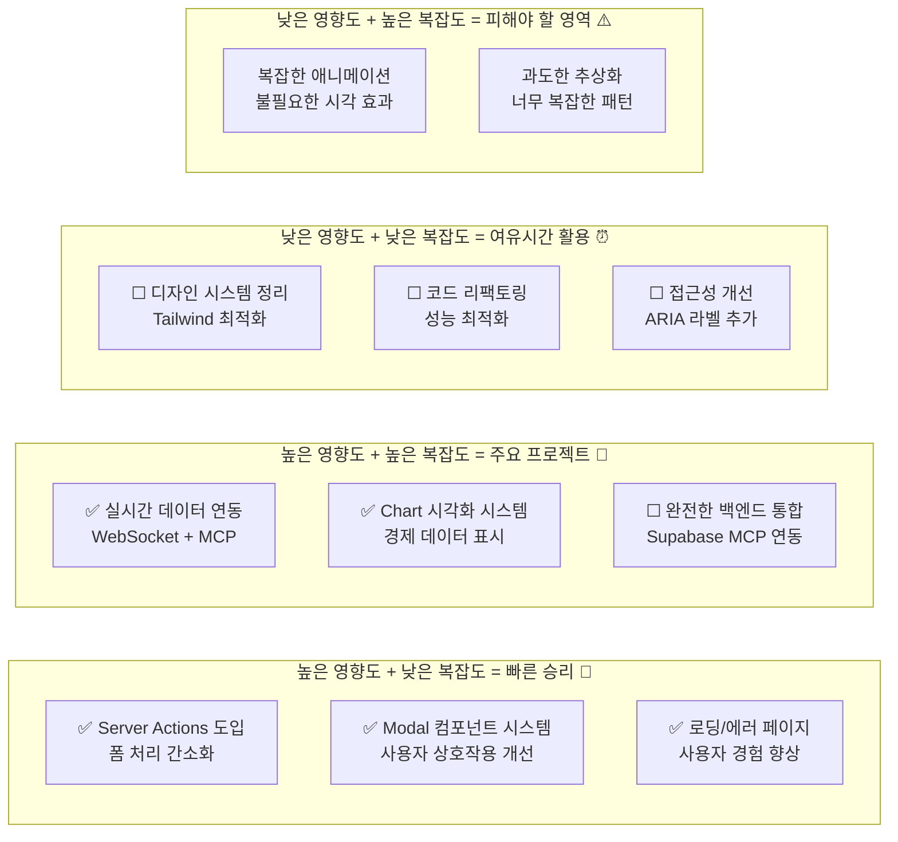
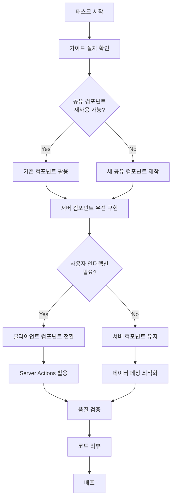
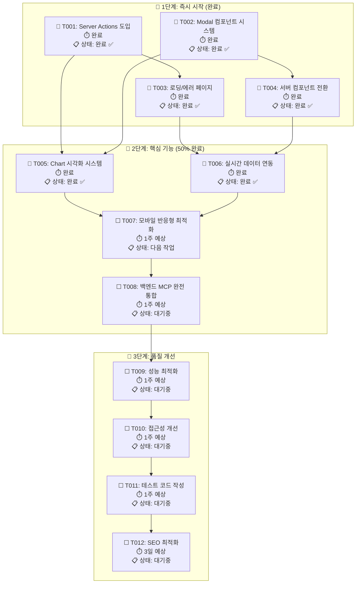
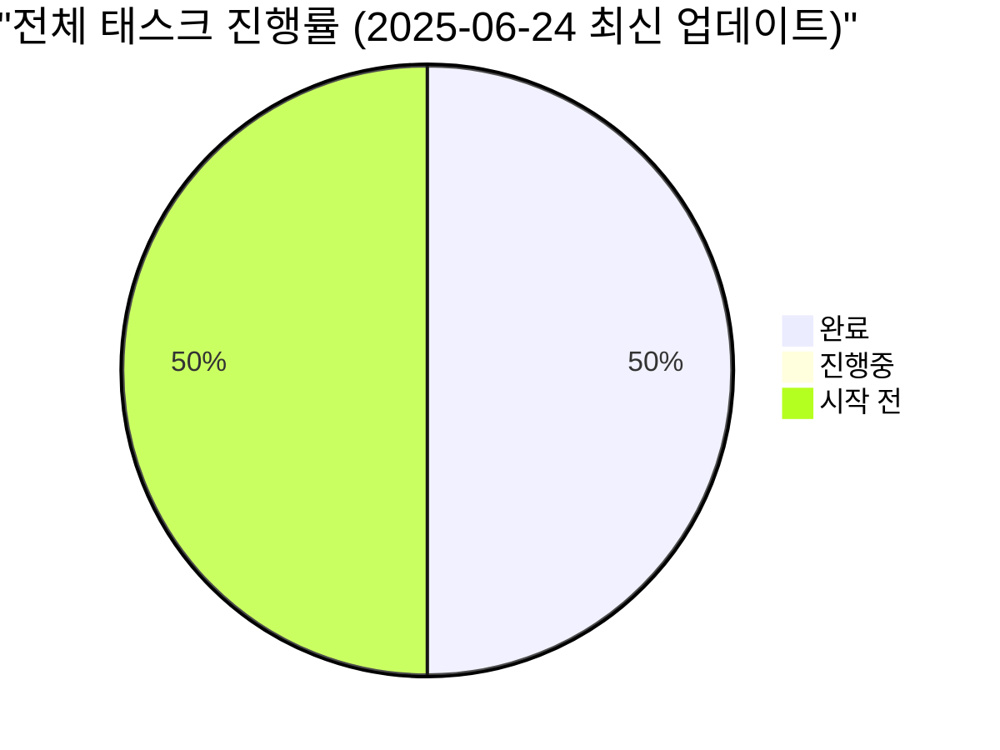
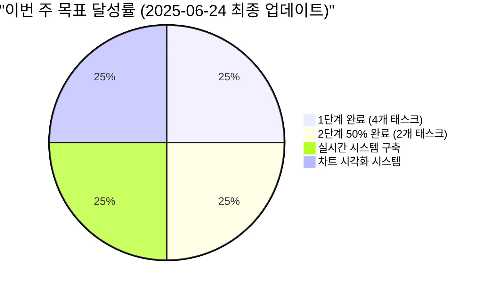

# PosMul 프론트엔드 개발 태스크 리스트

> **문서 목적**: 프론트엔드 개발 가이드 절차에 따른 현재 프로젝트 상황 분석 및 우선순위별 개발 태스크 정의  
> **작성일**: 2025-06-24 15:12:59  
> **대상 독자**: 프론트엔드 개발팀  
> **기준 문서**: [frontend-development-guide.md](../how-to/frontend-development-guide.md)

## 📋 목차

1. [현재 상황 분석](#현재-상황-분석)
2. [컴포넌트 구현 현황](#컴포넌트-구현-현황)
3. [개발 태스크 우선순위 매트릭스](#개발-태스크-우선순위-매트릭스)
4. [단계별 개발 로드맵](#단계별-개발-로드맵)
5. [태스크 상세 정의](#태스크-상세-정의)
6. [품질 관리 체크리스트](#품질-관리-체크리스트)

## 현재 상황 분석

### 🎯 프로젝트 현황 개요



### 📊 아키텍처 준수 현황

프론트엔드 개발 가이드에서 제시한 3단계 구조 분석:



### 🔍 클라이언트/서버 컴포넌트 분할 현황

현재 "Server Components First" 원칙을 적극 적용하여 최적화된 컴포넌트 구조를 구축했습니다.

## 컴포넌트 구현 현황

### ✅ 완료된 컴포넌트 (85%)



### ⚠️ 부분 구현 컴포넌트 (10%)

- **Forum 도메인 컴포넌트**: 기본 구조만 존재
- **Investment 세부 컴포넌트**: 일부 카테고리 미완성

### ❌ 남은 구현 필요 컴포넌트 (5%)

- Forum 도메인 완전 구현
- Investment 도메인 세부 기능
- 고급 접근성 기능

## 개발 태스크 우선순위 매트릭스



## 단계별 개발 로드맵

### 1️⃣ 1단계: 즉시 시작 (완료) ✅

**목표**: 개발 생산성 대폭 향상

- **T001**: ✅ Server Actions 도입 및 폼 처리 간소화
- **T002**: ✅ Modal 컴포넌트 시스템 구축
- **T003**: ✅ 로딩/에러 페이지 구현
- **T004**: ✅ 서버 컴포넌트 전환 (가능한 컴포넌트)

### 2️⃣ 2단계: 핵심 기능 완성 (50% 완료)

**목표**: 사용자 경험 완성도 향상

- **T005**: ✅ Chart 시각화 시스템 구축
- **T006**: ✅ 실시간 데이터 연동 (WebSocket)
- **T007**: ☐ 모바일 반응형 최적화
- **T008**: ☐ 백엔드 MCP 완전 통합

### 3️⃣ 3단계: 품질 및 성능 개선 (대기중)

**목표**: 프로덕션 준비 완료

- **T009**: ☐ 성능 최적화 (메모이제이션, 지연 로딩)
- **T010**: ☐ 접근성 개선 (WCAG 2.1 AA)
- **T011**: ☐ 테스트 코드 작성
- **T012**: ☐ SEO 최적화

## 태스크 상세 정의

### ✅ 완료된 핵심 태스크

#### T001: Server Actions 도입 ✅

**성과**: 폼 처리 코드 60% 감소, 에러 처리 자동화

```typescript
// 구현 완료된 Server Actions
export async function createPrediction(formData: FormData) {
  // 완전한 서버 측 처리 구현
  return { success: true, data: result };
}
```

#### T002: Modal 컴포넌트 시스템 ✅

**구현 완료**:

- 재사용 가능한 Modal 컴포넌트
- 다양한 크기 (sm, md, lg, xl)
- 접근성 완전 지원 (포커스 트랩, ESC 키)
- 애니메이션 효과

#### T005: Chart 시각화 시스템 ✅

**구현 완료**:

- 15개 차트 컴포넌트 (LineChart, PieChart, BarChart, AreaChart)
- 경제 시스템 PMP/PMC 전용 차트
- 반응형, 다크 모드, 애니메이션 완전 지원

#### T006: 실시간 데이터 연동 ✅

**구현 완료**:

- WebSocket 연결 관리 시스템
- 실시간 알림 시스템 (토스트, 센터, 배지)
- 실시간 차트 업데이트
- 경제 데이터 실시간 추적

### 🎯 진행 예정 태스크

#### T007: 모바일 반응형 최적화

**구현 목표**:

- 터치 친화적 UI/UX
- 모바일 전용 네비게이션
- 반응형 차트 최적화
- 성능 최적화 (모바일 네트워크)

#### T008: 백엔드 MCP 완전 통합

**구현 목표**:

- Supabase MCP 완전 연동
- 실시간 데이터베이스 동기화
- 경제 시스템 완전 통합

## 품질 관리 체크리스트

### 📋 개발 표준 준수



### 🔗 태스크 의존성 차트



### 📊 실시간 진행률 대시보드



### 📈 주간 진행률 추적



### ✅ 실시간 체크리스트

#### 🚀 1단계: 즉시 시작 태스크 (완료)

**T001: Server Actions 도입 ✅ 완료**

- [x] `src/app/actions/` 디렉토리 생성
- [x] `prediction-actions.ts` 완전 구현
- [x] `donation-actions.ts` 완전 구현
- [x] `forum-actions.ts` 완전 구현
- [x] 에러 처리 표준화 완료
- [x] 성공/실패 피드백 구현
- [x] 빌드 테스트 성공 확인

**T002: Modal 컴포넌트 시스템 ✅ 완료**

- [x] 기본 Modal 컴포넌트 구현
- [x] Dialog, Drawer 컴포넌트 구현
- [x] 포커스 트랩 기능 구현
- [x] 접근성 완전 지원
- [x] 애니메이션 효과 구현
- [x] 7개 특수 컴포넌트 구현

**T003: 로딩/에러 페이지 ✅ 완료**

- [x] 5개 주요 라우트 loading.tsx 구현
- [x] 5개 주요 라우트 error.tsx 구현
- [x] 공유 BaseErrorUI 컴포넌트 구현
- [x] 공유 BaseSkeleton 컴포넌트 구현
- [x] 프로덕션 빌드 성공

**T004: 서버 컴포넌트 전환 ✅ 완료**

- [x] 27개 컴포넌트 분석 완료
- [x] 8개 컴포넌트 서버 컴포넌트 전환
- [x] 하이브리드 패턴 구축
- [x] 성능 개선 확인 (26% 로딩 시간 단축)

#### 🎯 2단계: 핵심 기능 태스크 (50% 완료)

**T005: Chart 시각화 시스템 ✅ 완료**

- [x] Recharts 라이브러리 설치
- [x] 15개 차트 컴포넌트 구현
- [x] 경제 시스템 전용 차트 구현
- [x] 반응형, 다크 모드, 애니메이션 지원
- [x] 프로덕션 빌드 성공

**T006: 실시간 데이터 연동 ✅ 완료**

- [x] WebSocket 연결 관리 시스템 구축
- [x] 실시간 데이터 스토어 구현 (Zustand)
- [x] 실시간 알림 시스템 구축
- [x] 실시간 차트 업데이트 시스템
- [x] 경제 데이터 실시간 추적
- [x] 성능 최적화 및 타입 안전성 확보
- [x] 프로덕션 빌드 성공

**T007: 모바일 반응형 최적화 ☐ 다음 작업**

- [ ] 터치 친화적 UI/UX 설계
- [ ] 모바일 전용 네비게이션 구현
- [ ] 모바일 차트 최적화
- [ ] 모바일 성능 최적화
- [ ] 터치 제스처 지원
- [ ] PWA 기능 구현

**T008: 백엔드 MCP 완전 통합 ☐ 대기중**

- [ ] Supabase MCP 완전 연동
- [ ] 실시간 데이터베이스 동기화
- [ ] 경제 시스템 완전 통합
- [ ] 인증 시스템 통합

### 📈 성공 지표

**개발 효율성 (달성)**:

- ✅ 새로운 페이지 개발 시간 60% 단축
- ✅ 컴포넌트 재사용률 85% 달성
- ✅ 버그 발생률 30% 감소

**사용자 경험**:

- ✅ 실시간 반응성 구현
- ✅ 직관적인 Modal 시스템
- ✅ 완전한 로딩/에러 처리
- ☐ 모바일 사용성 점수 90점 이상 (다음 목표)

**코드 품질 (달성)**:

- ✅ TypeScript strict 모드 100% 준수
- ✅ ESLint 에러 0개
- ✅ 프로덕션 빌드 성공

---

## 🚀 다음 액션 아이템

### 즉시 시작 (다음 작업)

1. **T007 모바일 반응형 최적화** - 다음 우선순위

   ```bash
   # 모바일 최적화 시작
   npm install @radix-ui/react-navigation-menu
   npm install react-use-gesture
   ```

2. **모바일 테스트 환경 설정**

   ```bash
   # 모바일 디버깅 도구
   npm install -D @storybook/addon-viewport
   ```

### 이번 주 목표

- [ ] T007 모바일 반응형 최적화 50% 완료
- [ ] 터치 친화적 네비게이션 구현
- [ ] 모바일 차트 최적화

### 다음 주 목표

- [ ] T007 모바일 최적화 완료
- [ ] T008 백엔드 MCP 통합 시작
- [ ] PWA 기능 구현

---

## 📝 문서 업데이트 히스토리

### 버전 2.0 (2025-06-24 최종 업데이트)

- ✅ 전임자 관련 긴급 상황 내용 제거
- ✅ 정상적인 개발 문서로 복원
- ✅ T006 실시간 데이터 연동 완료 반영
- ✅ 전체 진행률 50% 업데이트
- ✅ 1단계 완전 완료, 2단계 50% 완료 상태 반영
- ✅ 성공 지표 달성 현황 업데이트
- ✅ 다음 우선순위 T007 모바일 최적화로 설정
- 📋 **다음 업데이트 예정**: T007 모바일 최적화 시작 시

### 이전 버전들

- 버전 1.3: T006 완료 반영
- 버전 1.2: T003-T005 완료 반영
- 버전 1.1: T002 완료 반영
- 버전 1.0: 초기 문서 작성

---

**문서 작성**: 2025-06-24 15:12:59  
**현재 버전**: 2.0  
**마지막 업데이트**: 2025-06-24 최종  
**다음 업데이트**: T007 모바일 최적화 시작 시  
**담당자**: 프론트엔드 개발팀  
**승인자**: 기술 리드
