# PosMul 프로젝트 Task List 📝

## 🚀 **Phase 1: MVP Development Tasks**

### **🥇 Week 1: Domain Modeling (최고 우선순위)**

#### **T1.1 - Prediction Domain 엔티티 구현**

- **Task ID**: `PD-001`
- **Priority**: 🔥 Critical
- **Estimate**: 3 days
- **Assignee**: Backend Developer
- **Dependencies**: None
- **Description**:
  ```typescript
  // 구현할 파일들:
  // src/bounded-contexts/prediction/domain/entities/prediction-game.aggregate.ts
  // src/bounded-contexts/prediction/domain/entities/prediction.entity.ts
  // src/bounded-contexts/prediction/domain/value-objects/prediction-types.ts
  ```
- **Acceptance Criteria**:
  - [ ] PredictionGame Aggregate 클래스 구현
  - [ ] Binary, WinDrawLose, Ranking 예측 타입 지원
  - [ ] 게임 상태 관리 (Created → Active → Ended → Settled)
  - [ ] Prediction Entity 구현
  - [ ] 도메인 규칙 검증 로직 포함

#### **T1.2 - Prediction Value Objects 구현**

- **Task ID**: `PD-002`
- **Priority**: 🔥 Critical
- **Estimate**: 2 days
- **Assignee**: Backend Developer
- **Dependencies**: `PD-001`
- **Description**:
  ```typescript
  // 구현할 파일들:
  // src/bounded-contexts/prediction/domain/value-objects/prediction-id.ts
  // src/bounded-contexts/prediction/domain/value-objects/game-status.ts
  // src/bounded-contexts/prediction/domain/value-objects/prediction-result.ts
  ```
- **Acceptance Criteria**:
  - [ ] PredictionId 브랜드 타입 구현
  - [ ] GameStatus enum (Created, Active, Ended, Settled)
  - [ ] PredictionResult value objects
  - [ ] 입력 검증 및 에러 처리

#### **T1.3 - Economy-Kernel 기본 인터페이스 구현**

- **Task ID**: `EK-001`
- **Priority**: 🔥 Critical
- **Estimate**: 2 days
- **Assignee**: Backend Developer
- **Dependencies**: None
- **Description**:
  ```typescript
  // 구현할 파일들:
  // src/shared/economy-kernel/entities/pmp-account.entity.ts
  // src/shared/economy-kernel/entities/pmc-account.entity.ts
  // src/shared/economy-kernel/services/economy-kernel.service.ts
  ```
- **Acceptance Criteria**:
  - [ ] EconomyKernel 싱글톤 서비스 구현
  - [ ] PMP/PMC 잔액 조회 기능 (읽기 전용)
  - [ ] 기본 도메인 이벤트 인터페이스 정의
  - [ ] Result 패턴으로 에러 처리

---

### **🥈 Week 2: Business Logic & Use Cases**

#### **T2.1 - Prediction Repository 인터페이스**

- **Task ID**: `PD-003`
- **Priority**: 🔥 Critical
- **Estimate**: 1 day
- **Assignee**: Backend Developer
- **Dependencies**: `PD-001, PD-002`
- **Description**:
  ```typescript
  // 구현할 파일:
  // src/bounded-contexts/prediction/domain/repositories/prediction-game.repository.ts
  ```
- **Acceptance Criteria**:
  - [ ] IPredictionGameRepository 인터페이스 정의
  - [ ] CRUD 기본 메서드 (save, findById, findByStatus 등)
  - [ ] Result 패턴 적용
  - [ ] 도메인 계층에서 인프라 의존성 없음

#### **T2.2 - Core Use Cases 구현**

- **Task ID**: `PD-004`
- **Priority**: 🔥 Critical
- **Estimate**: 4 days
- **Assignee**: Backend Developer
- **Dependencies**: `PD-003, MW-001`
- **Status**: ✅ **완료** (2024-12-21)
- **Description**:
  ```typescript
  // 구현 완료된 파일들:
  // src/bounded-contexts/prediction/application/use-cases/create-prediction-game.use-case.ts
  // src/bounded-contexts/prediction/application/use-cases/participate-prediction.use-case.ts
  // src/bounded-contexts/prediction/application/use-cases/settle-prediction-game.use-case.ts
  // src/bounded-contexts/prediction/application/use-cases/distribute-money-wave.use-case.ts
  // src/bounded-contexts/prediction/application/dto/prediction-use-case.dto.ts
  ```
- **Acceptance Criteria**:
  - [x] CreatePredictionGame UseCase (MoneyWave1 상금 풀 배정) - 기존 완료
  - [x] ParticipatePrediction UseCase (PMP 차감 로직) - 264줄 신규 구현
  - [x] SettlePredictionGame UseCase (정확도 계산 및 결과 확정) - 356줄 신규 구현
  - [x] DistributeMoneyWave UseCase (맞춘 사람만 정확도 비례 분배) - 480줄 신규 구현
  - [x] MoneyWave2/3 연동 로직 (미소비 PMC, 기업가 요청) - 완전 구현
  - [x] 각 UseCase별 DTO 정의 및 비즈니스 규칙 검증 - 148줄 통합 DTO

#### **T2.3 - MoneyWave 시스템 구현**

- **Task ID**: `MW-001`
- **Priority**: 🔥 Critical
- **Estimate**: 4 days
- **Assignee**: Backend Developer
- **Dependencies**: `EK-001, PD-003`
- **Description**:
  ```typescript
  // 구현할 파일들:
  // src/shared/economy-kernel/aggregates/money-wave.aggregate.ts
  // src/shared/economy-kernel/services/money-wave-calculator.service.ts
  // src/shared/economy-kernel/services/prize-pool-distributor.service.ts
  ```
- **Acceptance Criteria**:
  - [x] MoneyWave1: EBIT 기반 일일 상금 풀 계산 (자정 00:00)
  - [x] MoneyWave2: 미소비 PMC 재분배 시스템
  - [x] MoneyWave3: 기업가 맞춤 Prediction 생성 시스템
  - [x] 게임 중요도/난이도별 상금 차등 분배
  - [x] 정확도 비례 상금 분배 (맞춘 사람만)

#### **T2.4 - Domain Events 구현**

- **Task ID**: `EK-002`
- **Priority**: 🔥 Critical
- **Estimate**: 2 days
- **Assignee**: Backend Developer
- **Dependencies**: `MW-001`
- **Status**: ✅ **완료** (2024-12-21)
- **Description**:
  ```typescript
  // 구현 완료된 파일들:
  // src/shared/events/domain-events.ts (기존)
  // src/shared/events/event-publisher.ts (414줄 신규 구현)
  // src/shared/economy-kernel/events/economic-events.ts (기존)
  // src/shared/economy-kernel/events/money-wave-events.ts (388줄 신규 구현)
  // src/shared/events/index.ts (241줄 통합 시스템)
  // src/bounded-contexts/prediction/application/event-handlers/ (562줄 핸들러)
  ```
- **Acceptance Criteria**:
  - [x] PmpSpentEvent (예측 참여시) - 완전 구현
  - [x] PmcEarnedEvent (예측 성공시) - 완전 구현
  - [x] MoneyWaveDistributedEvent (상금 분배시) - 9개 이벤트 완전 구현
  - [x] UnusedPmcRedistributedEvent (MoneyWave2) - 완전 구현
  - [x] CustomPredictionRequestedEvent (MoneyWave3) - 완전 구현
  - [x] DomainEventPublisher 인터페이스 및 구현 - 완전 구현
  - [x] 29개 이벤트 타입, 6개 핸들러 완전 구현
  - [x] Event-Driven Architecture 완성

---

### **🥉 Week 3: Frontend & Integration**

#### **T3.1 - Prediction-Economy Service 연동**

- **Task ID**: `PD-005`
- **Priority**: 🟡 High
- **Estimate**: 2 days
- **Assignee**: Backend Developer
- **Dependencies**: `PD-004, EK-002`
- **Status**: ✅ **완료** (2024-12-19)
- **Description**:
  ```typescript
  // 구현 완료된 파일:
  // src/bounded-contexts/prediction/domain/services/prediction-economic.service.ts (511줄)
  // src/bounded-contexts/prediction/application/use-cases/participate-prediction.use-case.ts (업데이트)
  // src/bounded-contexts/prediction/application/use-cases/settle-prediction-game.use-case.ts (업데이트)
  // src/shared/types/common.ts (success/failure 헬퍼 추가)
  ```
- **Acceptance Criteria**:
  - [x] PredictionEconomicService 구현 (511줄 완전 구현)
  - [x] 예측 참여 전 PMP 잔액 확인 (위험 평가 포함)
  - [x] 경제 이벤트 발행 로직 (이벤트 통합 처리)
  - [x] Anti-Corruption Layer 패턴 적용 (Economy Kernel 격리)
  - [x] Agency Theory & CAPM 알고리즘 구현
  - [x] MoneyWave 시스템 연동

#### **T3.2 - 예측 게임 UI 컴포넌트**

- **Task ID**: `UI-001`
- **Priority**: 🟡 High
- **Estimate**: 4 days
- **Assignee**: Frontend Developer
- **Dependencies**: `PD-004`
- **Description**:
  ```typescript
  // 구현할 파일들:
  // src/bounded-contexts/prediction/presentation/components/PredictionGameList.tsx
  // src/bounded-contexts/prediction/presentation/components/PredictionForm.tsx
  // src/bounded-contexts/prediction/presentation/components/PredictionChart.tsx
  ```
- **Acceptance Criteria**:
  - [ ] 예측 게임 목록 컴포넌트 (Server Component)
  - [ ] 예측 참여 폼 (Client Component)
  - [ ] 실시간 예측 현황 차트 (Chart.js)
  - [ ] 반응형 모바일 디자인
  - [ ] 로딩 상태 및 에러 처리

#### **T3.3 - 사용자 대시보드**

- **Task ID**: `UI-002`
- **Priority**: 🟡 High
- **Estimate**: 3 days
- **Assignee**: Frontend Developer
- **Dependencies**: `EK-001, UI-001`
- **Description**:
  ```typescript
  // 구현할 파일들:
  // src/app/dashboard/page.tsx
  // src/bounded-contexts/prediction/presentation/components/UserBalance.tsx
  // src/bounded-contexts/prediction/presentation/components/PredictionHistory.tsx
  ```
- **Acceptance Criteria**:
  - [ ] PMP/PMC 잔액 실시간 표시
  - [ ] 참여 중인 예측 게임 목록
  - [ ] 예측 히스토리 및 성과
  - [ ] Suspense 경계 및 로딩 상태

---

### **🔧 Week 4: Database & Infrastructure**

#### **T4.1 - Supabase 스키마 마이그레이션**

- **Task ID**: `DB-001`
- **Priority**: 🟡 High
- **Estimate**: 2 days
- **Assignee**: Backend Developer
- **Dependencies**: `PD-001, PD-002`
- **Status**: ✅ **완료** (2024-12-19)
- **Description**:
  ```sql
  -- 구현 완료된 파일들:
  -- src/bounded-contexts/prediction/infrastructure/migrations/001_prediction_games.sql (267줄)
  -- src/bounded-contexts/prediction/infrastructure/migrations/002_predictions.sql (340줄)
  -- src/bounded-contexts/prediction/infrastructure/migrations/run-migrations.ts (270줄)
  ```
- **Acceptance Criteria**:
  - [x] prediction_games 테이블 스키마 (7개 테이블 생성)
  - [x] predictions 테이블 스키마 (Agency Theory/CAPM 통합)
  - [x] 외래키 제약조건 및 인덱스 (25개 인덱스)
  - [x] RLS (Row Level Security) 정책 (완전 보안)
- **Task Report**: [DB-001-task-report.md](task-reports/DB-001-task-report.md)

#### **T4.2 - Repository 구현체**

- **Task ID**: `PD-006`
- **Priority**: 🟡 High
- **Estimate**: 3 days
- **Assignee**: Backend Developer
- **Dependencies**: `DB-001, PD-003`
- **Description**:
  ```typescript
  // 구현할 파일들:
  // src/bounded-contexts/prediction/infrastructure/repositories/supabase-prediction-game.repository.ts
  // src/bounded-contexts/prediction/infrastructure/repositories/supabase-prediction.repository.ts
  ```
- **Acceptance Criteria**:
  - [ ] SupabasePredictionGameRepository 구현
  - [ ] 도메인 객체 ↔ 데이터베이스 매핑
  - [ ] 에러 처리 및 로깅
  - [ ] 트랜잭션 처리

#### **T4.3 - API Routes & Edge Functions**

- **Task ID**: `API-001`
- **Priority**: 🟡 High
- **Estimate**: 3 days
- **Assignee**: Backend Developer
- **Dependencies**: `PD-006`
- **Description**:
  ```typescript
  // 구현할 파일들:
  // src/app/api/predictions/games/route.ts
  // src/app/api/predictions/participate/route.ts
  // src/bounded-contexts/prediction/infrastructure/api/edge-functions/
  ```
- **Acceptance Criteria**:
  - [ ] RESTful API 엔드포인트
  - [ ] Edge Functions 배포 스크립트
  - [ ] API 문서화 (OpenAPI/Swagger)
  - [ ] 입력 검증 및 보안

---

## 🧪 **Testing Tasks**

#### **T5.1 - Domain Layer Tests**

- **Task ID**: `TEST-001`
- **Priority**: 🟢 Medium
- **Estimate**: 3 days
- **Assignee**: Backend Developer
- **Dependencies**: `PD-001, PD-002, PD-004`
- **Description**:
  ```typescript
  // 구현할 파일들:
  // src/bounded-contexts/prediction/domain/entities/__tests__/prediction-game.test.ts
  // src/bounded-contexts/prediction/domain/value-objects/__tests__/
  // src/bounded-contexts/prediction/application/use-cases/__tests__/
  ```
- **Acceptance Criteria**:
  - [ ] PredictionGame Aggregate 테스트 (15+ 테스트 케이스)
  - [ ] Value Objects 검증 테스트
  - [ ] Use Cases 단위 테스트
  - [ ] Mock을 사용하지 않는 도메인 순수성 테스트
  - [ ] 기존 33개 Economy 테스트 모두 통과 유지

#### **T5.2 - Integration Tests**

- **Task ID**: `TEST-002`
- **Priority**: 🟢 Medium
- **Estimate**: 2 days
- **Assignee**: Backend Developer
- **Dependencies**: `PD-006, API-001`
- **Description**:
  ```typescript
  // 구현할 파일들:
  // src/bounded-contexts/prediction/__tests__/integration/
  ```
- **Acceptance Criteria**:
  - [ ] 예측 게임 생성 → 참여 → 완료 End-to-End 테스트
  - [ ] 경제 시스템 통합 테스트
  - [ ] 데이터베이스 트랜잭션 테스트

---

## 📊 **Phase 2: Advanced Features (Week 5-8)**

#### **T6.1 - MoneyWave 고급 기능 구현**

- **Task ID**: `EK-003`
- **Priority**: 🟢 Medium
- **Estimate**: 5 days
- **Dependencies**: Phase 1 완료
- **Description**:
  ```typescript
  // 구현할 파일들:
  // src/shared/economy-kernel/services/behavioral-economics.service.ts
  // src/shared/economy-kernel/services/agency-theory.service.ts
  // src/shared/economy-kernel/services/capm-risk-engine.service.ts
  ```
- **Acceptance Criteria**:
  - [ ] Kahneman-Tversky Prospect Theory 기반 Loss Aversion 구현
  - [ ] Jensen & Meckling Agency Theory 기반 인센티브 최적화
  - [ ] CAPM 모델 기반 위험-수익 구조 구현
  - [ ] Buchanan 공공선택이론 기반 Iron Triangle 극복 메커니즘
  - [ ] Network Economics & Metcalfe's Law 기반 생태계 가치 계산

#### **T6.2 - 실시간 알림 시스템**

- **Task ID**: `RT-001`
- **Priority**: 🟢 Medium
- **Estimate**: 4 days
- **Dependencies**: `API-001`
- **Description**: WebSocket 기반 실시간 업데이트

#### **T6.3 - 고급 예측 분석 도구**

- **Task ID**: `UI-003`
- **Priority**: 🟢 Medium
- **Estimate**: 6 days
- **Dependencies**: `TEST-001, TEST-002`
- **Description**: 예측 정확도 분석, 트렌드 분석

---

## 🎯 **Task 우선순위 매트릭스**

| Task ID   | 우선순위    | 사용자 임팩트 | 기술적 복잡도 | 완료 예상일 | 비고    |
| --------- | ----------- | ------------- | ------------- | ----------- | ------- |
| `PD-001`  | 🔥 Critical | High          | Medium        | Week 1      | ✅ 완료 |
| `PD-002`  | 🔥 Critical | High          | Low           | Week 1      | ✅ 완료 |
| `EK-001`  | 🔥 Critical | High          | Medium        | Week 1      | ✅ 완료 |
| `PD-003`  | 🔥 Critical | Medium        | Low           | Week 2      | ✅ 완료 |
| `MW-001`  | 🔥 Critical | Very High     | High          | Week 2      | ✅ 완료 |
| `PD-004`  | 🔥 Critical | High          | High          | Week 2      | ✅ 완료 |
| `EK-002`  | 🔥 Critical | Medium        | Medium        | Week 2      | ✅ 완료 |
| `PD-005`  | 🟡 High     | High          | Medium        | Week 3      | ✅ 완료 |
| `UI-001`  | 🟡 High     | Very High     | Medium        | Week 3      | 📋 대기 |
| `UI-002`  | 🟡 High     | High          | Low           | Week 3      | 📋 대기 |
| `DB-001`  | 🟡 High     | Medium        | Medium        | Week 4      | ✅ 완료 |
| `PD-006`  | 🟡 High     | Medium        | High          | Week 4      | 📋 대기 |
| `API-001` | 🟡 High     | High          | High          | Week 4      | 📋 대기 |

---

## 🔄 **Task Dependencies Graph**

```mermaid
graph TD
    PD001[PD-001 Domain Entities ✅] --> PD002[PD-002 Value Objects ✅]
    PD002 --> PD003[PD-003 Repository Interface ✅]

    EK001[EK-001 Economy Kernel ✅] --> MW001[MW-001 MoneyWave System ✅]
    PD003 --> MW001
    MW001 --> PD004[PD-004 Use Cases ✅]
    MW001 --> EK002[EK-002 Domain Events 📋]

    EK002 --> PD005[PD-005 Economy Integration ✅]
    PD004 --> PD005
    PD004 --> UI001[UI-001 Prediction UI 📋]
    EK001 --> UI002[UI-002 Dashboard 📋]

    PD002 --> DB001[DB-001 Database Schema ✅]
    DB001 --> PD006[PD-006 Repository Impl 📋]
    PD006 --> API001[API-001 API Routes 📋]

    style PD001 fill:#c8e6c9,stroke:#4caf50,stroke-width:2px
    style PD002 fill:#c8e6c9,stroke:#4caf50,stroke-width:2px
    style EK001 fill:#c8e6c9,stroke:#4caf50,stroke-width:2px
    style PD003 fill:#c8e6c9,stroke:#4caf50,stroke-width:2px
    style MW001 fill:#fff3e0,stroke:#ff9800,stroke-width:2px
    style PD004 fill:#c8e6c9,stroke:#4caf50,stroke-width:2px
    style EK002 fill:#c8e6c9,stroke:#4caf50,stroke-width:2px
    style PD005 fill:#c8e6c9,stroke:#4caf50,stroke-width:2px
```



---

## ⚡ **Quick Start Commands**

### **이번 주 시작할 작업 (PowerShell)**

```powershell
# PD-001: Prediction Domain 엔티티 구현
cd src\bounded-contexts\prediction\domain\entities
# prediction-game.aggregate.ts 파일 생성 및 구현

# EK-001: Economy-Kernel 기본 구현
cd src\shared
New-Item -ItemType Directory -Path "economy-kernel"
cd economy-kernel
New-Item -ItemType Directory -Path "services"
# economy-kernel.service.ts 파일 생성 및 구현

# 개발 서버 실행 및 테스트
cd ..\..\..; npm run dev; npm test
```

---

## 🎉 **MVP 완성 체크리스트**

### **✅ Phase 1 완료 기준**

- [ ] **PD-001~006**: Prediction Domain 완전 구현
- [ ] **EK-001~002**: Economy-Kernel 기본 구현
- [ ] **UI-001~002**: 예측 게임 & 대시보드 UI
- [ ] **DB-001, API-001**: 데이터베이스 & API 연동
- [ ] **TEST-001~002**: 핵심 기능 테스트 완료

### **🚀 출시 준비 완료**

- [ ] 사용자가 예측 게임 참여 가능
- [ ] PMP → PMC 보상 시스템 작동
- [ ] 실시간 포인트 잔액 확인
- [ ] 모바일 반응형 UI
- [ ] 3초 이내 로딩 시간

---

_작성일: 2024년 12월_  
_Last Updated: 액션플랜 기반 Task 생성_

```mermaid

graph TD
subgraph "🔮 Prediction Game Types"
direction TB

        subgraph "📊 Binary Prediction"
            B1[/"예측 질문 <br/> (YES/NO)"/]
            B2["참여자가 YES 또는 NO 선택"]
            B3["결과: TRUE or FALSE"]
            B4["보상 계산: 정확도 기반"]

            B1 --> B2
            B2 --> B3
            B3 --> B4
        end

        subgraph "⚽ Win-Draw-Lose Prediction"
            W1[/"경기 결과 예측 <br/> (WIN/DRAW/LOSE)"/]
            W2["참여자가 승/무/패 선택"]
            W3["실제 경기 결과 확인"]
            W4["보상 계산: 선택 정확도 기반"]

            W1 --> W2
            W2 --> W3
            W3 --> W4
        end

        subgraph "🏆 Ranking Prediction"
            R1[/"순위 예측 <br/> (1위~N위)"/]
            R2["참여자가 전체 순위 예측"]
            R3["실제 순위 결과 확인"]
            R4["보상 계산: 순위 정확도 점수"]

            R1 --> R2
            R2 --> R3
            R3 --> R4
        end
    end

    subgraph "💰 Economic Flow"
        direction LR
        PMP["🪙 PMP<br/>(참여 비용)"]
        PMC["💎 PMC<br/>(보상)"]
        MW["🌊 Money Wave<br/>(분배 시스템)"]

        PMP -->|"예측 참여"| B2
        PMP -->|"예측 참여"| W2
        PMP -->|"예측 참여"| R2

        B4 -->|"성공시"| PMC
        W4 -->|"성공시"| PMC
        R4 -->|"성공시"| PMC

        PMC --> MW
        MW -->|"재분배"| PMC
    end

    subgraph "📈 Accuracy & Rewards"
        direction TB
        A1["정확도 90% 이상: 1.0x 보상"]
        A2["정확도 80~90%: 0.8x 보상"]
        A3["정확도 70~80%: 0.6x 보상"]
        A4["정확도 50~70%: 0.4x 보상"]
        A5["정확도 50% 미만: 0.0x 보상"]

        A1 --> A2 --> A3 --> A4 --> A5
    end

    style B1 fill:#e3f2fd,stroke:#2196f3,stroke-width:2px
    style B2 fill:#e3f2fd,stroke:#2196f3,stroke-width:2px
    style B3 fill:#e3f2fd,stroke:#2196f3,stroke-width:2px
    style B4 fill:#e3f2fd,stroke:#2196f3,stroke-width:2px

    style W1 fill:#e8f5e9,stroke:#4caf50,stroke-width:2px
    style W2 fill:#e8f5e9,stroke:#4caf50,stroke-width:2px
    style W3 fill:#e8f5e9,stroke:#4caf50,stroke-width:2px
    style W4 fill:#e8f5e9,stroke:#4caf50,stroke-width:2px

    style R1 fill:#fff3e0,stroke:#ff9800,stroke-width:2px
    style R2 fill:#fff3e0,stroke:#ff9800,stroke-width:2px
    style R3 fill:#fff3e0,stroke:#ff9800,stroke-width:2px
    style R4 fill:#fff3e0,stroke:#ff9800,stroke-width:2px

    style PMP fill:#ffebee,stroke:#f44336,stroke-width:2px
    style PMC fill:#f3e5f5,stroke:#9c27b0,stroke-width:2px
    style MW fill:#e0f2f1,stroke:#009688,stroke-width:2px

```


