# DB & Auth 연동 Task List (2025-07-11)

> **목표**: 로그인과 회원가입 기능을 실제 작동하게 하여 완전한 사용자 인증 시스템 구축

## 📊 **현재 상황 분석**

```mermaid
pie title 인증 시스템 현재 상태
    "UI 컴포넌트 완료" : 30
    "SDK 인터페이스 완료" : 25
    "DB 스키마 완료" : 20
    "비즈니스 로직 부분완성" : 15
    "실제 연동 미완료" : 10
```



### ✅ **완료된 구성요소**

```mermaid
graph TD
    A["Supabase 프로젝트"] --> B["fabyagohqqnusmnwekuc"]
    B --> C["user_profiles 테이블"]
    B --> D["user_economic_balances 테이블"]
    B --> E["user_reputation_metrics 테이블"]

    F["@posmul/auth-economy-sdk"] --> G["SupabaseAuthService"]
    F --> H["타입 시스템 완료"]
    F --> I["Result 패턴 구현"]

    J["웹 애플리케이션"] --> K["LoginForm 컴포넌트"]
    J --> L["SignUpForm 컴포넌트"]
    J --> M["useAuth 훅"]
```



### ❌ **미완료/문제점**

```mermaid
graph TD
    A[로그인 페이지] --> B[임시 noop 함수]
    C[회원가입 페이지] --> D[SDK 호출은 있으나 완전하지 않음]
    E[Auth Hook] --> F[타입 변환 로직 불완전]
    G[DB 연동] --> H[프로필 생성 자동화 미구현]
    I[오류 처리] --> J[사용자 친화적 에러 메시지 부족]

```



## 🎯 **Task 우선순위 분석**

```mermaid
graph LR
    A[Critical Path] --> B[Task 1: DB 스키마 검증]
    B --> C[Task 2: Auth SDK 완성]
    C --> D[Task 3: 프로필 생성 자동화]
    D --> E[Task 4: 로그인 페이지 완성]
    E --> F[Task 5: 회원가입 페이지 완성]
    F --> G[Task 6: 에러 처리 강화]
    G --> H[Task 7: 테스트 및 검증]

```



---

## 🚀 **Task 1: DB 스키마 검증 및 RLS 정책 설정**

**⏰ 예상 시간**: 30분  
**🎯 우선순위**: 🔴 Critical  
**📋 담당자**: MCP Tools + Agent

### 📝 **작업 내용**

1. **현재 DB 스키마 검증**
   - `user_profiles` 테이블 구조 확인
   - `user_economic_balances` 테이블 관계 확인
   - `auth.users` 테이블과의 외래키 관계 검증

2. **RLS 정책 설정**

   ```sql
   -- 사용자 프로필 RLS 정책
   CREATE POLICY "Users can view own profile" ON user_profiles
     FOR SELECT USING (auth.uid() = id);

   CREATE POLICY "Users can update own profile" ON user_profiles
     FOR UPDATE USING (auth.uid() = id);
   ```

3. **데이터베이스 함수 생성**

   ```sql
   -- 회원가입 시 자동 프로필 생성 함수
   CREATE OR REPLACE FUNCTION create_user_profile()
   RETURNS trigger AS $$
   BEGIN
     INSERT INTO public.user_profiles (id, username, display_name)
     VALUES (NEW.id, NEW.email, NEW.raw_user_meta_data->>'display_name');

     INSERT INTO public.user_economic_balances (user_id)
     VALUES (NEW.id);

     INSERT INTO public.user_reputation_metrics (user_id)
     VALUES (NEW.id);

     RETURN NEW;
   END;
   $$ LANGUAGE plpgsql SECURITY DEFINER;
   ```

### ✅ **완료 조건**

- [x] **RLS 정책 모든 테이블에 적용** ✅ 완료 (user_profiles, user_economic_balances, user_reputation_metrics)
- [x] **자동 프로필 생성 트리거 작동 확인** ✅ 완료 (`handle_new_user` 함수 + `on_auth_user_created` 트리거)
- [x] **외래키 제약조건 검증 완료** ✅ 완료 (auth.users와 연결 확인)

---

## 🔐 **Task 2: Auth SDK 서비스 완성**

**⏰ 예상 시간**: 45분  
**🎯 우선순위**: 🔴 Critical  
**📋 담당자**: TypeScript + SDK 개발

### 📝 **작업 내용**

1. **SupabaseAuthService 완성**

   ```typescript
   // packages/auth-economy-sdk/src/auth/services/supabase-auth.service.ts

   async signUp(email: Email, password: string, displayName?: string): Promise<Result<AuthResult, AuthError>> {
     try {
       const { data, error } = await this.supabase.auth.signUp({
         email,
         password,
         options: {
           data: {
             display_name: displayName || '',
           }
         }
       });

       if (error) return { success: false, error: this.mapAuthError(error) };
       if (!data.user) return { success: false, error: new AuthError('SIGNUP_FAILED', 'User creation failed') };

       return {
         success: true,
         data: {
           user: this.mapSupabaseUser(data.user),
           session: data.session,
         }
       };
     } catch (error) {
       return { success: false, error: new AuthError('UNKNOWN_ERROR', error.message) };
     }
   }
   ```

2. **타입 변환 유틸리티 완성**

   ```typescript
   private mapSupabaseUser(supabaseUser: SupabaseUser): User {
     return {
       id: supabaseUser.id as UserId,
       email: supabaseUser.email as Email,
       displayName: supabaseUser.user_metadata?.display_name || '',
       emailVerified: supabaseUser.email_confirmed_at !== null,
       createdAt: new Date(supabaseUser.created_at),
       lastActiveAt: new Date(supabaseUser.last_sign_in_at || supabaseUser.created_at),
     };
   }
   ```

3. **세션 관리 완성**
   ```typescript
   async getCurrentUser(): Promise<Result<User | null, AuthError>> {
     try {
       const { data: { user }, error } = await this.supabase.auth.getUser();
       if (error) return { success: false, error: this.mapAuthError(error) };
       return { success: true, data: user ? this.mapSupabaseUser(user) : null };
     } catch (error) {
       return { success: false, error: new AuthError('SESSION_ERROR', error.message) };
     }
   }
   ```

### ✅ **완료 조건**

- [x] **회원가입 함수 완전 구현** ✅ 완료 (signUp with display_name metadata)
- [x] **로그인 함수 완전 구현** ✅ 완료 (signInWithPassword)
- [x] **로그아웃 함수 구현** ✅ 완료 (signOut)
- [x] **현재 사용자 조회 함수 구현** ✅ 완료 (getCurrentUser)
- [x] **에러 매핑 함수 완성** ✅ 완료 (mapAuthError with Korean messages)

---

## 🔗 **Task 3: 프로필 생성 자동화 시스템**

**⏰ 예상 시간**: 30분  
**🎯 우선순위**: 🟡 High  
**📋 담당자**: Database + Trigger

### 📝 **작업 내용**

1. **Supabase Auth Trigger 설정**

   ```sql
   -- auth.users 테이블에 트리거 추가
   CREATE TRIGGER on_auth_user_created
     AFTER INSERT ON auth.users
     FOR EACH ROW EXECUTE PROCEDURE create_user_profile();
   ```

2. **초기 경제 데이터 설정**

   ```sql
   -- 신규 사용자 초기 PMP/PMC 지급
   CREATE OR REPLACE FUNCTION initialize_user_economy()
   RETURNS trigger AS $$
   BEGIN
     UPDATE public.user_economic_balances
     SET
       pmp_available = 1000,  -- 초기 PMP 1000개 지급
       pmc_available = 100,   -- 초기 PMC 100개 지급
       updated_at = NOW()
     WHERE user_id = NEW.id;

     RETURN NEW;
   END;
   $$ LANGUAGE plpgsql SECURITY DEFINER;
   ```

3. **데이터 일관성 확인**
   - 프로필 생성 실패 시 롤백 처리
   - 경제 데이터 초기화 실패 시 알림

### ✅ **완료 조건**

- [x] **회원가입 시 자동 프로필 생성 작동** ✅ 완료 (handle_new_user 트리거 검증 완료)
- [x] **초기 경제 데이터 정상 생성** ✅ 완료 (PMP 100개 초기 지급)
- [x] **실패 시 적절한 에러 처리** ✅ 완료 (CASCADE DELETE 정책으로 데이터 일관성 보장)

---

## 🖥️ **Task 4: 로그인 페이지 완성**

**⏰ 예상 시간**: 30분  
**🎯 우선순위**: 🟡 High  
**📋 담당자**: Frontend + Auth Integration

### 📝 **작업 내용**

1. **로그인 페이지 로직 구현**

   ```typescript
   // apps/posmul-web/src/app/auth/login/page.tsx

   export default function LoginPage() {
     const { signIn, isLoading, error } = useAuth();
     const router = useRouter();

     const handleLogin = async (credentials: { email: string; password: string }) => {
       try {
         await signIn(credentials);
         router.push('/dashboard'); // 로그인 성공 시 대시보드로 이동
       } catch (error) {
         // 에러는 useAuth에서 처리
       }
     };

     return (
       <main className="flex min-h-screen items-center justify-center bg-gray-50">
         <div className="w-full max-w-md p-6 bg-white rounded-lg shadow-md">
           <h1 className="text-2xl font-bold mb-4">로그인</h1>
           {error && (
             <div className="mb-4 p-3 bg-red-100 border border-red-400 text-red-700 rounded">
               {error}
             </div>
           )}
           <LoginForm onSubmit={handleLogin} isLoading={isLoading} />
         </div>
       </main>
     );
   }
   ```

2. **로그인 성공 후 리다이렉션**
   - 대시보드 페이지로 자동 이동
   - 이전 페이지 기억 기능 (returnUrl)

3. **에러 상태 UI 개선**
   - 로딩 스피너 추가
   - 구체적인 에러 메시지 표시

### ✅ **완료 조건**

- [ ] 실제 로그인 기능 작동
- [ ] 성공 시 적절한 페이지 리다이렉션
- [ ] 에러 상태 UI 완성

---

## 📝 **Task 5: 회원가입 페이지 완성**

**⏰ 예상 시간**: 45분  
**🎯 우선순위**: 🟡 High  
**📋 담당자**: Frontend + Validation

### 📝 **작업 내용**

1. **회원가입 페이지 로직 완성**

   ```typescript
   // apps/posmul-web/src/app/auth/signup/page.tsx

   const handleSignUp = async (data: SignUpFormData) => {
     // 비밀번호 확인 검증
     if (data.password !== data.confirmPassword) {
       setError("비밀번호가 일치하지 않습니다.");
       return;
     }

     // 이메일 형식 검증
     const emailResult = createEmail(data.email.toLowerCase());
     if (isFailure(emailResult)) {
       setError("유효하지 않은 이메일 형식입니다.");
       return;
     }

     setIsLoading(true);
     setError(null);

     try {
       const result = await sdk.auth.signUp(
         emailResult.data,
         data.password,
         data.displayName
       );

       if (isFailure(result)) {
         setError(getErrorMessage(result.error));
         return;
       }

       // 회원가입 성공 시 이메일 확인 안내
       router.push(
         "/auth/verify-email?email=" + encodeURIComponent(data.email)
       );
     } catch (error) {
       setError("회원가입 중 오류가 발생했습니다.");
     } finally {
       setIsLoading(false);
     }
   };
   ```

2. **입력 값 검증 강화**

   ```typescript
   const validateSignUpData = (data: SignUpFormData): string | null => {
     if (!data.email.includes("@")) return "유효한 이메일을 입력하세요.";
     if (data.password.length < 8) return "비밀번호는 8자 이상이어야 합니다.";
     if (data.password !== data.confirmPassword)
       return "비밀번호가 일치하지 않습니다.";
     if (!data.displayName || data.displayName.length < 2)
       return "표시 이름은 2자 이상이어야 합니다.";
     return null;
   };
   ```

3. **이메일 확인 페이지 추가**
   ```typescript
   // apps/posmul-web/src/app/auth/verify-email/page.tsx
   export default function VerifyEmailPage() {
     return (
       <div className="text-center">
         <h1>이메일 확인</h1>
         <p>회원가입을 완료하려면 이메일을 확인하세요.</p>
       </div>
     );
   }
   ```

### ✅ **완료 조건**

- [ ] 완전한 회원가입 기능 작동
- [ ] 입력 검증 로직 완성
- [ ] 이메일 확인 프로세스 구현

---

## ⚠️ **Task 6: 에러 처리 및 사용자 경험 개선**

**⏰ 예상 시간**: 30분  
**🎯 우선순위**: 🟢 Medium  
**📋 담당자**: UX + Error Handling

### 📝 **작업 내용**

1. **포괄적인 에러 메시지 정의**

   ```typescript
   // packages/auth-economy-sdk/src/auth/errors/auth-error-messages.ts

   export const AUTH_ERROR_MESSAGES = {
     EMAIL_ALREADY_EXISTS: "이미 사용 중인 이메일입니다.",
     INVALID_CREDENTIALS: "이메일 또는 비밀번호가 틀렸습니다.",
     WEAK_PASSWORD:
       "비밀번호가 너무 간단합니다. 8자 이상, 숫자와 특수문자를 포함하세요.",
     NETWORK_ERROR: "네트워크 연결을 확인해주세요.",
     SERVER_ERROR:
       "서버에 일시적인 문제가 발생했습니다. 잠시 후 다시 시도해주세요.",
     EMAIL_NOT_VERIFIED: "이메일 확인이 필요합니다.",
   } as const;
   ```

2. **로딩 상태 UI 개선**

   ```typescript
   // 로딩 스피너 컴포넌트
   const LoadingSpinner = () => (
     <div className="flex items-center justify-center">
       <div className="animate-spin rounded-full h-6 w-6 border-b-2 border-blue-600"></div>
       <span className="ml-2">처리 중...</span>
     </div>
   );
   ```

3. **성공 메시지 토스트**
   ```typescript
   // 성공 시 사용자 피드백
   const showSuccessToast = (message: string) => {
     // React Hot Toast 또는 유사한 라이브러리 사용
   };
   ```

### ✅ **완료 조건**

- [ ] 모든 에러 상황에 대한 적절한 메시지
- [ ] 로딩 상태 시각적 피드백
- [ ] 성공 시 사용자 확인 메시지

---

## 🧪 **Task 7: 테스트 및 검증**

**⏰ 예상 시간**: 45분  
**🎯 우선순위**: 🟢 Medium  
**📋 담당자**: QA + Integration Testing

### 📝 **작업 내용**

1. **통합 테스트 시나리오**

   ```typescript
   // apps/posmul-web/tests/integration/auth.test.ts

   describe("Auth Integration Tests", () => {
     test("회원가입 → 이메일 확인 → 로그인 플로우", async () => {
       // 1. 회원가입
       const signUpData = {
         email: "test@example.com",
         password: "TestPass123!",
         confirmPassword: "TestPass123!",
         displayName: "테스트 사용자",
       };

       // 2. DB에 사용자 프로필 생성 확인
       // 3. 경제 데이터 초기화 확인
       // 4. 로그인 성공 확인
     });

     test("잘못된 로그인 정보로 로그인 시도", async () => {
       // 적절한 에러 메시지 확인
     });
   });
   ```

2. **DB 데이터 검증**

   ```sql
   -- 테스트 사용자 생성 후 데이터 확인
   SELECT
     up.id,
     up.username,
     up.display_name,
     ueb.pmp_available,
     ueb.pmc_available,
     urm.reputation_tier
   FROM user_profiles up
   JOIN user_economic_balances ueb ON up.id = ueb.user_id
   JOIN user_reputation_metrics urm ON up.id = urm.user_id
   WHERE up.username = 'test@example.com';
   ```

3. **실제 사용자 플로우 테스트**
   - 브라우저에서 회원가입 → 로그인 전체 플로우
   - 다양한 에러 상황 테스트
   - 세션 지속성 확인

### ✅ **완료 조건**

- [ ] 모든 테스트 케이스 통과
- [ ] 실제 브라우저에서 플로우 확인
- [ ] DB 데이터 정확성 검증

---

## 🎊 **최종 완료 목표**

```mermaid
graph TD
    A[사용자] --> B[회원가입 페이지 방문]
    B --> C[이메일, 비밀번호, 이름 입력]
    C --> D[회원가입 버튼 클릭]
    D --> E[Supabase Auth에 사용자 생성]
    E --> F[자동 프로필 생성 트리거 실행]
    F --> G[user_profiles 테이블에 데이터 삽입]
    G --> H[user_economic_balances 초기화]
    H --> I[user_reputation_metrics 초기화]
    I --> J[이메일 확인 페이지로 리다이렉션]

    K[사용자] --> L[로그인 페이지 방문]
    L --> M[이메일, 비밀번호 입력]
    M --> N[로그인 버튼 클릭]
    N --> O[Supabase Auth 인증]
    O --> P[세션 생성]
    P --> Q[대시보드로 리다이렉션]
    Q --> R[사용자 프로필 및 경제 데이터 표시]

    style E fill:#E6F3E6
    style F fill:#E6F3E6
    style O fill:#E6F3E6
    style P fill:#E6F3E6
```



### 🏆 **성공 지표**

1. **기능적 완성도**
   - ✅ 회원가입: 이메일 → 프로필 생성 → 경제 데이터 초기화
   - ✅ 로그인: 인증 → 세션 생성 → 대시보드 접근
   - ✅ 로그아웃: 세션 종료 → 로그인 페이지 리다이렉션

2. **데이터 일관성**
   - ✅ `auth.users` ↔ `user_profiles` 동기화
   - ✅ 초기 PMP/PMC 잔액 정확성
   - ✅ 사용자 평판 시스템 초기화

3. **사용자 경험**
   - ✅ 직관적인 UI/UX
   - ✅ 명확한 에러 메시지
   - ✅ 적절한 로딩 상태 표시

---

## 📋 **Task 실행 순서**

```mermaid
gantt
    title DB & Auth 연동 Task 스케줄
    dateFormat  HH:mm
    axisFormat %H:%M

    section Critical Path
    Task 1: DB 스키마 검증        :crit, t1, 00:00, 30m
    Task 2: Auth SDK 완성         :crit, t2, after t1, 45m

    section High Priority
    Task 3: 프로필 생성 자동화     :high, t3, after t2, 30m
    Task 4: 로그인 페이지 완성     :high, t4, after t3, 30m
    Task 5: 회원가입 페이지 완성   :high, t5, after t4, 45m

    section Medium Priority
    Task 6: 에러 처리 개선         :med, t6, after t5, 30m
    Task 7: 테스트 및 검증         :med, t7, after t6, 45m
```

**📅 총 예상 시간**: 4시간 15분  
**🎯 완료 목표 시간**: 2025년 7월 11일 오늘 내

---

## 🔧 **개발 환경 설정 확인**

### ✅ **현재 준비된 환경**

- ✅ Supabase 프로젝트: `fabyagohqqnusmnwekuc`
- ✅ 환경 변수: `.env.local`에 설정 완료
- ✅ Auth-Economy SDK: 기본 구조 완성
- ✅ 데이터베이스 스키마: 사용자 관련 테이블 생성 완료

### 🚀 **즉시 시작 가능**

현재 모든 기반 구조가 준비되어 있어 바로 Task 1부터 시작할 수 있습니다.

```powershell
# 개발 서버 시작
cd C:\G\posmul
pnpm turbo dev

# 별도 터미널에서 DB 작업
# MCP Supabase 도구 사용 준비 완료
```

이제 Task 1부터 순차적으로 진행하여 완전한 인증 시스템을 구축하겠습니다! 🚀
