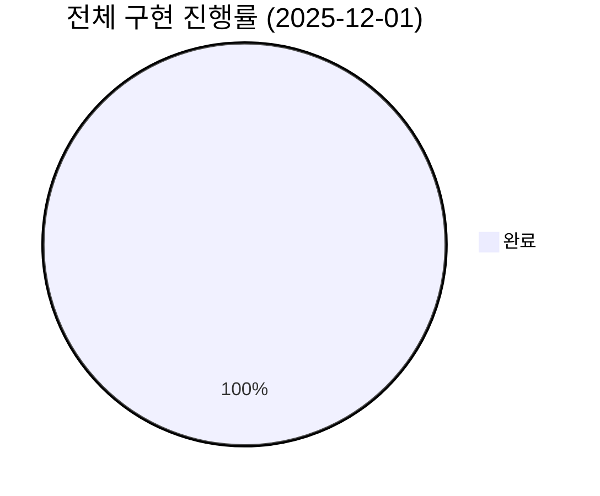
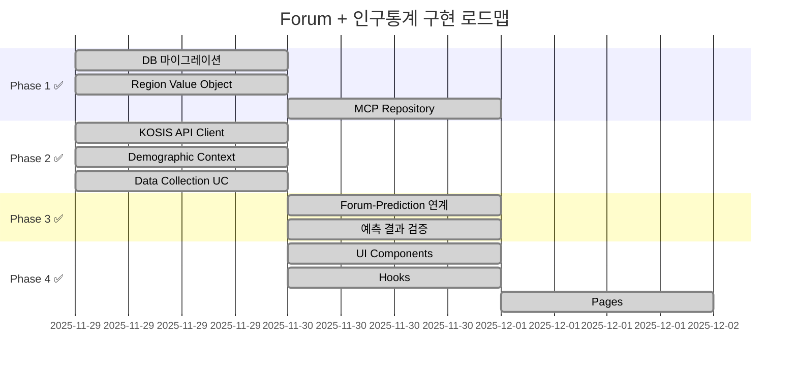

# Forum + 인구통계 Prediction 구현 태스크

> **시작일**: 2025-11-29  
> **최종 업데이트**: 2025-12-01  
> **목표**: Forum 도메인 완성 + 인구통계 기반 Prediction 연계  
> **현재 상태**: ✅ Phase 1-4 전체 완료 (100%)

---

## 📊 전체 진행 현황





---

## ✅ Phase 1: Forum 기반 완성

### Task 1.1: DB Schema 마이그레이션 ✅ 완료

**상태**: ✅ 완료 (2025-11-29)  
**소요 시간**: 20분  
**담당**: AI Agent

**작업 내용**:
- [x] forum 스키마 생성 (이미 존재)
- [x] forum_posts 테이블 생성 (이미 존재)
- [x] forum_comments 테이블 생성 (이미 존재)
- [x] forum_votes 테이블 생성 (이미 존재)
- [x] forum_activity_logs 테이블 생성 (이미 존재)
- [x] forum_regions 테이블 생성 ✅ NEW
- [x] forum_prediction_links 테이블 생성 ✅ NEW
- [x] demographic_data 스키마 생성 ✅ NEW
- [x] 초기 지역 데이터 삽입 (광주광역시 + 5개 구)

**완료된 마이그레이션**:
- `add_forum_regions_and_demographic_link`
- `create_demographic_data_schema`

---

### Task 1.2: Region Value Object 추가 ✅ 완료

**상태**: ✅ 완료 (2025-11-29)  
**소요 시간**: 30분  
**의존성**: Task 1.1 완료

**작업 내용**:
- [x] `RegionCode` 브랜드 타입 추가
- [x] `RegionLevel` enum 추가 (LOCAL, REGION, NATION, COLONY, COSMOS)
- [x] `RegionInfo` 인터페이스 추가
- [x] 팩토리 함수 `createRegionCode` 추가
- [x] `StatCategory` enum 추가
- [x] `PeriodType` enum 추가
- [x] `StatisticPeriod` 인터페이스 추가
- [x] `GWANGJU_REGION_CODES` 상수 추가

**파일**: `forum/domain/value-objects/forum-value-objects.ts`

---

### Task 1.3: MCP Post Repository 구현

**상태**: ✅ 완료 (2025-11-30)  
**소요 시간**: 2시간  
**의존성**: Task 1.1 완료

**작업 내용**:
- [x] `MCPPostRepository` 클래스 생성
- [x] `IPostRepository` 인터페이스 구현
- [x] 기본 CRUD 메서드 구현 (`save`, `update`, `findById`, `delete`)
- [x] 검색/필터링 메서드 구현 (`search`, `findByAuthor`, `findBySection` 등)
- [x] 인기/추천 메서드 구현 (`findPopular`, `findTrending`, `findRelated`)
- [x] 통계 메서드 구현 (`getStats`, `count`, `exists`)
- [x] Post Entity 확장 (추가 필드: `tags`, `isSticky`, `viewCount`, `popularityScore`, `regionCode`, `publishedAt`)
- [x] TypeScript 타입 오류 수정 (Brand Type 변환, PaginationParams 호환)

**파일**: 
- `forum/infrastructure/repositories/mcp-post.repository.ts`
- `forum/domain/entities/post.entity.ts` (확장됨)

---

### Task 1.4: Forum CRUD Use Cases

**상태**: ⬜ 대기  
**예상 시간**: 2시간  
**의존성**: Task 1.3 완료

**작업 내용**:
- [ ] `CreatePostUseCase` 구현
- [ ] `UpdatePostUseCase` 구현
- [ ] `DeletePostUseCase` 구현
- [ ] `GetPostsUseCase` 구현
- [ ] `SearchPostsUseCase` 구현

**파일**: `forum/application/use-cases/`

---

## 📊 Phase 2: 인구통계 데이터 연동

### Task 2.1: KOSIS API Client 구현 ✅ 완료

**상태**: ✅ 완료 (2025-11-29)  
**소요 시간**: 1시간  
**의존성**: Phase 1 완료

**작업 내용**:
- [ ] KOSIS API 키 발급 (https://kosis.kr/openapi) - **사용자 필요**
- [x] `KOSISClient` 클래스 생성
- [x] 인구동향 API 연동 (출생/사망/혼인/이혼)
- [x] 인구이동 API 연동 (전입/전출)
- [x] 고용동향 API 연동 (실업률/고용률/경제활동인구)
- [x] 물가지수 API 연동 (CPI)
- [x] Rate Limiting 구현
- [x] 데이터 파싱 유틸리티

**파일**: `demographic-data/infrastructure/api-clients/kosis.client.ts`

**지원 테이블**:
| 카테고리 | 테이블 ID | 설명 |
|---------|----------|------|
| BIRTH/DEATH/MARRIAGE/DIVORCE | DT_1B8000F | 인구동향조사 |
| MIGRATION_IN/OUT | DT_1B26001_A01 | 인구이동 |
| EMPLOYMENT/UNEMPLOYMENT/LABOR_FORCE | DT_1DA7004S | 경제활동인구 |
| CPI | DT_1J20004 | 소비자물가지수 |
| POPULATION | DT_1B04005N | 주민등록인구 |

---

### Task 2.2: Demographic Data Context 생성 ✅ 완료

**상태**: ✅ 완료 (2025-11-29)  
**소요 시간**: 1.5시간  
**의존성**: Task 2.1 완료

**작업 내용**:
- [x] demographic_data 스키마 마이그레이션
- [x] `Statistic` Entity 생성
- [x] `DataSource` Entity 생성
- [x] `StatCategory` Value Object 생성
- [x] `IStatisticRepository` 인터페이스 정의
- [x] `IDataSourceRepository` 인터페이스 정의
- [x] `MCPStatisticRepository` 구현
- [x] `MCPDataSourceRepository` 구현
- [x] context.md 문서 작성

**생성된 파일**:
```
bounded-contexts/demographic-data/
├── domain/
│   ├── entities/statistic.entity.ts
│   ├── repositories/statistic.repository.ts
│   └── index.ts
├── application/
│   ├── use-cases/collect-demographics.use-case.ts
│   └── index.ts
├── infrastructure/
│   ├── repositories/mcp-statistic.repository.ts
│   ├── api-clients/kosis.client.ts
│   └── index.ts
├── context.md
└── index.ts
```

---

### Task 2.3: 데이터 수집 Use Case ✅ 완료

**상태**: ✅ 완료 (2025-11-29)  
**소요 시간**: 1시간  
**의존성**: Task 2.2 완료

**작업 내용**:
- [x] `CollectDemographicsUseCase` 구현 (통합)
- [x] `GetStatisticsUseCase` 구현
- [x] 중복 데이터 체크 로직
- [x] 에러 핸들링 및 결과 리포팅
- [ ] 월별 자동 수집 스케줄러 설계 (추후)

---

## 🎮 Phase 3: Forum-Prediction 연계

### Task 3.1: Prediction 게임 생성 연계

**상태**: ✅ 완료 (2025-11-30)  
**소요 시간**: 1.5시간  
**의존성**: Phase 2 완료

**작업 내용**:
- [x] `CreatePredictionFromForumUseCase` 구현
- [x] Forum Post → Prediction Game 매핑
- [x] 토론 주제 기반 예측 게임 템플릿 (11개 카테고리)
- [x] `IForumPredictionLinkRepository` 인터페이스 정의
- [x] `IPredictionRepository` 인터페이스 정의
- [x] 광주 지역 코드 상수 (`GWANGJU_REGION_NAMES`)
- [x] TypeScript Result 타입 오류 수정

**예측 게임 템플릿** (구현 완료):
```typescript
// DEMOGRAPHIC_PREDICTION_TEMPLATES 에 정의됨
// BIRTH, DEATH, MARRIAGE, DIVORCE, MIGRATION_IN, MIGRATION_OUT,
// EMPLOYMENT, UNEMPLOYMENT, LABOR_FORCE, CPI, POPULATION
```

**파일**: `forum/application/use-cases/create-prediction-from-forum.use-case.ts`

---

### Task 3.2: 예측 결과 검증 시스템

**상태**: ✅ 완료 (2025-11-29)  
**소요 시간**: 45분  
**의존성**: Task 3.1 완료

**작업 내용**:
- [x] `VerifyPredictionResultUseCase` 구현
- [x] KOSIS 실제 데이터로 결과 검증
- [x] 자동 정산 트리거 인터페이스 (`ISettlementService`)
- [x] 일괄 검증 메서드 (`verifyAllExpired`, `verifyByTargetPeriod`)
- [x] `GetPredictionStatusUseCase` 구현

**파일**: `forum/application/use-cases/verify-prediction-result.use-case.ts`

---

## 🖥️ Phase 4: Presentation Layer

### Task 4.1: Forum UI Components

**상태**: ✅ 완료 (2025-11-30)  
**소요 시간**: 1시간  
**의존성**: Phase 1 완료

**작업 내용**:
- [x] `ForumPmpStatusCard` 컴포넌트 (기존)
- [x] `ForumPmpStatusCompact` 컴포넌트 (기존)
- [x] `DemographicDebateCard` 컴포넌트 ✅ NEW
- [x] `DemographicDebateList` 컴포넌트 ✅ NEW
- [x] `PredictionParticipationForm` 컴포넌트 ✅ NEW
- [ ] `ForumLayout` 컴포넌트
- [ ] `PostDetail` 컴포넌트
- [ ] `CreatePostForm` 컴포넌트

**생성된 파일**:
- `forum/presentation/components/demographic-debate-card.tsx`
- `forum/presentation/components/prediction-participation-form.tsx`
- `forum/presentation/components/index.ts`

---

### Task 4.2: Hooks 구현

**상태**: ✅ 완료 (2025-11-30)  
**소요 시간**: 1시간  
**의존성**: Task 4.1 완료

**작업 내용**:
- [x] `useForumPosts` hook (기존)
- [x] `useForumComments` hook (기존)
- [x] `useForumActivity` hook (기존)
- [x] `useDemographicPredictions` hook ✅ NEW
- [x] `useDemographicPrediction` hook ✅ NEW
- [x] `useCreateDemographicPrediction` hook ✅ NEW
- [x] `useMyPredictions` hook ✅ NEW
- [x] `useDemographicData` hook ✅ NEW

**생성된 파일**:
- `forum/presentation/hooks/use-demographic-prediction.ts`
- `forum/presentation/hooks/index.ts`
- `forum/presentation/index.ts`

---

### Task 4.3: Pages 구현

**상태**: ✅ 완료 (2025-12-01)  
**소요 시간**: 2시간  
**의존성**: Task 4.2 완료

**작업 내용**:
- [x] `/forum/debate` 페이지 ✅ NEW
- [x] `/prediction/demographic/[id]` 페이지 ✅ NEW
- [ ] `/forum/news` 페이지 (추후)
- [ ] `/forum/brainstorm` 페이지 (추후)
- [ ] `/forum/budget` 페이지 (추후)
- [ ] `/forum/region/[code]` 페이지 (추후)
- [ ] `/predictions/demographic` 페이지 (추후)

**생성된 파일**:
- `app/forum/debate/page.tsx` (Server Component)
- `app/forum/debate/page-client.tsx` (Client Component)
- `app/prediction/demographic/[id]/page.tsx` (Server Component)
- `app/prediction/demographic/[id]/page-client.tsx` (Client Component)

**구현된 기능**:
- 인구통계 토론 목록 페이지 (카테고리/지역 필터, 통계 요약)
- 예측 게임 상세 페이지 (예측값 선택, PMP 배팅, 배팅 분포 차트)

---

## 📋 첫 번째 예측 게임 런칭 체크리스트

### "12월 광주시 출생아 수" 예측 게임

- [ ] KOSIS에서 11월 출생아 데이터 확인 (기준점)
- [ ] 예측 범위 설정 (예: 800~1200명, 50명 단위)
- [ ] PMP 배팅 범위 설정 (50~500 PMP)
- [ ] 게임 생성 및 공개
- [ ] Forum에서 "저출산 정책" 관련 토론 연계
- [ ] 12월 말 결과 확인 후 정산

---

## 🔧 환경 설정 필요사항

```bash
# .env.local 추가 필요
KOSIS_API_KEY=your_kosis_api_key
```

**KOSIS API 키 발급**:
1. https://kosis.kr 접속
2. 회원가입/로그인
3. OpenAPI → API 신청
4. 서비스키 발급

---

## 📈 성공 지표

| 항목 | 1주 목표 | 2주 목표 | 4주 목표 |
|------|---------|---------|---------|
| Forum 게시글 | 10+ | 50+ | 100+ |
| 예측 게임 | 1개 | 5개 | 15개 |
| 예측 참여 | 50+ | 200+ | 500+ |
| 토론 참여자 | 20+ | 100+ | 300+ |

---

*Created: 2025-11-29*
