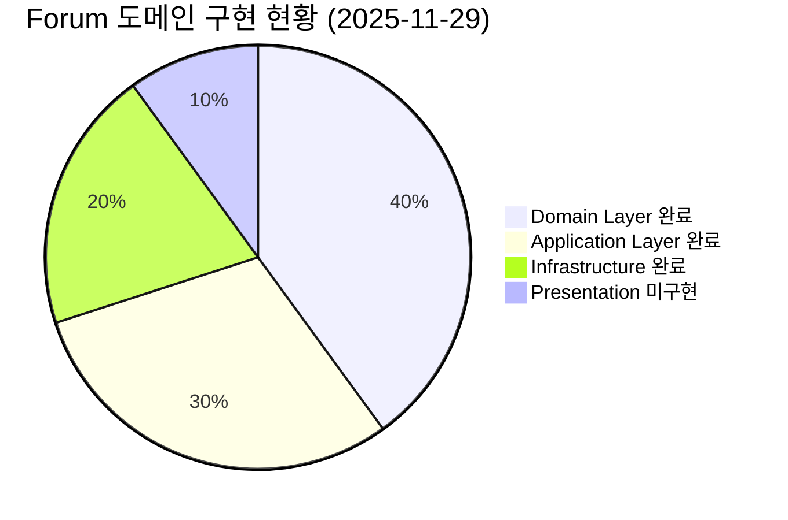
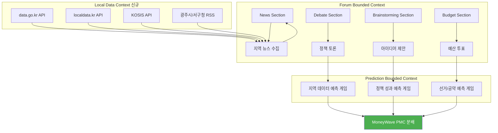
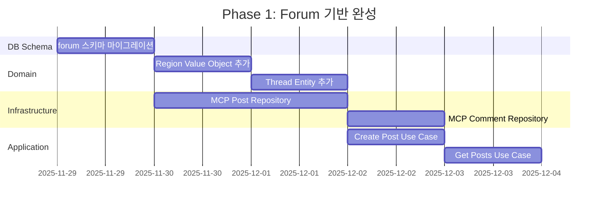
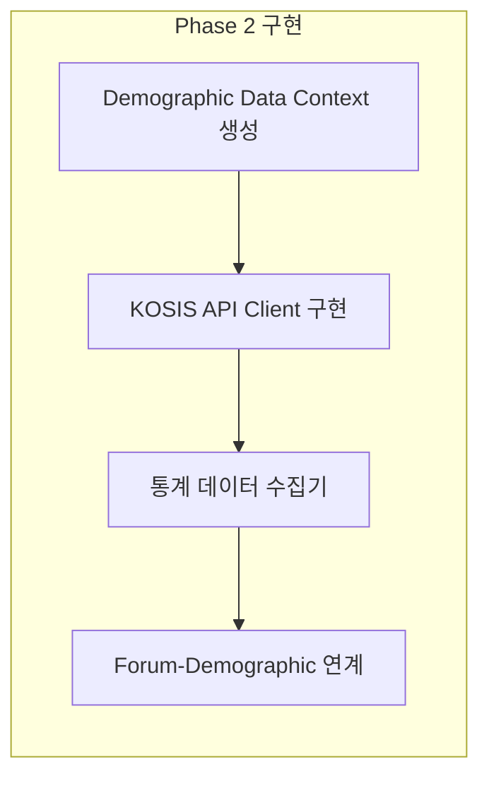
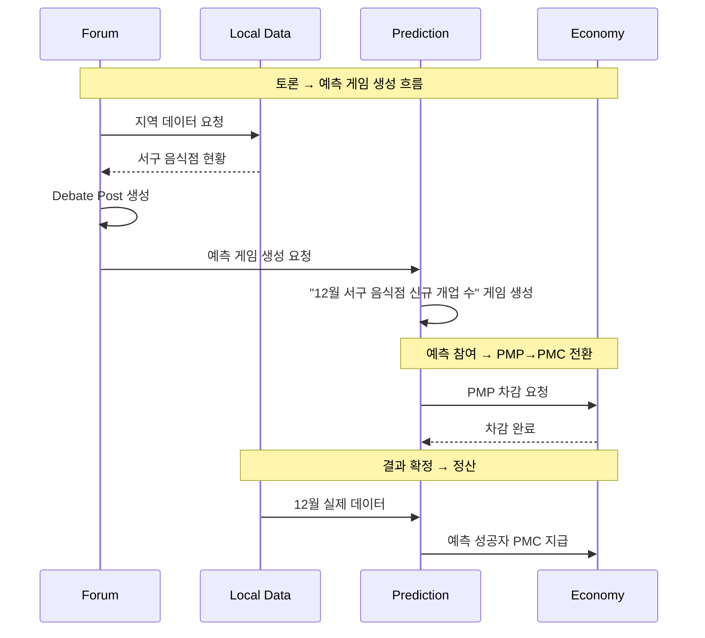
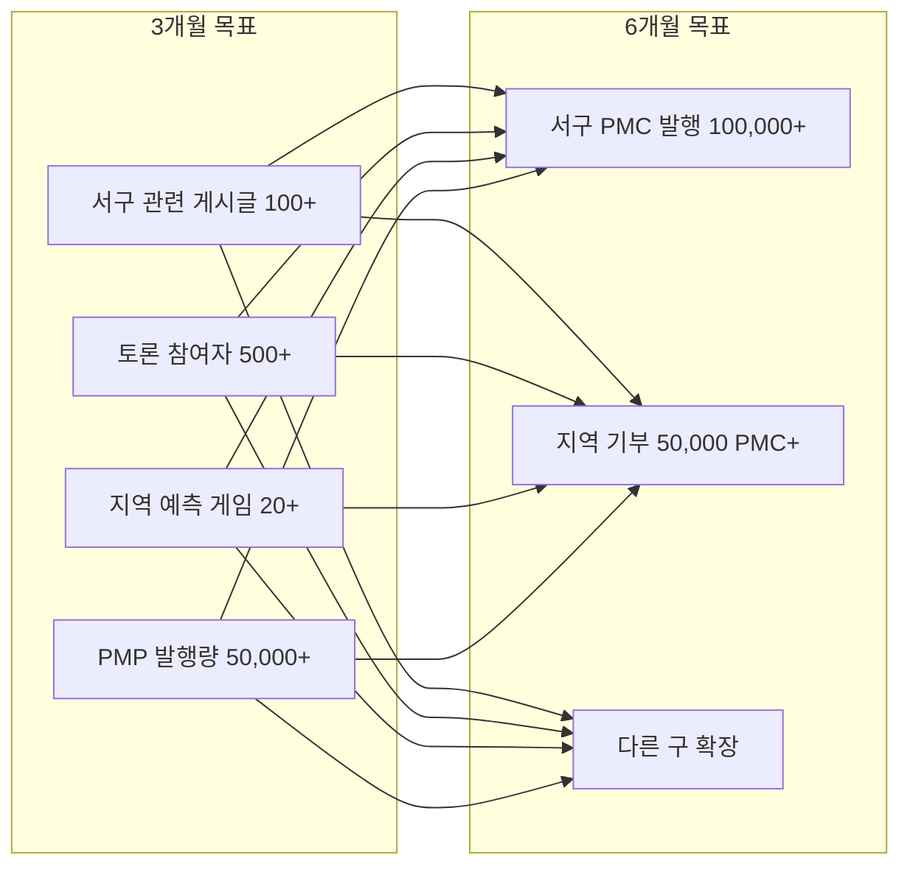

# Forum 도메인 구현 전략 + 광주 서구 연계

> **작성일**: 2025-11-29  
> **최종 업데이트**: 2025-11-29  
> **목표**: Forum 도메인 완성 + 광주 서구 지역 데이터 연계  
> **기반 문서**: `project_features.md`, `gwangju-seogu-forum-prediction-strategy.md`  
> **현재 상태**: ✅ Phase 1-3 대부분 완료

---

## 📊 현재 구현 현황 분석



### ✅ 구현 완료 (90%)

| 구분 | 파일 | 상태 |
|------|------|------|
| **Domain/Entities** | `post.entity.ts` | ✅ 완료 |
| **Domain/Entities** | `comment.entity.ts` | ✅ 완료 |
| **Domain/Entities** | `vote.entity.ts` | ✅ 완료 |
| **Domain/Value Objects** | `forum-value-objects.ts` | ✅ 완료 (Region, Stat 추가) |
| **Domain/Repositories** | `post.repository.ts` (Interface) | ✅ 완료 |
| **Application/Use Cases** | `reward-forum-activity.use-case.ts` | ✅ 완료 |
| **Application/Use Cases** | `create-prediction-from-forum.use-case.ts` | ✅ 완료 |
| **Application/Use Cases** | `verify-prediction-result.use-case.ts` | ✅ 완료 |
| **Infrastructure/Repositories** | `mcp-post.repository.ts` | ✅ 완료 |
| **Infrastructure/Repositories** | `mcp-forum-activity-log.repository.ts` | ✅ 완료 |
| **DB Schema** | `forum.forum_posts`, `forum_comments`, `forum_votes` | ✅ 완료 |
| **DB Schema** | `forum.forum_regions` | ✅ 완료 |
| **DB Schema** | `forum.forum_prediction_links` | ✅ 완료 |
| **DB Schema** | `demographic_data.*` | ✅ 완료 |

### 🆕 새로 구현된 항목 (2025-11-29)

| 구분 | 파일 | 설명 |
|------|------|------|
| **demographic-data/domain** | `statistic.entity.ts` | Statistic, DataSource Entity |
| **demographic-data/domain** | `statistic.repository.ts` | IStatisticRepository, IDataSourceRepository |
| **demographic-data/infrastructure** | `mcp-statistic.repository.ts` | MCPStatisticRepository 구현 |
| **demographic-data/infrastructure** | `kosis.client.ts` | KOSIS API 클라이언트 (11개 카테고리) |
| **demographic-data/application** | `collect-demographics.use-case.ts` | 데이터 수집 Use Case |
| **forum/infrastructure** | `mcp-post.repository.ts` | IPostRepository 완전 구현 |
| **forum/application** | `create-prediction-from-forum.use-case.ts` | Forum→Prediction 연계 |
| **forum/application** | `verify-prediction-result.use-case.ts` | KOSIS 데이터로 검증 |

### ❌ 구현 필요 (10%)

| 계층 | 필요 구현 | 우선순위 |
|------|----------|----------|
| **Presentation** | Components, Hooks, Pages | 🟡 중간 |
| **환경설정** | KOSIS API 키 발급 | 🔴 높음 |

---

## 🗺️ Forum-Prediction 연계 아키텍처



---

## 🎯 Phase별 구현 로드맵

### Phase 1: Forum 기반 완성 (1주차)



**Task 1.1: DB Schema 마이그레이션**
```sql
-- forum.forum_posts 테이블
-- forum.forum_comments 테이블
-- forum.forum_votes 테이블
-- forum.forum_activity_logs 테이블
-- forum.forum_regions 테이블 (지역 연계용)
```

**Task 1.2: Region Value Object 추가**
```typescript
// 지역 계층: LOCAL(서구) → REGION(광주) → NATION → COLONY → COSMOS
export type RegionId = string & { readonly __brand: "RegionId" };
export interface RegionInfo {
  id: RegionId;
  code: string;      // '29140' (서구)
  name: string;      // '광주광역시 서구'
  level: ForumCategory;
  parentCode?: string;
}
```

**Task 1.3: Infrastructure 구현**
- `mcp-post.repository.ts` - MCP 기반 Post Repository
- `mcp-comment.repository.ts` - MCP 기반 Comment Repository
- `mcp-vote.repository.ts` - MCP 기반 Vote Repository

---

### Phase 2: 인구통계 데이터 연동 (2주차)



**Task 2.1: demographic_data Bounded Context 생성**
```
bounded-contexts/
└── demographic-data/
    ├── domain/
    │   ├── entities/
    │   │   ├── region.entity.ts
    │   │   ├── statistic.entity.ts
    │   │   └── data-source.entity.ts
    │   ├── value-objects/
    │   │   ├── stat-category.vo.ts    # BIRTH, DEATH, EMPLOYMENT 등
    │   │   └── period.vo.ts           # Monthly, Quarterly, Yearly
    │   └── repositories/
    │       └── statistic.repository.interface.ts
    ├── infrastructure/
    │   ├── api-clients/
    │   │   ├── kosis.client.ts        # 인구동향, 고용, 물가
    │   │   ├── data-go-kr.client.ts   # 주민등록인구
    │   │   └── index-go-kr.client.ts  # 국가지표
    │   └── repositories/
    │       └── mcp-statistic.repository.ts
    └── application/
        └── use-cases/
            ├── collect-demographic-data.use-case.ts
            ├── get-birth-statistics.use-case.ts
            └── verify-prediction-result.use-case.ts
```

**Task 2.2: 통계청 KOSIS API 클라이언트 구현**
- `kosis.kr` - 출생/사망, 인구이동, 고용/실업, 물가지수
- `data.go.kr` - 주민등록인구, 외국인 현황
- `index.go.kr` - 국가지표 (GRDP, 소득 등)

---

### Phase 3: Forum-Prediction 연계 (3주차)



**Task 3.1: Forum → Prediction 연계 Use Case**
```typescript
// create-prediction-from-debate.use-case.ts
// Debate 토론에서 인구통계 Prediction 게임 자동 생성
// 예: "저출산 정책 효과" 토론 → "Q1 출생아 수 예측" 게임
```

**Task 3.2: 통계청 데이터 기반 예측 결과 검증**
```typescript
// verify-prediction-result.use-case.ts
// KOSIS API 데이터로 예측 결과 자동 검증
// - 출생/사망: 월말 발표
// - 고용/실업: 분기말 발표
// - 물가지수: 월 중순 발표
```

---

### Phase 4: Presentation 구현 (4주차)

```mermaid
graph TD
    subgraph "Forum UI Components"
        A[ForumLayout]
        B[PostList]
        C[PostDetail]
        D[CreatePost]
        E[DebateRoom]
        F[BudgetVote]
    end
    
    subgraph "Hooks"
        G[usePosts]
        H[useComments]
        I[useVotes]
        J[useLocalData]
    end
    
    subgraph "Pages"
        K[/forum/news]
        L[/forum/debate]
        M[/forum/brainstorm]
        N[/forum/budget]
        O[/forum/region/gwangju-seogu]
    end
    
    A --> B & C & D & E & F
    G & H & I & J --> A
    K & L & M & N & O --> A
```

---

## 🗄️ DB Schema 설계

### forum 스키마 테이블

```sql
-- 게시물 테이블
CREATE TABLE forum.forum_posts (
    id UUID PRIMARY KEY DEFAULT gen_random_uuid(),
    author_id UUID NOT NULL REFERENCES auth.users(id),
    section VARCHAR(20) NOT NULL, -- NEWS, DEBATE, BRAINSTORMING, BUDGET
    category VARCHAR(20) NOT NULL, -- COSMOS, COLONY, NATION, REGION, LOCAL
    region_code VARCHAR(10), -- 지역 코드 (29140 = 서구)
    title VARCHAR(100) NOT NULL,
    content TEXT NOT NULL,
    status VARCHAR(20) DEFAULT 'DRAFT',
    
    -- Section별 특화 필드
    news_category VARCHAR(30),
    budget_category VARCHAR(10),
    debate_position VARCHAR(20),
    
    -- 통계
    upvote_count INTEGER DEFAULT 0,
    downvote_count INTEGER DEFAULT 0,
    comment_count INTEGER DEFAULT 0,
    share_count INTEGER DEFAULT 0,
    view_count INTEGER DEFAULT 0,
    
    -- 메타데이터
    tags TEXT[],
    is_sticky BOOLEAN DEFAULT FALSE,
    is_locked BOOLEAN DEFAULT FALSE,
    
    -- 관리
    pinned_at TIMESTAMPTZ,
    archived_at TIMESTAMPTZ,
    moderated_at TIMESTAMPTZ,
    moderated_by UUID REFERENCES auth.users(id),
    
    created_at TIMESTAMPTZ DEFAULT NOW(),
    updated_at TIMESTAMPTZ DEFAULT NOW()
);

-- 댓글 테이블
CREATE TABLE forum.forum_comments (
    id UUID PRIMARY KEY DEFAULT gen_random_uuid(),
    post_id UUID NOT NULL REFERENCES forum.forum_posts(id) ON DELETE CASCADE,
    author_id UUID NOT NULL REFERENCES auth.users(id),
    parent_id UUID REFERENCES forum.forum_comments(id), -- 대댓글
    content TEXT NOT NULL,
    status VARCHAR(20) DEFAULT 'PUBLISHED',
    upvote_count INTEGER DEFAULT 0,
    downvote_count INTEGER DEFAULT 0,
    depth INTEGER DEFAULT 0, -- 0: 댓글, 1: 대댓글, 2: 대대댓글
    created_at TIMESTAMPTZ DEFAULT NOW(),
    updated_at TIMESTAMPTZ DEFAULT NOW()
);

-- 투표 테이블
CREATE TABLE forum.forum_votes (
    id UUID PRIMARY KEY DEFAULT gen_random_uuid(),
    user_id UUID NOT NULL REFERENCES auth.users(id),
    target_type VARCHAR(20) NOT NULL, -- POST, COMMENT
    target_id UUID NOT NULL,
    vote_type VARCHAR(20) NOT NULL, -- UPVOTE, DOWNVOTE, RATING
    vote_value INTEGER DEFAULT 1, -- 1~5 for RATING
    created_at TIMESTAMPTZ DEFAULT NOW(),
    updated_at TIMESTAMPTZ DEFAULT NOW(),
    
    UNIQUE(user_id, target_type, target_id)
);

-- 활동 로그 테이블
CREATE TABLE forum.forum_activity_logs (
    id UUID PRIMARY KEY DEFAULT gen_random_uuid(),
    user_id UUID NOT NULL REFERENCES auth.users(id),
    activity_type VARCHAR(30) NOT NULL,
    content_id UUID,
    pmp_earned INTEGER DEFAULT 0,
    description TEXT,
    metadata JSONB,
    created_at TIMESTAMPTZ DEFAULT NOW()
);

-- 지역 연계 테이블
CREATE TABLE forum.forum_regions (
    code VARCHAR(10) PRIMARY KEY,
    name VARCHAR(100) NOT NULL,
    parent_code VARCHAR(10) REFERENCES forum.forum_regions(code),
    level VARCHAR(20) NOT NULL, -- LOCAL, REGION, NATION, COLONY, COSMOS
    is_active BOOLEAN DEFAULT TRUE,
    created_at TIMESTAMPTZ DEFAULT NOW()
);

-- Forum-Prediction 연계 테이블
CREATE TABLE forum.forum_prediction_links (
    id UUID PRIMARY KEY DEFAULT gen_random_uuid(),
    forum_post_id UUID NOT NULL REFERENCES forum.forum_posts(id),
    prediction_game_id UUID NOT NULL, -- prediction.prediction_games 참조
    link_type VARCHAR(30) NOT NULL, -- SOURCE, RELATED, RESULT
    created_at TIMESTAMPTZ DEFAULT NOW()
);

-- RLS 정책
ALTER TABLE forum.forum_posts ENABLE ROW LEVEL SECURITY;
ALTER TABLE forum.forum_comments ENABLE ROW LEVEL SECURITY;
ALTER TABLE forum.forum_votes ENABLE ROW LEVEL SECURITY;
ALTER TABLE forum.forum_activity_logs ENABLE ROW LEVEL SECURITY;

-- 읽기 정책 (게시된 글은 모두 조회 가능)
CREATE POLICY "Published posts are viewable by everyone"
ON forum.forum_posts FOR SELECT
USING (status = 'PUBLISHED' OR auth.uid() = author_id);

-- 쓰기 정책 (인증된 사용자만)
CREATE POLICY "Users can create posts"
ON forum.forum_posts FOR INSERT
WITH CHECK (auth.uid() = author_id);

-- 수정 정책 (작성자만)
CREATE POLICY "Users can update own posts"
ON forum.forum_posts FOR UPDATE
USING (auth.uid() = author_id);

-- 초기 지역 데이터
INSERT INTO forum.forum_regions (code, name, parent_code, level) VALUES
    ('KR', '대한민국', NULL, 'NATION'),
    ('29000', '광주광역시', 'KR', 'REGION'),
    ('29110', '광주광역시 동구', '29000', 'LOCAL'),
    ('29140', '광주광역시 서구', '29000', 'LOCAL'),
    ('29155', '광주광역시 남구', '29000', 'LOCAL'),
    ('29170', '광주광역시 북구', '29000', 'LOCAL'),
    ('29200', '광주광역시 광산구', '29000', 'LOCAL');

-- 인덱스
CREATE INDEX idx_forum_posts_section ON forum.forum_posts(section);
CREATE INDEX idx_forum_posts_category ON forum.forum_posts(category);
CREATE INDEX idx_forum_posts_region ON forum.forum_posts(region_code);
CREATE INDEX idx_forum_posts_status ON forum.forum_posts(status);
CREATE INDEX idx_forum_posts_author ON forum.forum_posts(author_id);
CREATE INDEX idx_forum_posts_created ON forum.forum_posts(created_at DESC);
CREATE INDEX idx_forum_comments_post ON forum.forum_comments(post_id);
CREATE INDEX idx_forum_votes_target ON forum.forum_votes(target_type, target_id);
CREATE INDEX idx_forum_activity_user ON forum.forum_activity_logs(user_id, created_at DESC);
```

---

## 🎮 광주 서구 특화 인구통계 Prediction 게임 예시

### 기초 인구통계 예측 (Phase 1)

| 게임 ID | 주제 | 데이터 소스 | 기간 | PMP 배팅 |
|---------|------|------------|------|---------|
| GJ-001 | 12월 광주시 출생아 수 | KOSIS 인구동향 | 월간 | 50~500 |
| GJ-002 | Q4 서구 순유입 인구 (전입-전출) | KOSIS 인구이동 | 분기 | 100~1000 |
| GJ-003 | 12월 소비자물가지수 (전월대비 %) | KOSIS 물가 | 월간 | 50~500 |
| GJ-004 | Q4 광주시 실업률 | KOSIS 고용동향 | 분기 | 100~1000 |

### 정책 연계 예측 (Phase 2)

| 게임 ID | Forum 토론 연계 | 예측 주제 | 결과 확인 |
|---------|----------------|----------|----------|
| GJ-101 | "서구 저출산 대책 효과" 토론 | 2026년 Q1 서구 출생아 수 | 분기말 통계청 |
| GJ-102 | "청년 유출 막을 방법" 토론 | Q1 서구 20-30대 순유입 | 분기말 인구이동 |
| GJ-103 | "서구 일자리 정책 효과" 토론 | Q1 서구 취업자 증가율 | 분기말 고용동향 |

---

## 📋 즉시 실행 가능 Task

### Task 1: DB 마이그레이션 (오늘)

```bash
# MCP를 통한 마이그레이션 실행
# mcp_supabase_apply_migration 사용
```

### Task 2: Region Value Object 추가 (오늘)

**파일**: `forum-value-objects.ts` 에 추가
```typescript
// Region 관련 Value Objects
export type RegionCode = string & { readonly __brand: "RegionCode" };
export const createRegionCode = (code: string): RegionCode => {...};
```

### Task 3: MCP Repository 구현 (내일)

**파일**: `mcp-post.repository.ts`
```typescript
// IPostRepository 인터페이스 구현
export class MCPPostRepository implements IPostRepository {...}
```

---

## 📈 성과 지표 (KPI)



---

## 🔧 환경 설정 (추가 필요)

```bash
# .env.local 추가 항목
DATA_GO_KR_API_KEY=your_key
LOCAL_DATA_API_KEY=your_key
KOSIS_API_KEY=your_key
GWANGJU_DATA_API_KEY=your_key
```

---

## 🚀 다음 액션 아이템

### ✅ 완료된 작업

1. ✅ forum 스키마 DB 마이그레이션 완료
2. ✅ Region Value Object 코드 추가
3. ✅ MCPPostRepository 구현 완료
4. ✅ KOSIS 클라이언트 구현 완료 (11개 카테고리)
5. ✅ demographic-data 바운디드 컨텍스트 생성
6. ✅ CreatePredictionFromForumUseCase 구현
7. ✅ VerifyPredictionResultUseCase 구현

### ⏳ 다음 작업

1. **즉시**: KOSIS API 키 발급 신청 (https://kosis.kr/openapi)
2. **1주 내**: 첫 번째 인구통계 예측 게임 ("12월 광주시 출생아 수") 런칭
3. **2주 내**: Presentation Layer UI 컴포넌트 구현

### 인구통계 API 우선순위

| 순서 | API | 데이터 | 예측 게임 활용 |
|------|-----|--------|---------------|
| 1 | KOSIS 인구동향 | 출생/사망/혼인 | 월별 출생아 예측 ⭐ |
| 2 | KOSIS 고용동향 | 실업률/고용률 | 분기별 실업률 예측 |
| 3 | KOSIS 물가 | CPI | 월별 물가상승률 예측 |
| 4 | KOSIS 인구이동 | 전입/전출 | 분기별 순이동 예측 |

---

*Last Updated: 2025-11-29*
