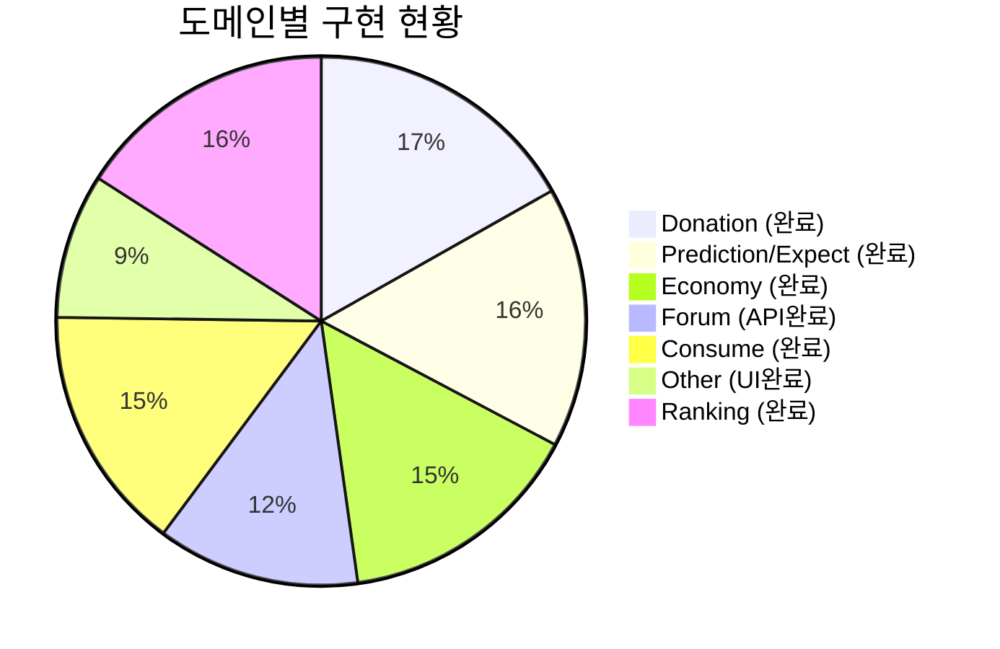
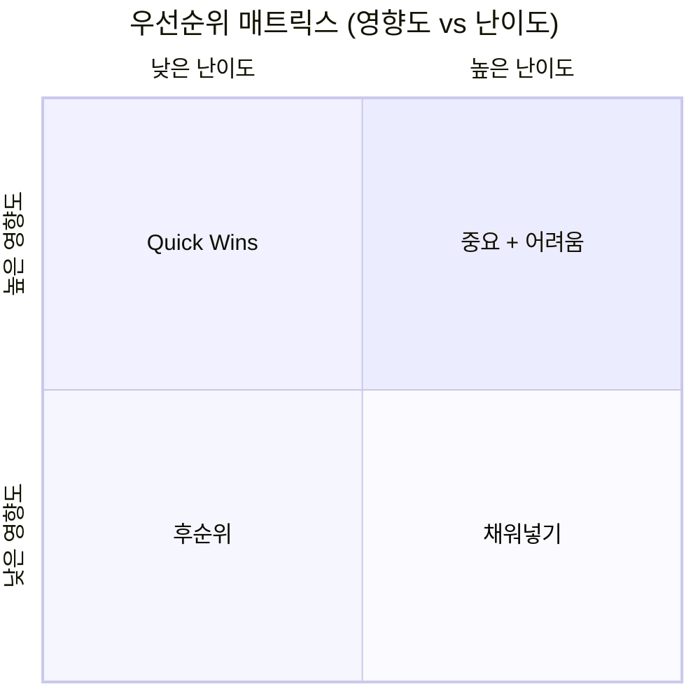
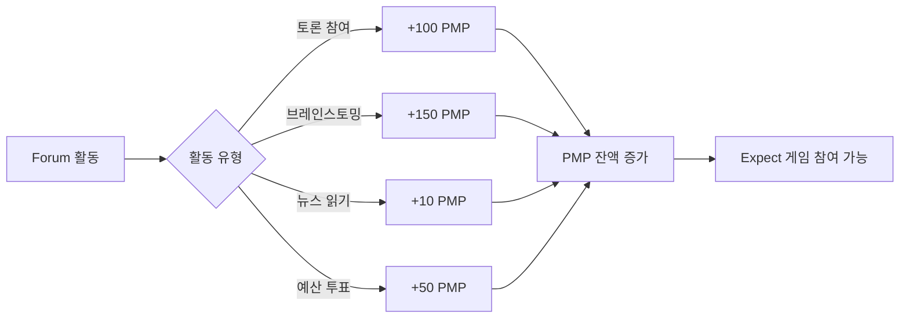
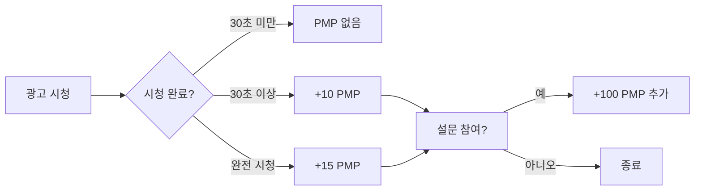
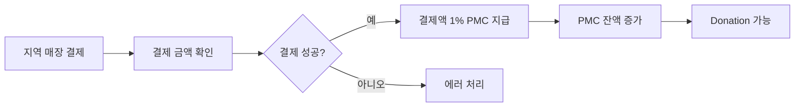
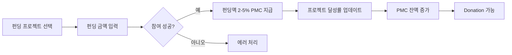
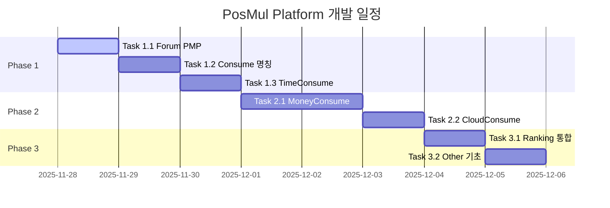

# PosMul Platform 개발 태스크 목록 2025

> **작성일**: 2025-11-28  
> **기준 문서**: `docs/init/economic_system_architecture.md`  
> **목표**: 경제 시스템 아키텍처에 맞춘 플랫폼 기능 구현

---

## 📊 현재 구현 현황



### 도메인별 상태

| 도메인 | UI | 비즈니스 로직 | DB | API | 상태 |
|--------|:--:|:------------:|:--:|:---:|:----:|
| **Donation** | ✅ | ✅ | ✅ | ✅ | 완료 |
| **Prediction/Expect** | ✅ | ✅ | ✅ | ✅ | 완료 |
| **Economy (PMP/PMC)** | ✅ | ✅ | ✅ | ✅ | 완료 |
| **Forum** | ✅ | ✅ | ✅ | ✅ | API 완료 |
| **Consume (TimeConsume)** | ✅ | ✅ | ✅ | ✅ | 완료 |
| **Consume (MoneyConsume)** | ✅ | ✅ | ✅ | ✅ | 완료 |
| **Consume (CloudConsume)** | ✅ | ✅ | ✅ | ✅ | 완료 |
| **Other** | ✅ | 🟡 | ❌ | ❌ | 기본 UI 완료 |
| **Ranking** | ✅ | ✅ | ✅ | ✅ | 완료 |

---

## 🎯 우선순위 매트릭스



| 우선순위 | 작업 | 영향도 | 난이도 | 이유 |
|:--------:|------|:------:|:------:|------|
| **🔥 1** | Forum PMP 획득 시스템 | ⭐⭐⭐⭐⭐ | ⭐⭐ | 시간 투입 → PMP 핵심 경로 |
| **🔥 2** | Consume 명칭 변경 + 라우팅 | ⭐⭐⭐⭐ | ⭐ | 문서와 코드 일치 필요 |
| **🔥 3** | TimeConsume PMP 획득 | ⭐⭐⭐⭐ | ⭐⭐⭐ | 광고 시청 → PMP |
| **⚡ 4** | MoneyConsume PMC 획득 | ⭐⭐⭐⭐ | ⭐⭐⭐⭐ | 지역 소비 → PMC |
| **⚡ 5** | Ranking 통합 개선 | ⭐⭐⭐ | ⭐⭐ | 모든 활동 반영 |
| **💫 6** | Other 서비스 기초 | ⭐⭐ | ⭐⭐⭐ | 확장 서비스 |

---

## 🔥 Phase 1: 핵심 경제 순환 완성 (최우선)

> **목표**: PMP 획득 → Expect → PMC → Donation 완전 순환

### Task 1.1: Forum PMP 획득 시스템 ⭐⭐⭐⭐⭐

**현재 상태**: UI만 존재, 실제 PMP 지급 로직 없음



**구현 항목**:
- [ ] 1.1.1 Forum 활동 테이블 생성 (`forum.user_activities`)
- [ ] 1.1.2 PMP 지급 API (`POST /api/forum/activity`)
- [ ] 1.1.3 토론 글 작성 시 PMP 지급
- [ ] 1.1.4 브레인스토밍 아이디어 제안 시 PMP 지급
- [ ] 1.1.5 활동 내역 조회 API
- [ ] 1.1.6 일일 PMP 획득 한도 설정

**예상 시간**: 4-6시간

---

### Task 1.2: Consume 명칭 변경 및 라우팅 정리 ⭐⭐⭐⭐

**현재 상태**: `/invest` 경로 사용, 문서는 `Consume` 용어 사용

**변경 사항**:
```
/invest → /consume (리다이렉트 설정)
/invest/local → /consume/money (MoneyConsume)
/invest/major → /consume/time (TimeConsume)
/invest/cloud → /consume/cloud (CloudConsume)
```

**구현 항목**:
- [x] 1.2.1 `/consume` 라우트 생성 ✅
- [x] 1.2.2 `/invest` → `/consume` 리다이렉트 설정 ✅
- [x] 1.2.3 네비게이션 메뉴 명칭 변경 ✅
- [x] 1.2.4 페이지 내용 업데이트 (Invest → Consume) ✅
- [x] 1.2.5 하위 페이지 라우트 정리 ✅

**✅ 완료일**: 2025-11-28

**완료 내용**:
1. `/app/consume/page.tsx` - 메인 소비 페이지 생성 (TimeConsume/MoneyConsume/CloudConsume)
2. `/app/consume/layout.tsx` - Consume 섹션 레이아웃
3. `/app/consume/time/page.tsx` - TimeConsume (광고 시청) 페이지
4. `/app/consume/money/page.tsx` - MoneyConsume (지역 소비) 페이지
5. `/app/consume/cloud/page.tsx` - CloudConsume (클라우드 펀딩) 페이지
6. `/app/invest/page.tsx` - `/consume`로 리다이렉트 설정
7. `ThreeRowNavbar.tsx` - 네비게이션 명칭 및 경로 전체 변경

**예상 시간**: 2-3시간
**실제 시간**: ~2시간

---

### Task 1.3: TimeConsume (Major League) PMP 획득 ⭐⭐⭐⭐

**현재 상태**: ✅ 완료



**구현 항목**:
- [x] 1.3.1 광고 시청 기록 테이블 (`consume.ad_views`) ✅
- [x] 1.3.2 광고 시청 API (`POST /api/consume/time/view`) ✅
- [x] 1.3.3 시청 시간 추적 로직 ✅
- [x] 1.3.4 PMP 자동 지급 (완전 시청 시) ✅
- [x] 1.3.5 설문 참여 추가 보상 ✅
- [x] 1.3.6 일일 시청 한도 설정 ✅

**✅ 완료일**: 2025-11-28

**완료 내용**:
1. **DB 마이그레이션**
   - `investment` 스키마 → `consume` 스키마 전체 변경
   - `consume.ad_campaigns` - 광고 캠페인 테이블 생성
   - `consume.ad_views` - 광고 시청 기록 테이블 생성
   - `consume.daily_view_stats` - 일일 통계 테이블 생성
   - 샘플 광고 캠페인 4개 추가

2. **Domain Layer**
   - `ad-campaign.entity.ts` - 광고 캠페인 엔티티
   - `ad-view.entity.ts` - 광고 시청 엔티티
   - Repository 인터페이스 정의

3. **Infrastructure Layer**
   - `mcp-ad-campaign.repository.ts` - 캠페인 MCP 리포지토리
   - `mcp-ad-view.repository.ts` - 시청 기록 MCP 리포지토리

4. **Application Layer**
   - `watch-ad.use-case.ts` - 광고 시청 유스케이스

5. **API Routes**
   - `GET /api/consume/time/campaigns` - 캠페인 목록 조회
   - `POST /api/consume/time/view` - 광고 시청 시작
   - `PATCH /api/consume/time/view/[id]` - 광고 시청 완료 + PMP 지급
   - `GET /api/consume/time/stats` - 일일 통계 조회

6. **Presentation Layer**
   - `use-time-consume.ts` - React hooks (useAdCampaigns, useDailyStats, useAdView)
   - TimeConsume 페이지 완전 리뉴얼 - API 연동, 시청 모달, 설문 기능

**예상 시간**: 5-7시간
**실제 시간**: ~4시간

---

## ⚡ Phase 2: 돈 투입 경로 구축

### Task 2.1: MoneyConsume (Local League) PMC 획득 ⭐⭐⭐⭐

**현재 상태**: ✅ 완료



**구현 항목**:
- [x] 2.1.1 Local League 매장 테이블 (`consume.local_stores`) ✅
- [x] 2.1.2 결제 기록 테이블 (`consume.payments`) ✅
- [x] 2.1.3 QR 결제 시뮬레이션 API ✅
- [x] 2.1.4 PMC 자동 지급 (결제 완료 시) ✅
- [x] 2.1.5 매장 목록/검색 API ✅
- [x] 2.1.6 결제 내역 조회 ✅

**✅ 완료일**: 2025-11-29

**완료 내용**:
1. **DB 마이그레이션**
   - `consume.local_stores` - 지역 매장 테이블 (카테고리, PMC 적립률 등)
   - `consume.payments` - 결제 기록 테이블 (결제액, PMC 획득 등)
   - 샘플 매장 4개 추가 (식당, 베이커리, 카페, 편의점)

2. **API Routes**
   - `GET /api/consume/money/stores` - 매장 목록 조회 (카테고리 필터링)
   - `POST /api/consume/money/payment` - 결제 처리 + PMC 자동 지급
   - `GET /api/consume/money/payment` - 결제 내역 조회

3. **Presentation Layer**
   - `use-money-consume.ts` - React hooks (useLocalStores, usePaymentHistory, usePayment)
   - MoneyConsume 페이지 완전 리뉴얼 - API 연동, 결제 모달, 카테고리 필터

**예상 시간**: 8-10시간
**실제 시간**: ~3시간

---

### Task 2.2: CloudConsume (Cloud Funding) PMC 획득 ⭐⭐⭐

**현재 상태**: ✅ 완료



**구현 항목**:
- [x] 2.2.1 펀딩 프로젝트 테이블 (`consume.funding_projects`) ✅ (기존 존재)
- [x] 2.2.2 펀딩 참여 기록 테이블 (`consume.contributions`) ✅
- [x] 2.2.3 프로젝트 목록 API ✅
- [x] 2.2.4 펀딩 참여 API (가상 결제) ✅
- [x] 2.2.5 펀딩 성공 시 PMC 지급 ✅
- [x] 2.2.6 프로젝트 진행률 업데이트 ✅

**✅ 완료일**: 2025-11-29

**완료 내용**:
1. **DB 마이그레이션**
   - `consume.funding_projects` - 기존 테이블 활용 (max_contribution 컬럼 추가)
   - `consume.contributions` - 펀딩 참여 기록 테이블 생성
   - 샘플 프로젝트 4개 존재 (도서관, 텀블러, 인디게임, AI교육)

2. **API Routes**
   - `GET /api/consume/cloud/projects` - 프로젝트 목록 조회 (카테고리/상태 필터링)
   - `POST /api/consume/cloud/contribute` - 펀딩 참여 + PMC 자동 지급
   - `GET /api/consume/cloud/contribute` - 참여 내역 조회

3. **Presentation Layer**
   - `use-cloud-consume.ts` - React hooks (useFundingProjects, useContributionHistory, useContribute)
   - CloudConsume 페이지 완전 리뉴얼 - API 연동, 펀딩 모달, 진행률 표시

**예상 시간**: 6-8시간
**실제 시간**: ~2시간

---

## 💫 Phase 3: 통합 및 고도화

### Task 3.1: Ranking 시스템 통합

**현재 상태**: ✅ 완료

**구현 항목**:
- [x] 3.1.1 통합 랭킹 테이블 설계 ✅
- [x] 3.1.2 Consume 활동 랭킹 추가 ✅
- [x] 3.1.3 Forum 활동 랭킹 추가 ✅
- [x] 3.1.4 Expect 성과 랭킹 추가 ✅
- [x] 3.1.5 종합 랭킹 계산 알고리즘 ✅
- [x] 3.1.6 랭킹 대시보드 UI ✅

**✅ 완료일**: 2025-11-29

**완료 내용**:
1. **DB 마이그레이션**
   - `ranking` 스키마 생성
   - `ranking.user_scores` - 사용자별 활동 점수 집계 테이블
     - forum_pmp_earned, money_consume_pmc, cloud_consume_pmc
     - expect_pmc_earned, donation_total_pmc
     - contribution_score, forum_rank, consume_rank 등
   - `ranking.ranking_history` - 주간/월간 랭킹 스냅샷
   - 샘플 데이터 5명 추가

2. **API Routes**
   - `GET /api/ranking` - 통합 랭킹 API
     - 카테고리 필터: overall, forum, consume, expect, donation
     - 기간 필터: all, monthly, weekly
     - 배지 자동 부여 로직 포함

3. **Presentation Layer**
   - `use-ranking.ts` - React hooks (useRanking)
   - `/app/ranking/page.tsx` - 통합 랭킹 페이지
     - 카테고리 탭 (종합, Forum, Consume, Expect, Donation)
     - 기간 필터 (전체, 이번 달, 이번 주)
     - 상세 점수 표시 옵션
     - 현재 사용자 랭킹 하이라이트

**예상 시간**: 4-6시간
**실제 시간**: ~2시간

---

### Task 3.2: Other 서비스 기초 구축

**현재 상태**: ✅ 기본 UI 완료

**구현 항목**:
- [x] 3.2.1 Other 메인 페이지 ✅
- [x] 3.2.2 Gift Aid 기본 UI ✅
- [x] 3.2.3 Accounting & Tax 기본 UI ✅
- [ ] 3.2.4 PMC 획득 로직 (서비스 이용 시) - 향후 구현

**✅ 완료일**: 2025-11-29

**완료 내용**:
1. **Other 메인 페이지** (`/app/other/page.tsx`)
   - 서비스 카드 그리드 (Gift Aid, Accounting & Tax, Support Center, Account Settings)
   - Active/Coming Soon 상태 표시
   - 각 서비스 기능 목록 표시

2. **Gift Aid 페이지** (`/app/other/gift-aid/page.tsx`)
   - 기부 내역 테이블 (날짜, 수혜기관, 금액, 상태, 영수증)
   - 세액공제 예상 계산기 (소득, 기부금액 입력)
   - 연간 기부금 영수증 발급 버튼
   - 연말정산 자료 다운로드 버튼

3. **Accounting & Tax 페이지** (`/app/other/tax/page.tsx`)
   - 거래 내역 테이블 (PMP/PMC 획득/사용/전환)
   - 요약 통계 (총 획득, 총 사용, PMP/PMC별)
   - 필터링 (거래유형, 포인트유형, 기간)
   - 명세서/Excel/세무신고용 자료 다운로드

**예상 시간**: 6-8시간
**실제 시간**: ~1.5시간

---

## 📅 실행 계획



---

## 🚀 즉시 시작: Task 1.1 Forum PMP 획득 시스템

### 상세 구현 계획

#### Step 1: DB 테이블 생성
```sql
-- forum.user_activities
CREATE TABLE forum.user_activities (
    id UUID PRIMARY KEY DEFAULT gen_random_uuid(),
    user_id UUID NOT NULL REFERENCES auth.users(id),
    activity_type VARCHAR(50) NOT NULL, -- 'debate', 'brainstorm', 'news', 'budget'
    content_id UUID, -- 관련 콘텐츠 ID
    pmp_earned INTEGER NOT NULL DEFAULT 0,
    created_at TIMESTAMPTZ DEFAULT NOW()
);

-- forum.debates (토론)
CREATE TABLE forum.debates (
    id UUID PRIMARY KEY DEFAULT gen_random_uuid(),
    title VARCHAR(200) NOT NULL,
    content TEXT NOT NULL,
    author_id UUID NOT NULL REFERENCES auth.users(id),
    category VARCHAR(50) NOT NULL,
    view_count INTEGER DEFAULT 0,
    comment_count INTEGER DEFAULT 0,
    created_at TIMESTAMPTZ DEFAULT NOW(),
    updated_at TIMESTAMPTZ DEFAULT NOW()
);

-- forum.debate_comments (토론 댓글)
CREATE TABLE forum.debate_comments (
    id UUID PRIMARY KEY DEFAULT gen_random_uuid(),
    debate_id UUID NOT NULL REFERENCES forum.debates(id),
    author_id UUID NOT NULL REFERENCES auth.users(id),
    content TEXT NOT NULL,
    pmp_earned INTEGER DEFAULT 0,
    created_at TIMESTAMPTZ DEFAULT NOW()
);
```

#### Step 2: API 구현
- `POST /api/forum/debates` - 토론 생성 (PMP 지급)
- `POST /api/forum/debates/[id]/comments` - 댓글 작성 (PMP 지급)
- `GET /api/forum/debates` - 토론 목록
- `GET /api/forum/my-activities` - 내 활동 내역

#### Step 3: PMP 지급 규칙
| 활동 | PMP | 일일 한도 |
|------|-----|----------|
| 토론 글 작성 | 100 PMP | 3회 (300 PMP) |
| 토론 댓글 | 20 PMP | 10회 (200 PMP) |
| 브레인스토밍 제안 | 150 PMP | 2회 (300 PMP) |
| 뉴스 읽기 | 5 PMP | 20회 (100 PMP) |
| **일일 최대** | - | **900 PMP** |

---

## ✅ 완료된 작업

### Task 1.1: Forum PMP 획득 시스템 (완료)

**구현 내역**:
- [x] `forum.forum_posts`, `forum.forum_comments`, `forum.forum_activity_logs` 테이블 확인 (이미 존재)
- [x] `RewardForumActivityUseCase` 생성 (`/bounded-contexts/forum/application/use-cases/`)
- [x] `MCPForumActivityLogRepository` 생성 (`/bounded-contexts/forum/infrastructure/repositories/`)
- [x] Forum API Routes 생성:
  - `POST/GET /api/forum/posts` - 게시글 생성/목록
  - `POST/GET /api/forum/posts/[id]/comments` - 댓글 생성/목록
  - `GET /api/forum/activity` - 일일 활동 현황
- [x] Forum Hooks 생성 (`/bounded-contexts/forum/presentation/hooks/use-forum.ts`)
- [x] PMP 현황 컴포넌트 생성 (`ForumPmpStatusCard`, `ForumPmpStatusCompact`)
- [x] 일일 한도 체크 로직 구현

**PMP 보상 규칙**:
| 활동 | PMP | 일일 한도 | 최대 일일 PMP |
|------|-----|----------|--------------|
| 토론 글 작성 | 100 | 3회 | 300 |
| 브레인스토밍 | 150 | 2회 | 300 |
| 일반 토론 | 50 | 5회 | 250 |
| 질문 작성 | 30 | 10회 | 300 |
| 댓글 작성 | 20 | 10회 | 200 |
| **총합** | - | - | **1,350 PMP** |

---

## 📝 변경 이력

| 버전 | 날짜 | 변경 내용 |
|------|------|----------|
| 1.0 | 2025-11-28 | 최초 작성 |
| 1.1 | 2025-11-28 | Task 1.1 Forum PMP 시스템 완료 |
| 1.2 | 2025-11-28 | Task 1.2 Consume 명칭 변경 완료 |
| 1.3 | 2025-11-28 | Task 1.3 TimeConsume PMP 시스템 완료, investment→consume DB 마이그레이션 |
| 1.4 | 2025-11-29 | **Phase 2 완료**: Task 2.1 MoneyConsume, Task 2.2 CloudConsume PMC 시스템 |
| 1.5 | 2025-11-29 | **Phase 3 완료**: Task 3.1 Ranking 통합 시스템, Task 3.2 Other 서비스 기본 UI |

---

*Last Updated: 2025-11-29*
