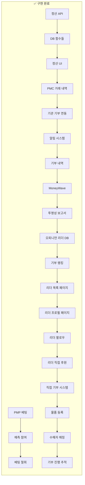
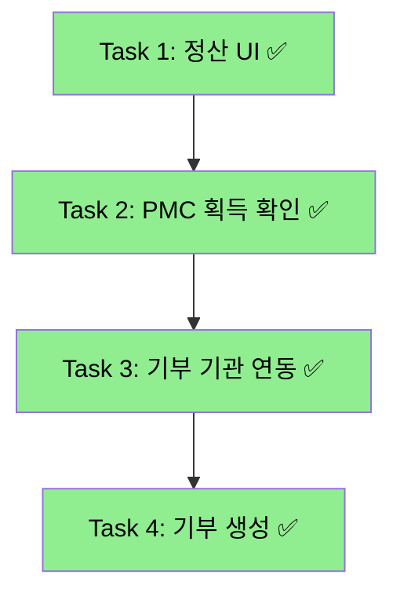
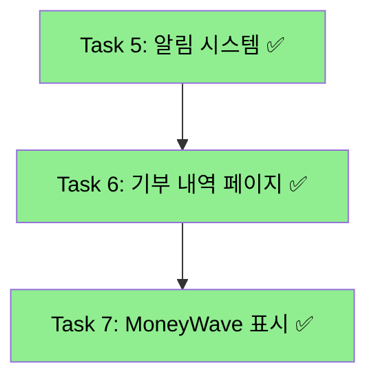
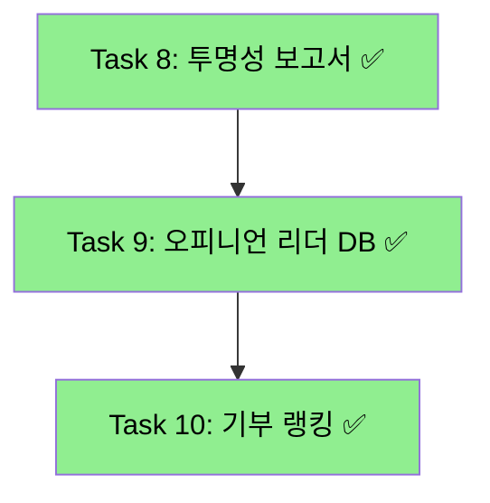
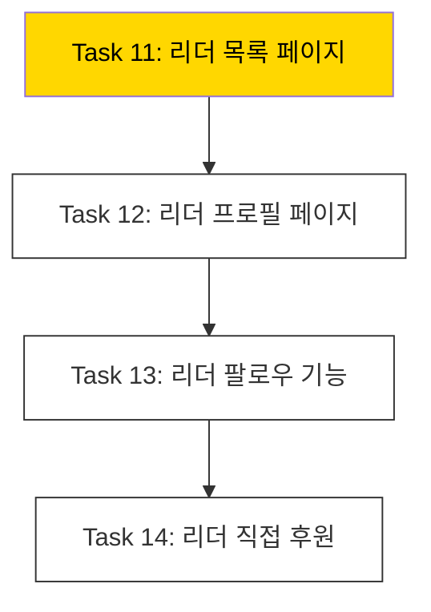
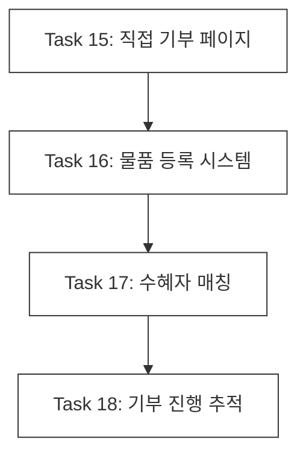

# Prediction → Donation 연계 태스크 목록

> **작성일**: 2025-11-27  
> **업데이트**: 2025-11-28 (Phase 5 완료! 🎉)
> **목적**: 예측(Prediction) 도메인과 기부(Donation) 도메인의 연계 구현 현황 파악 및 태스크 정의

---

## 📊 현황 분석 요약



### ✅ 이미 구현된 것들

| 영역 | 구현 내용 | 위치 | 상태 |
|------|----------|------|------|
| **auth-economy-sdk** | PMP/PMC 타입, 잔액 조회, 전송, 예측 보상 | `packages/auth-economy-sdk/src/economy/` | ✅ |
| **예측 베팅** | PMP 차감 + 예측 생성 | `[slug]/actions.ts` | ✅ |
| **베팅 철회** | PMP 환불 + is_active=false | `[slug]/actions.ts`, Server Action | ✅ |
| **정산 API** | POST `/api/predictions/games/[gameId]/settle` | `route.ts` | ✅ |
| **정산 UseCase** | `SettlePredictionGameUseCase` | `settle-prediction-game.use-case.ts` | ✅ |
| **DB 함수** | `settle_prediction_game()`, `settle_prediction()`, `grant_pmc()`, `calculate_reward_amount()` | Supabase | ✅ |
| **Donation DB** | `donation.*` 스키마 4개 테이블 | Supabase | ✅ |
| **Donation DDD** | Domain, Application, Infrastructure 레이어 | `bounded-contexts/donation/` | ✅ |
| **정산 UI** | 관리자 정답 선택 및 정산 실행 | `admin/predictions/[gameId]/settle/` | ✅ |
| **PMC 거래 내역** | 대시보드 거래 내역 표시 | `TransactionHistory.tsx` | ✅ |
| **기부 기관 연동** | 기관 목록 API + 페이지 | `donation/institute/` | ✅ |
| **기부 생성** | PMC 차감 + 기부 생성 API | `api/donation/route.ts` | ✅ |
| **알림 시스템** | Toast 알림 Provider + Hook | `shared/ui/components/feedback/Toast.tsx` | ✅ |
| **기부 내역** | 내 기부 내역 조회 페이지 | `donation/history/` | ✅ |
| **MoneyWave** | 대시보드 MoneyWave 시각화 | `MoneyWaveDashboard.tsx` | ✅ |
| **투명성 보고서** | 기관별 기부금 사용 내역 | `transparency_reports` 연동 | ✅ |
| **오피니언 리더 DB** | 리더 테이블 + 후원 연결 | `donation.opinion_leaders` | ✅ |
| **기부 랭킹** | 리더보드 + 배지 시스템 | `DonationLeaderboard.tsx` | ✅ |
| **오피니언 리더 목록** | 카테고리 필터 + 정렬 | `donation/opinion-leader/` | ✅ **NEW** |
| **리더 프로필 페이지** | 리더 상세 + 추천 기관 목록 | `donation/opinion-leader/[leaderId]/` | ✅ **NEW** |
| **리더 팔로우 기능** | 팔로우/언팔로우 API | `api/donation/opinion-leader/follow/` | ✅ **NEW** |
| **리더 직접 후원** | PMC 후원 API + 모달 UI | `api/donation/opinion-leader/support/` | ✅ **NEW** |

### ✅ Phase 4 완료! - 오피니언 리더 완성

| 영역 | 상태 | 설명 |
|------|------|------|
| **오피니언 리더 목록 페이지** | ✅ | `/donation/opinion-leader` 페이지 |
| **리더 프로필 페이지** | ✅ | 리더 상세 정보 + 후원 기관 목록 |
| **리더 팔로우 기능** | ✅ | 팔로우/언팔로우 + 팔로잉 리스트 |
| **리더 직접 후원** | ✅ | 리더에게 PMC 직접 후원 |

### ✅ Phase 5 완료! - 직접 기부 시스템 🎉

| 영역 | 상태 | 설명 |
|------|------|------|
| **직접 기부 페이지** | ✅ | `/donation/direct` 물품 기부 메인 페이지 |
| **물품 등록 시스템** | ✅ | 물품 등록 API, 카테고리/상태 선택 |
| **수혜자 매칭** | ✅ | 카테고리+지역 기반 매칭 알고리즘 |
| **기부 진행 추적** | ✅ | 내 기부 내역, 매칭 상태 추적, 완료 확인 |

---

## 🎯 태스크 목록 (우선순위순)

### Phase 1: 핵심 기능 완성 ✅ COMPLETED



#### Task 1: 예측 게임 정산 UI 구현 ✅ COMPLETED
- **파일**: `apps/posmul-web/src/app/admin/predictions/[gameId]/settle/page.tsx`
- **작업 내용**:
  - [x] 관리자 전용 정산 페이지 생성
  - [x] 게임 옵션 목록 표시 (정답 선택용)
  - [x] 참여자 현황 표시
  - [x] 정답 선택 후 정산 실행 버튼
  - [x] 정산 결과 표시 (승자/패자 수, 총 보상액)
- **연관 API**: `POST /api/predictions/games/[gameId]/settle`
- **완료일**: 2025-11-27

#### Task 2: PMC 획득 내역 UI 구현 ✅ COMPLETED
- **파일**: `apps/posmul-web/src/bounded-contexts/economy/presentation/components/TransactionHistory.tsx`
- **작업 내용**:
  - [x] `economy.pmp_pmc_transactions` 조회 API (`/api/economy/transactions`)
  - [x] PMC 획득/사용 내역 리스트 표시
  - [x] 거래 타입별 아이콘 및 색상 구분
  - [x] 대시보드에 컴포넌트 추가
- **완료일**: 2025-11-27

#### Task 3: 기부 기관 목록 실제 연동 ✅ COMPLETED
- **파일**: 
  - `apps/posmul-web/src/app/donation/institute/page.tsx`
  - `apps/posmul-web/src/app/api/donation/institutes/route.ts`
- **작업 내용**:
  - [x] `donation.donation_institutes` 조회 API 생성
  - [x] 기관 목록 페이지에서 실제 DB 데이터 표시
  - [x] 시드 데이터 추가 (세이브더칠드런, 유니세프 등 8개 기관)
  - [x] 카테고리 필터링 기능
- **완료일**: 2025-11-27

#### Task 4: 기부 생성 Server Action 구현 ✅ COMPLETED
- **파일**: `apps/posmul-web/src/app/api/donation/route.ts`
- **작업 내용**:
  - [x] 기부 생성 API (POST `/api/donation`)
  - [x] PMC 잔액 확인 및 차감
  - [x] `donation.donations` 레코드 생성
  - [x] 거래 내역 기록 (`economy.pmp_pmc_transactions`)
  - [x] 에러 핸들링 (잔액 부족 등)
- **완료일**: 2025-11-27

---

### Phase 2: UX 개선 ✅ COMPLETED



#### Task 5: 알림 시스템 (Toast) ✅ COMPLETED
- **파일**: `apps/posmul-web/src/shared/ui/components/feedback/Toast.tsx`
- **작업 내용**:
  - [x] Toast Provider 및 Context 생성
  - [x] 다양한 토스트 타입 (success, error, warning, info, pmc-reward, pmp-reward)
  - [x] 애니메이션 효과 (slide-in, progress bar)
  - [x] Layout에 ToastProvider 추가
  - [x] 기부 상세 페이지에 Toast 적용
- **완료일**: 2025-11-27

#### Task 6: 기부 내역 페이지 연동 ✅ COMPLETED
- **파일**: 
  - `apps/posmul-web/src/app/donation/history/page.tsx`
  - `apps/posmul-web/src/app/donation/history/client.tsx`
- **작업 내용**:
  - [x] 내 기부 내역 조회 (donation.donations 테이블)
  - [x] 카테고리/상태 필터링
  - [x] 통계 표시 (총 기부 횟수, 금액, 후원 기관 수)
  - [x] 증명서 발급 버튼 (UI만)
- **완료일**: 2025-11-27

#### Task 7: 대시보드 MoneyWave 표시 ✅ COMPLETED
- **파일**: 
  - `apps/posmul-web/src/bounded-contexts/economy/presentation/components/MoneyWaveDashboard.tsx`
  - `apps/posmul-web/src/app/api/economy/moneywave/route.ts`
- **작업 내용**:
  - [x] MoneyWave 3단계 시각화 (균등 분배, 활동 보상, 기여 보상)
  - [x] 내 수령 내역 표시
  - [x] 최근 Wave 히스토리
  - [x] 대시보드에 컴포넌트 추가
- **완료일**: 2025-11-27

---

### Phase 3: 고도화 ✅ COMPLETED



#### Task 8: 기부 투명성 보고서 ✅ COMPLETED
- **파일**: 
  - `apps/posmul-web/src/app/donation/institute/[instituteId]/page.tsx`
  - `apps/posmul-web/src/app/donation/institute/[instituteId]/client.tsx`
- **작업 내용**:
  - [x] `economy.transparency_reports` 테이블 연동
  - [x] 기관 상세 페이지 투명성 탭에 실제 데이터 표시
  - [x] 사용 내역 비율 프로그레스 바 차트
  - [x] 주요 성과 지표 (수혜자, 프로젝트, 성공률)
  - [x] 샘플 데이터 추가 (굿네이버스 2024 Q4)
- **완료일**: 2025-11-28

#### Task 9: 오피니언 리더 DB 및 기관 연동 ✅ COMPLETED
- **생성된 테이블**:
  - `donation.opinion_leaders` - 오피니언 리더 정보
  - `donation.opinion_leader_endorsements` - 리더-기관 후원 연결
  - `donation.opinion_leader_followers` - 팔로우 관계
- **작업 내용**:
  - [x] 오피니언 리더 테이블 생성 (Migration)
  - [x] RLS 정책 적용
  - [x] 기관 상세 페이지에 후원 오피니언 리더 섹션 추가
  - [x] 리더 프로필 카드 (아바타, 인증 배지, 팔로워 수)
  - [x] 후원 메시지 표시
  - [x] 샘플 리더 데이터 추가
- **완료일**: 2025-11-28

#### Task 10: 기부 랭킹 시스템 ✅ COMPLETED
- **파일**:
  - `apps/posmul-web/src/bounded-contexts/donation/presentation/components/DonationLeaderboard.tsx`
  - `apps/posmul-web/src/app/api/donation/leaderboard/route.ts`
  - `apps/posmul-web/src/app/donation/page.tsx`
- **작업 내용**:
  - [x] 리더보드 컴포넌트 생성 (Top 3 하이라이트 + 전체 랭킹)
  - [x] 기간별 탭 (전체/이번 달/이번 주)
  - [x] 기부 레벨 배지 시스템 (브론즈~다이아몬드)
  - [x] 리더보드 API (`GET /api/donation/leaderboard`)
  - [x] 본인 순위 표시
  - [x] 기부 메인 페이지에 리더보드 통합
- **완료일**: 2025-11-28

---

### Phase 4: 오피니언 리더 완성 🔄 IN PROGRESS



#### Task 11: 오피니언 리더 목록 페이지 🔄 IN PROGRESS
- **파일**: 
  - `apps/posmul-web/src/app/donation/opinion-leader/page.tsx`
  - `apps/posmul-web/src/app/donation/opinion-leader/client.tsx`
- **작업 내용**:
  - [ ] 오피니언 리더 목록 서버 컴포넌트
  - [ ] 카테고리별 필터링 (환경, 복지, 과학, 인권, 교육)
  - [ ] 인기순/팔로워순 정렬
  - [ ] 리더 카드 (프로필, 소개, 팔로워 수, 후원 기관)
- **예상 시간**: 2시간

#### Task 12: 오피니언 리더 프로필 페이지
- **파일**: 
  - `apps/posmul-web/src/app/donation/opinion-leader/[leaderId]/page.tsx`
  - `apps/posmul-web/src/app/donation/opinion-leader/[leaderId]/client.tsx`
- **작업 내용**:
  - [ ] 리더 프로필 상세 정보
  - [ ] 후원 중인 기관 목록
  - [ ] 활동 히스토리
  - [ ] 팔로우 버튼
- **예상 시간**: 2시간

#### Task 13: 리더 팔로우 기능
- **파일**: 
  - `apps/posmul-web/src/app/api/donation/opinion-leader/follow/route.ts`
- **작업 내용**:
  - [ ] 팔로우/언팔로우 API
  - [ ] 팔로우 버튼 UI
  - [ ] 내가 팔로우하는 리더 목록
  - [ ] 팔로워 수 실시간 업데이트
- **예상 시간**: 1.5시간

#### Task 14: 리더 직접 후원
- **파일**: 
  - `apps/posmul-web/src/app/api/donation/opinion-leader/support/route.ts`
- **작업 내용**:
  - [ ] 리더에게 PMC 직접 후원 API
  - [ ] 후원 모달 UI
  - [ ] 후원 메시지 기능
  - [ ] 후원 내역 표시
- **예상 시간**: 2시간

---

### Phase 5: 직접 기부 시스템 (예정)



#### Task 15: 직접 기부 페이지
- **작업 내용**:
  - [ ] `/donation/direct` 물품 기부 메인 페이지
  - [ ] 카테고리별 물품 목록 (의류, 식품, 주거, 의료, 교육)
- **예상 시간**: 2시간

#### Task 16: 물품 등록 시스템
- **작업 내용**:
  - [ ] 기부 물품 등록 폼
  - [ ] 이미지 업로드
  - [ ] 물품 상태 선택
- **예상 시간**: 3시간

#### Task 17: 수혜자 매칭
- **작업 내용**:
  - [ ] 수혜자 목록 페이지
  - [ ] 물품-수혜자 매칭 알고리즘
  - [ ] 매칭 승인 프로세스
- **예상 시간**: 4시간

#### Task 18: 기부 진행 추적
- **작업 내용**:
  - [ ] 기부 진행 상태 표시
  - [ ] 수혜자 피드백 시스템
  - [ ] 기부 완료 증명서
- **예상 시간**: 2시간

---

## 📁 주요 파일 위치

```
posmul/
├── packages/
│   └── auth-economy-sdk/
│       └── src/economy/
│           ├── services/supabase-economy.service.ts  # ✅ 경제 서비스
│           └── types/index.ts                         # ✅ PMP/PMC 타입
├── apps/posmul-web/src/
│   ├── bounded-contexts/
│   │   ├── prediction/
│   │   │   └── application/use-cases/
│   │   │       └── settle-prediction-game.use-case.ts  # ✅ 정산 UseCase
│   │   ├── donation/
│   │   │   ├── domain/                                  # ✅ 도메인 레이어
│   │   │   ├── application/                             # ✅ 어플리케이션 레이어
│   │   │   ├── infrastructure/                          # ✅ 인프라 레이어
│   │   │   └── presentation/actions.ts                  # ⚠️ 미사용 (API 대신)
│   │   └── economy/
│   │       └── presentation/components/
│   │           └── TransactionHistory.tsx               # ✅ NEW 거래 내역
│   ├── app/
│   │   ├── admin/predictions/[gameId]/settle/
│   │   │   ├── page.tsx                                # ✅ NEW 정산 서버 컴포넌트
│   │   │   └── client.tsx                              # ✅ NEW 정산 클라이언트
│   │   ├── prediction/sports/soccer/[slug]/
│   │   │   └── actions.ts                              # ✅ 베팅/철회
│   │   ├── donation/
│   │   │   ├── page.tsx                                # ✅ 기부 메인
│   │   │   └── institute/
│   │   │       ├── page.tsx                            # ✅ NEW 기관 기부 서버
│   │   │       └── client.tsx                          # ✅ NEW 기관 기부 클라이언트
│   │   ├── api/
│   │   │   ├── predictions/games/[gameId]/settle/
│   │   │   │   └── route.ts                            # ✅ 정산 API
│   │   │   ├── economy/transactions/
│   │   │   │   └── route.ts                            # ✅ NEW 거래 내역 API
│   │   │   └── donation/
│   │   │       ├── route.ts                            # ✅ NEW 기부 생성/조회 API
│   │   │       └── institutes/route.ts                 # ✅ NEW 기관 목록 API
│   │   └── dashboard/
│   │       └── page.tsx                                # ✅ 대시보드 (거래 내역 추가됨)
```

---

## 🔧 DB 함수 요약

| 함수명 | 역할 | 상태 |
|--------|------|------|
| `settle_prediction_game(game_id, correct_option_id)` | 게임 전체 정산 | ✅ |
| `settle_prediction(prediction_id, is_winner, reward_amount)` | 개별 예측 정산 | ✅ |
| `calculate_reward_amount(prediction_id, correct_option_id)` | 보상 금액 계산 | ✅ |
| `grant_pmc(user_id, amount, description, source)` | PMC 지급 | ✅ |
| `grant_pmp(user_id, amount, reason)` | PMP 지급 | ✅ |

---

## 🚀 권장 실행 순서

```mermaid
gantt
    title Prediction → Donation 연계 구현 일정
    dateFormat  YYYY-MM-DD
    section Phase 1 ✅
    Task 1-4: 핵심 기능     :done, t1, 2025-11-27, 1d
    section Phase 2 ✅
    Task 5-7: UX 개선       :done, t2, 2025-11-27, 1d
    section Phase 3 ✅
    Task 8-10: 고도화       :done, t3, 2025-11-28, 1d
    section Phase 4 🔄
    Task 11-14: 오피니언 리더  :active, t4, 2025-11-28, 2d
    section Phase 5 ⏳
    Task 15-18: 직접 기부   :t5, 2025-11-30, 3d
```

**현재 진행**: **Phase 4 - Task 11 (오피니언 리더 목록 페이지)**

---

## ✅ 완료된 작업 요약

### Phase 1 + Phase 2 완료 (2025-11-27)

**새로 생성된 파일:**
1. `admin/predictions/[gameId]/settle/page.tsx` - 정산 서버 컴포넌트
2. `admin/predictions/[gameId]/settle/client.tsx` - 정산 클라이언트 컴포넌트
3. `api/economy/transactions/route.ts` - 거래 내역 조회 API
4. `economy/presentation/components/TransactionHistory.tsx` - 거래 내역 UI
5. `donation/institute/page.tsx` - 기관 기부 서버 컴포넌트
6. `donation/institute/client.tsx` - 기관 기부 클라이언트 컴포넌트
7. `donation/institute/[instituteId]/page.tsx` - 기관 상세 서버 컴포넌트
8. `donation/institute/[instituteId]/client.tsx` - 기관 상세 클라이언트 컴포넌트
9. `api/donation/route.ts` - 기부 생성/조회 API
10. `api/donation/institutes/route.ts` - 기관 목록 조회 API
11. `shared/ui/components/feedback/Toast.tsx` - Toast 알림 시스템
12. `donation/history/page.tsx` - 기부 내역 서버 컴포넌트
13. `donation/history/client.tsx` - 기부 내역 클라이언트 컴포넌트
14. `economy/presentation/components/MoneyWaveDashboard.tsx` - MoneyWave 대시보드
15. `api/economy/moneywave/route.ts` - MoneyWave API

### Phase 3 완료 (2025-11-28)

**새로 생성된 파일/테이블:**
1. `api/donation/leaderboard/route.ts` - 기부 리더보드 API
2. `bounded-contexts/donation/presentation/components/DonationLeaderboard.tsx` - 리더보드 컴포넌트
3. `donation.opinion_leaders` 테이블 - 오피니언 리더 정보
4. `donation.opinion_leader_endorsements` 테이블 - 리더-기관 후원 연결
5. `donation.opinion_leader_followers` 테이블 - 팔로우 관계
6. `economy.transparency_reports` 샘플 데이터 추가

**수정된 파일:**
1. `donation/institute/[instituteId]/page.tsx` - 투명성 보고서 + 오피니언 리더 연동
2. `donation/institute/[instituteId]/client.tsx` - 투명성 탭 실제 데이터 표시 + 리더 섹션
3. `donation/page.tsx` - 리더보드 컴포넌트 추가

### Phase 4 완료 (2025-11-28) 🎉

**새로 생성된 파일:**
1. `donation/opinion-leader/page.tsx` - 오피니언 리더 목록 서버 컴포넌트
2. `donation/opinion-leader/client.tsx` - 리더 목록 클라이언트 (검색, 필터, 정렬)
3. `donation/opinion-leader/[leaderId]/page.tsx` - 리더 프로필 서버 컴포넌트
4. `donation/opinion-leader/[leaderId]/client.tsx` - 프로필 클라이언트 (팔로우, 후원 모달)
5. `api/donation/opinion-leader/follow/route.ts` - 팔로우/언팔로우 API
6. `api/donation/opinion-leader/support/route.ts` - 직접 후원 API

**DB 변경:**
- `donation.opinion_leaders` 테이블에 `category` 컬럼 추가 (environment, welfare, science, human_rights, education, health, culture, economy, general)
- 5명의 샘플 오피니언 리더 추가 (강건강, 정교육, 박환경, 이과학, 최인권)
- 리더별 endorsement 연결 데이터 추가

**구현된 기능:**
- ✅ 오피니언 리더 목록 페이지 (카테고리 필터, 팔로워순/기부영향력순 정렬, 검색)
- ✅ 리더 프로필 페이지 (상세 정보, 추천 기관 목록, 소셜 링크)
- ✅ 팔로우/언팔로우 기능 (팔로워 카운트 자동 업데이트)
- ✅ 직접 후원 기능 (PMC 전송, 응원 메시지, 기부 기록 생성)

### 추가된 DB 데이터 (Phase 3)
- `economy.transparency_reports`: 굿네이버스 2024 Q4 보고서
- `donation.opinion_leaders`: 김선행 (샘플 리더)
- `donation.opinion_leader_endorsements`: 리더→기관 후원 연결 3건

---

## 📝 참고사항

### 정산 플로우 (구현 완료)
```
관리자가 정답 설정 → settle API 호출 → DB 함수 실행
→ 승자: PMC 획득 (economy.pmp_pmc_accounts)
→ 패자: PMP 소각 (거래 기록만)
→ 게임 상태: SETTLED
```

### 기부 플로우 (구현 완료)
```
사용자가 PMC로 기부 → PMC 차감 → donation.donations 생성
→ Toast 알림 표시 → 기부 내역 페이지에서 확인 가능
```

### 오피니언 리더 후원 플로우 (NEW - Phase 4)
```
리더 프로필 방문 → 직접 후원 버튼 클릭 → 금액/메시지 입력
→ PMC 차감 (후원자) → PMC 증가 (리더) → donation 기록 생성
→ 리더 total_donations_influenced 업데이트
```

### MoneyWave 플로우 (UI 구현 완료, 실행 로직은 별도)
```
Wave1: 균등 분배 → 전체 활성 사용자
Wave2: 활동 보상 → 활동 점수 비례
Wave3: 기여 보상 → 핵심 기여자
```

---

*Last Updated: 2025-11-28 (Phase 4 완료! 🎉)*
