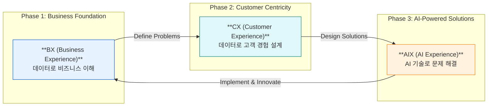
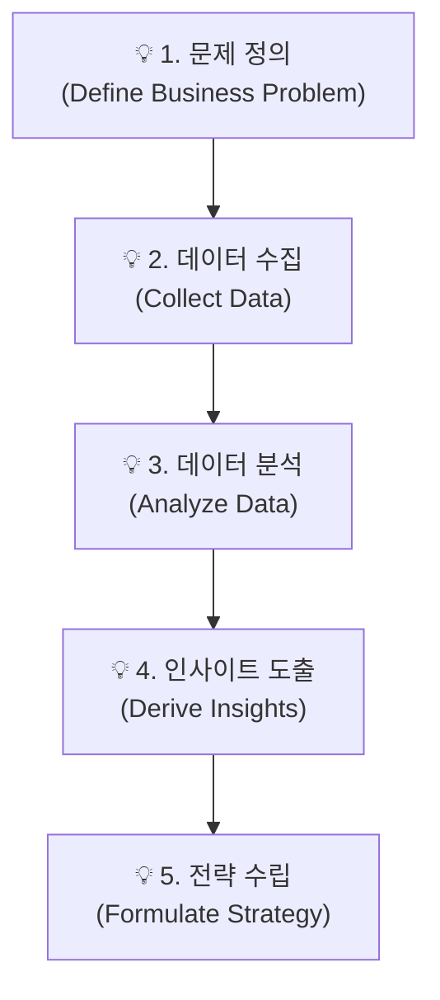
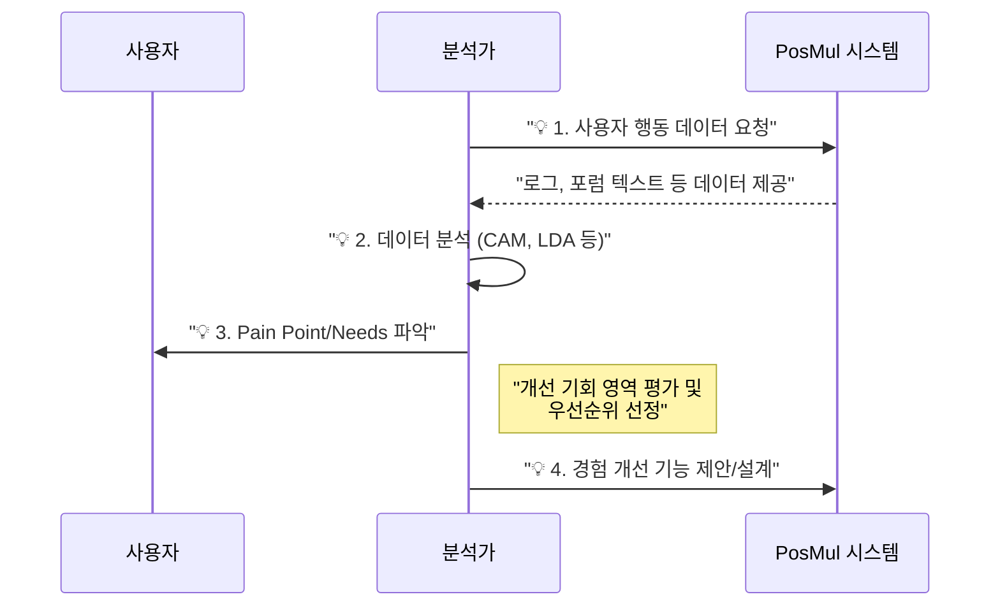
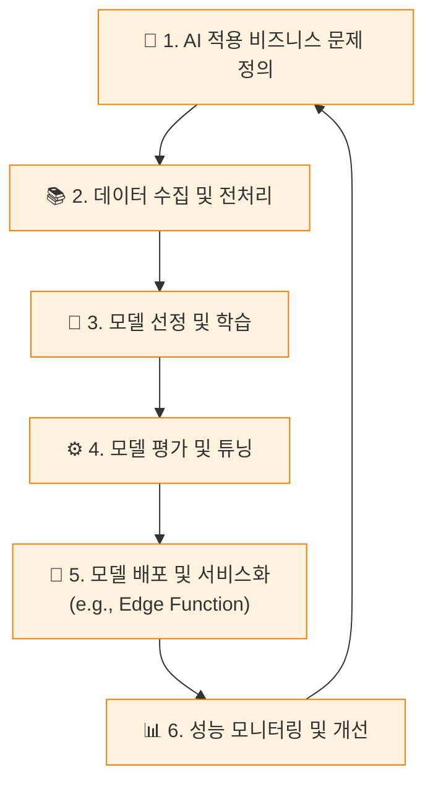

---
type: tutorial
title: "LG전자 DX School 커리큘럼 기반 PosMul 역량 강화 가이드"
description: "LG전자 DX School의 데이터 중심 문제 해결 방법론을 PosMul 프로젝트에 적용하기 위한 체계적인 자가 학습 가이드입니다. BX, CX, AIX 3단계 학습 로드맵을 제공합니다."
difficulty: intermediate
last_updated: "2024-07-28"
tags: [learning-guide, data-analysis, dx, cx, aix, self-study, career-development]
---

# LG전자 DX School 커리큘럼 기반 PosMul 역량 강화 가이드

> **"데이터를 이해하고, 고객을 경험하며, AI로 해결하는 능력을 기릅니다."**

이 문서는 LG전자 DX School의 우수한 커리큘럼을 기반으로, PosMul 프로젝트 팀원들이 데이터 중심의 문제 해결 역량을 체계적으로 강화할 수 있도록 설계된 자가 학습 가이드입니다. 각 단계는 실제 PosMul 프로젝트의 도메인과 연계된 실습 과제를 포함하여, 학습 효과를 극대화하는 것을 목표로 합니다.

## 🎯 이 가이드의 목표

-   **데이터 기반 의사결정 능력 향상**: PosMul의 다양한 데이터를 활용하여 비즈니스 문제를 정의하고 해결하는 능력을 배양합니다.
-   **고객 중심 서비스 설계**: 사용자의 경험 데이터를 분석하여 실제 가치를 창출하는 서비스를 기획하고 설계하는 방법을 학습합니다.
-   **AI 기술 적용 능력 확보**: 인공지능 기술을 이해하고, 이를 PosMul 프로젝트에 적용하여 혁신적인 기능을 구현하는 기반을 마련합니다.

## 🗺️ 전체 학습 로드맵 (Overall Learning Roadmap)

본 가이드는 3단계의 점진적 학습 과정으로 구성되어 있으며, 각 단계는 이전 단계의 결과물을 바탕으로 더 깊이 있는 역량을 요구합니다.

---

## 1단계: BX (Business Experience) - 데이터로 비즈니스 이해하기

이 단계에서는 비즈니스의 방향성을 데이터 관점에서 이해하고, 문제를 정의하는 기본적인 역량을 기릅니다.

-   **학습 목표**:
    -   데이터 수집, 분석, 시각화 등 단위 기술에 대한 이해도를 높입니다.
    -   데이터 기반의 문제 정의 및 해결 프로세스를 습득합니다.

### 세부 커리큘럼 및 PosMul 적용 방안

1.  **데이터 관리 및 전략 수립**:
    -   **학습 내용**: 데이터베이스 개론 (RDBMS vs NoSQL), 데이터 모델링, 데이터 확보/관리/분석 전략.
    -   **PosMul 적용**: PosMul의 Supabase (PostgreSQL) 스키마를 분석하고, `economy-kernel`과 각 `bounded-context`의 데이터 관계를 이해합니다. 사용자의 어떤 데이터를 추가로 확보해야 가치 있을지 전략을 수립해 봅니다.
2.  **데이터 수집 및 시각화**:
    -   **학습 내용**: Python 프로그래밍, 통계 기반 데이터 분석, 웹 크롤링을 활용한 데이터 수집.
    -   **PosMul 적용**: Python을 사용하여 외부 스포츠 경기 결과나 커뮤니티의 여론 데이터를 크롤링하고, 이를 PosMul의 신규 예측 게임 생성에 활용하는 방안을 구상합니다.

### 📈 BX 단계 워크플로

### 🛠️ Mini-Project 제안

> **"PosMul 신규 예측 게임 카테고리(예: e-Sports) 도입 타당성 분석 보고서 작성"**
>
> -   외부 데이터를 수집하여 시장 규모와 사용자 관심도를 분석합니다.
> -   내부 사용자 데이터를 기반으로 잠재 참여율을 예측합니다.
> -   분석 결과를 바탕으로 신규 카테고리 도입에 대한 전략적 제언을 합니다.

---

## 2단계: CX (Customer Experience) - 고객 경험 중심으로 생각하기

이 단계에서는 수집된 데이터를 바탕으로 고객을 깊이 이해하고, 실제 사용자의 경험을 개선할 기회를 찾는 데 집중합니다.

-   **학습 목표**:
    -   고객 경험 데이터 분석 및 기획 능력을 향상합니다.
    -   데이터를 기반으로 신규 가치를 분석하고 설계하는 능력을 습득합니다.

### 세부 커리큘럼 및 PosMul 적용 방안

1.  **데이터 분석 및 기획**:
    -   **학습 내용**: 지도/비지도 학습, 텍스트 경험 데이터 전처리(Word2Vec, LDA 등), 고객 행동 맵(CAM) 도출.
    -   **PosMul 적용**: `Forum` 바운디드 컨텍스트의 게시글, 댓글 데이터를 자연어 처리 기술로 분석하여 사용자들이 주로 논의하는 주제(Topic Modeling)와 핵심 행위자(Actor)를 도출합니다.
2.  **신규 가치 분석 및 설계**:
    -   **학습 내용**: 중요도-만족도 분석(IPA), 개선 우선순위 선정.
    -   **PosMul 적용**: 분석된 사용자들의 Pain Point를 기반으로, 어떤 기능을 개선하거나 추가해야 만족도를 높일 수 있을지 우선순위를 정하고 구체적인 개선안을 설계합니다.

### 🔄 CX 단계 워크플로 (DCX: Data-driven Customer Experience)

### 🛠️ Mini-Project 제안

> **"PosMul 포럼 데이터를 활용한 사용자 참여도 증진 및 경험 개선 방안 도출"**
>
> -   LDA, Word2Vec 등을 사용하여 포럼의 주요 토픽과 사용자 그룹을 식별합니다.
> -   사용자 행동 흐름(CAM)을 분석하여 이탈 지점이나 불편 사항을 파악합니다.
> -   데이터 기반의 UI/UX 개선안 또는 신규 기능(예: 인기 토픽 요약봇)을 제안합니다.

---

## 3단계: AIX (AI eXperience) - AI로 문제 해결하기

마지막 단계에서는 AI 기술을 본격적으로 활용하여 이전 단계에서 정의한 문제를 해결하고, 새로운 가치를 창출하는 방법을 학습합니다.

-   **학습 목표**:
    -   AI 단위 기술(ML/DL/NLP)에 대한 이해도를 높입니다.
    -   AI를 활용하여 비즈니스 문제를 해결하는 능력을 향상합니다.

### 세부 커리큘럼 및 PosMul 적용 방안

1.  **AI 서비스 기획**:
    -   **학습 내용**: AI 비즈니스 모델 수립, AI 기반 서비스 기획.
    -   **PosMul 적용**: PosMul 예측 게임의 승률을 예측하거나, 사용자에게 맞춤형 투자 상품을 추천하는 AI 서비스를 기획합니다.
2.  **AI 기술 및 적용**:
    -   **학습 내용**: 머신러닝/딥러닝 모델링, 하이퍼파라미터 튜닝.
    -   **PosMul 적용**: 과거 예측 게임 데이터와 사용자 참여 기록을 바탕으로 실제 예측 모델을 구축하고 성능을 평가합니다.
3.  **AI 플랫폼 활용**:
    -   **학습 내용**: 클라우드 AI 서비스(AWS, GCP, Azure) 활용.
    -   **PosMul 적용**: 개발한 모델을 Vercel의 Edge Function이나 Supabase의 외부 함수 호출 기능을 통해 실제 서비스와 연동하는 아키텍처를 설계합니다.

### 🤖 AIX 단계 워크플로

### 🛠️ Final Project 제안

> **"PosMul 예측 게임 결과를 예측하는 AI 모델 개발 및 PoC(Proof of Concept)"**
>
> -   과거 데이터를 수집하여 모델 학습에 적합한 형태로 가공합니다.
> -   다양한 ML 모델(e.g., Logistic Regression, XGBoost, etc.)을 학습시키고 가장 성능이 좋은 모델을 선택합니다.
> -   선택된 모델을 API로 노출시키고, 프런트엔드에서 특정 게임에 대한 예측 결과를 보여주는 간단한 화면을 개발합니다.

## 맺음말

이 가이드를 통해 PosMul 팀원 모두가 데이터를 무기로 비즈니스를 이해하고, 고객을 위한 가치를 창출하며, AI 기술로 혁신을 이끄는 'DX 전문가'로 성장하기를 기대합니다. 이 학습 여정은 PosMul 프로젝트를 한 단계 더 높은 수준으로 발전시키는 핵심 동력이 될 것입니다. 