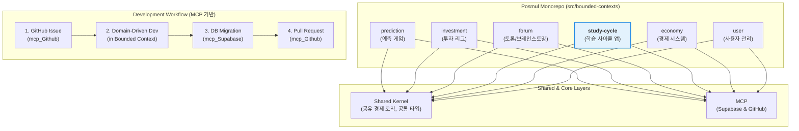
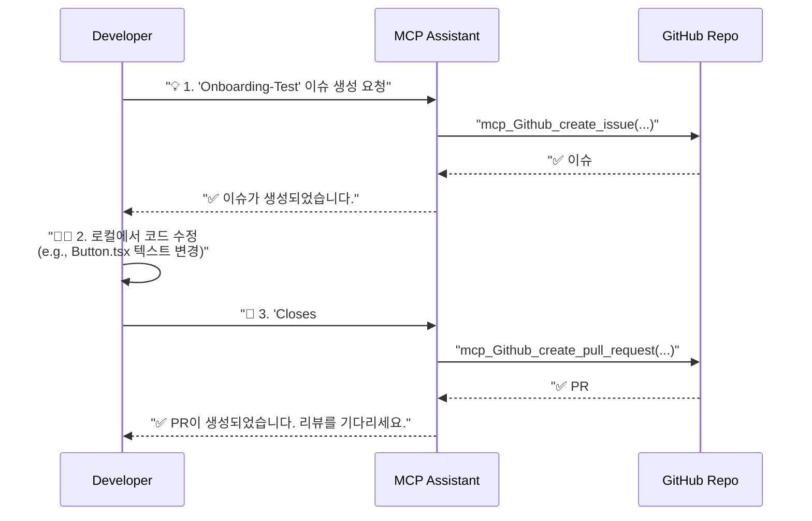

# 📚 PosMul 신규 개발자 온보딩 튜토리얼

> **목표**: PosMul 프로젝트의 개발 철학을 이해하고, MCP 기반의 자동화된 개발 워크플로우를 통해 첫 기여를 성공적으로 완료합니다.

## 📚 목차 (Table of Contents)

- [🎯 학습 목표](#-학습-목표)
- [🛠️ 사전 준비사항](#️-사전-준비사항)
- [📖 단계별 가이드](#-단계별-가이드)
  - [1단계: 개발 환경 설정 (15분)](#1단계-개발-환경-설정-15분)
  - [2단계: PosMul 아키텍처 이해 (10분)](#2단계-posmul-아키텍처-이해-10분)
  - [3단계: MCP 기반 첫 기여 실습 (20분)](#3단계-mcp-기반-첫-기여-실습-20분)
- [✅ 완료 확인](#-완료-확인)
- [🚀 다음 단계](#-다음-단계)
- [🆘 문제 해결](#-문제-해결)

## 🎯 학습 목표

이 튜토리얼을 완료하면 다음을 할 수 있게 됩니다:

- [ ] **PosMul 아키텍처 이해**: 모노레포, DDD, Clean Architecture, 그리고 경제 시스템(PMP/PMC)의 역할을 설명할 수 있습니다.
- [ ] **개발 환경 구축**: 로컬 환경에서 PosMul 프로젝트를 실행하고 테스트할 수 있습니다.
- [ ] **MCP 워크플로우 수행**: `mcp_Github` 도구를 사용하여 이슈 생성부터 PR 제출까지의 전체 개발 사이클을 직접 수행할 수 있습니다.

## 🛠️ 사전 준비사항

### 필수 요구사항

- **도구**: Git, Node.js v20 이상, npm
- **계정**: GitHub, Supabase
- **OS**: Windows (PowerShell 7+ 권장)
- **IDE**: Cursor 또는 VS Code

### 설치 확인

PowerShell에서 다음 명령어로 준비상태를 확인하세요:

```powershell
git --version; node --version; npm --version
```

**예상 출력 (버전은 다를 수 있습니다):**

```
git version 2.44.0.windows.1
v20.11.1
10.2.4
```

> ⚠️ **주의**: 명령어 실행에 실패하거나 버전이 너무 낮으면 각 도구의 공식 사이트에서 최신 버전을 설치해주세요.

## 📖 단계별 가이드

### 1단계: 개발 환경 설정 (15분)

**목표**: 로컬 컴퓨터에서 PosMul 프로젝트를 실행할 수 있도록 설정합니다.

1.  **프로젝트 클론**: 원하는 위치에 프로젝트를 복제합니다.

    ```powershell
    # 예: C:\G\ 디렉토리에 클론
    cd C:\G\
    git clone https://github.com/your-username/posmul.git
    cd posmul
    ```

2.  **의존성 설치**: 프로젝트에 필요한 모든 패키지를 설치합니다.

    ```powershell
    npm install
    ```

3.  **환경 변수 설정**: `.env.local` 파일을 생성하고 Supabase 관련 키를 입력합니다. 이 키들은 Supabase 프로젝트 대시보드에서 찾을 수 있습니다.

    ```
    # .env.local 파일 예시
    SUPABASE_URL="YOUR_SUPABASE_URL"
    SUPABASE_ANON_KEY="YOUR_SUPABASE_ANON_KEY"
    SUPABASE_PROJECT_ID="YOUR_SUPABASE_PROJECT_ID"
    ```

4.  **개발 서버 실행**: 프로젝트를 로컬에서 실행합니다.

    ```powershell
    npm run dev
    ```

**확인하기**: 브라우저에서 `http://localhost:3000`으로 접속했을 때 PosMul 애플리케이션이 보이면 성공입니다.

### 2단계: PosMul 아키텍처 이해 (10분)

**목표**: PosMul의 모노레포 구조, 핵심 아키텍처, 그리고 개발 워크플로우를 이해합니다.

PosMul은 여러 비즈니스 도메인을 하나의 저장소에서 관리하는 **모노레포(Monorepo)** 구조를 채택했습니다. 아키텍처의 핵심은 **DDD(도메인 주도 설계)**와 **Clean Architecture**이며, 모든 외부 연동은 **MCP(Model Context Protocol)**를 통해 이루어집니다.

이 구조는 각 비즈니스 도메인, 즉 **경계 컨텍스트(Bounded Context)**의 독립성을 보장하면서도, 공유 경제 시스템(`PMP/PMC`)과 같은 핵심 로직은 일관되게 유지하도록 돕습니다.



이 다이어그램에서 볼 수 있듯, `prediction`, `investment`, 그리고 **`study-cycle`**과 같은 주요 애플리케이션들이 각자의 경계 컨텍스트 내에서 개발됩니다. 이들은 모두 공유 커널(Shared Kernel)의 자원을 활용하며, 모든 개발 과정은 MCP 기반의 표준 워크플로우를 따릅니다.

### 3단계: MCP 기반 첫 기여 실습 (20분)

**목표**: MCP 도구를 사용하여 실제 개발 워크플로우를 체험하고 첫 번째 기여를 만듭니다.

이제 간단한 UI 텍스트를 수정하는 작업을 통해 전체 과정을 경험해 보겠습니다.



#### 3.1 GitHub 이슈 생성 (MCP 사용)

AI 어시스턴트(Cursor 등)에게 다음처럼 요청하여 작업을 시작합니다.

> **(AI 어시스턴트에게 보낼 프롬프트)**
>
> `mcp_Github_create_issue`를 사용해서 PosMul 저장소에 다음 내용으로 이슈를 생성해줘:
>
> - **owner**: (당신의 GitHub 사용자명)
> - **repo**: posmul
> - **title**: "Onboarding: Update shared button component"
> - **body**: "This is a test issue for the new developer onboarding tutorial."
> - **labels**: ["good first issue", "documentation", "tutorial"]

#### 3.2 코드 수정

`src/shared/components/Button.tsx` 파일을 열어 `PosMul` 텍스트가 포함된 버튼을 찾아 `PosMul App`으로 수정합니다.

```tsx
// src/shared/components/Button.tsx

// ... 기존 코드 ...

// 예시: 아래와 같이 수정
<button>Click me on PosMul App</button>

// ... 기존 코드 ...
```

#### 3.3 Pull Request 생성 (MCP 사용)

이제 변경 사항을 제출할 차례입니다. 아까 생성한 이슈를 닫는 PR을 생성해달라고 요청합니다.

> **(AI 어시스턴트에게 보낼 프롬프트)**
>
> `mcp_Github_create_pull_request`를 사용해서 PosMul 저장소에 PR을 생성해줘:
>
> - **owner**: (당신의 GitHub 사용자명)
> - **repo**: posmul
> - **title**: "Feat: Update button text for onboarding"
> - **head**: (방금 작업한 브랜치명, 예: `feature/onboarding-text-update`)
> - **base**: main
> - **body**: "Updated button text as part of the onboarding tutorial. Closes #(아까 생성된 이슈 번호)"

## ✅ 완료 확인

다음 체크리스트로 학습 완료를 확인하세요:

- [ ] **환경 설정**: `npm run dev`로 프로젝트가 로컬에서 정상 실행됨
- [ ] **이슈 생성**: MCP를 통해 GitHub에 이슈가 생성됨
- [ ] **코드 수정**: `Button.tsx` 파일의 내용이 성공적으로 변경됨
- [ ] **PR 생성**: MCP를 통해 GitHub에 Pull Request가 생성되고, 이전 이슈와 연결됨

## 🚀 다음 단계

축하합니다! PosMul의 핵심 개발 워크플로우를 성공적으로 완료했습니다. 이제 더 복잡한 작업에 참여할 준비가 되었습니다.

1.  **Explanation**: [PosMul 종합 아키텍처 개요](../explanation/architecture/posmul-comprehensive-architecture-overview.md)
2.  **How-to 가이드**: [How to: 기존 도메인에 새 엔티티 추가하기](../how-to/how-to-add-new-entity.md)
3.  **How-to 가이드**: [How to: Universal MCP로 타입 관리하기](../how-to/manage-universal-types.md)
4.  **Reference**: [PosMul Core MCP Tools Reference](../reference/mcp-tools-reference.md)

## 🆘 문제 해결

### 자주 발생하는 문제

#### 문제 1: `npm install` 실패

**증상**: 의존성 설치 중 에러 발생
**해결**:

1. `node_modules` 폴더와 `package-lock.json` 파일 삭제
2. `npm cache clean --force` 실행
3. `npm install` 재시도

#### 문제 2: MCP 명령어 실행 오류

**증상**: AI 어시스턴트가 MCP 도구를 찾지 못하거나 실행에 실패함
**해결**:

1.  AI 어시스턴트가 최신 버전인지 확인
2.  프로젝트 규칙(Rules)이 올바르게 로드되었는지 확인
3.  `owner`와 `repo` 파라미터를 정확하게 입력했는지 재확인
