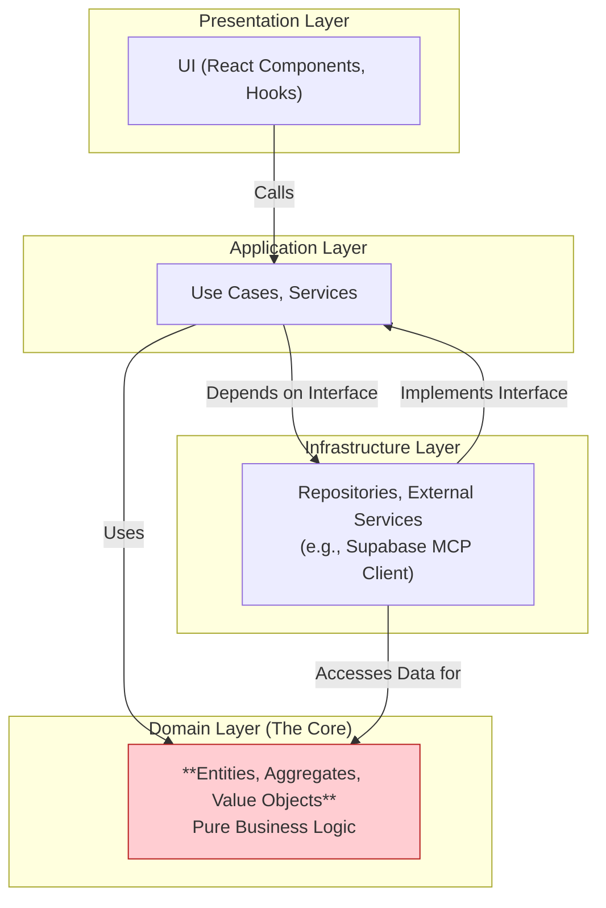
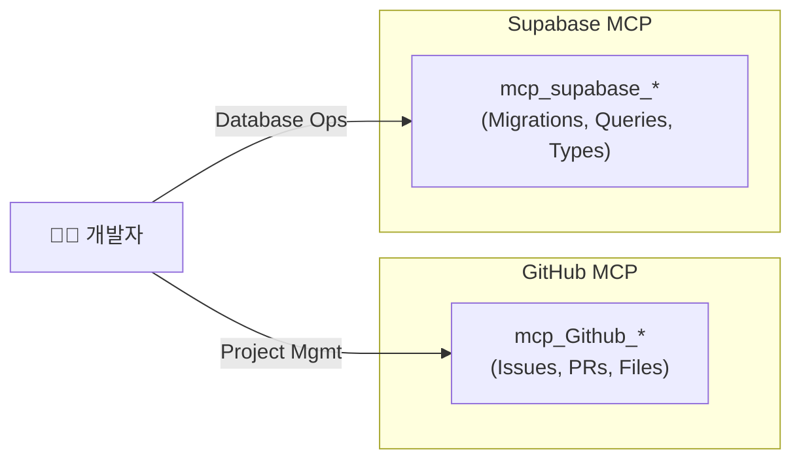
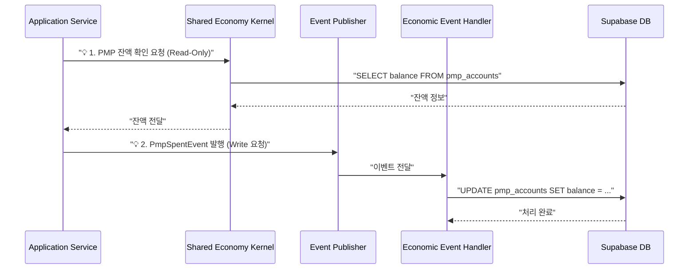

# 신규 개발자를 위한 PosMul 플랫폼 온보딩 튜토리얼 (v2)

> **"Welcome to PosMul! 이 튜토리얼을 마치면, 당신은 PosMul의 방식으로 생각하고, 코딩하며, 기여하는 개발자가 될 것입니다."**

이 튜토리얼은 PosMul 프로젝트에 새로 합류한 개발자를 위한 실습 중심의 온보딩 가이드입니다. 프로젝트의 핵심 철학을 이해하고, 독특한 DUAL MCP 워크플로우를 따라 **실제 코드를 수정하여** 첫 번째 Task를 성공적으로 완료하는 것을 목표로 합니다.

## 📚 목차 (Table of Contents)

- [신규 개발자를 위한 PosMul 플랫폼 온보딩 튜토리얼 (v2)](#신규-개발자를-위한-posmul-플랫폼-온보딩-튜토리얼-v2)
  - [📚 목차 (Table of Contents)](#-목차-table-of-contents)
  - [🎯 학습 목표](#-학습-목표)
  - [🛠️ 사전 준비사항](#️-사전-준비사항)
  - [1. PosMul 핵심 철학 이해하기 (20분)](#1-posmul-핵심-철학-이해하기-20분)
    - [1.1. 아키텍처: DDD + 클린 아키텍처](#11-아키텍처-ddd--클린-아키텍처)
    - [1.2. 개발 워크플로우: DUAL MCP](#12-개발-워크플로우-dual-mcp)
    - [1.3. **왜 이 방식을 사용하나요?**](#13-왜-이-방식을-사용하나요)
  - [2. 개발 환경 설정 (15분)](#2-개발-환경-설정-15분)
  - [3. 나의 첫 번째 Task 수행하기 (60분)](#3-나의-첫-번째-task-수행하기-60분)
    - [3.1. GitHub 이슈 생성](#31-github-이슈-생성)
    - [3.2. 브랜치 생성](#32-브랜치-생성)
    - [3.3. **실제 코드 수정하기 (Local Change)**](#33-실제-코드-수정하기-local-change)
    - [3.4. Pull Request(PR) 생성](#34-pull-requestpr-생성)
  - [4. 테스팅 및 품질 보증 (15분)](#4-테스팅-및-품질-보증-15분)
    - [테스트 실행하기](#테스트-실행하기)
    - [테스트 코드 살펴보기](#테스트-코드-살펴보기)
  - [5. 핵심 경제 시스템 맛보기 (10분)](#5-핵심-경제-시스템-맛보기-10분)
    - [🔁 경제 시스템 상호작용 흐름](#-경제-시스템-상호작용-흐름)
  - [✅ 완료 확인 및 다음 단계](#-완료-확인-및-다음-단계)
    - [다음 단계](#다음-단계)

---

## 🎯 학습 목표

-   PosMul의 핵심 아키텍처와 **그것을 사용하는 이유**를 설명할 수 있습니다.
-   DUAL MCP 기반 개발 워크플로우에 따라 **실제 코드를 수정하고** 기여할 수 있습니다.
-   PowerShell을 사용하여 프로젝트 개발 환경을 설정하고 **테스트를 실행**할 수 있습니다.
-   프로젝트의 파일 구조를 탐색하고 간단한 UI 변경 사항을 적용할 수 있습니다.

## 🛠️ 사전 준비사항

-   **Node.js & npm**: 최신 LTS 버전 설치
-   **Git**: 설치 및 기본 설정 완료
-   **GitHub 계정**: PosMul 프로젝트 저장소에 접근 권한 필요
-   **Supabase 계정**: PosMul 프로젝트에 접근 권한 필요
-   **IDE**: Visual Studio Code 또는 Cursor 권장

---

## 1. PosMul 핵심 철학 이해하기 (20분)

PosMul은 단순한 웹 애플리케이션이 아닙니다. 장기적인 확장성과 유지보수성을 위해 엄격한 설계 원칙 위에 세워진 시스템입니다.

### 1.1. 아키텍처: DDD + 클린 아키텍처

우리의 코드는 계층으로 나뉘어 있으며, 의존성 규칙은 화살표 방향으로만 흐릅니다. **Domain이 가장 핵심**이며, 외부 기술이나 프레임워크에 대해 아무것도 알지 못합니다.



### 1.2. 개발 워크플로우: DUAL MCP

모든 GitHub 작업과 Supabase 데이터베이스 작업은 CLI나 웹 UI가 아닌, **MCP(Model Context Protocol) 도구**를 통해 수행됩니다. 이는 일관성, 자동화, 보안을 위함입니다.



### 1.3. **왜 이 방식을 사용하나요?**

-   **변경 용이성**: `Domain`(핵심 비즈니스 규칙)을 건드리지 않고 UI나 데이터베이스 기술을 쉽게 교체할 수 있습니다.
-   **테스트 용이성**: 각 계층을 독립적으로 테스트할 수 있어 안정성이 높습니다.
-   **협업 효율성**: 여러 개발자가 다른 계층에서 동시에 작업해도 충돌이 적습니다.
-   **장기적 유지보수**: 코드의 의존성이 명확하여 새로운 기능을 추가하거나 버그를 수정하기 쉽습니다.

---

## 2. 개발 환경 설정 (15분)

모든 명령어는 **PowerShell**에서 실행해야 합니다.

1.  **프로젝트 클론**:
    ```powershell
    git clone https://github.com/[your-username]/posmul.git
    cd posmul
    ```

2.  **의존성 설치**:
    ```powershell
    npm install
    ```

3.  **.env 파일 설정**:
    루트 디렉토리에 `.env.local` 파일을 생성하고 프로젝트 리더에게 제공받은 환경 변수를 추가합니다.
    ```
    SUPABASE_URL=...
    SUPABASE_ANON_KEY=...
    SUPABASE_PROJECT_ID=...
    ```

4.  **개발 서버 실행**:
    ```powershell
    npm run dev
    ```
    이제 브라우저에서 `http://localhost:3000`으로 접속하여 PosMul 애플리케이션을 확인할 수 있습니다.

---

## 3. 나의 첫 번째 Task 수행하기 (60분)

이 단계에서는 **"메인 페이지의 버튼 텍스트를 수정"** 하는 실제 코딩 작업을 DUAL MCP 워크플로우에 따라 수행합니다.

### 3.1. GitHub 이슈 생성

-   **목표**: `mcp_Github_create_issue`를 사용하여 나의 첫 번째 Task를 GitHub에 등록합니다.
-   **실행**: (AI 에이전트에게 아래와 같이 요청한다고 상상해보세요.)
    ```typescript
    await mcp_Github_create_issue({
      owner: "your-github-username",
      repo: "posmul",
      title: "Onboarding: Update main page button text",
      body: "As part of the onboarding tutorial, I will update the text of a button on the main page.",
      labels: ["documentation", "good first issue", "onboarding"],
      assignees: ["your-github-username"]
    });
    ```

### 3.2. 브랜치 생성

-   **목표**: 작업할 새로운 브랜치를 생성합니다.
-   **실행**: PowerShell에서 다음 명령어를 입력합니다.
    ```powershell
    # 이슈 번호가 123이라고 가정
    git checkout -b feature/onboarding-ui-update-123
    ```

### 3.3. **실제 코드 수정하기 (Local Change)**

이제 진짜 코드를 수정해봅시다.

1.  **파일 찾기**: VS Code나 Cursor에서 `src/app/page.tsx` 파일을 엽니다.
2.  **코드 수정**: 파일 내용에서 `<Button>` 컴포넌트를 찾아서 텍스트를 수정합니다.
    ```tsx
    // Before
    <Button variant="default">Learn More</Button>

    // After
    <Button variant="default">Explore PosMul</Button>
    ```
3.  **변경 사항 확인**: 브라우저(`http://localhost:3000`)에서 버튼 텍스트가 "Explore PosMul"로 바뀐 것을 확인하세요.
4.  **변경 내용 커밋**: 수정한 내용을 로컬 git에 커밋합니다.
    ```powershell
    git add .
    git commit -m "feat(ui): Update main page button text for onboarding"
    git push origin feature/onboarding-ui-update-123
    ```

### 3.4. Pull Request(PR) 생성

-   **목표**: `mcp_Github_create_pull_request`를 사용하여 코드 리뷰를 요청합니다.
-   **실행**:
    ```typescript
    await mcp_Github_create_pull_request({
      owner: "your-github-username",
      repo: "posmul",
      title: "Feat: Update main page button text",
      head: "feature/onboarding-ui-update-123",
      base: "main",
      body: "This PR updates a button text on the main page as part of the developer onboarding tutorial. Closes #123"
    });
    ```

**축하합니다!** 이제 당신은 PosMul의 실제 코드를 수정하고, 개발 흐름에 따라 첫 번째 기여를 완료했습니다.

---

## 4. 테스팅 및 품질 보증 (15분)

PosMul은 코드 품질을 중요하게 생각합니다. 모든 주요 로직에는 테스트 코드가 함께 제공됩니다.

### 테스트 실행하기

-   **명령어**: 프로젝트 루트에서 다음 명령어를 실행하여 전체 테스트를 실행할 수 있습니다.
    ```powershell
    npm test
    ```
-   **확인**: 테스트가 모두 통과하는지 확인하세요. PR을 제출하기 전 로컬에서 테스트를 통과시키는 것은 좋은 습관입니다.

### 테스트 코드 살펴보기

-   `src/bounded-contexts/prediction/domain/entities/prediction-game.entity.spec.ts` 와 같은 파일을 열어보세요.
-   테스트 코드가 어떻게 도메인 로직의 정확성을 검증하는지 살펴보는 것만으로도 많은 것을 배울 수 있습니다.

---

## 5. 핵심 경제 시스템 맛보기 (10분)

PosMul의 심장은 PMP와 PMC로 구성된 경제 시스템입니다. 모든 도메인은 이 경제 시스템과 상호작용합니다.

### 🔁 경제 시스템 상호작용 흐름



-   **핵심 원칙**: 경제 데이터 조회는 `Shared Kernel`을 통해 **읽기 전용**으로, 상태 변경은 `Domain Event`를 발행하여 **쓰기 작업을 위임**하는 방식으로 분리됩니다. 이는 시스템의 안정성과 확장성을 보장합니다.

---

## ✅ 완료 확인 및 다음 단계

이 튜토리얼을 통해 당신은 PosMul 프로젝트의 개발 문화와 워크플로우에 대한 첫걸음을 뗐습니다.

-   [ ] PosMul의 아키텍처를 사용하는 **이유**를 설명할 수 있나요?
-   [ ] 실제 UI 코드를 **찾아서 수정**하고, 로컬에서 변경 사항을 확인할 수 있나요?
-   [ ] `npm test`를 사용하여 **테스트를 실행**할 수 있나요?
-   [ ] 경제 시스템의 **읽기/쓰기 분리 원칙**(Kernel/Event)을 이해했나요?

### 다음 단계

-   **[`posmul-comprehensive-architecture-overview.md`](./posmul-comprehensive-architecture-overview.md)**: 프로젝트 전체 아키텍처를 심도 있게 학습하세요.
-   **[`diataxis_template`](../diataxis_template/README.md)**: PosMul의 문서화 규칙을 배우세요.
-   **`good first issue`** 라벨이 붙은 다른 이슈들에 도전해보세요! 