# Universal MCP 자동화 시스템 초보자 완전 정복 가이드

> **🎯 목표**: 프로그래밍 초보자도 Universal MCP 자동화 시스템을 완벽하게 이해하고 활용할 수 있도록 돕기  
> **⏰ 예상 학습 시간**: 30분  
> **📚 난이도**: 초급 (프로그래밍 기초 지식만 있으면 OK!)  
> **🛠️ 필요 도구**: VS Code, Node.js, 터미널 기본 사용법

## 📋 목차

1. [MCP가 뭔가요? - 5분만에 이해하기](#mcp가-뭔가요---5분만에-이해하기)
2. [왜 자동화가 필요한가? - 문제점부터 이해하기](#왜-자동화가-필요한가---문제점부터-이해하기)
3. [Universal MCP 시스템 동작 원리](#universal-mcp-시스템-동작-원리)
4. [실습: 첫 번째 자동화 경험하기](#실습-첫-번째-자동화-경험하기)
5. [고급 기능 활용하기](#고급-기능-활용하기)
6. [문제 해결 가이드](#문제-해결-가이드)
7. [다음 단계와 심화 학습](#다음-단계와-심화-학습)

---

## MCP가 뭔가요? - 5분만에 이해하기

### 🤔 MCP를 일상 언어로 설명하면?

**MCP(Model Context Protocol)**를 **"똑똑한 번역기"**라고 생각해보세요!


### 🔍 실제 예시로 이해하기

**데이터베이스에는 이런 테이블이 있어요:**

```sql
-- users 테이블
CREATE TABLE users (
  id UUID PRIMARY KEY,
  name TEXT NOT NULL,
  email TEXT UNIQUE,
  created_at TIMESTAMPTZ
);
```

**MCP가 이것을 TypeScript로 번역해줘요:**

```typescript
// 자동으로 생성된 타입
export interface User {
  id: string;
  name: string;
  email: string | null;
  created_at: string;
}
```

### 💡 왜 이게 좋은가요?


1. **⚡ 시간 절약**: 6시간 → 10분 (95% 단축!)
2. **🛡️ 오타 방지**: 수동 타이핑 실수 없음
3. **🔄 실시간 동기화**: 데이터베이스 변경되면 즉시 반영
4. **👥 팀 협업**: 모든 개발자가 같은 타입 사용

---

## 왜 자동화가 필요한가? - 문제점부터 이해하기

### 😰 기존 방식의 문제점들

#### 문제 1: 시간이 너무 오래 걸려요!

```mermaid
gantt
    title 기존 방식 vs 자동화 방식
    dateFormat  HH:mm
    axisFormat %H:%M

    section 기존 방식 (6시간)
    데이터베이스 확인      :done, old1, 00:00, 1h
    타입 수동 작성        :done, old2, after old1, 2h
    오타 확인 및 수정     :done, old3, after old2, 1h
    테스트              :done, old4, after old3, 2h

    section 자동화 방식 (10분)
    MCP 실행            :active, new1, 00:00, 5m
    결과 확인           :new2, after new1, 3m
    완료               :new3, after new2, 2m
```



#### 문제 2: 실수가 너무 많아요!


#### 문제 3: 팀원마다 다른 타입을 써요!


### 🎯 자동화의 해결책


---

## Universal MCP 시스템 동작 원리

### 🏗️ 전체 구조 한눈에 보기


### 🔧 각 단계별 상세 설명

#### 단계 1: 개발자가 간단한 명령어 실행

```bash
# 이 한 줄이면 끝!
npx tsx scripts/universal-mcp-automation.ts generate posmul
```

#### 단계 2: MCP 도구가 똑똑하게 분석


#### 단계 3: 결과물 확인

**생성된 파일 예시:**

```typescript
/**
 * PosMul AI-era 직접민주주의 플랫폼 - 자동 생성 타입
 * 생성 시간: 2025-06-24 21:30:00
 * 도메인: 8개 (Prediction, Investment, Economy, ...)
 * 테이블: 23개
 */

export interface User {
  id: string;
  name: string;
  email: string;
  created_at: string;
  // ... 다른 필드들
}

export interface PredictionGame {
  id: string;
  title: string;
  description: string;
  // ... 예측 게임 관련 필드들
}

// ... 다른 모든 타입들
```

### 📊 처리 속도 비교


---

## 실습: 첫 번째 자동화 경험하기

### 🚀 준비 단계 (5분)

#### 1. 필요한 도구 확인


#### 2. 터미널에서 확인하기

```bash
# Node.js 버전 확인
node --version
# 결과: v18.0.0 이상이면 OK!

# 프로젝트 폴더로 이동
cd C:\G\posmul

# 필요한 패키지 설치되어 있는지 확인
npm list tsx
```

### 🎯 실습 1: 첫 번째 자동화 실행

#### 단계별 따라하기

**1단계: 터미널 열기**


**2단계: 명령어 실행**

```bash
# 🚀 마법의 명령어 실행!
npx tsx scripts/universal-mcp-automation.ts generate posmul
```

**3단계: 결과 확인하기**


### 📝 실습 2: 결과물 분석하기

#### 생성된 파일 살펴보기

**파일 위치:**

```
📁 posmul/
  📁 src/
    📁 shared/
      📁 types/
        📄 supabase-generated.ts  ← 여기에 생성됨!
```

**파일 내용 구조:**


#### 실제 타입 사용해보기

**Before (자동화 전):**

```typescript
// 😰 이렇게 직접 타입을 만들어야 했어요
interface User {
  id: string; // 혹시 number였나? UUID였나?
  name: string; // 필수인가 선택인가?
  email: string; // 이것도 확실하지 않음...
}
```

**After (자동화 후):**

```typescript
// 😊 이제 자동으로 생성된 정확한 타입 사용!
import { Database } from "./shared/types/supabase-generated";

type User = Database["public"]["Tables"]["users"]["Row"];
// 모든 필드가 정확하고, 타입도 정확해요!
```

---

## 고급 기능 활용하기

### 🎨 도메인별 특화 타입 생성

#### 왜 도메인별로 나누나요?


#### 도메인별 생성 실습

```bash
# 예측 게임 도메인만 생성
npx tsx scripts/universal-mcp-automation.ts domain posmul prediction

# 투자 도메인만 생성
npx tsx scripts/universal-mcp-automation.ts domain posmul investment

# 경제 도메인만 생성
npx tsx scripts/universal-mcp-automation.ts domain posmul economy
```

**결과:**

```
📁 src/
  📁 bounded-contexts/
    📁 prediction/
      📁 types/
        📄 supabase-prediction.ts  ← 예측 게임 관련 타입만!
    📁 investment/
      📁 types/
        📄 supabase-investment.ts  ← 투자 관련 타입만!
```

### 🔄 배치 처리로 모든 도메인 한번에

```bash
# 🚀 모든 도메인을 한번에 처리하는 슈퍼 명령어!
npx tsx scripts/universal-mcp-automation.ts batch posmul
```

**처리 과정 시각화:**


### 🎯 새 프로젝트에 적용하기

#### 나만의 프로젝트 설정 만들기

```typescript
// scripts/my-project-config.ts
import { addProjectConfig } from "./universal-mcp-automation";

// 🎨 나만의 블로그 프로젝트 설정
addProjectConfig("my-blog", {
  projectId: "my-blog-project-id",
  projectName: "나의 개인 블로그",
  outputPath: "src/types/blog-database.ts",
  domains: ["posts", "users", "comments", "categories"],
  customHeader: `/**
   * 개인 블로그 프로젝트 자동 생성 타입
   * 블로그 기능: 포스트, 댓글, 카테고리
   */`,
});
```

#### 적용해보기

```bash
# 내 블로그 프로젝트 타입 생성
npx tsx scripts/universal-mcp-automation.ts generate my-blog
```

---

## 문제 해결 가이드

### 🚨 자주 발생하는 문제들

#### 문제 1: "tsx 명령어를 찾을 수 없습니다"


**해결책:**

```bash
# 방법 1: tsx 설치
npm install -g tsx

# 방법 2: 직접 실행
node --loader tsx scripts/universal-mcp-automation.ts generate posmul

# 방법 3: 프로젝트에 설치
npm install tsx --save-dev
```

#### 문제 2: "프로젝트 ID를 찾을 수 없습니다"


**해결책:**

```bash
# .env 파일 확인
SUPABASE_PROJECT_ID=your-project-id-here
SUPABASE_URL=https://your-project.supabase.co
SUPABASE_ANON_KEY=your-anon-key-here
```

#### 문제 3: "권한이 없습니다"


### 🛠️ 트러블슈팅 체크리스트


**단계별 체크리스트:**

- [ ] Node.js 18 이상 설치됨
- [ ] npm 패키지 설치됨 (`npm install`)
- [ ] 환경 변수 설정됨 (`.env` 파일)
- [ ] 인터넷 연결 정상
- [ ] Supabase 프로젝트 접근 가능
- [ ] 파일 쓰기 권한 있음

---

## 다음 단계와 심화 학습

### 📚 학습 로드맵


### 🎯 다음에 해볼 만한 것들

#### 1. CI/CD 파이프라인 통합

```yaml
# .github/workflows/auto-types.yml
name: Auto Type Generation
on:
  push:
    branches: [main]
    paths: ["supabase/migrations/**"]

jobs:
  generate-types:
    runs-on: ubuntu-latest
    steps:
      - uses: actions/checkout@v3
      - name: Generate Types
        run: npx tsx scripts/universal-mcp-automation.ts generate posmul
```

#### 2. 다른 팀 프로젝트에 적용

```mermaid
graph LR
    A[현재: PosMul 프로젝트] --> B[확장: 팀 다른 프로젝트]
    B --> C[확장: 회사 모든 프로젝트]
    C --> D[확장: 오픈소스 프로젝트]

    style A fill:#E6FFE6
    style D fill:#E6F3FF
```

#### 3. 커뮤니티 기여

```mermaid
pie title "기여할 수 있는 영역"
    "버그 리포트" : 25
    "기능 제안" : 25
    "문서 개선" : 25
    "코드 기여" : 25
```

### 💡 추가 학습 자료

#### 관련 기술 스택 학습

1. **TypeScript 심화**

   - 제네릭과 유틸리티 타입
   - 고급 타입 조작
   - 타입 안전성 패턴

2. **Supabase 마스터**

   - RLS (Row Level Security)
   - 실시간 데이터베이스
   - Edge Functions

3. **자동화 도구 개발**
   - Node.js 스크립트
   - CLI 도구 만들기
   - 워크플로우 자동화

#### 실무 프로젝트 적용

```mermaid
flowchart TD
    A[개인 프로젝트] --> B[팀 프로젝트]
    B --> C[회사 프로젝트]
    C --> D[오픈소스 프로젝트]

    A --> A1[포트폴리오 향상]
    B --> B1[팀 생산성 향상]
    C --> C1[업무 효율성 증대]
    D --> D1[커뮤니티 기여]

    style A fill:#E6F3FF
    style B1 fill:#E6FFE6
    style C1 fill:#E6FFE6
    style D1 fill:#E6FFE6
```

---

## 🎉 축하합니다! 완주하셨습니다!

### 📊 학습 성과 정리

```mermaid
pie title "30분 학습으로 얻은 것들"
    "자동화 시스템 이해" : 30
    "실무 적용 능력" : 25
    "문제 해결 능력" : 20
    "심화 학습 방향" : 15
    "커뮤니티 참여 가능성" : 10
```

### 🎯 이제 여러분은 할 수 있어요!

#### ✅ 마스터한 기능들

- [x] **MCP 자동화 시스템 이해**: 원리와 장점을 완벽히 파악
- [x] **기본 자동화 실행**: 명령어 한 줄로 타입 생성
- [x] **도메인별 특화 생성**: 필요한 부분만 골라서 생성
- [x] **문제 해결**: 일반적인 오류 상황 대처 가능
- [x] **다른 프로젝트 적용**: 나만의 프로젝트에 적용 가능

#### 🚀 다음 목표

```mermaid
graph TD
    A[현재 상태: 초보자 졸업] --> B[목표 1: 중급자 되기]
    A --> C[목표 2: 팀에 도입하기]
    A --> D[목표 3: 커뮤니티 기여]

    B --> B1[고급 설정 마스터]
    C --> C1[팀 워크플로우 개선]
    D --> D1[오픈소스 기여자]

    style A fill:#4CAF50
    style B1 fill:#E6FFE6
    style C1 fill:#E6FFE6
    style D1 fill:#E6FFE6
```

### 💬 커뮤니티 참여하기

#### 도움받을 수 있는 곳

- **GitHub Issues**: 버그 리포트 및 기능 요청
- **Discord/Slack**: 실시간 질문과 답변
- **StackOverflow**: 기술적 문제 해결
- **블로그/유튜브**: 경험 공유 및 튜토리얼

#### 도움줄 수 있는 방법

```mermaid
flowchart LR
    A[나의 기여] --> B[문서 개선]
    A --> C[버그 리포트]
    A --> D[기능 제안]
    A --> E[튜토리얼 작성]

    B --> F[더 나은 가이드]
    C --> G[더 안정적인 시스템]
    D --> H[더 유용한 기능]
    E --> I[더 많은 사용자]

    style A fill:#E6F3FF
    style F fill:#E6FFE6
    style G fill:#E6FFE6
    style H fill:#E6FFE6
    style I fill:#E6FFE6
```

---

## 📚 추가 참고 자료

### 🔗 핵심 링크들

- **공식 문서**: [Universal MCP Automation 가이드](../reports/universal-mcp-automation-system-report.md)
- **실습 프로젝트**: [PosMul 플랫폼](https://github.com/your-repo/posmul)
- **MCP 공식 사이트**: [Model Context Protocol](https://modelcontextprotocol.org)
- **Supabase 문서**: [Supabase TypeScript 지원](https://supabase.com/docs/guides/api/generating-types)

### 📖 추천 학습 순서

```mermaid
graph TD
    A[1. 이 가이드 완독] --> B[2. 실제 프로젝트 적용]
    B --> C[3. 고급 기능 탐색]
    C --> D[4. 커뮤니티 참여]
    D --> E[5. 전문가 되기]

    style A fill:#4CAF50
    style B fill:#E6FFE6
    style C fill:#FFF2E6
    style D fill:#E6F3FF
    style E fill:#FFE6E6
```

---

**🎉 축하합니다! 이제 여러분은 Universal MCP 자동화 시스템의 초보자를 졸업했습니다!**

**💪 자신감을 가지고 실제 프로젝트에 적용해보세요. 분명히 놀라운 생산성 향상을 경험하실 것입니다!**

---

**문서 정보**

- **작성일**: 2025-06-24 21:30:00
- **대상**: 프로그래밍 초보자
- **예상 학습 시간**: 30분
- **난이도**: ⭐⭐☆☆☆ (초급)
- **업데이트**: 정기적으로 커뮤니티 피드백 반영

**피드백을 주세요!** 이 가이드가 도움이 되었는지, 어떤 부분이 어려웠는지 알려주시면 더 좋은 문서로 개선하겠습니다. 🙏
