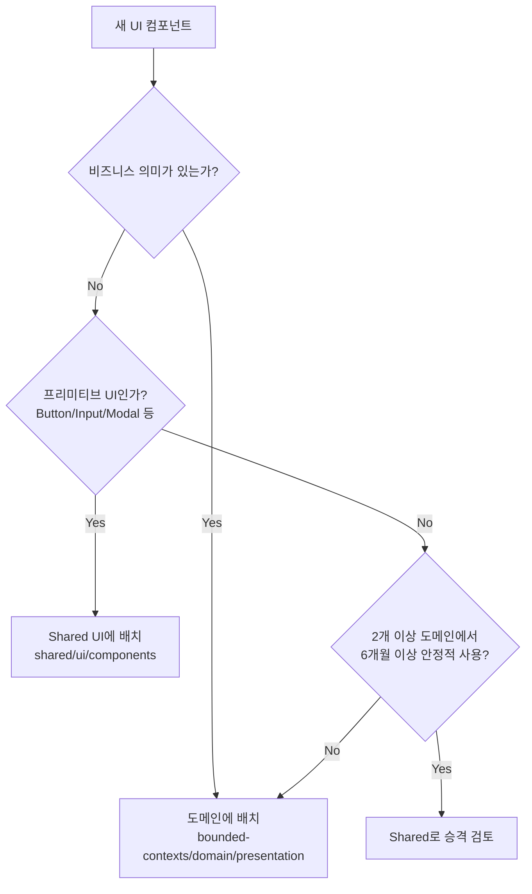
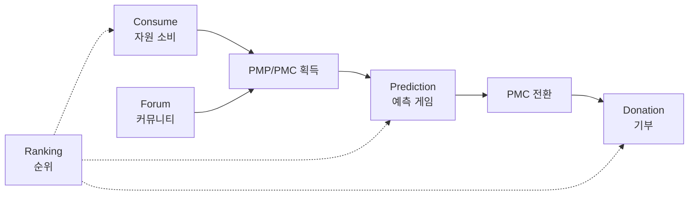

# PosMul UI/UX 디자인 가이드라인

> 일관된 사용자 경험을 위한 UI/UX 원칙 및 방법론

---

## 핵심 원칙

### 1. Local First 원칙 (도메인 우선)

**컴포넌트 배치 전략:**



**규칙:**
- ✅ **Shared UI**: 버튼, 입력, 모달 셸, 레이아웃 셸 등 **프리미티브만**
- ✅ **도메인 UI**: 예측 카드, 기부 폼, 랭킹 테이블 등 **비즈니스 로직이 포함된 조합 UI**
- ❌ 도메인 의미가 있는 컴포넌트를 Shared에 배치 금지

---

### 2. Compound Component Pattern

복잡한 컴포넌트를 관련 하위 컴포넌트로 분리하여 재사용성 향상:

```typescript
// 예: PredictionCard 컴포넌트
export const PredictionCard = Object.assign(PredictionCardRoot, {
  Header: PredictionCardHeader,
  Body: PredictionCardBody,
  Actions: PredictionCardActions,
  Chart: PredictionCardChart,
});

// 사용 예
<PredictionCard>
  <PredictionCard.Header title="2024 대선 예측" />
  <PredictionCard.Body>
    <PredictionCard.Chart data={trendData} />
  </PredictionCard.Body>
  <PredictionCard.Actions onBet={handleBet} />
</PredictionCard>
```

---

### 3. Facade Pattern (확장 전략)

Shared UI 위에 도메인별 확장을 구축:

```
┌─────────────────────────────────────┐
│     도메인 컴포넌트 (확장)           │
│  PredictionTrendChart               │
│  DonationProgressCard               │
└─────────────────┬───────────────────┘
                  │ 확장
┌─────────────────┴───────────────────┐
│     Shared UI (기반)                 │
│  BaseChart, Card, Button            │
└─────────────────────────────────────┘
```

---

## 스타일링 규칙

### 디자인 토큰 사용

**필수:**
- ✅ 토큰 기반 색상: `text-primary-600`, `bg-background`
- ✅ 상태 색상: `text-success-600`, `text-warning-600`, `text-error-600`
- ❌ hex 하드코딩 금지 (`#FF5733` ❌)

### Tailwind CSS 규칙

```typescript
// 다크모드
className="bg-white dark:bg-gray-900"

// 반응형
className="w-full md:w-1/2 lg:w-1/3"

// 호버/상태
className="hover:bg-primary-100 active:bg-primary-200"
```

---

## 컴포넌트 구조 표준

```typescript
"use client";

import { useState } from 'react';
import type { FC } from 'react';

interface Props {
  title: string;
  variant?: 'default' | 'compact';
  onAction?: () => void;
}

export const ComponentName: FC<Props> = ({ 
  title, 
  variant = 'default',
  onAction 
}) => {
  const [isActive, setIsActive] = useState(false);
  
  const handleClick = () => {
    setIsActive(true);
    onAction?.();
  };
  
  return (
    <div 
      className={cn(
        "rounded-lg border p-4",
        variant === 'compact' && "p-2"
      )}
      onClick={handleClick}
    >
      {title}
    </div>
  );
};
```

---

## 사용자 플로우 원칙

### Value Chain 반영

모든 UI 플로우는 최종적으로 **Donation(기부)**으로 수렴:



### 도메인별 주요 플로우

| 도메인 | 핵심 플로우 |
|--------|-------------|
| Consume | 광고 시청 → PMP 획득 → 지역 소비 → PMC 획득 |
| Prediction | 게임 목록 → 게임 상세 → 베팅 참여 → 결과 확인 |
| Donation | 기부 대상 선택 → 금액 입력 → 결제 → 영수증 |
| Forum | 뉴스 구독 → 토론 참여 → PMP 적립 |
| Ranking | 순위 확인 → 활동 분석 → 보상 확인 |

---

## 문서 구조

```
docs/ui-ux/
├── README.md                  # 이 문서 (글로벌 가이드라인)
├── component-catalog.md       # Shared UI 컴포넌트 카탈로그
├── design-tokens.md           # 디자인 토큰 정의
└── domains/
    ├── prediction.md          # 예측 도메인 UI/UX
    ├── economy.md             # 경제 시스템 UI/UX
    ├── consume.md             # 소비 도메인 UI/UX
    ├── donation.md            # 기부 도메인 UI/UX
    ├── forum.md               # 포럼 도메인 UI/UX
    ├── ranking.md             # 랭킹 도메인 UI/UX
    ├── dashboard.md           # 대시보드 UI/UX
    ├── auth.md                # 인증 UI/UX
    └── user.md                # 사용자 프로필 UI/UX
```

---

## 접근성 (A11y)

### 필수 체크리스트

- [ ] 키보드 네비게이션 지원
- [ ] 스크린 리더 호환 (aria-label)
- [ ] 색상 대비 4.5:1 이상
- [ ] 포커스 상태 시각화
- [ ] 에러 메시지 명시

---

**버전**: 1.0 | **업데이트**: 2026-01-13
