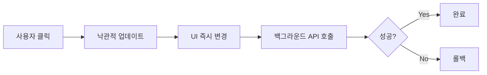

# Polymarket UX 벤치마킹 분석

> **목적**: Polymarket의 UI/UX 패턴을 분석하여 PosMul Prediction 도메인에 반영

---

## 핵심 발견사항

### 1. 예측 카드 디자인


**Polymarket 카드 구조:**
- 아이콘/썸네일 (좌측)
- 제목/질문 (중앙)
- **확률 % 원형 프로그레스** (우측, 핵심!)
- Yes/No 버튼 (하단)
- 거래량 ($17m Vol.) 표시

**적용 포인트:**

| Polymarket | PosMul 적용 |
|------------|-------------|
| 원형 확률 표시 | `PredictionGameCard`에 원형 프로그레스 추가 |
| Yes/No 버튼 | 베팅 옵션 버튼 즉시 표시 |
| 거래량 표시 | 총 베팅 금액/참여자 수 표시 |

---

### 2. 빠른 반응속도의 비결

**Polymarket의 성능 패턴:**



| 기법 | 설명 | PosMul 적용 |
|------|------|-------------|
| **낙관적 업데이트** | 서버 응답 전 UI 먼저 변경 | 베팅 시 즉시 UI 반영 |
| **WebSocket** | 확률 실시간 스트리밍 | Supabase Realtime 강화 |
| **SPA 전환** | 페이지 전체 새로고침 없음 | Next.js App Router 활용 |
| **스켈레톤 로딩** | 콘텐츠 로딩 중 형태 유지 | `BaseSkeleton` 적극 활용 |
| **플립 클락 애니메이션** | 숫자 변경 시 애니메이션 | 확률 변경 시 애니메이션 추가 |

---

### 3. 상세 페이지 레이아웃

**Polymarket 레이아웃:**
```
┌────────────────────────────────────────────────────┐
│                    네비게이션 바                    │
├──────────────────────────┬─────────────────────────┤
│                          │                         │
│   콘텐츠 영역 (60%)       │   트레이딩 사이드바     │
│   - 제목/설명            │   (40%, Sticky)         │
│   - 차트                 │   - Buy/Sell 탭         │
│   - Rules (해결 기준)    │   - 금액 입력           │
│   - 타임라인             │   - 퀵버튼 (+$1, Max)   │
│   - 댓글                 │   - 확인 버튼           │
│   - 활동 내역            │                         │
│                          │                         │
└──────────────────────────┴─────────────────────────┘
```

**적용 포인트:**
- 우측 스티키 사이드바에 베팅 UI 배치
- 퀵버튼 (+100 PMP, +500 PMP, Max) 추가
- Rules(해결 기준) 섹션 명시

---

## PosMul 즉시 적용 체크리스트

### 카드 개선 (우선순위 높음)
- [ ] 원형 프로그레스 바 추가 (확률 표시)
- [ ] Yes/No 버튼 카드 내 배치
- [ ] 참여자 수/총 베팅 금액 표시

### 반응속도 개선
- [ ] 낙관적 업데이트 패턴 적용
- [ ] 숫자 변경 애니메이션 (Framer Motion)
- [ ] 스켈레톤 로딩 전면 적용

### 상세 페이지 개선
- [ ] 우측 스티키 베팅 사이드바
- [ ] 퀵버튼 (+100, +500, Max)
- [ ] 해결 기준(Rules) 섹션

---

## 콘텐츠 전략 분석

**Polymarket의 콘텐츠 채우기 방식:**

1. **시사 이슈 중심**: 정치, 경제, 스포츠 등 실시간 이슈
2. **명확한 해결 기준**: Rules 섹션에 판정 기준 명시
3. **시간 제한**: 마감일이 명확하게 표시
4. **사회적 증거**: 거래량, 참여자 수 강조

**PosMul 콘텐츠 전략 제안:**
- 한국 정치/정책 이슈 중심
- 지역 커뮤니티 이슈 (Region/Local)
- 예측 결과 판정 기준 투명 공개
- MoneyWave와 연동된 보상 강조

---

**분석일**: 2026-01-13
