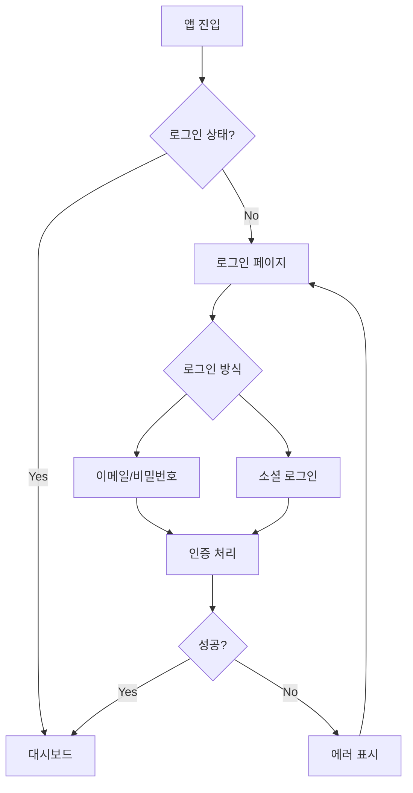

# Auth 도메인 UI/UX 가이드

> 인증 및 보안 시스템의 UI/UX 설계

---

## 도메인 개요

**핵심 기능:**
- Supabase Auth 기반 인증
- 소셜 로그인 (Google, Kakao 등)
- 세션 관리

---

## 인증 플로우



---

## 컴포넌트 구조

### 인증 폼

| 컴포넌트 | 용도 |
|----------|------|
| `LoginForm` | 로그인 폼 |
| `SignupForm` | 회원가입 폼 |
| `ForgotPasswordForm` | 비밀번호 찾기 |
| `SocialLoginButtons` | 소셜 로그인 버튼 |

### 보안 컴포넌트

| 컴포넌트 | 용도 |
|----------|------|
| `AuthGuard` | 인증 가드 |
| `SessionDisplay` | 세션 정보 |
| `LogoutButton` | 로그아웃 버튼 |

---

## 디자인 패턴

### 입력 검증

```typescript
// 에러 상태
<Input
  type="email"
  error="올바른 이메일을 입력해주세요"
  className="border-error-500"
/>

// 성공 상태
<Input
  type="email"
  success
  className="border-success-500"
/>
```

### 소셜 로그인 버튼

```typescript
<SocialLoginButton provider="google">
  <GoogleIcon /> Google로 계속하기
</SocialLoginButton>

<SocialLoginButton provider="kakao">
  <KakaoIcon /> 카카오로 계속하기
</SocialLoginButton>
```

---

## 파일 위치

```
bounded-contexts/auth/
├── application/
├── domain/
├── infrastructure/
└── presentation/
    └── components/
```

---

**버전**: 1.0 | **업데이트**: 2026-01-13
