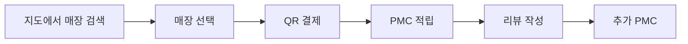
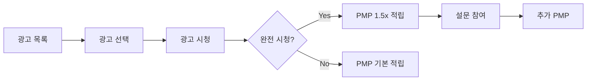

# Consume 도메인 UI/UX 가이드

> 자원 소비를 통한 포인트 획득 시스템의 UI/UX 설계

---

## 도메인 개요

**핵심 원칙:**
- 💵 **돈 투입** → PMC 획득 (MoneyConsume, CloudConsume)
- ⏰ **시간 투입** → PMP 획득 (TimeConsume)

**하위 서비스:**

| 서비스 | 유형 | 획득 통화 | 설명 |
|--------|------|----------|------|
| MoneyConsume | Local League | PMC | 지역 소상공인 소비 |
| TimeConsume | Major League | PMP | 광고 시청, 설문 참여 |
| CloudConsume | Cloud Funding | PMC | 크라우드펀딩 투자 |

---

## 현재 컴포넌트 상태

> ⚠️ **초기 단계**: 현재 3개 컴포넌트만 구현됨

### 구현된 컴포넌트

```
consume/presentation/components/
├── ConsumeDashboard.tsx     # 메인 대시보드
├── LocalLeagueMap.tsx       # 지역 매장 지도
└── PointHistoryCard.tsx     # 포인트 이력
```

---

## 개발 예정 컴포넌트

### MoneyConsume (Local League)

| 컴포넌트 | 용도 |
|----------|------|
| `StoreCard` | 매장 정보 카드 |
| `QRScanner` | QR 코드 결제 |
| `ReceiptView` | 영수증 확인 |
| `LocalMap` | 주변 매장 지도 |
| `StoreFilter` | 카테고리 필터 |

### TimeConsume (Major League)

| 컴포넌트 | 용도 |
|----------|------|
| `AdPlayer` | 광고 재생기 |
| `SurveyForm` | 설문조사 폼 |
| `RewardProgress` | 보상 진행률 |
| `AdRatingForm` | 광고 평가 |

### CloudConsume (Cloud Funding)

| 컴포넌트 | 용도 |
|----------|------|
| `ProjectCard` | 프로젝트 카드 |
| `FundingProgress` | 펀딩 진행률 |
| `InvestmentForm` | 투자 폼 |
| `RewardList` | 리워드 목록 |

---

## 사용자 플로우

### MoneyConsume 플로우



### TimeConsume 플로우



---

## 디자인 패턴

### 포인트 유형별 강조

```typescript
// PMP 획득 (시간 투입)
<Badge className="bg-purple-100 text-purple-700">
  ⏰ +100 PMP
</Badge>

// PMC 획득 (돈 투입)
<Badge className="bg-amber-100 text-amber-700">
  💰 +50 PMC
</Badge>
```

### 진행률 표시

```typescript
<ProgressBar
  value={75}
  label="광고 시청 완료"
  variant="primary"
/>
```

---

## 파일 위치

```
bounded-contexts/consume/presentation/
├── components/
│   ├── ConsumeDashboard.tsx
│   ├── LocalLeagueMap.tsx
│   └── PointHistoryCard.tsx
└── hooks/
    ├── useLocalStores.ts
    └── useAdRewards.ts
```

---

**버전**: 1.0 | **업데이트**: 2026-01-13
