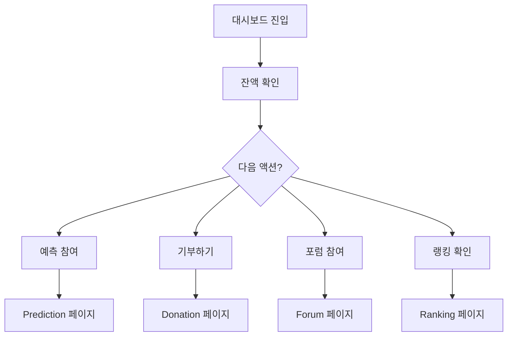

# Dashboard UI/UX 가이드

> 사용자 대시보드 및 종합 현황 UI/UX 설계

---

## 개요

대시보드는 여러 도메인의 핵심 정보를 한눈에 볼 수 있는 종합 뷰입니다.

**표시 항목:**
- 경제 현황 (PMP/PMC 잔액)
- 진행 중인 예측 게임
- 최근 기부 내역
- 랭킹 현황
- 활동 알림

---

## 레이아웃 구조

### 데스크탑 (3컬럼)

```
┌─────────────────────────────────────────────────┐
│                    Header                        │
├───────────┬─────────────────────┬───────────────┤
│           │                     │               │
│ Sidebar   │   Main Content      │  Side Panel   │
│           │   - 예측 게임 목록  │  - 잔액       │
│ (네비)    │   - 트렌드 차트     │  - 알림       │
│           │   - 활동 피드       │  - 퀵메뉴     │
│           │                     │               │
├───────────┴─────────────────────┴───────────────┤
│                    Footer                        │
└─────────────────────────────────────────────────┘
```

### 모바일 (단일 컬럼)

```
┌─────────────────┐
│    Header       │
├─────────────────┤
│  Quick Stats    │
├─────────────────┤
│  Main Feed      │
├─────────────────┤
│  Bottom Nav     │
└─────────────────┘
```

---

## 위젯 컴포넌트

### 경제 위젯

| 컴포넌트 | 용도 |
|----------|------|
| `BalanceWidget` | PMP/PMC 잔액 |
| `MoneyWaveWidget` | MoneyWave 현황 |
| `TransactionWidget` | 최근 거래 |

### 예측 위젯

| 컴포넌트 | 용도 |
|----------|------|
| `ActiveGamesWidget` | 진행 중 게임 |
| `MyPositionsWidget` | 내 포지션 |
| `TrendWidget` | 트렌드 요약 |

### 활동 위젯

| 컴포넌트 | 용도 |
|----------|------|
| `ActivityFeed` | 활동 피드 |
| `NotificationWidget` | 알림 목록 |
| `AchievementWidget` | 업적/뱃지 |

---

## 디자인 패턴

### 카드 그리드

```typescript
<div className="grid grid-cols-1 md:grid-cols-2 lg:grid-cols-3 gap-4">
  <BalanceWidget />
  <ActiveGamesWidget />
  <RankingWidget />
  <ActivityFeed className="col-span-2" />
  <NotificationWidget />
</div>
```

### 반응형 사이드바

```typescript
// 모바일: 바텀 네비게이션
// 데스크탑: 좌측 사이드바
<ResponsiveNav
  mobile={<BottomNavigation />}
  desktop={<Sidebar />}
/>
```

---

## 사용자 플로우



---

## 알림 시스템

### 알림 유형

| 유형 | 아이콘 | 색상 |
|------|--------|------|
| 예측 결과 | 🎯 | `primary` |
| 기부 완료 | 💝 | `success` |
| 순위 변동 | 📊 | `warning` |
| 시스템 | ⚙️ | `gray` |

---

**버전**: 1.0 | **업데이트**: 2026-01-13
