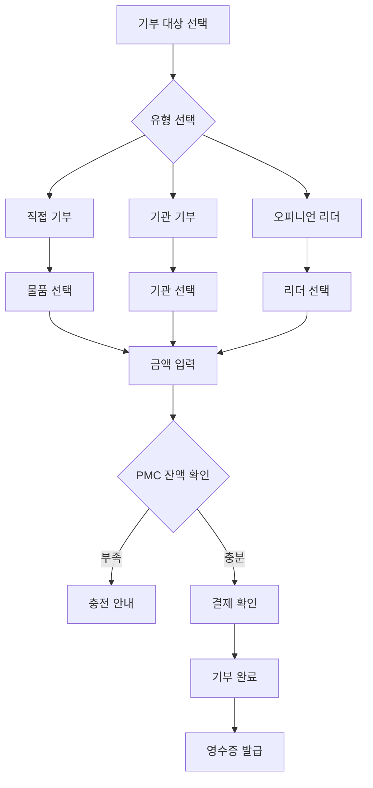

# Donation 도메인 UI/UX 가이드

> PMC를 활용한 기부 시스템의 UI/UX 설계

---

## 도메인 개요

**핵심 기능:**
- PMC로만 기부 가능 (PMP 직접 기부 불가)
- 직접 기부, 기관 기부, 오피니언 리더 후원
- 기부 내역 투명 공개

> ⚠️ **중요**: 기부는 **PMC로만 가능**합니다. 모든 플랫폼 활동의 최종 귀결점입니다.

---

## 컴포넌트 구조

### 핵심 컴포넌트 (7개)

| 컴포넌트 | 크기 | 용도 |
|----------|------|------|
| `DonationList` | 13KB | 기부 내역 목록 |
| `DonationDetail` | 12KB | 기부 상세 정보 |
| `DonationForm` | 11KB | 기부 입력 폼 |
| `DonationLeaderboard` | 10KB | 기부 순위표 |
| `DonationActivityPanel` | 9KB | 활동 패널 |
| `OpinionLeaderCard` | 4KB | 오피니언 리더 카드 |
| `InstituteCard` | 3KB | 기부 기관 카드 |

---

## 사용자 플로우

### 기부 실행 플로우



---

## 디자인 패턴

### 기부 유형별 색상

| 유형 | 색상 | 아이콘 |
|------|------|--------|
| 직접 기부 | `bg-green-50` | 🎁 |
| 기관 기부 | `bg-blue-50` | 🏛️ |
| 리더 후원 | `bg-purple-50` | ⭐ |

### 기부 상태 표시

```typescript
// 대기 중
<Badge variant="outline">대기 중</Badge>

// 완료
<Badge variant="success">완료</Badge>

// 취소
<Badge variant="destructive">취소</Badge>
```

---

## 카드 컴포넌트 구조

### InstituteCard

```typescript
<InstituteCard
  name="유니세프"
  category="국제구호"
  description="전 세계 어린이를 위한..."
  totalDonations={1234567}
  donorCount={5678}
  imageUrl="/institutes/unicef.png"
  onDonate={handleDonate}
/>
```

### OpinionLeaderCard

```typescript
<OpinionLeaderCard
  name="김민준"
  field="환경"
  bio="환경 정책 전문가..."
  followers={12345}
  totalSupport={987654}
  verified={true}
  onSupport={handleSupport}
/>
```

---

## 파일 위치

```
bounded-contexts/donation/presentation/
├── components/
│   ├── DonationList.tsx
│   ├── DonationDetail.tsx
│   ├── DonationForm.tsx
│   ├── DonationLeaderboard.tsx
│   ├── DonationActivityPanel.tsx
│   ├── InstituteCard.tsx
│   └── OpinionLeaderCard.tsx
├── hooks/
│   └── useDonation.ts
└── actions.ts
```

---

**버전**: 1.0 | **업데이트**: 2026-01-13
