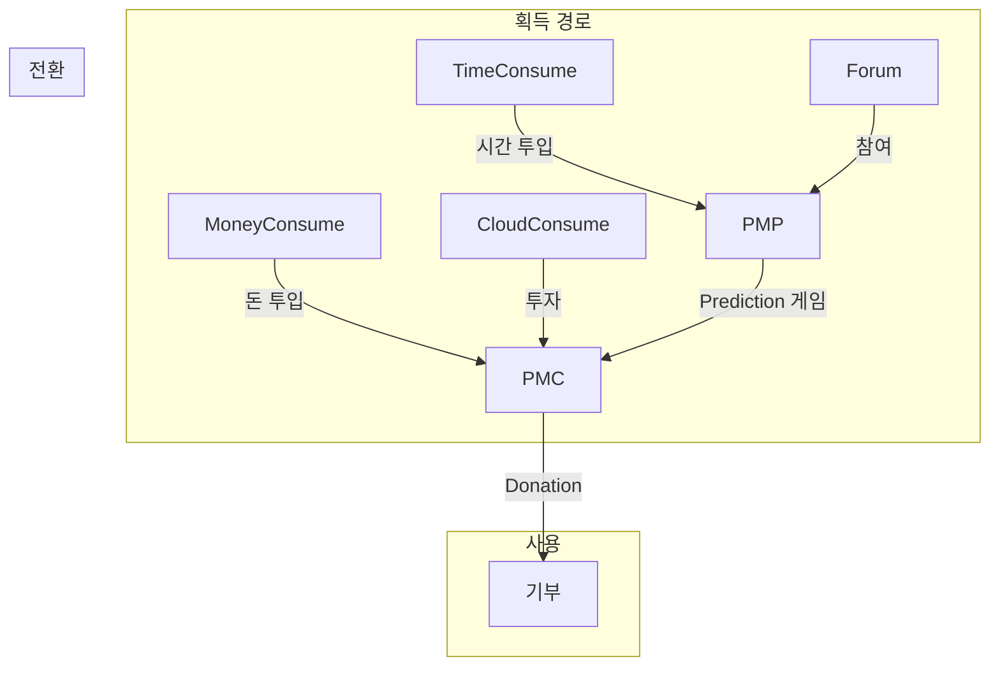
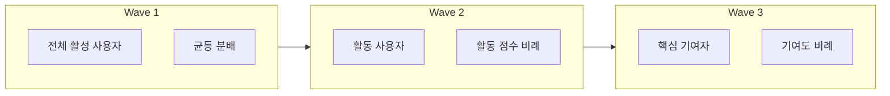
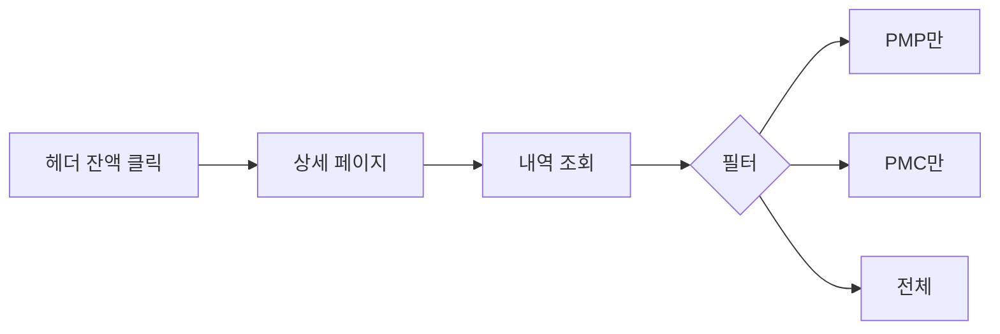

# Economy 도메인 UI/UX 가이드

> PMP/PMC 경제 시스템의 UI/UX 설계

---

## 도메인 개요

**핵심 기능:**
- PMP (Point Major Policy): 예측 참여권
- PMC (Point Minor Community): 기부 전용 통화
- MoneyWave: 3단계 보상 분배 시스템

**Value Chain:**


---

## 컴포넌트 구조

### 핵심 표시 컴포넌트

| 컴포넌트 | 용도 | 위치 |
|----------|------|------|
| `UserEconomicBalance` | PMP/PMC 잔액 표시 | 헤더, 사이드바 |
| `BalanceCard` | 잔액 상세 카드 | 마이페이지 |
| `TransactionHistory` | 거래 내역 목록 | 마이페이지 |
| `MoneyWaveStatus` | MoneyWave 현황 | 대시보드 |

### MoneyWave 시각화



---

## 디자인 패턴

### 통화 표시 규칙

```typescript
// PMP 표시 (보라색 계열)
<span className="text-purple-600">🔮 1,234 PMP</span>

// PMC 표시 (금색 계열)
<span className="text-amber-600">💰 5,678 PMC</span>

// 변동 표시
<span className="text-success-600">+100 PMC</span>
<span className="text-error-600">-50 PMP</span>
```

### 잔액 상태 표시

| 상태 | 스타일 | 설명 |
|------|--------|------|
| Available | 기본 색상 | 사용 가능 |
| Locked | `opacity-50` | 게임 참여 중 잠김 |
| Pending | `animate-pulse` | 처리 중 |

---

## 사용자 플로우

### 잔액 조회 플로우


---

## 파일 위치

```
bounded-contexts/economy/presentation/
├── components/
│   ├── BalanceCard.tsx
│   ├── TransactionHistory.tsx
│   ├── MoneyWaveStatus.tsx
│   └── ...
└── hooks/
    ├── useBalance.ts
    └── useMoneyWave.ts
```

---

**버전**: 1.0 | **업데이트**: 2026-01-13
