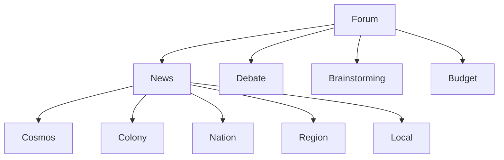
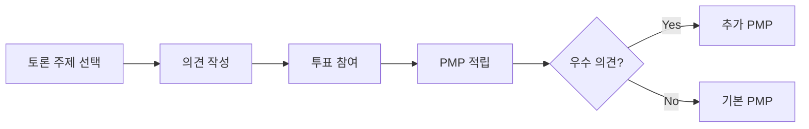

# Forum 도메인 UI/UX 가이드

> 커뮤니티 및 의사소통 시스템의 UI/UX 설계

---

## 도메인 개요

**핵심 기능:**
- News: 네트워크 뉴스 (Cosmos → Local 계층)
- Debate: 토론/토의
- Brainstorming: 아이디어 제안
- Budget: 예산 참여

**획득 통화:** PMP (시간 투입 기반)

---

## 계층 구조



---

## 컴포넌트 구조

### 현재 구현 (8개)

| 컴포넌트 | 용도 |
|----------|------|
| `NewsCard` | 뉴스 카드 |
| `NewsList` | 뉴스 목록 |
| `DebateRoom` | 토론방 |
| `CommentThread` | 댓글 스레드 |
| `IdeaCard` | 아이디어 카드 |
| `VotingPanel` | 투표 패널 |
| `BudgetProposal` | 예산 제안 |
| `ContributorBadge` | 기여자 배지 |

---

## 사용자 플로우

### 토론 참여 플로우



---

## 디자인 패턴

### 기여도 표시

```typescript
// 기여자 레벨
<Badge variant="gold">Gold 기여자</Badge>
<Badge variant="silver">Silver 기여자</Badge>
<Badge variant="bronze">Bronze 기여자</Badge>
```

### 투표 시각화

```typescript
// 실시간 투표 결과
<VotingBar
  options={[
    { label: "찬성", votes: 65 },
    { label: "반대", votes: 35 }
  ]}
/>
```

---

## 파일 위치

```
bounded-contexts/forum/presentation/
├── components/
│   ├── news/
│   ├── debate/
│   ├── brainstorming/
│   └── budget/
└── hooks/
```

---

**버전**: 1.0 | **업데이트**: 2026-01-13
