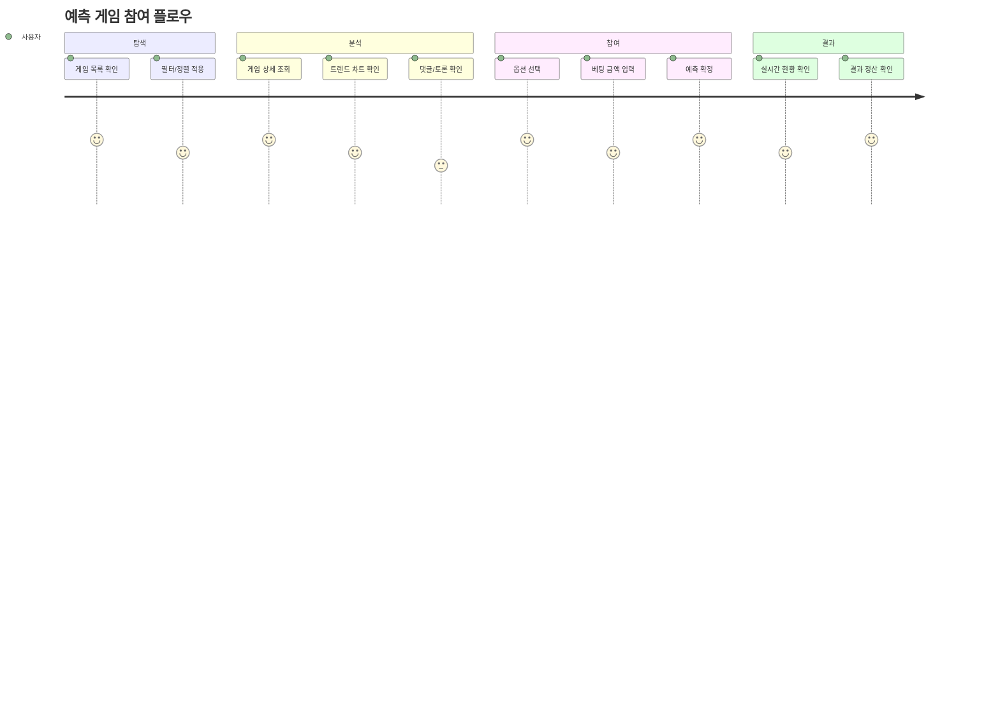
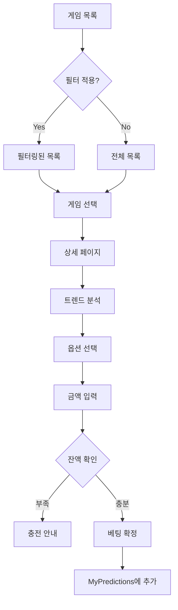
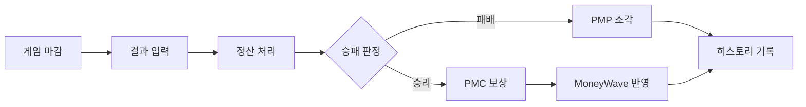

# Prediction 도메인 UI/UX 가이드

> 예측 시장(Prediction Market) 시스템의 UI/UX 설계

---

## 도메인 개요

**핵심 기능:**
- PMP를 사용한 사회적 이슈 예측 참여
- 실시간 배당률 및 트렌드 시각화
- MoneyWave 연동 PMC 보상 지급

**사용자 여정:**


---

## 컴포넌트 계층 구조

### 1. Core Cards (핵심 카드)

| 컴포넌트 | 용도 | 위치 |
|----------|------|------|
| `PredictionGameCard` | 게임 전체 정보 표시 (25KB) | 목록/상세 |
| `PredictionStockCard` | 주식 스타일 컴팩트 뷰 | 대시보드 |
| `CompactMoneyWaveCard` | MoneyWave 현황 | 사이드바 |
| `UserPositionCard` | 사용자 베팅 현황 | 마이페이지 |
| `UserEconomicBalance` | PMP/PMC 잔액 | 헤더/사이드바 |

### 2. Lists (목록)

| 컴포넌트 | 특징 |
|----------|------|
| `PredictionGameList` | 기본 목록 |
| `ResponsivePredictionGameList` | 반응형 (모바일/데스크탑) |
| `PredictionGameListWithFilter` | 필터링 + 정렬 지원 |
| `PredictionGameListWithVirtualization` | 가상화 (대량 데이터) |

### 3. Charts (차트)

```
charts/
├── PredictionTrendChart.tsx    # 예측 트렌드 (시계열)
├── LivePriceChart.tsx          # 실시간 가격
├── OrderBookWidget.tsx         # 주문 현황
└── [기타 5개 하위 컴포넌트]
```

### 4. Betting (베팅 플로우)

```
betting/
├── BettingForm.tsx             # 베팅 폼
├── BettingConfirmModal.tsx     # 확인 모달
├── BettingSlider.tsx           # 금액 슬라이더
├── OddsDisplay.tsx             # 배당률 표시
├── OptionSelector.tsx          # 옵션 선택
└── StakeInput.tsx              # 스테이크 입력
```

### 5. Realtime (실시간)

```
realtime/
├── RealtimePredictionStatus.tsx  # 실시간 상태
├── LiveOddsIndicator.tsx         # 실시간 배당률
└── ParticipantCounter.tsx        # 참여자 수
```

### 6. Mobile (모바일 최적화)

```
mobile/
├── MobilePredictionCard.tsx
├── MobileChartView.tsx
└── SwipeableBettingPanel.tsx
```

---

## 디자인 패턴

### 상태별 색상 체계

| 상태 | 색상 | 용도 |
|------|------|------|
| **PENDING** | `bg-gray-100` | 대기 중 게임 |
| **ACTIVE** | `bg-primary-50` | 진행 중 게임 |
| **CLOSED** | `bg-warning-50` | 마감된 게임 |
| **SETTLED** | `bg-success-50` / `bg-error-50` | 정산 완료 (승/패) |

### 배당률 변화 표시

```typescript
// 상승: 녹색 + 화살표 ↑
<span className="text-success-600">+2.3% ↑</span>

// 하락: 빨강 + 화살표 ↓
<span className="text-error-600">-1.5% ↓</span>

// 변동 없음: 회색
<span className="text-gray-500">0.0%</span>
```

---

## 주요 사용자 플로우

### 1. 예측 참여 플로우



### 2. 결과 확인 플로우



---

## 반응형 브레이크포인트

| 디바이스 | 너비 | 레이아웃 |
|----------|------|----------|
| Mobile | < 640px | 단일 컬럼, 스와이프 UI |
| Tablet | 640-1024px | 2컬럼 그리드 |
| Desktop | > 1024px | 3컬럼 + 사이드바 |

### 모바일 최적화

- **카드 스와이프**: 좌우 스와이프로 옵션 선택
- **바텀 시트**: 베팅 폼은 바텀 시트로 표시
- **축약 차트**: 모바일에서는 간소화된 차트

---

## 성능 최적화

### 가상화 (Virtualization)
- 50개 이상의 게임 목록: `PredictionGameListWithVirtualization` 사용
- react-window 기반 가상 스크롤

### 실시간 업데이트
- Supabase Realtime 구독
- 5초 단위 폴링 (fallback)
- 웹소켓 연결 상태 표시

---

## 파일 위치

```
bounded-contexts/prediction/presentation/
├── components/           # 모든 UI 컴포넌트
│   ├── betting/          # 베팅 관련
│   ├── charts/           # 차트 관련
│   ├── mobile/           # 모바일 전용
│   ├── realtime/         # 실시간 업데이트
│   └── ...
├── hooks/                # 커스텀 훅
│   ├── usePredictionGames.ts
│   ├── useBetting.ts
│   └── ...
├── actions/              # 서버 액션
└── utils/                # 유틸리티
```

---

**버전**: 1.0 | **업데이트**: 2026-01-13
