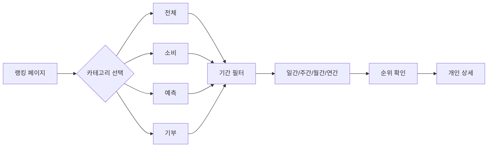

# Ranking 도메인 UI/UX 가이드

> 랭킹 및 순위 시스템의 UI/UX 설계

---

## 도메인 개요

**핵심 기능:**
- 다양한 활동 기반 종합 랭킹
- 기간별/분야별 순위 제공
- 개인/기업/단체 랭킹

**계층 구조:**
```
Cosmos → Colony → Nation → Region → Local
```

---

## 현재 상태

> ⚠️ **초기 개발 단계**: 현재 1개 컴포넌트만 구현됨

### 구현된 컴포넌트

```
ranking/presentation/
└── components/
    └── RankingTable.tsx
```

---

## 개발 예정 컴포넌트

### 랭킹 표시

| 컴포넌트 | 용도 |
|----------|------|
| `RankingTable` | 순위 테이블 |
| `RankingCard` | 개인 순위 카드 |
| `TopPerformers` | 상위 순위자 |
| `RankingChart` | 순위 변동 차트 |
| `ActivityScore` | 활동 점수 표시 |

### 카테고리별 랭킹

| 컴포넌트 | 분야 |
|----------|------|
| `ConsumeRanking` | 소비 랭킹 |
| `PredictionRanking` | 예측 랭킹 |
| `DonateRanking` | 기부 랭킹 |
| `ForumRanking` | 포럼 활동 랭킹 |

---

## 디자인 패턴

### 순위 뱃지

```typescript
// 1등
<Badge className="bg-gold-500 text-white">🥇 1위</Badge>

// 2등
<Badge className="bg-silver-500 text-white">🥈 2위</Badge>

// 3등
<Badge className="bg-bronze-500 text-white">🥉 3위</Badge>
```

### 순위 변동 표시

```typescript
// 상승
<span className="text-success-600">▲ 5</span>

// 하락
<span className="text-error-600">▼ 3</span>

// 유지
<span className="text-gray-500">-</span>

// 신규
<span className="text-primary-600">NEW</span>
```

---

## 사용자 플로우



---

## 파일 위치

```
bounded-contexts/ranking/presentation/
└── components/
    └── RankingTable.tsx
```

---

**버전**: 1.0 | **업데이트**: 2026-01-13
