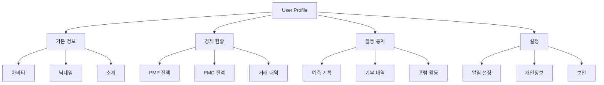
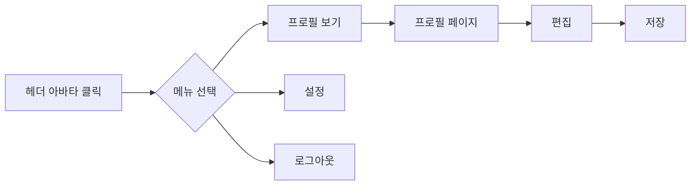

# User 도메인 UI/UX 가이드

> 사용자 프로필 및 계정 관리 UI/UX 설계

---

## 도메인 개요

**핵심 기능:**
- 사용자 프로필 관리
- 계정 설정
- 활동 통계/히스토리

---

## 프로필 구조



---

## 컴포넌트 구조

### 프로필 표시

| 컴포넌트 | 용도 |
|----------|------|
| `ProfileCard` | 프로필 카드 |
| `AvatarUpload` | 아바타 업로드 |
| `ProfileForm` | 프로필 편집 폼 |
| `StatsSummary` | 통계 요약 |

### 활동 히스토리

| 컴포넌트 | 용도 |
|----------|------|
| `ActivityTimeline` | 활동 타임라인 |
| `PredictionHistory` | 예측 기록 |
| `DonationHistory` | 기부 내역 |

### 설정

| 컴포넌트 | 용도 |
|----------|------|
| `SettingsPanel` | 설정 패널 |
| `NotificationSettings` | 알림 설정 |
| `PrivacySettings` | 개인정보 설정 |

---

## 디자인 패턴

### 프로필 카드

```typescript
<ProfileCard
  avatar="/avatars/user.jpg"
  name="홍길동"
  username="@honggildong"
  level={5}
  badges={['Gold', 'Predictor']}
/>
```

### 레벨 표시

```typescript
// 레벨 프로그레스
<LevelProgress
  current={5}
  experience={750}
  nextLevel={1000}
/>
```

---

## 사용자 플로우



---

## 파일 위치

```
bounded-contexts/user/
├── application/
├── domain/
├── infrastructure/
└── presentation/
    └── components/
```

---

**버전**: 1.0 | **업데이트**: 2026-01-13
