# AI Agent Collaboration Guidelines (Enhanced Monorepo Edition)

> **Purpose**: AI Agent collaboration principles for monorepo + DDD + Clean Architecture projects  
> **Scope**: Communication methods, code quality, documentation, debugging, and monorepo-specific guidelines  
> **Application**: Monorepo projects with pnpm + turbo + Next.js 15 + React 19  
> **Last Updated**: 2025-07-03

## 🚨 **CRITICAL: Monorepo-First Development Rules**

### 🏗️ **Monorepo Environment Standards**

**❌ Single-repo commands are absolutely prohibited in monorepo environment!**

#### 📦 **Package Manager & Build System Requirements**

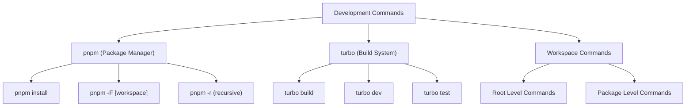

#### ✅ **Monorepo Command Standards (Mandatory)**

1. **Root Level Commands**: Use `turbo` for orchestration
2. **Package Level Commands**: Use `pnpm -F [workspace]` for specific packages
3. **Recursive Commands**: Use `pnpm -r` for all packages
4. **Build Optimization**: Always use turbo cache
5. **Dependency Management**: Use workspace protocols

#### ❌ **Absolutely Prohibited Commands**

- `npm install` (use `pnpm install`)
- `npm run build` (use `turbo build`)
- `yarn` commands (use `pnpm`)
- Direct package commands without workspace context
- Commands that bypass turbo cache

### 🔧 **Monorepo Development Workflow**

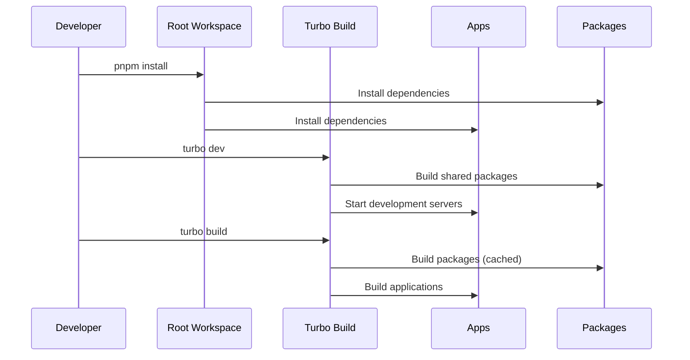

## 🚨 **CRITICAL: Mandatory Visualization Rules**

### 🎯 **Required for All Document Creation**

**❌ Documents without visualization are absolutely prohibited!**

#### 📊 **Minimum Visualization Requirements by Document Type**

1. **Analysis Report**: Minimum 5 charts required
2. **Task List**: Minimum 4 charts required  
3. **Tutorial**: Minimum 2 charts required
4. **How-to Guide**: Minimum 2 charts required
5. **Reference**: Minimum 1 chart required
6. **Explanation**: Minimum 2 charts required

#### 🎨 **Visualization Quality Standards (Mandatory)**

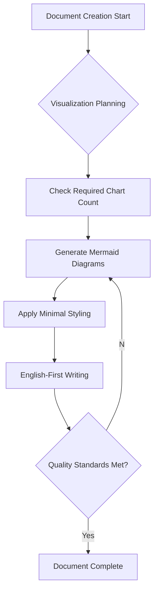

#### ✅ **Mandatory Compliance Items (Non-negotiable)**

1. **Minimal Styling**: Avoid colors unless absolutely necessary (use only low saturation/brightness colors for special cases)
2. **Mermaid v11.6.0 Usage**: Ensure Next.js 15 compatibility
3. **Complex Structure Encouraged**: Visualization should help understand complex concepts and relationships
4. **Rendering Verification**: Complete validation in Mermaid Live Editor

#### ❌ **Absolutely Prohibited**

- 3+ consecutive sections without visualization
- High saturation/brightness colors (only muted colors for special cases)
- Complex Korean-heavy diagrams
- Charts without rendering verification
- **quadrantChart usage** (complex syntax, rendering issues)

### 🔍 **Visualization Verification Checklist**

```
🔥 Critical (All items mandatory):
□ Document type minimum visualization count met
□ Minimal styling applied (avoid colors unless necessary)
□ Mermaid v11.6.0 syntax compliance
□ Complex structures allowed to explain difficult concepts
□ Rendering test completed

⚡ Quality (80% or higher compliance):
□ Clear chart titles
□ Appropriate chart type selection
□ Consistent minimal styling
□ Text and visualization balance
□ Complex relationships properly visualized
```

## 📚 Table of Contents

- [1. Monorepo Communication & Environment Setup](#1-monorepo-communication--environment-setup)
- [2. Code Quality & Monorepo Development Principles](#2-code-quality--monorepo-development-principles)
- [3. Monorepo Refactoring & Code Improvement](#3-monorepo-refactoring--code-improvement)
- [4. Debugging & Problem Solving in Monorepo](#4-debugging--problem-solving-in-monorepo)
- [5. Documentation & Communication](#5-documentation--communication)
- [6. Monorepo Collaboration & Quality Management](#6-monorepo-collaboration--quality-management)
- [7. Enhanced Visualization Guidelines](#7-enhanced-visualization-guidelines)
- [8. Final Checklist](#8-final-checklist)

---

## 1. Monorepo Communication & Environment Setup

### 📝 **Communication Principles**

- **Language**: Always respond in Korean and explain clearly for Korean developers
- **Encoding**: Use UTF-8 encoding to prevent Korean character corruption
- **Clarity**: Provide specific and clear explanations rather than ambiguous ones
- **🔥 Visualization Priority**: Include appropriate visualization in all explanations
- **🔥 Monorepo Context**: Always consider workspace relationships and dependencies

### 🏗️ **Monorepo Environment Setup**

#### **Required Tools & Versions**

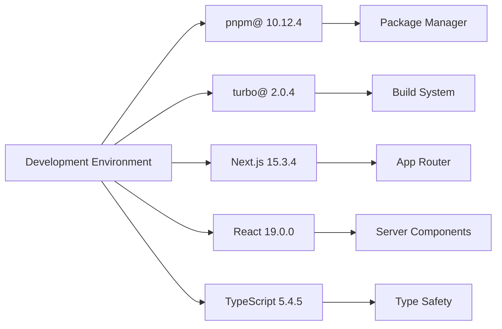

#### **Workspace Structure Understanding**

- **Root Level**: `pnpm install`, `turbo build`, `turbo dev`
- **App Level**: `pnpm -F posmul-web dev`, `pnpm -F android build`
- **Package Level**: `pnpm -F shared-types build`, `pnpm -F shared-ui test`
- **Cross-Package**: Use workspace protocols (`workspace:*`)

### 🔧 **Environment Considerations**

- **Path Specification**: Use monorepo-aware paths (e.g., `apps/posmul-web/src/...`)
- **Dependency Management**: Always consider workspace dependencies
- **Build Order**: Understand package build dependencies
- **🔥 Workspace Integration**: Include workspace context in all workflows

### 🚀 **Monorepo Workflow**

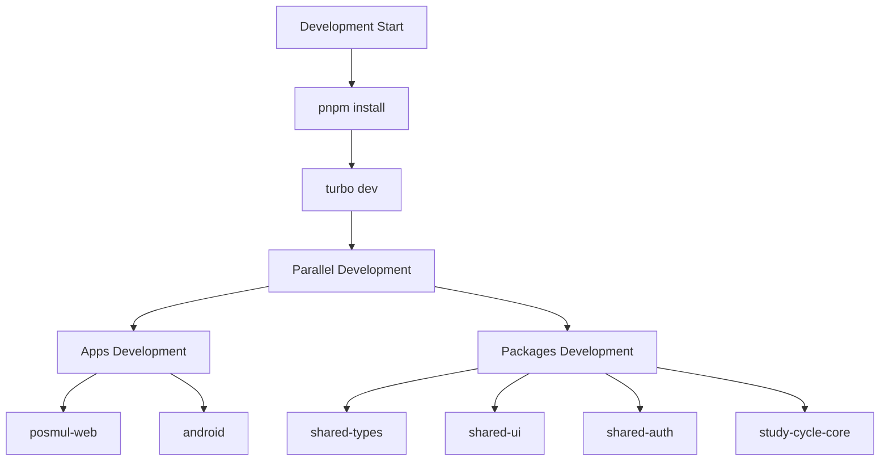

- **MCP Utilization**: Actively use MCP (Model Context Protocol) tools
- **Monorepo Execution**: Execute commands with workspace context
- **Build Optimization**: Leverage turbo cache for faster builds

---

## 2. Code Quality & Monorepo Development Principles

### 🏗️ **General Development Principles**

- **Context7 MCP Integration**: Search and apply best practices
- **Monorepo-First Thinking**: Always consider cross-package impacts
- **Workspace Dependencies**: Use workspace protocols for internal dependencies
- **Build Optimization**: Leverage turbo cache and parallelization
- **Package Boundaries**: Respect package boundaries and interfaces
- **🔥 Visualization Documentation**: Include architecture diagrams in all code explanations

### 🎯 **Monorepo Code Structure Principles**

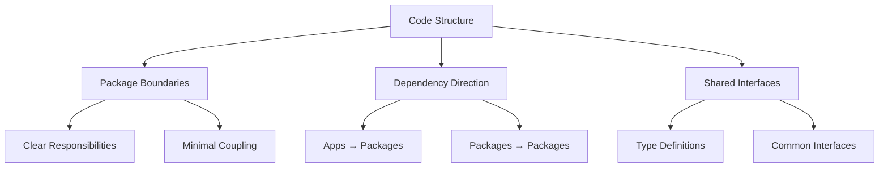

- **Package Modularity**: Design packages to be independently testable and buildable
- **Dependency Flow**: Apps depend on packages, packages can depend on other packages
- **Interface Contracts**: Use shared-types for interface definitions
- **Build Dependencies**: Consider build order and optimization

### 📊 **Monorepo Performance & Security**

- **Build Performance**: Use turbo cache effectively
- **Bundle Optimization**: Avoid duplicate dependencies across packages
- **Security Consistency**: Apply security standards across all packages
- **Resource Management**: Share resources efficiently across packages

---

## 3. Monorepo Refactoring & Code Improvement

### 🔄 **Monorepo Refactoring Guidelines**

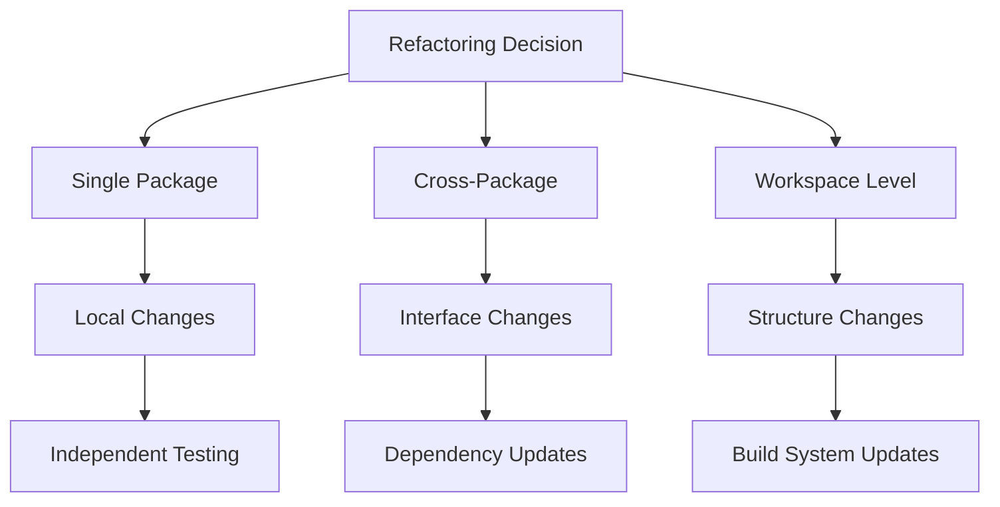

- **Context7 MCP Integration**: Search and apply best practices
- **Impact Analysis**: Analyze cross-package impacts before refactoring
- **Package Boundaries**: Respect package boundaries during refactoring
- **Build Verification**: Ensure all packages build after refactoring
- **🔥 Visual Impact Analysis**: Visualize refactoring impact with dependency graphs

### 📈 **Monorepo Improvement Strategy**

- **Incremental Changes**: Make small changes across multiple packages
- **Dependency Updates**: Update workspace dependencies systematically
- **Build Optimization**: Continuously improve build performance

---

## 4. Debugging & Problem Solving in Monorepo

### 🐛 **Monorepo Debugging Support**

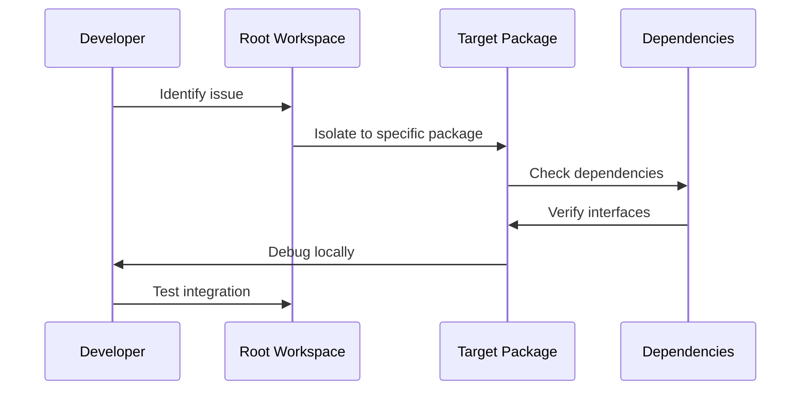

- **Context7 MCP Integration**: Search and apply best practices
- **Package Isolation**: Debug issues within specific packages first
- **Dependency Tracing**: Trace issues across package boundaries
- **Build Debugging**: Use turbo verbose mode for build issues
- **🔥 Debugging Flow Visualization**: Visualize debugging process with dependency flows

### 🔍 **Monorepo Problem Analysis**

- **Package-Level Issues**: Isolate problems to specific packages
- **Integration Issues**: Focus on package interface mismatches
- **Build Issues**: Use turbo logs for build problem analysis

---

## 5. Documentation & Communication

### 📚 **Monorepo Documentation Standards**

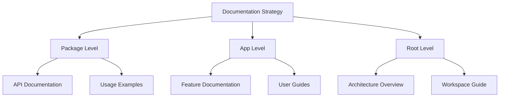

- **Package Documentation**: Each package must have clear README and API docs
- **Workspace Documentation**: Root-level documentation for overall architecture
- **Cross-Package Documentation**: Document package relationships and dependencies
- **🔥 Mandatory Visualization**: Include required visualization in all documents

### 🎨 **Monorepo Documentation Style**

- **Consistency**: Maintain consistent documentation style across all packages
- **Completeness**: Ensure all packages have adequate documentation
- **Workspace Awareness**: Include workspace context in all documentation
- **🔥 Visual Hierarchy**: Use dependency graphs and architecture diagrams

---

## 6. Monorepo Collaboration & Quality Management

### 🤝 **Monorepo Team Collaboration**

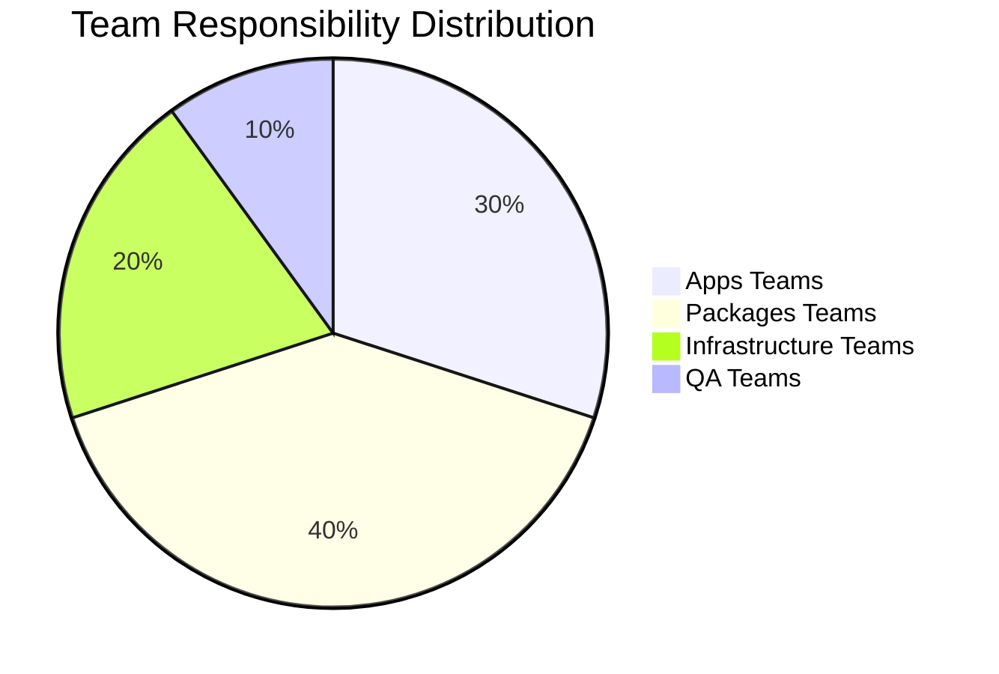

- **Package Ownership**: Clear ownership of packages and their interfaces
- **Integration Testing**: Comprehensive testing across package boundaries
- **Build Pipeline**: Shared build pipeline with package-specific optimizations

### 🎯 **Monorepo Quality Assurance**

- **Package Testing**: Independent testing of each package
- **Integration Testing**: Testing across package boundaries
- **Build Verification**: Continuous integration with turbo cache

---

## 7. Enhanced Visualization Guidelines

### 🎨 **Essential Visualization Principles**

#### 📊 **Monorepo Visualization Requirements**

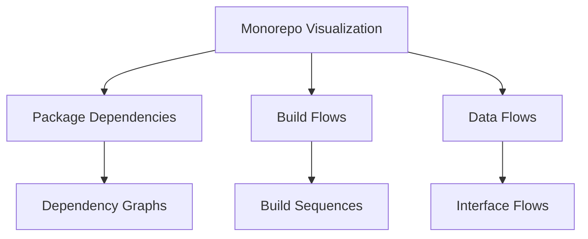

All monorepo documents must include:

- **Package Dependency Graphs**: Show relationships between packages
- **Build Flow Diagrams**: Visualize build order and optimization
- **Interface Documentation**: Show package interfaces and contracts
- **Architecture Overviews**: High-level system architecture

#### 🎨 **Minimal Styling Guidelines**

**Color Usage Rules:**

- **Default**: Use Mermaid's default styling (no colors)
- **Special Cases Only**: Apply colors only when absolutely necessary (low saturation/brightness only)
- **Accessibility**: Ensure color-blind friendly when colors are used
- **Consistency**: Maintain consistent minimal styling across documents

### 📋 **Monorepo Visualization Quality Verification Process**

#### Stage 1: Monorepo Planning

```
□ Confirm required visualization count per document type
□ Define package relationships and dependencies
□ Plan build flow documentation
□ Plan interface documentation
```

#### Stage 2: Creation

```
□ Generate package dependency graphs
□ Create build flow diagrams
□ Document interface contracts
□ Apply minimal styling
```

#### Stage 3: Validation

```
□ Verify dependency accuracy
□ Test build flow correctness
□ Validate interface documentation
□ Complete rendering test
```

---

## 8. Final Checklist

### ✅ **Monorepo Code Quality Check**

- [ ] **Package Boundaries**: Are package boundaries respected?
- [ ] **Workspace Dependencies**: Are workspace protocols used correctly?
- [ ] **Build Optimization**: Is turbo cache utilized effectively?
- [ ] **Cross-Package Impact**: Are cross-package impacts considered?
- [ ] **🔥 Monorepo Visualization**: Are package dependencies visualized?

### ✅ **Monorepo Documentation Check**

- [ ] **Package Documentation**: Does each package have adequate documentation?
- [ ] **Workspace Documentation**: Is overall architecture documented?
- [ ] **Dependency Documentation**: Are package relationships documented?
- [ ] **🔥 Mandatory Visualization**: Are required charts included per document type?
- [ ] **🎨 Minimal Styling**: Is minimal styling applied?

### ✅ **Monorepo Collaboration Check**

- [ ] **Package Ownership**: Are package responsibilities clear?
- [ ] **Integration Testing**: Are cross-package tests adequate?
- [ ] **Build Pipeline**: Is build pipeline optimized?
- [ ] **🔥 Visual Communication**: Are complex relationships visualized?

### ✅ **Enhanced Monorepo Visualization Check**

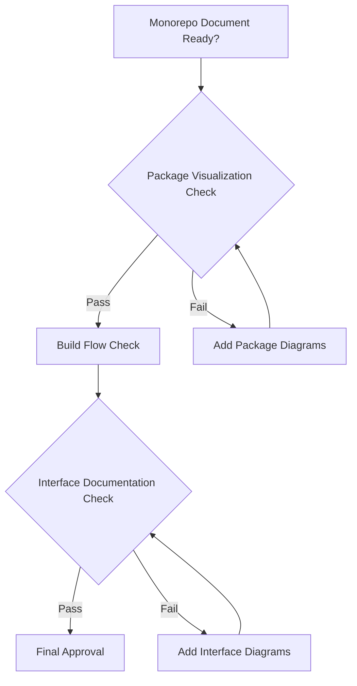

**🔥 Critical Monorepo Visualization Checks:**

- [ ] Package dependency graphs included
- [ ] Build flow diagrams present
- [ ] Interface contracts documented
- [ ] Architecture overviews provided
- [ ] Minimal styling applied
- [ ] Rendering tests completed

---

## 📋 **Monorepo Usage Guidelines**

### **When to Use Monorepo Guidelines**

- Setting up monorepo development workflows
- Managing cross-package dependencies
- Optimizing build performance with turbo
- Coordinating multi-package development
- **🔥 Ensuring monorepo visualization compliance**

### **Monorepo Command Quick Reference**

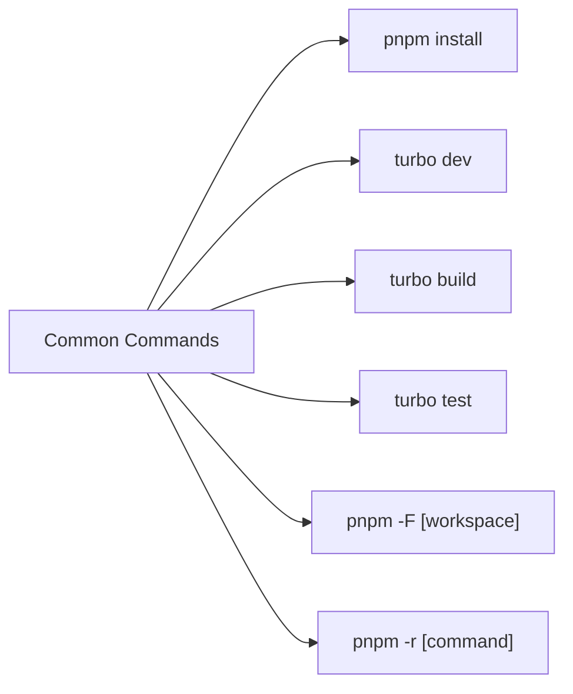

**PowerShell Commands (Monorepo Edition):**

```powershell
# Root level development
pnpm install
turbo dev
turbo build
turbo test

# Specific package commands
pnpm -F posmul-web dev
pnpm -F shared-types build
pnpm -F shared-ui test

# Cross-package commands
pnpm -r build
pnpm -r test
pnpm -r lint
```

---

**Note**: These enhanced guidelines are specifically designed for monorepo environments with pnpm + turbo + Next.js 15 + React 19. For single-repo projects, refer to separate documentation.

**🎯 Enhanced Monorepo Note**: These guidelines ensure optimal monorepo development workflows with proper visualization and documentation standards. All commands and workflows are optimized for the monorepo environment.
