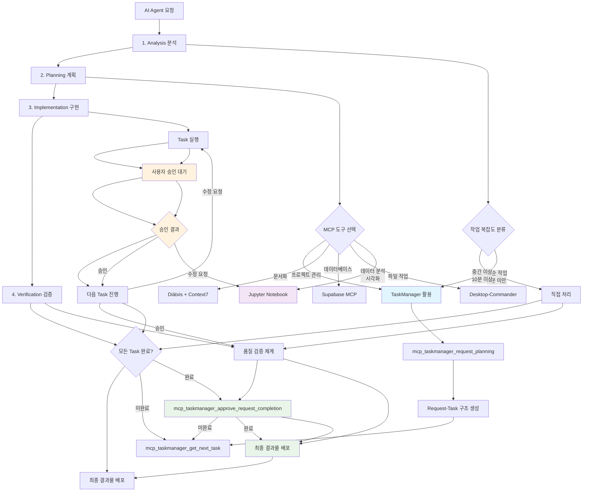
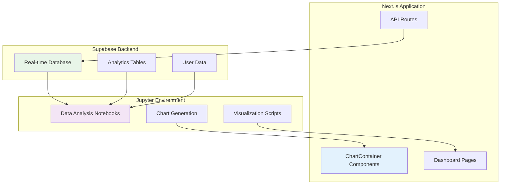
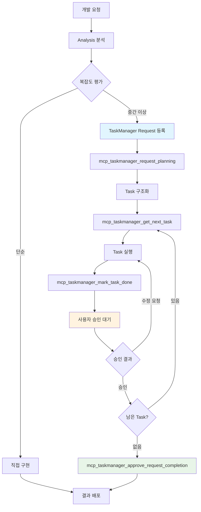
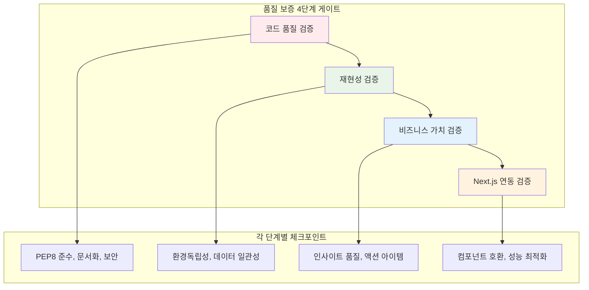
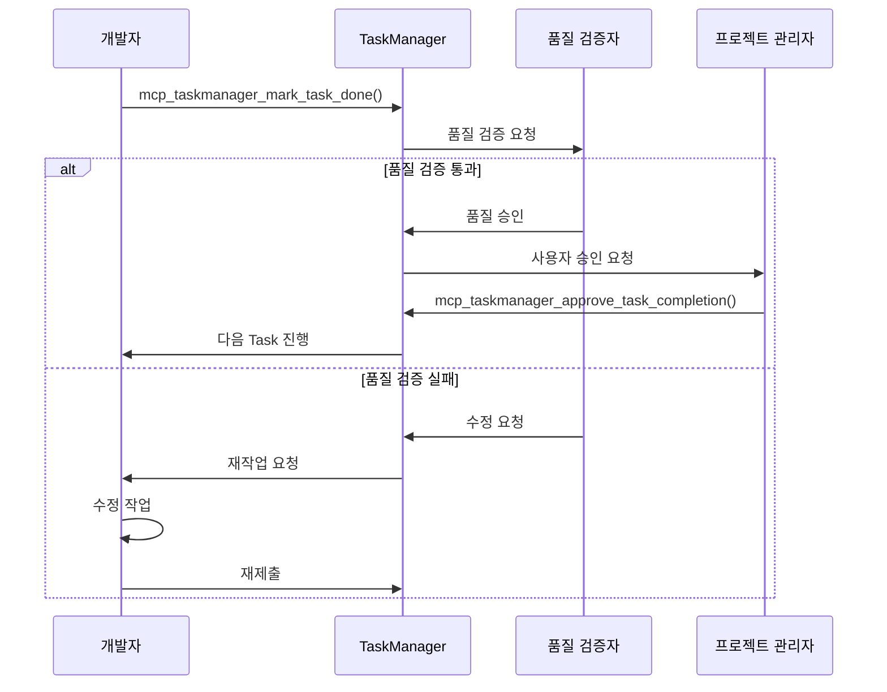
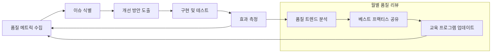

# AI Agent 통합 워크플로우 지침 v2.1 (Integrated AI Agent Workflow Guidelines)

  

## 📋 메타데이터 (Metadata)

  

| 항목 | 상세 정보 |

|------|-----------|

| **문서 버전** | 2.1.0 |

| **작성일** | 2025-06-16 |

| **최종 수정일** | 2025-06-19 |

| **문서 유형** | 통합 워크플로우 지침 |

| **적용 범위** | posmul-platform 프로젝트 전체 |

| **의존성** | MCP 5종 (Jupyter Notebook 추가), Diátxis Framework, Mermaid.js |

  

---

  

## 🎯 목차 (Table of Contents)

  

1. 목표 및 개요

2. MCP 활용 전략

3. Jupyter Notebook 통합 전략 ⭐ NEW

4. 문서화 표준

5. 프롬프트 엔지니어링

6. 품질 보증 체계

7. GitHub Copilot Instructions

8. 실무 적용 가이드

  

---

  

## 1. 목표 및 개요

  

### 1.1 통합 목표

- **MCP 5종 최적 활용**: Windows PowerShell 환경에서 UTF-8 인코딩 기반 자동화 (Jupyter Notebook 추가)

- **표준화된 문서화**: Diátxis 프레임워크 기반 일관된 문서 품질

- **시각적 커뮤니케이션**: Mermaid.js 다이어그램 중심 프로세스 설명

- **데이터 기반 의사결정**: Jupyter Notebook을 통한 분석 및 시각화 워크플로우

- **지속적 품질 향상**: 메타데이터 기반 버전 관리 및 품질 추적

- **개선된 4단계 워크플로우**: Analysis → Planning → Implementation → Verification

  

### 1.2 개선된 AI Agent 워크플로우 통합

  



  

### 1.3 워크플로우 연계 문서

- **How-to: 개선된 AI 워크플로우 구현하기** - 실제 적용 단계별 가이드

- **How-to: TaskManager에서 작업 구조화하기** - 태스크 관리 실무 가이드

- **How-to: Copilot Instructions 업데이트하기** - AI 지침 관리 방법

  

---

  

## 2. MCP 활용 전략

  

### 2.1 MCP 5종 역할 정의

  

#### 🎯 TaskManager MCP

- **주요 역할**: 프로젝트 request-task 구조 관리, approval 워크플로우 자동화

- **적용 영역**:

  - 구조화된 개발 프로젝트 계획 및 실행

  - 작업별 승인 게이트를 통한 품질 보증

  - 문서화 작업의 단계별 진행 관리

  - 멀티 스텝 워크플로우의 진행 상황 추적

- **문서화 연계**: 프로젝트 진행률 테이블 및 승인 워크플로우 다이어그램 생성

  

#### 🗄️ Supabase MCP  

- **주요 역할**: 데이터베이스 스키마 관리, 데이터 조작

- **적용 영역**:

  - Migration 스크립트 자동 생성

  - 데이터베이스 구조 문서화

  - API 엔드포인트 테스트 및 검증

- **문서화 연계**: ERD 다이어그램, API 참조 문서 생성

  

#### 💻 Desktop-Commander MCP

- **주요 역할**: 로컬 파일 시스템 조작, 대용량 처리

- **적용 영역**:

  - 문서 템플릿 일괄 적용

  - 로그 파일 분석 및 리포트 생성

  - 프로젝트 구조 문서화

- **문서화 연계**: 파일 구조 다이어그램, 설정 파일 문서화

  

#### 📚 Context7 MCP

- **주요 역할**: 기술 문서 검색, Best Practice 조사

- **적용 영역**:

  - 최신 기술 동향 및 표준 조사

  - 라이브러리 사용법 및 예제 수집

  - 아키텍처 패턴 및 설계 가이드라인 제공

- **문서화 연계**: Reference 문서, Explanation 문서 강화

  

#### 📊 Jupyter Notebook MCP ⭐ NEW

- **주요 역할**: 데이터 분석, 시각화, Interactive 문서화

- **적용 영역**:

  - posmul 예측 게임 데이터 분석 및 시각화

  - Supabase 데이터 실시간 분석 및 리포팅

  - 알고리즘 프로토타이핑 및 검증

  - 교육용 Interactive 문서 생성

- **문서화 연계**: Tutorial 노트북, 분석 결과 시각화 문서

- **통합 아키텍처**: Next.js + Supabase + Jupyter 환경에서 Recharts 기반 차트 컴포넌트 재사용

  

### 2.2 MCP 조합 전략

  

```mermaid

graph TB

    subgraph "TaskManager 중심 승인 기반 워크플로우"

        A1[mcp_taskmanager_request_planning] --> A2[Request 등록]

        A2 --> A3[Task 구조화]

        A3 --> A4[mcp_taskmanager_get_next_task]

        A4 --> A5{Task 유형 분석}        A5 -->|문서 작성| B1[Context7 + Desktop-Commander]

        A5 -->|DB 작업| B2[Supabase MCP]

        A5 -->|코드 개발| B3[Context7 + Desktop-Commander]

        A5 -->|분석 작업| B4[Desktop-Commander + Context7]

        A5 -->|데이터 분석\n시각화| B5[Jupyter Notebook + Supabase]        B1 --> C1[Task 실행]

        B2 --> C1

        B3 --> C1

        B4 --> C1

        B5 --> C1

        C1 --> C2[mcp_taskmanager_mark_task_done]

        C2 --> C3[사용자 승인 대기]

        C3 --> C4{승인 결과}

        C4 -->|승인| C5[다음 Task]

        C4 -->|수정 요청| C1

        C5 --> A4

        C5 --> D1{모든 Task 완료?}

        D1 -->|미완료| A4

        D1 -->|완료| D2[mcp_taskmanager_approve_request_completion]

    end

    subgraph "MCP 역할별 특화 영역"        E1[TaskManager: 프로젝트 관리]

        E2[Context7: 기술 조사]

        E3[Supabase: 데이터베이스]

        E4[Desktop-Commander: 파일 작업]

        E5[Jupyter Notebook: 데이터 분석 & 시각화]

    end

    subgraph "품질 보증 게이트"

        F1[각 Task 완료 시 승인]

        F2[Request 완료 시 승인]

        F3[Cross-validation 검증]

        F4[메타데이터 품질 체크]

    end

    style A1 fill:#e1f5fe

    style C3 fill:#fff3e0

    style D2 fill:#e8f5e8

    style F1 fill:#ffebee

```

  

### 2.3 환경별 MCP 활용 가이드

  

#### Windows PowerShell 환경 최적화

```powershell

# ✅ 올바른 PowerShell 명령어 체이닝

cd C:\Dev\posmul-platform; npm install; npm run build; npm test

  

# ❌ 잘못된 명령어 (&&는 PowerShell 미지원)

cd C:\Dev\posmul-platform && npm install && npm run build

```

  

#### UTF-8 인코딩 강제 적용

- 모든 파일 생성 시 UTF-8 인코딩 명시

- 한글 문서 작성 시 인코딩 검증 필수

- 메타데이터에 인코딩 정보 포함

  

---

  

## 3. Jupyter Notebook 통합 전략 ⭐ NEW

  

### 3.1 Jupyter Notebook 역할 및 활용 영역

  

#### 📊 **데이터 분석 및 시각화**
- **posmul 예측 게임 데이터 분석**: 예측 정확도, 사용자 행동 패턴 분석
- **실시간 대시보드**: Supabase 데이터를 활용한 실시간 분석 결과 시각화
- **성과 지표 모니터링**: KPI 추적 및 트렌드 분석

#### 🔬 **프로토타이핑 및 검증**
- **알고리즘 검증**: 예측 알고리즘의 효과성 사전 검증
- **A/B 테스트 분석**: 기능 개선안의 성과 측정
- **시뮬레이션**: 다양한 시나리오 기반 예측 시뮬레이션

#### 📚 **Interactive 문서화**
- **기술 문서**: 분석 과정과 결과를 시각적으로 설명
- **교육 자료**: 팀원 교육 및 온보딩용 Interactive 가이드
- **의사결정 지원**: 데이터 기반 의사결정을 위한 분석 리포트

### 3.2 Next.js + Supabase 통합 아키텍처

  



  

### 3.3 데이터 분석 및 시각화 워크플로우

  

#### **1단계: 데이터 수집 및 전처리**
```python
# Supabase 직접 연결을 통한 실시간 데이터 수집
import supabase
from datetime import datetime, timedelta

client = supabase.create_client(SUPABASE_URL, SUPABASE_KEY)
prediction_data = client.table('predictions').select('*').execute()
```

#### **2단계: 분석 및 시각화**
```python
# Recharts 호환 포맷으로 데이터 변환
chart_data = transform_for_recharts(analysis_results)

# CSS 변수 기반 테마 적용
chart_config = {
    "accuracy": {"color": "var(--chart-1)"},
    "confidence": {"color": "var(--chart-2)"}
}
```

#### **3단계: Next.js 컴포넌트 연동**
- Jupyter에서 생성한 차트 구성을 Next.js ChartContainer로 이전
- CSS 변수를 통한 일관된 테마 적용
- 접근성 고려한 차트 설정 (accessibilityLayer 활성화)

### 3.4 MCP와 Jupyter 연동 패턴

  

#### **Jupyter + Supabase MCP**
```javascript
// 실시간 데이터 동기화
const liveAnalysis = () => {
  supabase
    .channel('prediction-updates')
    .on('postgres_changes', 
        { event: '*', schema: 'public', table: 'predictions' },
        payload => updateJupyterAnalysis(payload)
    )
    .subscribe()
}
```

#### **Jupyter + TaskManager MCP**
- 분석 작업을 Task로 구조화하여 관리
- 각 분석 단계별 승인 게이트 적용
- 분석 결과 품질 검증 및 문서화

#### **Jupyter + Context7 MCP**
- 최신 데이터 분석 Best Practice 조사
- 시각화 라이브러리 업데이트 가이드
- 통계 분석 방법론 연구 및 적용

### 3.5 실전 활용 시나리오

#### 📈 **시나리오 1: 예측 정확도 분석**
```python
# 1. Supabase 데이터 수집
import pandas as pd
import numpy as np
from supabase import create_client

# 예측 데이터 수집
prediction_results = supabase_client.table('predictions')\
    .select('user_id, prediction_value, actual_value, confidence_level, created_at')\
    .gte('created_at', '2024-01-01')\
    .execute()

# 2. 정확도 계산 및 분석
df = pd.DataFrame(prediction_results.data)
df['accuracy'] = np.abs(df['prediction_value'] - df['actual_value']) / df['actual_value']
df['is_accurate'] = df['accuracy'] < 0.05  # 5% 이내 정확

# 3. 시각화 (Recharts 호환 포맷)
accuracy_by_confidence = df.groupby('confidence_level').agg({
    'is_accurate': 'mean',
    'accuracy': 'mean'
}).reset_index()

chart_data = accuracy_by_confidence.to_dict('records')
```

#### 📊 **시나리오 2: 사용자 행동 패턴 분석**
```python
# 사용자별 예측 빈도 및 성향 분석
user_patterns = supabase_client.table('user_predictions_view')\
    .select('user_id, prediction_frequency, avg_confidence, success_rate')\
    .execute()

# 클러스터링을 통한 사용자 그룹 분류
from sklearn.cluster import KMeans
user_clusters = KMeans(n_clusters=4).fit_predict(user_features)

# Next.js 대시보드용 데이터 포맷
dashboard_data = {
    "userSegments": user_cluster_data,
    "chartConfig": {
        "frequency": {"label": "예측 빈도", "color": "var(--chart-1)"},
        "confidence": {"label": "평균 신뢰도", "color": "var(--chart-2)"},
        "success": {"label": "성공률", "color": "var(--chart-3)"}
    }
}
```

#### 🔄 **시나리오 3: 실시간 A/B 테스트 모니터링**
```python
# A/B 테스트 결과 실시간 분석
ab_test_data = supabase_client.table('ab_test_results')\
    .select('variant, conversion_rate, sample_size, statistical_significance')\
    .eq('test_id', 'prediction_ui_v2')\
    .execute()

# 통계적 유의성 검증
from scipy import stats
significance_test = stats.chi2_contingency(contingency_table)
p_value = significance_test[1]

# 실시간 업데이트를 위한 WebSocket 연결
import asyncio
async def monitor_ab_test():
    channel = supabase_client.channel('ab-test-updates')
    await channel.on('postgres_changes', 
                     lambda payload: update_analysis(payload))
    await channel.subscribe()
```

### 3.6 환경별 최적화 가이드

#### **Windows 환경 최적화**
```bash
# Jupyter 환경 구성 (PowerShell)
python -m venv venv
.\venv\Scripts\Activate.ps1
pip install jupyter pandas numpy matplotlib seaborn plotly
pip install supabase psycopg2-binary

# 환경 변수 설정
$env:SUPABASE_URL="your-supabase-url"
$env:SUPABASE_KEY="your-supabase-key"
```

#### **Docker 컨테이너 환경**
```dockerfile
# Jupyter + posmul 분석 환경
FROM jupyter/scipy-notebook:latest

# posmul 특화 패키지 설치
RUN pip install supabase plotly dash streamlit
RUN pip install scikit-learn tensorflow pandas-profiling

# 환경 설정
ENV SUPABASE_URL=${SUPABASE_URL}
ENV SUPABASE_KEY=${SUPABASE_KEY}

# 노트북 디렉토리 마운트
VOLUME ["/home/jovyan/posmul-notebooks"]
```

### 3.7 품질 보증 및 베스트 프랙티스

#### **🎯 Jupyter Notebook 품질 기준**
- **재현성**: 모든 분석은 동일한 결과를 재현할 수 있어야 함
- **문서화**: 각 셀에 명확한 설명과 목적 기술
- **성능**: 대용량 데이터 처리 시 메모리 최적화
- **보안**: 민감한 정보 하드코딩 금지 (환경변수 사용)

#### **📋 체크리스트**
- [ ] 데이터 소스 및 수집 방법 명시
- [ ] 분석 목적 및 가설 명확히 기술
- [ ] 코드 실행 순서 및 의존성 확인
- [ ] 결과 해석 및 비즈니스 인사이트 포함
- [ ] 차트 및 시각화 접근성 고려
- [ ] Next.js 컴포넌트 연동 가능성 검토

#### **🔄 CI/CD 통합**
```yaml
# GitHub Actions - Jupyter Notebook 검증
name: Validate Jupyter Notebooks
on:
  pull_request:
    paths:
      - 'analysis/**/*.ipynb'

jobs:
  validate-notebooks:
    runs-on: ubuntu-latest
    steps:
      - uses: actions/checkout@v3
      - name: Setup Python
        uses: actions/setup-python@v4
        with:
          python-version: '3.11'
      - name: Install dependencies
        run: |
          pip install jupyter nbconvert pytest-notebook
      - name: Execute notebooks
        run: |
          jupyter nbconvert --execute --to notebook analysis/**/*.ipynb
      - name: Validate outputs
        run: |
          python scripts/validate_notebook_outputs.py
```

---

  

## 4. 문서화 표준

  

### 3.1 Diátxis 프레임워크 적용

  

posmul-platform 프로젝트의 모든 문서는 Diátxis 4가지 유형으로 분류합니다:

  

```mermaid

quadrantChart

    title posmul-platform 문서 분류

    x-axis 실용성 낮음 --> 실용성 높음

    y-axis 이론적 --> 실무적

    quadrant-1 학습 지향 (Tutorial)

    quadrant-2 이해 지향 (Explanation)  

    quadrant-3 문제 해결 (How-to)

    quadrant-4 정보 제공 (Reference)

    예측 시스템 튜토리얼: [0.2, 0.3]

    설치 가이드: [0.2, 0.7]

    시스템 아키텍처: [0.8, 0.3]

    API 문서: [0.8, 0.7]

```

  

#### 📚 Tutorial (docs/tutorials/)

- **목적**: 새로운 개발자가 posmul-platform을 시작할 수 있도록 안내

- **예시**:

  - `01-tutorial-getting-started.md`: 프로젝트 첫 시작 가이드

  - `02-tutorial-prediction-basics.md`: 예측 시스템 기본 사용법

  - `03-tutorial-advanced-features.md`: 고급 기능 활용법

  

#### 🛠️ How-to (docs/how-to/)

- **목적**: 특정 문제 해결을 위한 실용적 가이드

- **예시**:

  - `how-to-setup-development-environment.md`

  - `how-to-deploy-to-production.md`

  - `how-to-troubleshoot-common-issues.md`

  

#### 📖 Reference (docs/reference/)

- **목적**: 정확하고 완전한 기술 정보 제공

- **예시**:

  - `ref-api-endpoints.md`: API 엔드포인트 완전 목록

  - `ref-configuration-options.md`: 설정 옵션 전체 목록

  - `ref-database-schema.md`: 데이터베이스 스키마 명세

  

#### 🧠 Explanation (docs/explanation/)

- **목적**: 시스템 설계 및 아키텍처 이해

- **예시**:

  - `exp-architecture-overview.md`: 시스템 전체 아키텍처

  - `exp-prediction-algorithm.md`: 예측 알고리즘 설명

  - `exp-security-model.md`: 보안 모델 설명

  

### 3.2 프로젝트별 메타데이터 표준

  

```yaml

---

# 📋 posmul-platform 표준 메타데이터

title: "[문서 제목]"

description: "[간단한 설명]"

version: "1.0.0"

type: "tutorial|how-to|reference|explanation"

  

# 📅 시간 정보

created: "YYYY-MM-DD"

updated: "YYYY-MM-DD"

  

# 👥 posmul-platform 팀 정보

author: "AI Agent (GitHub Copilot)"

reviewer: "[검토자]"

maintainer: "[유지보수 담당자]"

  

# 🏷️ 프로젝트 분류

tags:

  - "posmul-platform"

  - "prediction"

  - "next.js"

categories:

  - "development"

  - "documentation"

audience: "beginner|intermediate|advanced"

platform: "web|api|database|all"

  

# 🔧 기술 스택 (프로젝트 맞춤)

technology:

  - "Next.js"

  - "TypeScript"

  - "Supabase"

  - "Tailwind CSS"

framework: "Next.js 14"

language: "TypeScript"

  

# 📊 상태 정보

status: "draft|review|approved|published|archived"

priority: "high|medium|low"

  

# 🔄 posmul-platform 특화 필드

component: "[관련 컴포넌트]"

domain: "prediction|economy|shared|common"

feature: "[관련 기능]"

---

```

  

### 3.3 Mermaid 다이어그램 활용 기준

  

#### 프로세스 플로우 (필수 적용)

- 사용자 여정 (User Journey)

- 데이터 처리 흐름

- 개발 워크플로우 (TaskManager 승인 기반)

  



  

#### 시스템 아키텍처 (Reference 문서용)

- 컴포넌트 관계도

- 데이터베이스 ERD

- API 연동 구조

  

#### 시퀀스 다이어그램 (API 문서용)

- API 호출 순서

- 인증 프로세스

- 에러 핸들링 흐름

  

---

  

## 4. 프롬프트 엔지니어링

  

### 4.1 개선된 4단계 워크플로우 기반 프롬프트

  

#### 4.1.1 구조화된 프롬프트 템플릿

  

```

🎯 **목표**: [작업의 구체적 목표]

📋 **맥락**: [현재 상황 및 배경 정보]

  

🔍 **1단계 - Analysis (분석)**:

- 요구사항: [구체적 요구사항 명시]

- 현재 상태: [기존 코드/문서 상태]

- 제약 조건: [기술적/비즈니스적 제약]

  

📝 **2단계 - Planning (계획)**:

- 접근 방법: [선택한 해결 접근법]

- 태스크 분해: [세부 작업 단위]

- 일정 계획: [예상 소요 시간]

  

🔧 **3단계 - Implementation (구현)**:

- MCP 활용: [사용할 MCP와 그 이유]

- 결과물: [원하는 결과물의 형식과 품질 기준]

- 문서화: [문서 유형 및 Diátxis 분류]

  

✅ **4단계 - Verification (검증)**:

- 검증 기준: [완료 기준 및 품질 체크]

- 테스트 방법: [기능/품질 검증 방법]

- 피드백 반영: [개선 사항 반영 계획]

```

  

#### 4.1.2 단계별 실제 적용 예시

  

**❌ 기존 방식 (즉흥적 프롬프트):**

```

"예측 시스템 문서 만들어줘"

```

  

**✅ 개선된 4단계 워크플로우 + TaskManager MCP 적용:**

```

🎯 **목표**: posmul-platform의 예측 시스템 사용법을 초보자도 이해할 수 있는 Tutorial 문서 작성

  

📋 **맥락**:

- 프로젝트: C:\Dev\posmul-platform

- 대상: Next.js 기본 지식이 있는 개발자

- 환경: Windows PowerShell, UTF-8 인코딩

  

🔍 **1단계 - Analysis (분석)**:

- 요구사항: 초보자 친화적 예측 시스템 학습 가이드

- 현재 상태: 기술 문서 부족, 진입 장벽 높음

- 제약 조건: 기존 코드 변경 없이 문서만으로 해결

  

📝 **2단계 - Planning (계획)**:

- 접근 방법: Diátxis Tutorial 프레임워크 적용

- TaskManager 연동: 복잡한 튜토리얼은 Request로 등록하여 단계별 관리

- 태스크 분해: 1) 시스템 분석 2) 학습 단계 설계 3) 실습 예제 작성 4) 검증 방법 포함

- 일정 계획: 분석 30분, 작성 2시간, 검토 30분

  

🔧 **3단계 - Implementation (구현)**:

- MCP 활용 전략:

  - TaskManager: 튜토리얼 작성을 Request로 등록, 각 섹션을 Task로 분해

    ```

    mcp_taskmanager_request_planning(

      originalRequest: "예측 시스템 초보자 튜토리얼 작성",

      tasks: [

        {title: "시스템 구조 분석", description: "프로젝트 구조 파악 및 핵심 컴포넌트 식별"},

        {title: "학습 여정 설계", description: "단계별 학습 목표와 실습 과제 설계"},

        {title: "실습 예제 작성", description: "따라하기 가능한 코드 예제 및 설명 작성"},

        {title: "검증 방법 구현", description: "학습자 자가 평가 도구 및 체크리스트 작성"}

      ]

    )

    ```

  - Context7: Next.js 예측 시스템 Best Practice 조사

  - Desktop-Commander: 프로젝트 구조 분석 및 예제 코드 추출

- 결과물:

  - 파일명: `01-tutorial-prediction-system.md`

  - 형식: Diátxis Tutorial 템플릿 적용

  - 다이어그램: Mermaid로 학습 여정 및 시스템 플로우 포함

- 문서화:

  - 유형: Tutorial (학습 지향)

  - 메타데이터: 프로젝트 표준 YAML 프론트매터 포함

  - 구조: 단계별 실습 + 검증 + 다음 단계 안내

  

✅ **4단계 - Verification (검증)**:

- TaskManager 품질 승인:

  ```

  각 Task 완료 후 mcp_taskmanager_mark_task_done() 호출

  → 사용자가 mcp_taskmanager_approve_task_completion() 로 승인

  → 다음 단계 진행 (mcp_taskmanager_get_next_task())

  ```

- 검증 기준:

  - 실제 코드 실행 가능여부 확인

  - 링크 유효성 검사  

  - 초보자 관점에서 이해도 검토

- 테스트 방법:

  - 문서 따라하기 테스트

  - 예제 코드 실행 검증

  - 목표 독자 피드백 수집

- 피드백 반영:

  - 난이도 조정

  - 설명 보완

  - 추가 예제 제공

```

  

### 4.2 MCP별 특화 프롬프트 패턴

  

#### 🎯 TaskManager MCP 프롬프트

```

TaskManager MCP를 사용해서 posmul-platform 프로젝트의 [구체적 작업]을 다음과 같이 관리해줘:

  

**1. Request 등록 및 구조화**:

- 전체 목표: [명확한 프로젝트 목표와 배경 설명]

- 완료 기준: [구체적이고 측정 가능한 완료 조건]

- 예상 소요 시간: [전체 프로젝트 예상 시간]

  

**2. Task 분해 및 계획**:

- 1-4시간 단위의 독립적 작업으로 세분화

- 각 작업의 입력/출력 명시

- 의존성 관계 및 우선순위 정의

- 각 작업별 품질 기준 설정

  

**3. 승인 기반 품질 보증**:

- 각 작업 완료 후 사용자 승인 게이트 설정

- 품질 검증 체크리스트 적용

- 오류 발견 시 수정 루프 진입

  

**4. 진행률 추적 및 시각화**:

- 실시간 진행 상황 테이블 제공

- 완료/승인 상태 명확한 구분

- 남은 작업 및 예상 완료 시간 안내

  

**TaskManager API 사용 패턴**:

- mcp_taskmanager_request_planning() → 프로젝트 계획 수립

- mcp_taskmanager_get_next_task() → 다음 작업 조회

- mcp_taskmanager_mark_task_done() → 작업 완료 보고

- mcp_taskmanager_approve_task_completion() → 사용자 품질 승인

- mcp_taskmanager_approve_request_completion() → 전체 프로젝트 승인

  

**결과물**:

- 구조화된 Request-Task 시스템

- 승인 기반 품질 보증 체계

- 투명한 진행률 추적

- 단계별 문서화 및 결과물 관리

```

  

#### 🗄️ Supabase MCP 프롬프트

```

Supabase MCP를 사용해서 posmul-platform의 [데이터베이스 작업]을 수행해줘:

  

1. **스키마 설계**: [테이블 구조 및 관계 정의]

2. **Migration 생성**: [단계별 마이그레이션 스크립트]

3. **API 테스트**: [CRUD 작업 검증]

4. **문서화**: Reference 타입으로 ERD 및 API 문서 생성

  

환경: Windows PowerShell

결과물: .sql 파일 + .md 문서 (UTF-8 인코딩)

```

  

#### 💻 Desktop-Commander MCP 프롬프트

```

Desktop-Commander MCP를 사용해서 C:\Dev\posmul-platform에서 [파일 시스템 작업]을 실행해줘:

  

1. **파일 분석**: [프로젝트 구조 또는 로그 분석]

2. **템플릿 적용**: [문서 템플릿 일괄 적용]

3. **자동화 스크립트**: [반복 작업 자동화]

4. **문서 생성**: [분석 결과를 How-to 가이드로 문서화]

  

주의사항: PowerShell 명령어 체이닝은 `;` 사용 (&&는 금지)

결과물: 실행 가능한 .ps1 스크립트 + 문서화

```

  

#### 📚 Context7 MCP 프롬프트

```

Context7 MCP를 사용해서 [기술 주제]에 대한 Best Practice를 조사하고 posmul-platform에 적용 가능한 가이드를 만들어줘:

  

1. **기술 조사**: [최신 동향 및 표준 조사]

2. **Best Practice 수집**: [업계 표준 및 권장사항]

3. **프로젝트 맞춤**: [posmul-platform 특성에 맞는 적용방안]

4. **문서화**: Explanation 타입으로 이해 중심 문서 작성

  

포함 요소:

- 개념 설명 (이론적 배경)

- 실제 적용 예시 (코드 포함)

- 장단점 분석

- 의사결정 가이드라인

```

  

#### 📊 Jupyter Notebook 생성 프롬프트

```
Jupyter Notebook을 생성해서 posmul-platform의 [분석 목적]을 달성해줘:

**1. 분석 목표 및 범위**:
- 분석 목적: [예측 정확도 분석 / 사용자 행동 패턴 / A/B 테스트 결과 등]
- 데이터 소스: [Supabase 테이블명, 기간, 필터 조건]
- 예상 결과물: [차트 유형, 인사이트, Next.js 연동 방안]

**2. 환경 설정 및 의존성**:
- Python 패키지: pandas, numpy, matplotlib, seaborn, plotly
- Supabase 연동: @supabase/supabase-js 또는 python 클라이언트
- 환경 변수: SUPABASE_URL, SUPABASE_KEY (민감정보 하드코딩 금지)

**3. 노트북 구조 (Cell 단위 설계)**:
- Cell 1: 환경 설정 및 라이브러리 임포트
- Cell 2: Supabase 연결 및 데이터 수집
- Cell 3: 데이터 전처리 및 정제
- Cell 4: 탐색적 데이터 분석 (EDA)
- Cell 5: 주요 분석 및 시각화
- Cell 6: Next.js Recharts 호환 데이터 변환
- Cell 7: 결과 해석 및 비즈니스 인사이트
- Cell 8: 다음 단계 제안 및 액션 아이템

**4. Next.js 연동 고려사항**:
- ChartContainer 컴포넌트 호환 데이터 포맷 생성
- CSS 변수 기반 차트 테마 적용
- 접근성 고려 (accessibilityLayer 활성화)
- 반응형 디자인 지원

**5. 품질 보증 요구사항**:
- 재현성: 동일한 결과 보장 (random seed 설정)
- 문서화: 각 셀의 목적과 분석 과정 명시
- 성능: 대용량 데이터 처리 시 메모리 최적화
- 보안: 환경 변수 사용, 민감 정보 마스킹

**노트북 메타데이터 요구사항**:
```json
{
  "kernelspec": {
    "display_name": "Python 3.11",
    "language": "python",
    "name": "python3"
  },
  "language_info": {
    "name": "python",
    "version": "3.11.0"
  },
  "metadata": {
    "title": "[분석 제목]",
    "description": "[분석 목적 및 범위]",
    "author": "AI Agent (GitHub Copilot)",
    "created": "YYYY-MM-DD",
    "project": "posmul-platform",
    "tags": ["data-analysis", "supabase", "jupyter"],
    "status": "draft|review|approved"
  }
}
```

**결과물 검증 체크리스트**:
- [ ] 모든 셀이 순차적으로 실행 가능
- [ ] 데이터 수집 과정이 명확히 문서화됨
- [ ] 분석 결과에 대한 해석 포함
- [ ] Next.js 컴포넌트 연동 가능한 데이터 포맷 제공
- [ ] 비즈니스 인사이트 및 액션 아이템 제시
- [ ] 환경 변수 및 보안 고려사항 준수
```

#### 🧠 Context7 MCP + Jupyter 조합 프롬프트

```
Context7 MCP와 Jupyter Notebook을 조합해서 [분석 주제]의 최신 Best Practice를 조사하고 실제 분석을 수행해줘:

**1. Best Practice 조사 (Context7 활용)**:
- 검색 키워드: "[데이터 분석 주제] best practices 2024"
- 조사 영역: 최신 분석 방법론, 시각화 트렌드, 통계적 접근법
- 라이브러리 동향: Python 데이터 분석 스택 최신 동향

**2. 방법론 적용 (Jupyter 구현)**:
- 조사된 Best Practice를 posmul 데이터에 적용
- 최신 시각화 기법 활용 (plotly, seaborn 고급 기능)
- 통계적 유의성 검증 방법 포함

**3. 실용적 활용 방안**:
- Next.js 대시보드 컴포넌트로 변환 가능한 차트 생성
- 실시간 데이터 업데이트 대응 방안
- 성능 최적화 및 캐싱 전략

**연동 워크플로우**:
1. Context7로 최신 동향 조사 → 분석 계획 수립
2. Jupyter에서 방법론 구현 → 실제 데이터 분석
3. 결과를 Next.js 호환 포맷으로 변환
4. 대시보드 컴포넌트 생성 및 통합

**결과물**:
- 최신 방법론이 적용된 Jupyter Notebook
- Next.js 연동 가능한 차트 컴포넌트 코드
- 분석 결과 기반 비즈니스 인사이트 리포트
```

#### 🎯 TaskManager + Jupyter 통합 프롬프트

```
TaskManager MCP를 사용해서 복잡한 데이터 분석 프로젝트를 Jupyter Notebook 기반으로 체계적으로 관리해줘:

**Request 레벨 계획**:
- 전체 목표: [포괄적 분석 목적]
- 분석 범위: [데이터 범위, 시간 범위, 세부 분석 항목]
- 최종 결과물: [대시보드 연동, 리포트, 의사결정 지원 자료]

**Task 분해 전략 (각 Task = 1개 Notebook)**:
1. **데이터 수집 및 품질 검증**: 원본 데이터 확인, 결측치/이상치 처리
2. **탐색적 데이터 분석 (EDA)**: 기초 통계, 분포 분석, 상관관계 파악
3. **핵심 분석 수행**: 가설 검증, 모델링, 패턴 발견
4. **시각화 및 인사이트 도출**: 차트 생성, 트렌드 분석, 비즈니스 해석
5. **Next.js 연동 코드 생성**: 컴포넌트 코드, API 연동, 실시간 업데이트

**각 Task별 승인 기준**:
- 노트북 실행 완료 및 오류 없음
- 분석 과정 및 결과에 대한 명확한 문서화
- 다음 단계로 전달 가능한 데이터 포맷 생성
- 비즈니스 관점에서의 인사이트 포함

**품질 보증 체계**:
- 각 노트북 완료 후 TaskManager 승인 게이트
- 재현성 테스트 (다른 환경에서 실행 가능성)
- 코드 품질 검토 (PEP8, 주석, 문서화)
- 결과 검증 (논리적 일관성, 통계적 유의성)

**결과물 통합**:
- 모든 Task 완료 후 종합 분석 리포트 생성
- Next.js 대시보드 컴포넌트 패키지 제공
- 향후 자동화를 위한 파이프라인 코드 생성
```

### 4.3 실제 적용 예시: Jupyter Notebook 분석 프로젝트

#### 🎯 예시 1: 예측 정확도 분석 Notebook 생성

**실제 프롬프트:**
```
🎯 **목표**: posmul-platform의 예측 정확도를 분석하고 개선 방안을 도출하는 Jupyter Notebook 생성

📋 **맥락**:
- 프로젝트: C:\G\posmul
- 분석 대상: 최근 3개월 예측 데이터
- 환경: Windows PowerShell, Python 3.11, Supabase 연동

🔍 **1단계 - Analysis (분석)**:
- 요구사항: 예측 정확도 트렌드 분석, 사용자별/시간대별 패턴 파악
- 현재 상태: 예측 데이터는 수집되고 있으나 체계적 분석 부족
- 제약 조건: 실시간 분석 가능, Next.js 대시보드 연동 필요

📝 **2단계 - Planning (계획)**:
- 접근 방법: 탐색적 데이터 분석 + 통계적 유의성 검증
- TaskManager 연동: 복잡한 분석이므로 Request로 등록하여 단계별 관리
- 일정 계획: 데이터 수집 1시간, 분석 3시간, 시각화 2시간

🔧 **3단계 - Implementation (구현)**:
- MCP 활용 전략:
  - TaskManager: 분석 프로젝트를 체계적으로 관리
  - Supabase: 예측 데이터 직접 수집
  - Context7: 최신 정확도 분석 방법론 조사
- 결과물: prediction_accuracy_analysis.ipynb
- 문서화: 각 분석 단계별 상세 설명 및 비즈니스 해석

✅ **4단계 - Verification (검증)**:
- 재현성: 동일한 분석 결과 재현 가능
- 통계적 유의성: p-value < 0.05 기준 적용
- Next.js 연동: Recharts 호환 데이터 포맷 생성
```

**예상 결과물:**
```python
# Cell 1: 환경 설정
import pandas as pd
import numpy as np
from supabase import create_client
import plotly.express as px
import matplotlib.pyplot as plt

# Cell 2: 데이터 수집
supabase = create_client(
    os.getenv('SUPABASE_URL'),
    os.getenv('SUPABASE_KEY')
)

predictions = supabase.table('predictions')\
    .select('user_id, prediction_value, actual_value, confidence_level, created_at')\
    .gte('created_at', '2024-03-01')\
    .execute()

# Cell 3: 정확도 계산
df = pd.DataFrame(predictions.data)
df['accuracy'] = 1 - abs(df['prediction_value'] - df['actual_value']) / df['actual_value']
df['is_accurate'] = df['accuracy'] > 0.95

# Cell 4: Next.js Recharts 호환 데이터 생성
chart_data = df.groupby(df['created_at'].dt.date).agg({
    'accuracy': 'mean',
    'is_accurate': 'mean'
}).reset_index()

recharts_data = chart_data.to_dict('records')
print("Next.js 컴포넌트용 데이터:")
print(json.dumps(recharts_data, indent=2))
```

#### 📊 예시 2: A/B 테스트 결과 분석

**실제 프롬프트:**
```
TaskManager MCP를 사용해서 posmul-platform의 새로운 예측 UI A/B 테스트 결과를 Jupyter Notebook으로 체계적으로 분석해줘:

**Request 등록**:
- 전체 목표: A/B 테스트 통계적 유의성 검증 및 의사결정 지원
- 분석 범위: 2주간 테스트 데이터, 전환율/이탈률/사용자 만족도
- 최종 결과물: 의사결정용 대시보드 + 상세 분석 리포트

**Task 분해 (각 Task = 1개 Notebook)**:
1. **데이터 수집 및 검증**: ab_test_data_collection.ipynb
2. **통계적 유의성 검증**: ab_test_statistical_analysis.ipynb  
3. **사용자 세그먼트별 분석**: ab_test_segment_analysis.ipynb
4. **의사결정 지원 대시보드**: ab_test_dashboard_data.ipynb

**품질 보증**:
- 각 노트북 완료 후 TaskManager 승인 필요
- 통계적 검정 결과 peer review
- Next.js 대시보드 연동 테스트
```

#### 🔄 예시 3: Context7 + Jupyter 조합

**실제 프롬프트:**
```
Context7 MCP와 Jupyter Notebook을 조합해서 "사용자 행동 예측 모델링"의 최신 Best Practice를 조사하고 posmul 데이터에 실제 적용해줘:

**Best Practice 조사 (Context7)**:
- 키워드: "user behavior prediction machine learning 2024"
- 조사 영역: 최신 ML 모델, 특성 엔지니어링, 평가 지표
- 라이브러리: scikit-learn, xgboost, tensorflow 최신 동향

**방법론 적용 (Jupyter)**:
- 조사 결과를 바탕으로 user_behavior_prediction.ipynb 생성
- posmul 사용자 데이터에 최신 모델링 기법 적용
- 모델 성능 비교 및 해석 가능성 분석

**Next.js 연동**:
- 예측 결과를 실시간 대시보드에 표시
- 모델 성능 지표 시각화 컴포넌트
- 사용자별 예측 결과 개인화 UI
```

### 4.4 프롬프트 품질 보증 체크리스트

#### ✅ **기본 품질 기준**
- [ ] 구체적이고 측정 가능한 목표 설정
- [ ] 4단계 워크플로우 (Analysis → Planning → Implementation → Verification) 적용
- [ ] MCP별 역할과 연동 방식 명시
- [ ] Windows PowerShell 환경 고려 (`;` 연산자 사용)
- [ ] UTF-8 인코딩 및 한글 지원 확인

#### 📊 **Jupyter Notebook 전용 기준**
- [ ] 셀 단위 구조 설계 명시
- [ ] Supabase 연동 방법 포함
- [ ] Next.js Recharts 호환 데이터 포맷 고려
- [ ] 환경 변수 사용 (하드코딩 금지)
- [ ] 재현성 보장 (random seed, 버전 명시)
- [ ] 비즈니스 인사이트 및 액션 아이템 포함

#### 🎯 **TaskManager 연동 기준**
- [ ] Request-Task 구조 명확히 정의
- [ ] 각 Task별 승인 기준 설정
- [ ] 1-4시간 단위 작업으로 세분화
- [ ] 품질 검증 체크포인트 포함
- [ ] 진행률 추적 가능한 구조

#### 🔄 **MCP 조합 효과성 기준**
- [ ] 각 MCP의 고유 강점 활용
- [ ] 중복 작업 최소화
- [ ] 결과물 간 일관성 보장
- [ ] 전체 워크플로우의 효율성 확보

---

## 5. 품질 보증 체계 ⭐ NEW

### 5.1 Jupyter Notebook 품질 보증 프레임워크

#### 📋 **4단계 품질 검증 체계**



#### 🔍 **1단계: 코드 품질 검증**

**필수 체크리스트:**
- [ ] **PEP8 준수**: 코드 스타일 가이드 준수
- [ ] **함수/변수 명명**: 명확하고 일관된 네이밍
- [ ] **주석 및 문서화**: 각 셀의 목적과 과정 설명
- [ ] **에러 처리**: try-catch 블록 및 예외 상황 대응
- [ ] **보안 고려**: 환경변수 사용, 민감정보 하드코딩 금지
- [ ] **라이브러리 버전**: 호환성 확인된 패키지 버전 명시

**자동화 도구 활용:**
```python
# Jupyter Notebook 품질 검증 스크립트
import nbformat
import subprocess
import os

def validate_notebook_quality(notebook_path):
    """Jupyter Notebook 품질 검증 함수"""
    
    # 1. 구문 오류 검사
    result = subprocess.run(['python', '-m', 'py_compile', notebook_path], 
                          capture_output=True, text=True)
    
    # 2. PEP8 검사 (flake8)
    flake8_result = subprocess.run(['flake8', notebook_path], 
                                 capture_output=True, text=True)
    
    # 3. 보안 스캔 (bandit)
    security_result = subprocess.run(['bandit', '-r', notebook_path], 
                                   capture_output=True, text=True)
    
    return {
        'syntax_check': result.returncode == 0,
        'style_check': len(flake8_result.stdout) == 0,
        'security_check': 'No issues identified' in security_result.stdout
    }
```

#### ♻️ **2단계: 재현성 검증**

**환경 독립성 보장:**
- [ ] **환경 변수 사용**: 하드코딩된 설정값 없음
- [ ] **상대 경로 사용**: 절대 경로 사용 금지
- [ ] **Random Seed 고정**: 분석 결과 재현 가능
- [ ] **패키지 버전 고정**: requirements.txt 또는 environment.yml 제공
- [ ] **데이터 종속성**: 외부 데이터 소스 문서화

**재현성 테스트 자동화:**
```python
# 재현성 검증 스크립트
def test_notebook_reproducibility(notebook_path, iterations=3):
    """노트북 재현성 테스트"""
    
    results = []
    for i in range(iterations):
        # 새로운 환경에서 노트북 실행
        result = subprocess.run([
            'jupyter', 'nbconvert', 
            '--execute', 
            '--to', 'notebook',
            '--output', f'test_run_{i}.ipynb',
            notebook_path
        ], capture_output=True, text=True)
        
        results.append(result.returncode == 0)
    
    # 결과 비교
    return all(results), results
```

**환경 설정 표준화:**
```yaml
# environment.yml 예시
name: posmul-analysis
channels:
  - conda-forge
dependencies:
  - python=3.11
  - jupyter=1.0.0
  - pandas=2.0.3
  - numpy=1.24.3
  - matplotlib=3.7.2
  - seaborn=0.12.2
  - plotly=5.15.0
  - supabase=1.0.4
  - scikit-learn=1.3.0
```

#### 💼 **3단계: 비즈니스 가치 검증**

**인사이트 품질 기준:**
- [ ] **명확한 결론**: 분석 결과에 대한 구체적 해석
- [ ] **비즈니스 임팩트**: 실무 적용 가능한 인사이트
- [ ] **액션 아이템**: 구체적이고 실행 가능한 다음 단계
- [ ] **한계점 인식**: 분석의 제약사항 및 주의사항 명시
- [ ] **의사결정 지원**: 데이터 기반 의사결정 근거 제공

**비즈니스 가치 평가 매트릭스:**
```python
def evaluate_business_value(notebook_analysis):
    """비즈니스 가치 평가 함수"""
    
    criteria = {
        'clarity': 0,      # 결론 명확성 (1-5점)
        'actionable': 0,   # 실행 가능성 (1-5점)
        'impact': 0,       # 비즈니스 임팩트 (1-5점)
        'feasibility': 0   # 구현 가능성 (1-5점)
    }
    
    # 각 기준별 평가 로직
    total_score = sum(criteria.values())
    max_score = len(criteria) * 5
    
    return {
        'score': total_score,
        'percentage': (total_score / max_score) * 100,
        'grade': 'A' if total_score >= 16 else 'B' if total_score >= 12 else 'C'
    }
```

#### 🔗 **4단계: Next.js 연동 검증**

**컴포넌트 호환성 검증:**
- [ ] **Recharts 호환**: ChartContainer 컴포넌트 사용 가능한 데이터 포맷
- [ ] **CSS 변수 활용**: 테마 시스템과 일관된 색상 체계
- [ ] **접근성 고려**: accessibilityLayer 활성화 가능
- [ ] **반응형 지원**: 다양한 화면 크기 대응
- [ ] **성능 최적화**: 대용량 데이터 처리 최적화

**Next.js 연동 테스트:**
```javascript
// 연동 테스트 예시
import { ChartContainer, ChartTooltip, ChartTooltipContent } from "@/components/ui/chart"

function TestJupyterIntegration({ jupyterData }) {
  // Jupyter에서 생성된 데이터 검증
  const isValidFormat = validateJupyterData(jupyterData);
  
  if (!isValidFormat) {
    throw new Error('Jupyter 데이터 포맷이 Recharts와 호환되지 않습니다.');
  }
  
  return (
    <ChartContainer
      config={{
        accuracy: { label: "정확도", color: "var(--chart-1)" },
        confidence: { label: "신뢰도", color: "var(--chart-2)" }
      }}
    >
      {/* 차트 컴포넌트 렌더링 */}
    </ChartContainer>
  );
}

function validateJupyterData(data) {
  // 필수 필드 검증
  const requiredFields = ['name', 'value', 'timestamp'];
  return data.every(item => 
    requiredFields.every(field => field in item)
  );
}
```

### 5.2 TaskManager 기반 품질 승인 워크플로우

#### 🔄 **승인 게이트 프로세스**



#### 📊 **품질 메트릭 대시보드**

**실시간 품질 추적:**
```python
def generate_quality_dashboard():
    """품질 메트릭 대시보드 데이터 생성"""
    
    quality_metrics = {
        'code_quality': {
            'pep8_compliance': 95,      # PEP8 준수율
            'documentation_coverage': 88,  # 문서화 커버리지
            'security_score': 92        # 보안 점수
        },
        'reproducibility': {
            'environment_independence': 100,  # 환경 독립성
            'data_consistency': 94,          # 데이터 일관성
            'execution_success_rate': 97     # 실행 성공률
        },
        'business_value': {
            'insight_clarity': 4.2,         # 인사이트 명확성 (5점 만점)
            'actionability': 4.0,           # 실행 가능성
            'business_impact': 4.5          # 비즈니스 임팩트
        },
        'integration': {
            'nextjs_compatibility': 100,    # Next.js 호환성
            'performance_score': 85,        # 성능 점수
            'accessibility_score': 90      # 접근성 점수
        }
    }
    
    return quality_metrics
```

### 5.3 CI/CD 통합 품질 자동화

#### 🤖 **GitHub Actions 품질 파이프라인**

```yaml
# .github/workflows/jupyter-quality-check.yml
name: Jupyter Notebook Quality Assurance
on:
  pull_request:
    paths:
      - 'analysis/**/*.ipynb'
      - 'notebooks/**/*.ipynb'

jobs:
  quality-check:
    runs-on: ubuntu-latest
    
    steps:
      - name: Checkout Code
        uses: actions/checkout@v4
        
      - name: Setup Python
        uses: actions/setup-python@v4
        with:
          python-version: '3.11'
          
      - name: Install Dependencies
        run: |
          pip install jupyter nbconvert flake8 bandit pytest-notebook
          pip install pandas numpy matplotlib seaborn plotly
          
      - name: Code Quality Check
        run: |
          # PEP8 스타일 검사
          flake8 --select=E9,F63,F7,F82 analysis/ notebooks/
          
          # 보안 스캔
          bandit -r analysis/ notebooks/ -f json -o security-report.json
          
      - name: Reproducibility Test
        run: |
          # 노트북 실행 테스트 (3회 반복)
          for i in {1..3}; do
            jupyter nbconvert --execute --to notebook analysis/**/*.ipynb
          done
          
      - name: Business Value Assessment
        run: |
          python scripts/assess_business_value.py analysis/
          
      - name: Next.js Integration Test
        run: |
          # 데이터 포맷 호환성 검증
          python scripts/test_nextjs_integration.py
          
      - name: Generate Quality Report
        run: |
          python scripts/generate_quality_report.py
          
      - name: Upload Artifacts
        uses: actions/upload-artifact@v3
        with:
          name: quality-reports
          path: |
            security-report.json
            quality-report.html
            integration-test-results.json
```

#### 🎯 **품질 승인 기준 매트릭스**

| 카테고리 | 필수 기준 | 권장 기준 | 측정 방법 |
|---------|----------|----------|----------|
| **코드 품질** | PEP8 100% 준수 | 문서화 90% 이상 | flake8, pylint |
| **재현성** | 실행 성공률 100% | 환경 독립성 100% | 자동화 테스트 |
| **비즈니스 가치** | 인사이트 4/5점 이상 | 액션 아이템 포함 | 수동 리뷰 |
| **Next.js 연동** | 데이터 포맷 호환 | 성능 최적화 | 통합 테스트 |

### 5.4 품질 개선 가이드라인

#### 🔧 **일반적인 품질 이슈 및 해결책**

**문제 1: 재현성 부족**
```python
# ❌ 문제가 있는 코드
import random
result = random.choice([1, 2, 3, 4, 5])

# ✅ 개선된 코드
import random
random.seed(42)  # 고정된 시드 사용
result = random.choice([1, 2, 3, 4, 5])
```

**문제 2: 하드코딩된 설정값**
```python
# ❌ 문제가 있는 코드
supabase_url = "https://abc123.supabase.co"
supabase_key = "your_secret_key_here"

# ✅ 개선된 코드
import os
supabase_url = os.getenv('SUPABASE_URL')
supabase_key = os.getenv('SUPABASE_KEY')
```

**문제 3: 비즈니스 인사이트 부족**
```markdown
# ❌ 단순한 결과 제시
- 예측 정확도가 85%입니다.

# ✅ 비즈니스 인사이트 포함
- 예측 정확도가 85%로, 업계 평균 80%보다 5% 높습니다.
- 특히 오후 시간대 예측 정확도가 90%로 가장 높으므로, 
  주요 의사결정은 오후에 하는 것을 권장합니다.
- 다음 단계: 정확도가 낮은 새벽 시간대 데이터 품질 개선 필요
```

#### 📈 **지속적 품질 개선 프로세스**

