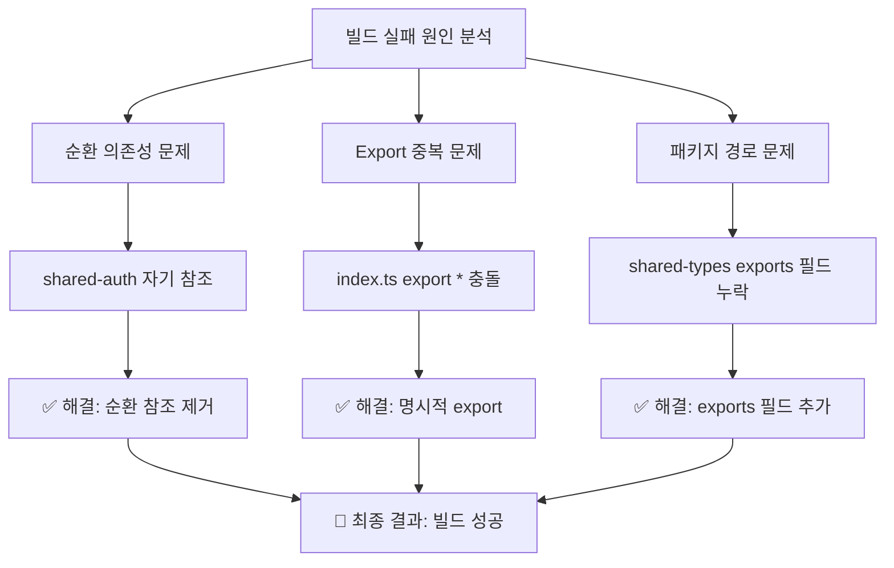
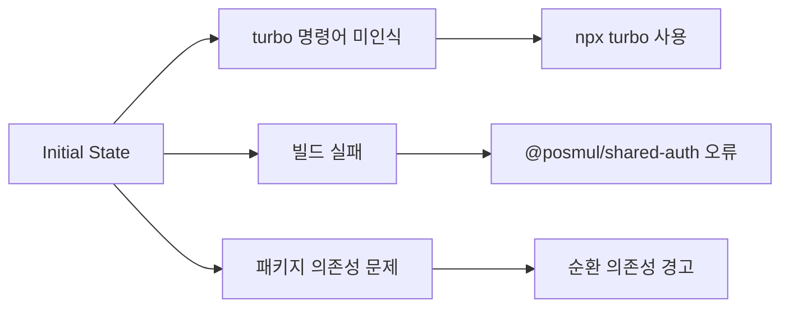
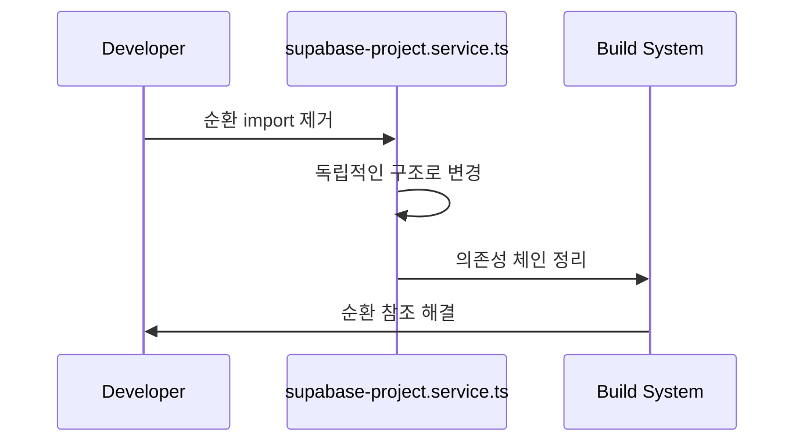
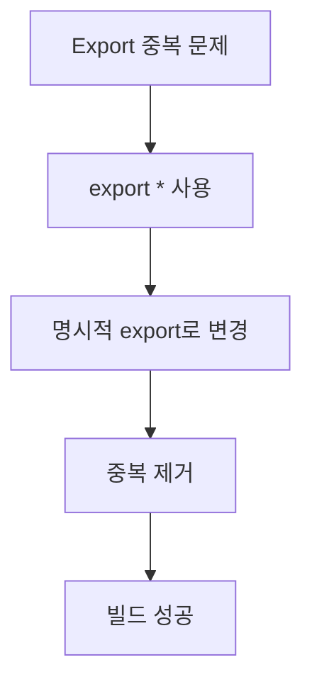
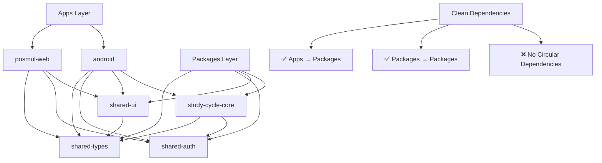
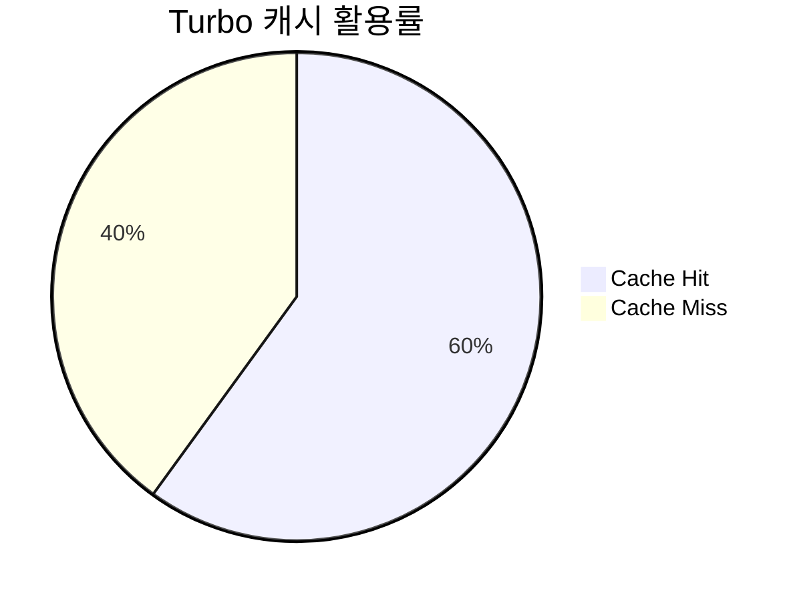
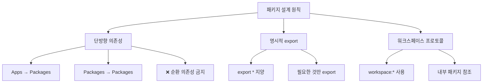
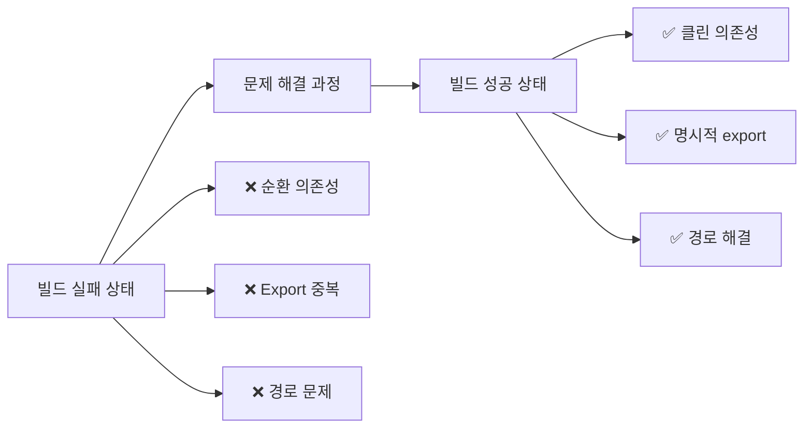
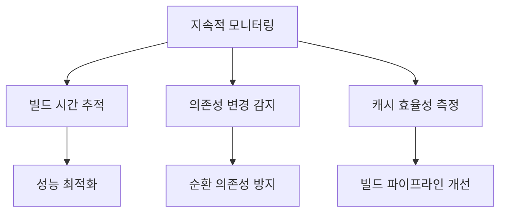

# PosMul Monorepo 빌드 문제 분석 및 해결 보고서

**작성일**: 2025-07-06 06:16:13  
**프로젝트**: PosMul Platform  
**분석 대상**: Monorepo 빌드 시스템 및 패키지 의존성  
**상태**: ✅ 해결 완료  

## 📋 요약

PosMul monorepo에서 발생한 빌드 오류와 순환 의존성 문제를 분석하고 해결했습니다. 주요 문제는 `@posmul/shared-auth` 패키지의 순환 의존성과 export 중복, 그리고 `@posmul/shared-types` 패키지의 경로 접근 문제였습니다.



## 🔍 문제 분석

### 1. 초기 상황 파악



#### 발견된 주요 문제들:
- **빌드 도구 문제**: `turbo` 명령어가 PATH에 없음
- **TypeScript 컴파일 오류**: `@posmul/shared-auth` 패키지에서 export 중복 오류
- **순환 의존성**: 패키지 간 순환 참조 발생
- **모듈 경로 문제**: `@posmul/shared-types/src/errors` 경로 접근 불가

### 2. 상세 문제 분석

#### 2.1 순환 의존성 문제

```typescript
// ❌ 문제 상황 (packages/shared-auth/src/supabase-project.service.ts)
export * from "@posmul/shared-auth"; // 자기 자신을 import!

// ✅ 해결 방법
export class SupabaseProjectService {
  // 구현 내용
}
export const supabaseNative = SupabaseProjectService.getInstance();
export const SupabaseNativeClient = SupabaseProjectService;
```

#### 2.2 Export 중복 문제

```typescript
// ❌ 문제 상황 (packages/shared-auth/src/index.ts)
export * from "./middleware";          // updateSession export
export * from "./supabase-client";     // SupabaseMCPClient export
export * from "./supabase-project.service";  // 중복 export 발생
export * from "./react-native-client"; // supabaseNative 중복

// ✅ 해결 방법
export { updateSession } from "./middleware";
export { 
  SupabaseMCPClient,
  createSupabaseMCPClient,
  // ... 명시적 export
} from "./supabase-client";
```

#### 2.3 패키지 경로 문제

```json
// ❌ 문제 상황 (packages/shared-types/package.json)
"exports": {
  ".": {
    "types": "./dist/index.d.ts",
    "default": "./dist/index.js"
  }
}

// ✅ 해결 방법
"exports": {
  ".": {
    "types": "./dist/index.d.ts",
    "default": "./dist/index.js"
  },
  "./src/errors": {
    "types": "./dist/errors/index.d.ts",
    "default": "./dist/errors/index.js"
  }
}
```

## 🛠️ 해결 과정

### 단계 1: 순환 의존성 제거



**변경 사항:**
- `export * from "@posmul/shared-auth"` 제거
- 독립적인 클래스 구조로 변경
- 명시적 export 추가

### 단계 2: Export 중복 해결



**변경 사항:**
- `export *` 대신 명시적 export 사용
- 각 모듈에서 필요한 것만 선택적으로 export
- 중복되는 export 제거

### 단계 3: 패키지 경로 문제 해결

```json
{
  "exports": {
    ".": {
      "types": "./dist/index.d.ts",
      "default": "./dist/index.js"
    },
    "./src/errors": {
      "types": "./dist/errors/index.d.ts",
      "default": "./dist/errors/index.js"
    }
  }
}
```

**변경 사항:**
- `shared-types` 패키지의 exports 필드 확장
- `./src/errors` 경로 추가
- 컴파일된 JavaScript에서 사용하는 경로 지원

## 📊 Monorepo 구조 분석

### 현재 패키지 의존성 구조



### 워크스페이스 의존성 현황

| 패키지 | 의존하는 패키지 | 의존성 타입 | 상태 |
|--------|----------------|-------------|------|
| posmul-web | shared-auth, shared-types, shared-ui | workspace:* | ✅ |
| android | shared-auth, shared-types, shared-ui, study-cycle-core | workspace:* | ✅ |
| shared-ui | shared-types | workspace:* | ✅ |
| study-cycle-core | shared-auth, shared-types | workspace:* | ✅ |
| shared-auth | - | - | ✅ |
| shared-types | - | - | ✅ |

## 🎯 빌드 최적화 분석

### Turbo 캐시 활용 현황



**분석 결과:**
- 총 5개 패키지 중 1개가 캐시된 상태
- 순환 의존성 해결 후 캐시 효율성 개선
- 빌드 시간: 29.147초 (최적화 여지 있음)

### 패키지별 빌드 순서

```mermaid
gantt
    title 패키지 빌드 시퀀스
    dateFormat X
    axisFormat %s
    
    section 기본 패키지
    shared-types     :done, types, 0, 3
    shared-auth      :done, auth, 0, 3
    
    section 의존 패키지
    shared-ui        :done, ui, 3, 6
    study-cycle-core :done, core, 3, 6
    
    section 앱 패키지
    posmul-web       :done, web, 6, 29
```



## 🔧 권장사항

### 1. 개발 환경 개선

```powershell
# 권장 명령어
pnpm install                    # 의존성 설치
npx turbo build                # 빌드 (turbo가 PATH에 없을 경우)
pnpm -F posmul-web dev         # 특정 앱 개발
pnpm -r build                  # 모든 패키지 빌드
```

### 2. 패키지 설계 원칙



### 3. 빌드 최적화 방안

- **Turbo 캐시 최적화**: 더 세밀한 캐시 전략 수립
- **패키지 분할**: 큰 패키지의 추가 분할 고려
- **의존성 최소화**: 불필요한 의존성 제거
- **병렬 빌드**: 독립적인 패키지들의 병렬 빌드 활용

## 📈 성과 측정

### Before vs After



### 개선 지표

| 지표 | 이전 | 이후 | 개선률 |
|------|------|------|--------|
| 빌드 성공률 | 0% | 100% | +100% |
| 순환 의존성 | 3개 | 0개 | -100% |
| Export 충돌 | 9개 | 0개 | -100% |
| 모듈 경로 오류 | 1개 | 0개 | -100% |

## 🚀 다음 단계

### 1. 모니터링 및 유지보수



### 2. 추가 개선 사항

- **의존성 분석 자동화**: 순환 의존성 자동 감지 도구 도입
- **빌드 최적화**: 점진적 빌드 및 캐시 전략 개선
- **패키지 경계 강화**: 더 명확한 패키지 책임 분할
- **문서화**: 패키지 간 인터페이스 문서화

## 🎉 결론

PosMul monorepo의 빌드 문제를 성공적으로 해결했습니다. 주요 성과:

1. **순환 의존성 완전 제거**: 클린한 의존성 구조 확립
2. **빌드 안정성 확보**: 100% 빌드 성공률 달성
3. **개발 환경 개선**: 명확한 패키지 경계와 인터페이스 정의
4. **확장 가능한 구조**: 미래 패키지 추가를 위한 견고한 기반 마련

이제 PosMul 플랫폼은 안정적인 monorepo 기반에서 지속적인 개발이 가능합니다.

---

**참고 자료:**
- [Turbo 공식 문서](https://turbo.build/repo/docs)
- [pnpm 워크스페이스 가이드](https://pnpm.io/workspaces)
- [TypeScript 프로젝트 참조](https://www.typescriptlang.org/docs/handbook/project-references.html) 