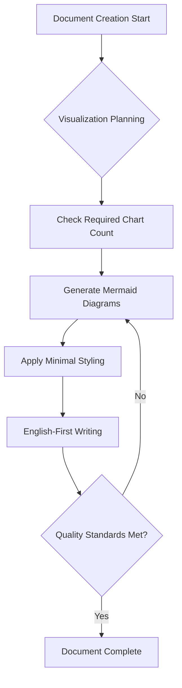
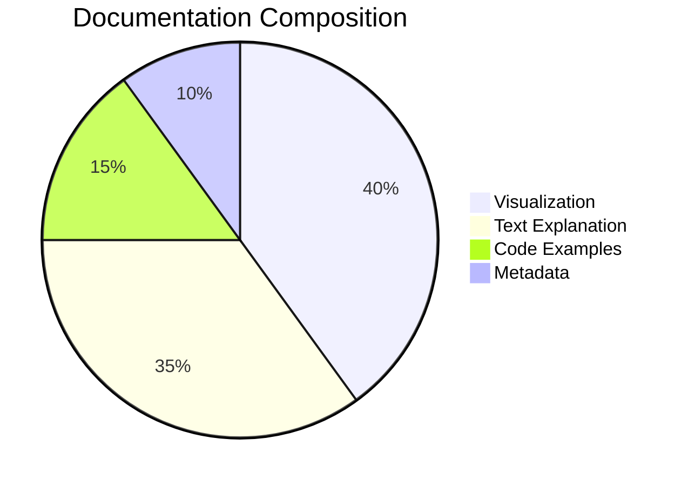
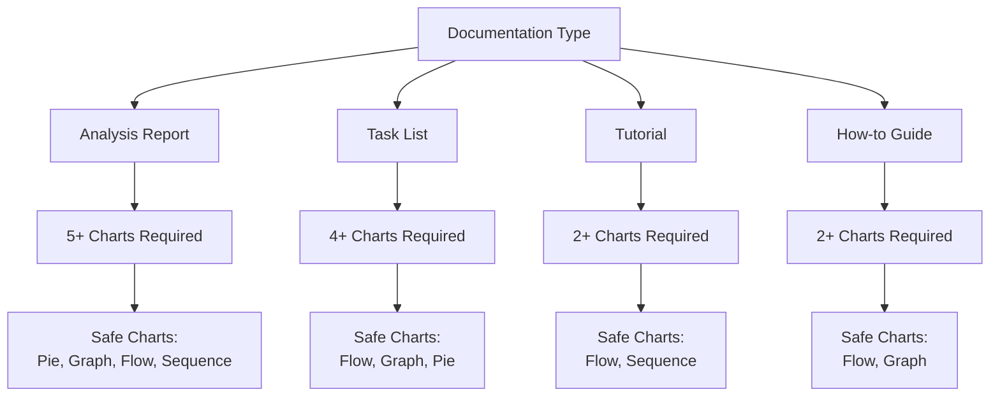
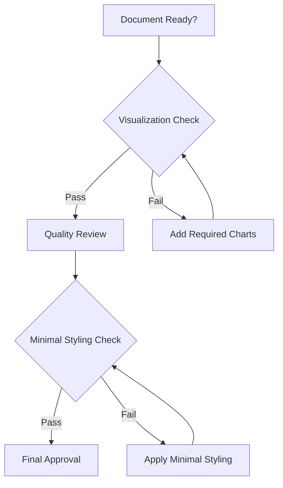
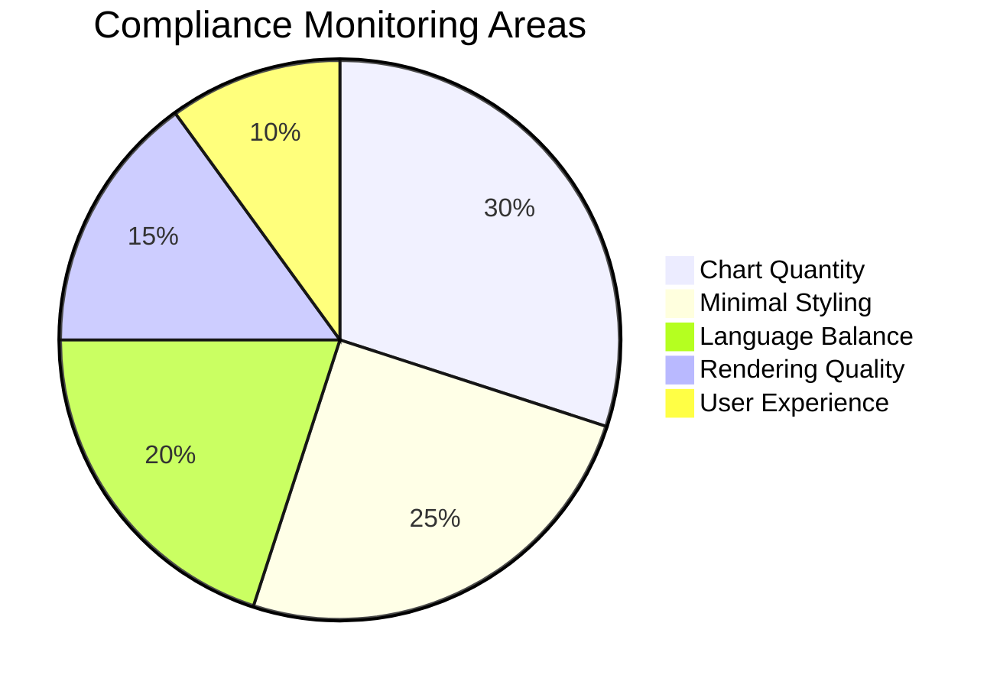

# AI Agent Collaboration Guidelines (Enhanced Visualization Edition)

> **Purpose**: General AI Agent collaboration principles independent of specific projects  
> **Scope**: Communication methods, code quality, documentation, debugging, and other universal guidelines  
> **Application**: All projects and domains

## 🚨 **CRITICAL: Mandatory Visualization Rules**

### 🎯 **Required for All Document Creation**

**❌ Documents without visualization are absolutely prohibited!**

#### 📊 **Minimum Visualization Requirements by Document Type**

1. **Analysis Report**: Minimum 5 charts required
2. **Task List**: Minimum 4 charts required
3. **Tutorial**: Minimum 2 charts required
4. **How-to Guide**: Minimum 2 charts required
5. **Reference**: Minimum 1 chart required
6. **Explanation**: Minimum 2 charts required

#### 🎨 **Visualization Quality Standards (Mandatory)**



#### ✅ **Mandatory Compliance Items (Non-negotiable)**

1. **Minimal Styling**: Avoid colors unless absolutely necessary (use only low saturation/brightness colors for special cases)
2. **Mermaid v11.6.0 Usage**: Ensure Next.js 15 compatibility
3. **Complex Structure Encouraged**: Visualization should help understand complex concepts and relationships
4. **Rendering Verification**: Complete validation in Mermaid Live Editor

#### ❌ **Absolutely Prohibited**

- 3+ consecutive sections without visualization
- High saturation/brightness colors (only muted colors for special cases)
- Complex Korean-heavy diagrams
- Charts without rendering verification
- **quadrantChart usage** (complex syntax, rendering issues)

### 🔍 **Visualization Verification Checklist**

```
🔥 Critical (All items mandatory):
□ Document type minimum visualization count met
□ Minimal styling applied (avoid colors unless necessary)
□ Mermaid v11.6.0 syntax compliance
□ Complex structures allowed to explain difficult concepts
□ Rendering test completed

⚡ Quality (80% or higher compliance):
□ Clear chart titles
□ Appropriate chart type selection
□ Consistent minimal styling
□ Text and visualization balance
□ Complex relationships properly visualized
```

## 📚 Table of Contents

- [1. Basic Communication & Environment Setup](#1-basic-communication--environment-setup)
- [2. Code Quality & Development Principles](#2-code-quality--development-principles)
- [3. Refactoring & Code Improvement](#3-refactoring--code-improvement)
- [4. Debugging & Problem Solving](#4-debugging--problem-solving)
- [5. Documentation & Communication](#5-documentation--communication)
- [6. Collaboration & Quality Management](#6-collaboration--quality-management)
- [7. Enhanced Visualization Guidelines](#7-enhanced-visualization-guidelines)
- [8. Final Checklist](#8-final-checklist)

---

## 1. Basic Communication & Environment Setup

### 📝 **Communication Principles**

- **Language**: Always respond in Korean and explain clearly for Korean developers
- **Encoding**: Use UTF-8 encoding to prevent Korean character corruption
- **Clarity**: Provide specific and clear explanations rather than ambiguous ones
- **🔥 Visualization Priority**: Include appropriate visualization in all explanations

### 🔧 **Environment Considerations**

- **Path Specification**: Write code or scripts with direct paths for execution
- **Environment Assumptions**: Consider user's development environment when suggesting commands or scripts
- **Compatibility**: Consider cross-platform compatibility, but optimize for specific environments when specified
- **🔥 Visualization Integration**: Include visualization steps in all workflows

### 🚀 **Workflow**

- **MCP Utilization**: Actively use MCP (Model Context Protocol) tools
- **Direct Execution**: Write code or scripts with direct paths for execution (e.g., explicitly include `C:\E\posmul` path when executing from that location)

---

## 2. Code Quality & Development Principles

### 🏗️ **General Development Principles**

- **Context7 MCP Integration**: Search and apply best practices
- **Simplicity (KISS)**: Prioritize simple and clear solutions over complex ones
- **DRY Principle**: Avoid code duplication and actively suggest reusable functions or modules
- **Mock Data Limitation (Guardrail)**: Generate code without mock data in development or production environments (except testing)
- **Readability**: Write code as concisely as possible without compromising clarity, minimize unnecessary comments and complex logic
- **🔥 Visualization Documentation**: Include architecture diagrams in all code explanations

### 🎯 **Code Structure Principles**

- **Modularity**: Design code to be modular and reusable
- **Separation of Concerns**: Clearly separate different responsibilities and functions
- **Interface Design**: Design clear interfaces between different layers or modules
- **Error Handling**: Implement appropriate error handling and validation

### 📊 **Performance & Security**

- **Performance Consideration**: Consider performance impact when suggesting code changes
- **Security Best Practices**: Follow security best practices and validate all inputs
- **Resource Management**: Properly manage resources like memory, file handles, network connections

---

## 3. Refactoring & Code Improvement

### 🔄 **Refactoring Guidelines**

- **Context7 MCP Integration**: Search and apply best practices
- **Refactoring Suggestions**: When suggesting refactoring for code structure improvement, explain code before/after and clear reasons (e.g., readability improvement, duplication removal, performance improvement)
- **Minimize Functional Changes**: Aim to improve internal code structure without changing existing functionality
- **Test Compatibility**: Suggest code that allows all related tests to pass normally after refactoring (actual test execution by developer)
- **🔥 Visual Impact Analysis**: Visualize refactoring impact with charts

### 📈 **Improvement Strategy**

- **Gradual Improvement**: Suggest small incremental improvements rather than large changes at once
- **Backward Compatibility**: Maintain backward compatibility when possible
- **Documentation Updates**: Update documentation for structural changes

---

## 4. Debugging & Problem Solving

### 🐛 **Debugging Support**

- **Context7 MCP Integration**: Search and apply best practices
- **Debugging Suggestions**: When suggesting code changes for error fixing or debugging, clearly explain expected problem causes and proposed solutions
- **Normal Operation Priority**: Prioritize normal operation of suggested code
- **Log Addition Suggestions**: When problem causes are unclear and analysis is needed, suggest adding detailed logs to code for debugging assistance
- **🔥 Debugging Flow Visualization**: Visualize debugging process with flowcharts

### 🔍 **Problem Analysis**

- **Root Cause Analysis**: Focus on solving root causes rather than symptoms
- **Systematic Approach**: Use systematic approaches for problem solving
- **Alternative Suggestions**: Provide multiple solution methods when possible

### 📋 **Error Handling**

- **Graceful Degradation**: Implement graceful degradation and fallback mechanisms
- **User-Friendly Messages**: Provide clear and user-friendly error messages
- **Logging Strategy**: Implement comprehensive logging strategy for debugging

---

## 5. Documentation & Communication

### 📚 **Documentation Standards**

- **Resource Descriptions**: Write descriptions for cloud resources (e.g., AWS, Azure, GCP) or important code resources in English
- **Terminology**: Use original terms for technical terms, library names, framework names (e.g., "React" not "리액트")
- **Diagrams**: When simple flows or structures need explanation, generate diagrams using Mermaid syntax. For complex architecture diagrams, assume separate SVG file management and provide guidance to reference them
- **🔥 Mandatory Visualization**: Include required visualization in all documents

### 🎨 **Documentation Style**

- **Consistency**: Maintain consistent documentation style throughout the project
- **Completeness**: Ensure documents are complete and up-to-date
- **Accessibility**: Make documents accessible to team members with various expertise levels
- **🔥 Visual Hierarchy**: Convey information through visual hierarchy

### 💬 **Communication Best Practices**

- **Clear Explanations**: Provide clear, step-by-step explanations for complex processes
- **Visual Aids**: Use diagrams, code examples, and other visual materials when helpful
- **Sufficient Context**: Provide sufficient context to understand decisions and changes

---

## 6. Collaboration & Quality Management

### 🤝 **Team Collaboration**

- **Code Review Culture**: Encourage thorough code reviews and constructive feedback
- **Knowledge Sharing**: Promote knowledge sharing among team members
- **Best Practice Documentation**: Document and share best practices within the team

### 🎯 **Quality Assurance**

- **Testing Strategy**: Implement comprehensive testing strategy
- **Continuous Integration**: Support continuous integration and deployment methods
- **Quality Metrics**: Track and improve code quality metrics

### 📊 **Process Improvement**

- **Feedback Loops**: Build feedback loops for continuous improvement
- **Process Documentation**: Document development processes and workflows
- **Tool Optimization**: Optimize development tools and workflows for efficiency

---

## 7. Enhanced Visualization Guidelines

### 🎨 **Essential Visualization Principles**

#### 📊 **Visualization First Principle**



All documents must adhere to the following ratio:

- **Visualization**: 40% (charts, diagrams, graphs)
- **Text Explanation**: 35% (core explanations)
- **Code Examples**: 15% (actual implementation)
- **Metadata**: 10% (table of contents, links, etc.)

#### 🎯 **Required Visualization Types**



#### 🔧 **Mermaid Usage Standards (Updated)**

To prevent rendering errors and ensure consistency, all Mermaid diagrams must adhere to the following principles.

**1. Simplicity First (단순성 최우선)**

- Instead of large, complex diagrams, break down concepts into multiple, simpler charts.
- This improves readability and reduces the chance of syntax errors.
- **Good**: Use several simple `flowchart`, `graph TD`, or `sequenceDiagram` charts.
- **Bad**: A single, monolithic diagram trying to show everything.

**2. Safe Chart-Type Usage (안전한 차트 유형 사용)**

- To avoid rendering issues, strictly use the following chart types:
  - `flowchart`
  - `graph TD` (and its variations like `LR`)
  - `sequenceDiagram`
  - `pie`
- These types are well-supported and handle various content gracefully.

**3. Korean Character Handling (한국어 처리 원칙)**

- Use English or kebab-case for node IDs.
- Use Korean freely within the node labels (the text in quotes).
- **Good**: `graph TD; A["데이터베이스 설계"] --> B["API 구현"];`
- **Bad**: `graph TD; [데이터베이스 설계] --> [API 구현];`

**4. Minimal Styling (최소한의 스타일링)**

- Use Mermaid's default styling.
- Avoid colors unless absolutely necessary for distinction. If needed, use low-saturation, muted colors.
- **Good**: `graph TD; A --> B;`
- **Bad**: `graph TD; A --> B; style A fill:#ff0000,stroke:#333,stroke-width:4px`

**5. Prohibited Patterns (금지 패턴)**

- **`quadrantChart`**: Do not use. It has complex syntax and frequent rendering issues.
- **Complex `gantt` and `timeline` charts**: High risk of error with Korean text. Use simpler alternatives like tables or lists.
- **Unverified code**: All diagrams must be tested in the [Mermaid Live Editor](https://mermaid.live) before being included.
- **Long sections without visuals**: No more than 2 consecutive text-heavy sections without a supporting diagram.

#### 🎨 **Minimal Styling Guidelines**

**Color Usage Rules:**

- **Default**: Use Mermaid's default styling (no colors)
- **Special Cases Only**: Apply colors only when absolutely necessary (low saturation/brightness only)
- **Accessibility**: Ensure color-blind friendly when colors are used
- **Consistency**: Maintain consistent minimal styling across documents

### 📋 **Visualization Quality Verification Process**

#### Stage 1: Planning

```
□ Confirm required visualization count per document type
□ Define visualization types and purposes
□ Plan minimal styling approach
□ Plan Korean-friendly chart types
```

#### Stage 2: Creation

```
□ Generate charts in Mermaid Live Editor
□ Apply minimal styling (if needed)
□ Use Korean text freely (avoid quadrantChart)
□ Allow complex structures for better understanding
```

#### Stage 3: Validation

```
□ Complete rendering test
□ Review accessibility (color-blind support when colors are used)
□ Confirm mobile compatibility
□ Review performance optimization
```

#### Stage 4: Integration

```
□ Place in appropriate document positions
□ Balance text and visualization
□ Include visualization sections in table of contents
□ Add cross-reference links
```

---

## 8. Final Checklist

### ✅ **Code Quality Check**

- [ ] **Simplicity**: Is the solution as simple as possible while maintaining functionality?
- [ ] **DRY Principle**: Have code duplications been eliminated?
- [ ] **Mock Data**: Is mock data avoided in non-test environments?
- [ ] **Error Handling**: Is proper error handling implemented?
- [ ] **🔥 Visualization**: Are architectural diagrams included for code explanations?

### ✅ **Documentation Check**

- [ ] **Clarity**: Are explanations clear and understandable?
- [ ] **Completeness**: Is all necessary information provided?
- [ ] **Consistency**: Is terminology and style consistent?
- [ ] **Accessibility**: Is documentation accessible to the target audience?
- [ ] **🔥 Mandatory Visualization**: Are required number of charts included per document type?
- [ ] **🎨 Minimal Styling**: Is minimal styling applied (colors avoided unless necessary)?
- [ ] **🌐 Korean Friendly**: Are Korean-friendly chart types used (no quadrantChart)?

### ✅ **Collaboration Check**

- [ ] **Communication**: Are explanations clear and helpful?
- [ ] **Context**: Is sufficient context provided for understanding?
- [ ] **Best Practices**: Are industry best practices followed?
- [ ] **Team Alignment**: Does the approach align with team standards?
- [ ] **🔥 Visual Communication**: Are complex concepts explained with diagrams?

### ✅ **Enhanced Visualization Check**



**🔥 Critical Visualization Checks:**

- [ ] Minimum chart count met for document type
- [ ] Minimal styling applied (colors avoided unless necessary)
- [ ] Korean text used freely (no quadrantChart restrictions)
- [ ] Mermaid v11.6.0 syntax compliance
- [ ] Rendering test completed
- [ ] Complex structures encouraged for better understanding
- [ ] Visual hierarchy established
- [ ] Charts support main narrative

---

## 📋 **Usage Guidelines**

### **When to Use**

- Setting up AI Agent collaboration workflows
- Establishing code quality standards
- Writing documentation guidelines
- Building debugging procedures
- Training team members on AI collaboration methods
- **🔥 Ensuring mandatory visualization compliance**

### **Integration with Project-Specific Rules**

This document provides general guidelines that should complement project-specific rules and requirements. For specialized project requirements, refer to the respective project documentation.

### **Continuous Improvement**

These guidelines should be regularly reviewed and updated based on:

- Team feedback and experience
- Evolution of industry best practices
- Updates to tools and technologies
- Changes in project requirements
- **🔥 Visualization effectiveness metrics**

### **Visualization Compliance Monitoring**



**Regular Review Items:**

- Visualization count compliance rate per document
- Minimal styling usage rate (colors avoided unless necessary)
- Korean-friendly chart usage rate (no quadrantChart)
- Complex structure utilization for understanding
- Rendering error occurrence rate
- User satisfaction scores

---

**Note**: For project-specific specialized rules, please refer to the respective project's separate documentation files.

**🎯 Enhanced Note**: These enhanced guidelines are designed to ensure all documents are visualization-centric to maximize information delivery and comprehension. Visualization requirements are mandatory, not optional.
