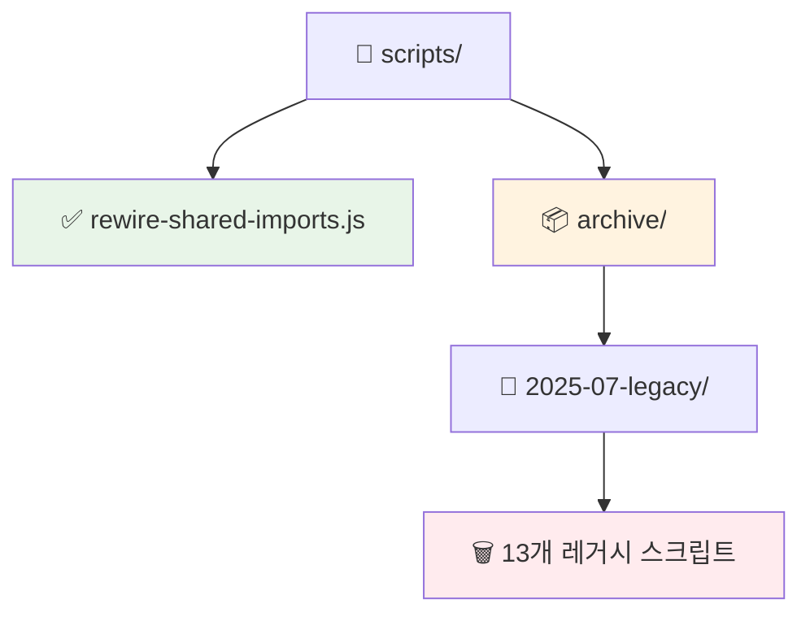
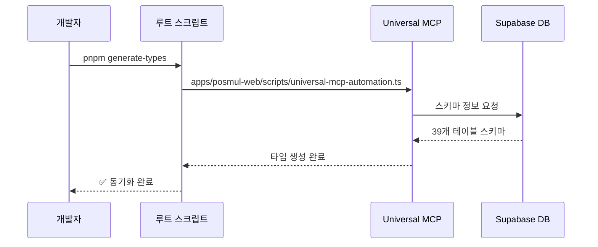
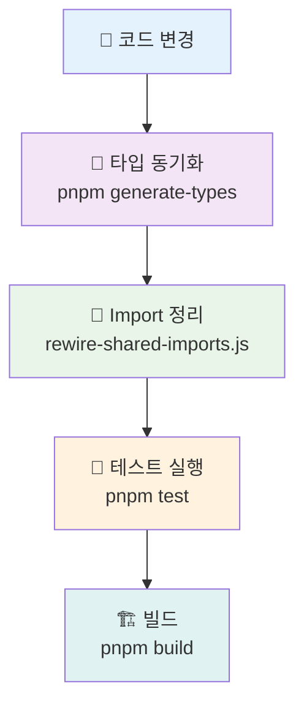
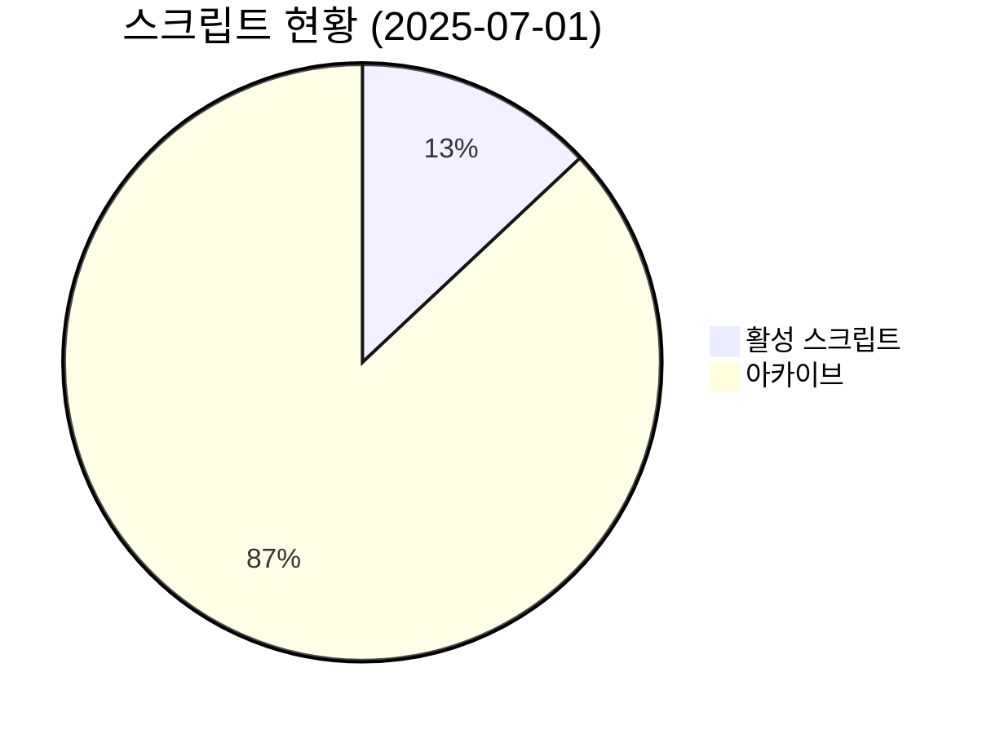

# 🔧 PosMul 개발 스크립트 가이드

> **최종 업데이트**: 2025-07-01  
> **상태**: 레거시 정리 완료 ✅

## 📋 현재 활성 스크립트

### ✅ **활성 스크립트 (2개)**

| 스크립트 | 크기 | 용도 | 실행 방법 |
|----------|------|------|-----------|
| `rewire-shared-imports.js` | 2.0KB | Import 경로 재구성 | `node scripts/rewire-shared-imports.js <targetDir>` |

### 📦 **아카이브 디렉토리**



## 🚀 주요 스크립트 사용법

### 📝 **Import 경로 재구성**

```powershell
# 특정 디렉토리의 import 경로 정리
node scripts/rewire-shared-imports.js packages/shared-types/src

# 여러 디렉토리 동시 처리
node scripts/rewire-shared-imports.js apps/posmul-web/src
node scripts/rewire-shared-imports.js packages/shared-ui/src
```

**기능**:
- 상대 경로를 절대 경로로 변환
- 공유 모듈 import 최적화
- 타입 import 정리

## 🎯 타입 생성 시스템

### 🤖 **Universal MCP 시스템**

타입 생성은 별도의 **Universal MCP Automation System**을 통해 관리됩니다.



### 📍 **타입 생성 명령어**

```powershell
# 메인 타입 생성 (권장)
pnpm generate-types

# 수동 타입 생성 (개발용)
pnpm --filter posmul gen:types
```

## 📦 레거시 스크립트 정보

### 🗂️ **아카이브 위치**

- **경로**: `scripts/archive/2025-07-legacy/`
- **개수**: 13개 스크립트
- **총 크기**: 약 25KB
- **정리일**: 2025-07-01

### 📋 **아카이브된 스크립트 목록**

| 카테고리 | 스크립트 수 | 주요 용도 |
|----------|-------------|-----------|
| Import 정리 | 6개 | 모노레포 전환 시 경로 수정 |
| 타입 시스템 | 3개 | Result 패턴 및 타입 가드 추가 |
| 플랫폼별 | 2개 | Android, API 라우트 정리 |
| UI 관련 | 2개 | Viewport, 컴포넌트 정리 |

### 🔄 **복구 방법**

```powershell
# 특정 스크립트 복구
Copy-Item "scripts/archive/2025-07-legacy/[스크립트명]" "scripts/"

# 전체 아카이브 확인
Get-ChildItem "scripts/archive/2025-07-legacy/" -Name
```

## 🛠️ 개발 워크플로우

### 📊 **일반적인 개발 순서**



### ⚡ **빠른 명령어**

```powershell
# 전체 개발 환경 설정
pnpm install; pnpm build; pnpm generate-types

# 개발 서버 실행
pnpm dev

# 타입 + 테스트
pnpm generate-types; pnpm test
```

## 📚 관련 문서

- **[Universal MCP 가이드](../docs/guides/manage-universal-types.md)**: 타입 관리 상세 가이드
- **[프로젝트 README](../README.md)**: 전체 프로젝트 개요
- **[스크립트 정리 계획](../SCRIPTS_CLEANUP_PLAN.md)**: 정리 과정 상세 기록

## 🚨 주의사항

### ⚠️ **스크립트 사용 시 주의점**

1. **백업 필수**: 중요한 파일 수정 전 백업
2. **테스트 확인**: 스크립트 실행 후 반드시 테스트
3. **Git 커밋**: 변경사항을 단계별로 커밋
4. **문서 업데이트**: 스크립트 수정 시 이 문서도 업데이트

### 🔄 **문제 해결**

```powershell
# 스크립트 실행 권한 오류
Set-ExecutionPolicy -ExecutionPolicy RemoteSigned -Scope CurrentUser

# Node.js 경로 문제
where.exe node
where.exe npm
```

## 📈 성과 지표

### 🎯 **정리 완료 성과 (2025-07-01)**

- **스크립트 수 감소**: 15개 → 2개 (87% 감소)
- **레거시 정리**: 13개 스크립트 아카이브
- **유지보수성**: ✅ 대폭 향상
- **신규 개발자 친화성**: ✅ 명령어 단순화

### 📊 **현재 상태**



---

**🎉 깔끔하게 정리된 개발 환경에서 효율적인 개발을 즐기세요!** 